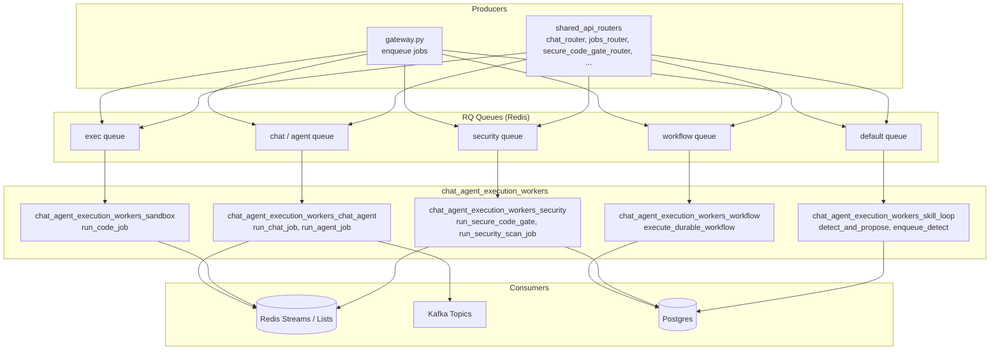

# chat_agent_execution_workers

## Overview

The `chat_agent_execution_workers` module is the asynchronous execution backbone for chat, agent, workflow, sandboxed code, security scanning, and self-improving skill automation. It sits downstream of the [gateway](../core/gateway.md) and [shared_api_routers](../core/shared_api_routers.md): API routes enqueue RQ jobs, and the workers in this module perform the heavy, long-running, or isolation-sensitive work off the hot request path.

All workers follow a consistent pattern:

- Receive a `payload` dict from an RQ queue.
- Perform the requested work (LLM calls, sandbox execution, repository scanning, etc.).
- Publish results back via Redis Streams, Redis lists, Kafka topics, or direct return values.
- Apply compliance, budget, and security gates before and during execution.

This module is part of the larger [workers](workers.md) ecosystem. It is most closely related to:

- [gateway](../core/gateway.md) — enqueues jobs via `core.job_queue.enqueue_job`.
- [shared_core](../core/shared_core.md) — provides `agents`, `models.model_router`, `workflows.engine`, `sandbox.docker_executor`, `tools.security_scan_tools`, and compliance engines.
- [shared_api_routers](../core/shared_api_routers.md) — exposes endpoints that trigger these workers (chat, agents, workflows, secure code gate, etc.).

---

## Architecture

### Data Flow

1. A user or system request reaches the [gateway](../core/gateway.md) or a [shared_api_routers](../core/shared_api_routers.md) endpoint.
2. The route calls `core.job_queue.enqueue_job(fn_name, payload, queue_name=...)`.
3. An RQ worker process pulls the job from the named Redis queue.
4. The worker executes the target function, applying gates (budget, compliance, security) as needed.
5. Results are handed back through the appropriate channel:
   - **Chat** → Redis Stream `chat:stream:{job_id}` for SSE consumption.
   - **Agent** → direct return string.
   - **Workflow** → Postgres `workflow_history` / `workflow_runs`.
   - **Sandbox code** → Redis list `cowork:exec:result:{job_id}`.
   - **Security scan** → Postgres `security_scan_results` + GitLab MR comment.
   - **Skill loop** → Postgres `skill_proposals` + `SkillRecord`.

---

## Sub-modules

| Sub-module | Files | Responsibility | Documentation |
|------------|-------|----------------|---------------|
| `chat_agent_execution_workers_chat_agent` | `agent_worker.py`, `chat_worker.py` | Runs named agents and the full chat pipeline (compliance, RAG, streaming, document generation). | [chat_agent_execution_workers_chat_agent.md](chat_agent_execution_workers_chat_agent.md) |
| `chat_agent_execution_workers_workflow` | `durable_workflow_worker.py` | Executes workflows with checkpoint/resume and rollback-aware execution. | [chat_agent_execution_workers_workflow.md](chat_agent_execution_workers_workflow.md) |
| `chat_agent_execution_workers_sandbox` | `exec_worker.py` | Runs Cowork `run_code` jobs inside an isolated Docker sandbox. | chat_agent_execution_workers_sandbox.md |
| `chat_agent_execution_workers_security` | `secure_code_gate_worker.py`, `security_scan_worker.py` | Generation-time SAST with LLM auto-fix and PR-level security scanning. | chat_agent_execution_workers_security.md |
| `chat_agent_execution_workers_skill_loop` | `skill_loop_worker.py` | Detects repeated successful runs and proposes new skills for HITL approval. | chat_agent_execution_workers_skill_loop.md |

---

## Shared Infrastructure

### Job Enqueueing

All producers use `core.job_queue.enqueue_job` (see [shared_core](../core/shared_core.md)). The function:

- Validates RQ/Redis availability.
- Applies atomic queue-depth back-pressure.
- Imports the target function dynamically by dotted path.
- Enqueues with configurable timeout, retry count, and retry interval.

### Redis Databases

The workers rely on several Redis logical databases configured in `core.config`:

- `RDB_STREAM` (DB 6) — chat SSE streams.
- `RDB_CACHE` (DB 0) — answer cache, docs namespaces, plan checkpoints.
- `RDB_QUEUE` (DB 5) — RQ queues, sandbox result lists, slide caches.

### Compliance & Security

Every worker that handles user input or generated code invokes the shared compliance engine (`agents.compliance_engine`) and/or security scanners (`tools.security_scan_tools`). See [shared_core](../core/shared_core.md) for details.

### Observability

Workers propagate `request_id`, `chat_id`, `user_id`, and W3C `traceparent` from the gateway so logs and OpenTelemetry spans remain correlated across the async boundary.

---

## Deployment Notes

- Workers are started by `workers/start_workers.py` (see [workers](workers.md)).
- Each sub-module typically maps to one or more RQ queues; queue names are defined in `core.config` (e.g., `Q_DOC`, `Q_EXEC`, `Q_SECURITY`).
- Concurrency is controlled by the number of RQ worker processes per queue, not by in-process threading.
- Long timeouts are used for document generation (30 min), security scans (10 min+), and durable workflows (1 hour).
