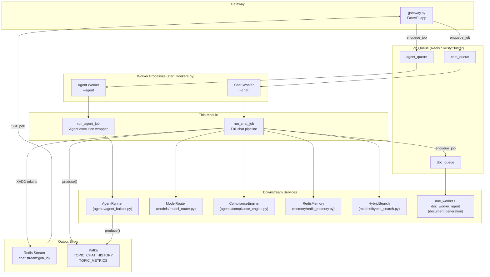
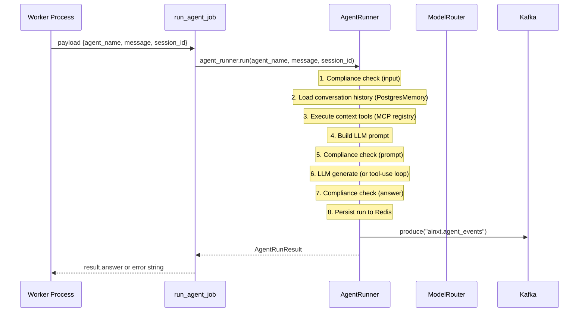
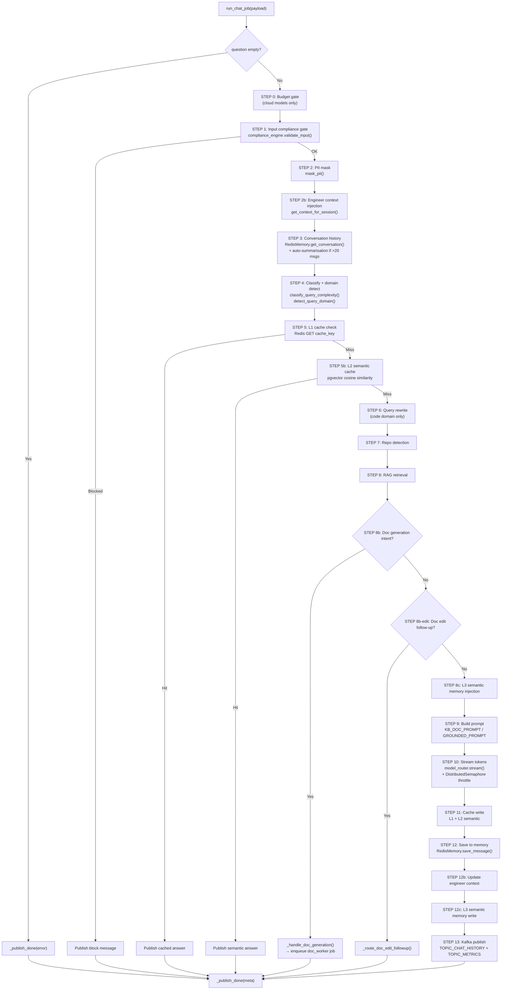
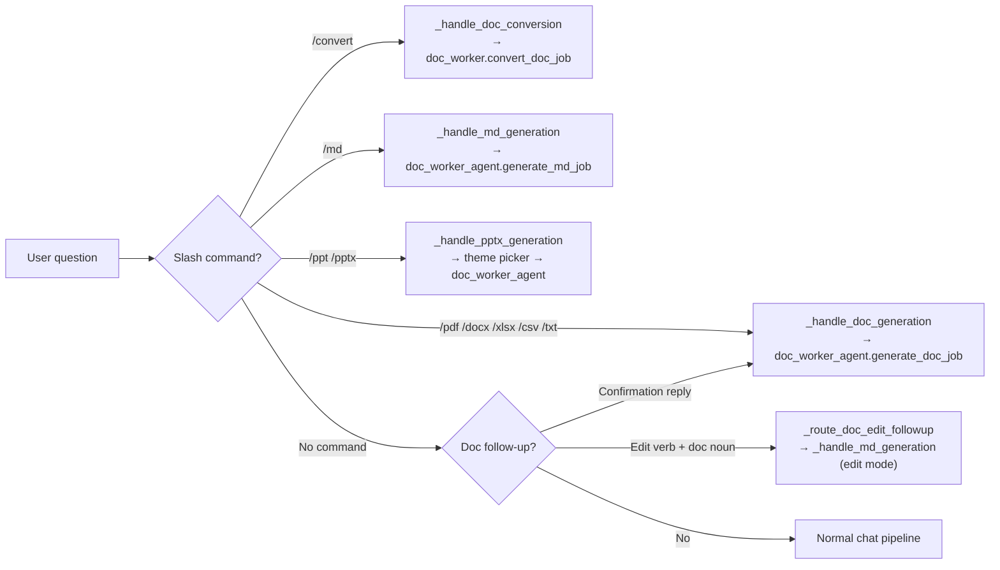
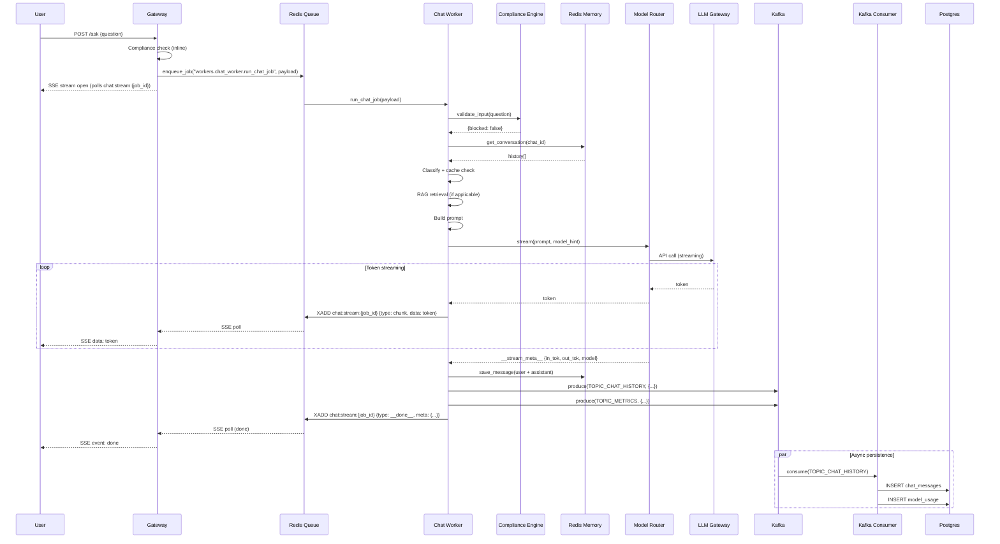
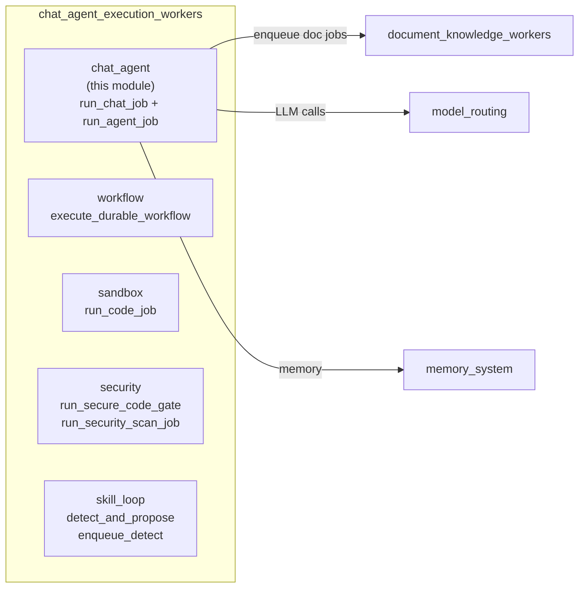

# Chat & Agent Execution Workers — Chat Agent

## Introduction

The `chat_agent_execution_workers_chat_agent` module is the **core asynchronous execution layer** for user-facing chat and agent interactions in the AiNxt platform. It contains two RQ (Redis Queue) job functions that are enqueued by the [gateway](#gateway) and consumed by background worker processes:

| Component | File | Role |
|---|---|---|
| `run_agent_job` | `workers/agent_worker.py` | Thin RQ wrapper that delegates to `AgentRunner.run()` for named-agent executions. |
| `run_chat_job` | `workers/chat_worker.py` | Full chat pipeline: compliance gating, PII masking, conversation history, RAG retrieval, LLM streaming, caching, memory persistence, and document-generation routing. |

Both functions are designed to run inside worker processes spawned by the [worker orchestration](#worker-orchestration) layer (`workers/start_workers.py`). They communicate results back to the gateway via **Redis Streams** (SSE token streaming) and **Kafka** (durable persistence).

---

## Architecture Overview



---

## Component Documentation

### 1. `run_agent_job` — Agent Execution Worker

**File:** `workers/agent_worker.py`

A lightweight RQ job function that serves as the async entry point for named-agent runs. It receives a payload dictionary and delegates to the singleton `AgentRunner` instance.

#### Payload Contract

| Key | Type | Description |
|---|---|---|
| `agent_name` | `str` | Registered agent name (must be `PRODUCTION` status) |
| `message` | `str` | User message to send to the agent |
| `session_id` | `str` (optional) | Conversation session for history continuity |

#### Execution Flow



#### Key Behaviours

- **Timeout enforcement:** `AgentRunner` enforces a 120-second wall-clock timeout per run via a `ThreadPoolExecutor`.
- **Greeting short-circuit:** Bare greetings skip the full tool/LLM pipeline and return a lightweight response.
- **Tool-use loop:** Agents with action tools (Jira, GitLab, Confluence, etc.) use Claude's native tool-use API with up to 10 LLM↔tool iterations.
- **Error propagation:** On exception, the error is logged and re-raised so RQ's retry mechanism can handle it.

#### Dependencies

| Dependency | Module | Purpose |
|---|---|---|
| `AgentRunner` | [agent_system](#agent-system) (`agents/agent_builder.py`) | Core agent execution engine |
| `logger` | [core_infrastructure](#core-infrastructure) (`core/logger.py`) | Structured logging |

---

### 2. `run_chat_job` — Chat Pipeline Worker

**File:** `workers/chat_worker.py`

The most complex worker in the platform. It executes the full conversational AI pipeline for a single user question, streaming tokens to a Redis Stream for SSE consumption by the gateway.

#### Payload Contract

| Key | Type | Description |
|---|---|---|
| `job_id` | `str` | Unique job ID; used as Redis Stream key suffix |
| `question` | `str` | Raw user question |
| `session_id` | `str` | Conversation memory lookup key |
| `chat_id` | `str` | Chat ID for memory storage (defaults to `session_id`) |
| `repo_filter` | `str` (optional) | Repository scope for code RAG |
| `model` | `str` (optional) | Model hint for routing |
| `user_id` | `str` | User ID for budget tracking |
| `user_ctx` | `dict` (optional) | User context (department, admin flag, etc.) |
| `rag_mode` | `str` (optional) | Context isolation: `off` / `auto` / `on` |
| `attachment_ids` | `list` (optional) | Uploaded file attachment IDs |
| `enqueued_at` | `float` (optional) | Timestamp for latency anchoring |
| `trace_headers` | `dict` (optional) | W3C traceparent for OTel span linking |
| `request_id` | `str` (optional) | Request ID for log correlation |

#### Pipeline Architecture



#### Key Subsystems

##### 2a. Document Generation Routing

The chat worker intercepts document-generation intents **before** normal LLM generation. This is a critical routing layer that supports multiple document formats via slash commands:

| Command | Format | Handler |
|---|---|---|
| `/pdf` | PDF | `_handle_doc_generation()` → `doc_worker_agent.generate_doc_job` |
| `/docx`, `/doc`, `/word` | Word | `_handle_doc_generation()` → `doc_worker_agent.generate_doc_job` |
| `/xlsx`, `/excel` | Excel | `_handle_doc_generation()` → `doc_worker_agent.generate_doc_job` |
| `/csv` | CSV | `_handle_doc_generation()` → `doc_worker_agent.generate_doc_job` |
| `/txt`, `/text` | Plain text | `_handle_doc_generation()` → `doc_worker_agent.generate_doc_job` |
| `/md` | Markdown | `_handle_md_generation()` → `doc_worker_agent.generate_md_job` |
| `/ppt`, `/pptx` | PowerPoint | `_handle_pptx_generation()` → theme picker flow |
| `/convert <fmt>` | File conversion | `_handle_doc_conversion()` → `doc_worker.convert_doc_job` |

The routing also handles:
- **Follow-up confirmations** (`_is_doc_followup`): Short replies like "yes" or "go with option A" after a prior doc command.
- **Plain-language edit follow-ups** (`_route_doc_edit_followup`): Natural phrases like "update this document" or "fix the title" when an `md:session:{chat_id}` exists in Redis.
- **Preservation mode**: When a user uploads a file and asks to reproduce/convert it, the `_build_preservation_prompt` is used instead of free-form generation.



##### 2b. Multi-Layer Caching

The chat worker implements a three-tier caching strategy:

| Tier | Mechanism | Scope | TTL |
|---|---|---|---|
| **L1** | Exact-match Redis cache (`chat_cache_key`) | Per question + repo + rag_mode | 24 hours |
| **L2** | Semantic cache (pgvector cosine similarity) | First-turn only, non-code domain | Configurable |
| **L3** | Semantic memory (learned patterns) | User + team scoped | Configurable |

L2 and L3 are gated by feature flags (`SEMANTIC_CACHE_ENABLED`, `SEMANTIC_MEMORY_ENABLED`) and include defense-in-depth checks at both the worker and store layers.

##### 2c. RAG Retrieval

Retrieval is context-dependent:

- **Platform queries** (keywords: `ainxt`, `npci`, `upi`, `sdlc`, etc.) or **voice mode**: Searches `docs_kb` namespaces via `pgvector_search` + `keyword_search`, with BGE cross-encoder reranking and section-aware re-ranking.
- **Code repo queries** (`repo_filter` set): Uses `hybrid_retrieve_context` with BGE reranking.
- **General queries**: No retrieval; goes directly to LLM.

When retrieval returns zero chunks for a `docs_kb` query, the worker returns a **refusal message** rather than allowing the LLM to hallucinate from training data.

##### 2d. Streaming & Sentinel Protocol

Tokens are published to a Redis Stream (`chat:stream:{job_id}`) via `XADD`. The stream uses:
- **`maxlen=10,000`** with approximate trimming to prevent unbounded growth.
- **`__done__` sentinel** with metadata (model, tokens, cost, latency, confidence, chunk_count).
- **`__error__` sentinel** for failure cases.
- **TTL of 1 hour** set in a `finally` block to guarantee self-cleaning even on crash.

The `try/finally` pattern ensures the sentinel is **always** delivered, preventing hanging SSE connections on the gateway side.

##### 2e. Concurrency Throttle

LLM calls are gated by a `DistributedSemaphore` (`llm_global`, capacity=500) backed by a Redis Lua script for atomic acquire/release. This prevents thundering-herd LLM calls under high load. If the semaphore initialization fails, the worker proceeds without throttling (fail-open).

##### 2f. Compliance & PII

- **Input gate** (Step 1): `compliance_engine.validate_input()` blocks requests containing PAN, CVV, secrets, etc.
- **PII masking** (Step 2): `mask_pii()` redacts sensitive patterns before the question enters the pipeline.
- **Attachment redaction**: Uploaded file content is passed through the compliance redactor before injection into LLM prompts (gated by `COMPLIANCE_SCAN_TOOL_RESULTS`).

##### 2g. Budget Enforcement

A defense-in-depth budget gate runs at Step 0. Cloud models (GPT, Claude, Gemini) are checked against the user's budget allocation. In-house models (local GPU, LiteLLM-routed) are always exempt. If the budget is exhausted, a user-friendly message is published and the job exits early.

#### Dependencies

| Dependency | Module Reference | Purpose |
|---|---|---|
| `compliance_engine` | [agent_system](#agent-system) | Input/prompt/answer compliance gating |
| `model_router` | [model_routing](#model-routing) | LLM routing, streaming, fallback |
| `RedisMemory` | [memory_system](#memory-system) | Conversation history persistence |
| `hybrid_search` / `hybrid_retriever` | [model_routing](#model-routing) | RAG retrieval + BGE reranking |
| `budget_store` | [store_layer](#store-layer) | Budget checking and usage increment |
| `semantic_cache` | [store_layer](#store-layer) | L2/L3 semantic caching |
| `context_manager` | [core_infrastructure](#core-infrastructure) | Engineer cross-session context |
| `distributed_semaphore` | [core_infrastructure](#core-infrastructure) | LLM concurrency throttle |
| `kafka_producer` | [core_infrastructure](#core-infrastructure) | Async persistence to Postgres |
| `job_queue` | [core_infrastructure](#core-infrastructure) | Enqueue doc generation jobs |
| `doc_worker` / `doc_worker_agent` | [document_knowledge_workers](#document-knowledge-workers) | Document generation |
| `doc_generator` (tools) | [shared_integrations](#shared-integrations) | Filename/theme utilities |
| `classifier` | [model_routing](#model-routing) | Query complexity + domain classification |
| `query_rewriter` | [model_routing](#model-routing) | Code-domain query rewriting |
| `section_query_router` | [core_infrastructure](#core-infrastructure) | KB section-aware reranking |
| `chat_utils` | [core_infrastructure](#core-infrastructure) | PII masking, cache keys, repo detection |

---

## Data Flow: End-to-End Chat Request



---

## Worker Orchestration

Worker processes are spawned by `workers/start_workers.py`. The chat and agent workers are started with specific CLI flags:

```bash
# Chat workers (consume chat_queue, high_queue, default_queue)
python -m workers.start_workers --chat --n 2

# Agent workers (consume agent_queue)
python -m workers.start_workers --agent

# All queues (default mode)
python -m workers.start_workers
```

Each worker process calls `_worker_process()` which creates an RQ Worker (or RustyCluster equivalent) via the KV factory. The backend is selected by `REDIS_CLIENT_CONFIG_DB5` environment variable. Workers run with `with_scheduler=True` for RQ's built-in job scheduling.

For more details on worker process management, see [worker_orchestration](#worker-orchestration).

---

## Redis Stream Protocol

The chat worker communicates with the gateway via a well-defined Redis Stream protocol:

| Event Type | Fields | Description |
|---|---|---|
| `chunk` | `type=chunk`, `data=<token>` | Individual LLM token or text chunk |
| `__done__` | `type=__done__`, `meta=<json>` | Successful completion with metadata |
| `__done__` | `type=__done__`, `error=<msg>` | Empty question or early exit |
| `__error__` | `type=__error__`, `msg=<msg>` | Unhandled exception |

**Metadata JSON** (in `__done__`):

```json
{
  "model": "GPT-5.4 (gpt-5.4)",
  "in_tok": 1523,
  "out_tok": 487,
  "cost": 0.0234,
  "latency": 3.421,
  "confidence": 0.82,
  "chunk_count": 12
}
```

---

## Error Handling & Resilience

| Scenario | Behaviour |
|---|---|
| Empty question | Publishes `__done__` with error; exits immediately |
| Compliance block | Publishes block message; publishes `__done__`; exits |
| Budget exhausted | Publishes budget message; publishes `__done__`; exits |
| LLM gateway failure | ModelRouter fallback chain (e.g., Claude → OpenAI → Local) |
| Semaphore timeout | Publishes "Server busy" message; publishes `__done__` |
| Redis Stream write failure | Logged as warning; job continues (best-effort) |
| Kafka publish failure | Logged as warning; job never fails due to Kafka |
| Memory persistence failure | Logged as warning; job continues |
| Unhandled exception | Publishes `__error__`; re-raises for RQ retry |
| Worker crash | `finally` block sets stream TTL; orphaned stream self-cleans in 1h |

---

## Relationship to Sibling Modules

This module is part of the `chat_agent_execution_workers` family:



- **[chat_agent_execution_workers_workflow](chat_agent_execution_workers_workflow.md)**: Durable workflow execution (`execute_durable_workflow`) — handles multi-step workflow graphs.
- **chat_agent_execution_workers_sandbox**: Code execution sandbox (`run_code_job`) — isolated Python/Docker execution.
- **chat_agent_execution_workers_security**: Security scanning (`run_secure_code_gate`, `run_security_scan_job`).
- **chat_agent_execution_workers_skill_loop**: Self-improving skill detection (`detect_and_propose`, `enqueue_detect`).

---

## Configuration Reference

| Environment Variable | Default | Description |
|---|---|---|
| `RDB_STREAM` | `6` | Redis DB for chat streams |
| `RDB_CACHE` | `0` | Redis DB for answer cache |
| `RDB_QUEUE` | `5` | Redis DB for RQ job queue + slides cache |
| `COMPLIANCE_SCAN_TOOL_RESULTS` | `False` | Gate attachment content redaction |
| `RERANKER_MIN_SCORE` | `0.30` | BGE reranker relevance threshold |
| `SEMANTIC_CACHE_ENABLED` | varies | L2 semantic cache feature flag |
| `SEMANTIC_MEMORY_ENABLED` | varies | L3 semantic memory feature flag |
| `SEMANTIC_MEMORY_MIN_CONFIDENCE` | varies | Minimum confidence for L3 writes |
| `STREAM_TTL` | `3600` (1h) | Redis Stream TTL |
| `STREAM_MAXLEN` | `10,000` | Max stream entries (approximate trim) |
| `_SLIDES_CACHE_TTL` | `3600` (1h) | PPTX slides cache TTL |

---

## Cross-References

| Topic | Documentation |
|---|---|
| Agent execution engine | [agent_system](#agent-system) — `AgentRunner`, `AgentBuilder` |
| Model routing & fallback | [model_routing](#model-routing) — `ModelRouter`, gateway dispatch |
| Conversation memory | [memory_system](#memory-system) — `RedisMemory`, `PostgresMemory` |
| Compliance & governance | [agent_system](#agent-system) — `ComplianceEngine` |
| Job queue infrastructure | [core_infrastructure](#core-infrastructure) — `enqueue_job`, queue management |
| Worker process management | [worker_orchestration](#worker-orchestration) — `start_workers.py` |
| Document generation | [document_knowledge_workers](#document-knowledge-workers) — `doc_worker`, `doc_worker_agent` |
| Budget management | [store_layer](#store-layer) — `budget_store` |
| Semantic caching | [store_layer](#store-layer) — `semantic_cache` |
| Kafka event consumption | [kafka_event_consumer](#kafka-event-consumer) — `kafka_consumer.py` |
| Gateway API layer | [gateway](#gateway) — `gateway.py` |
