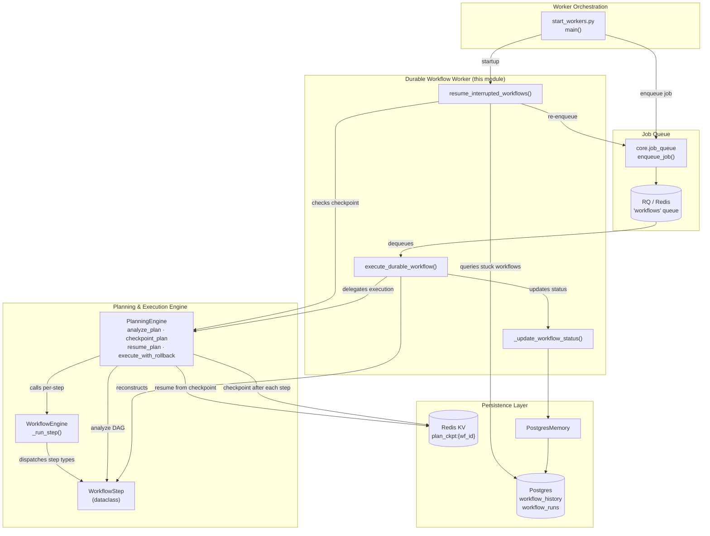
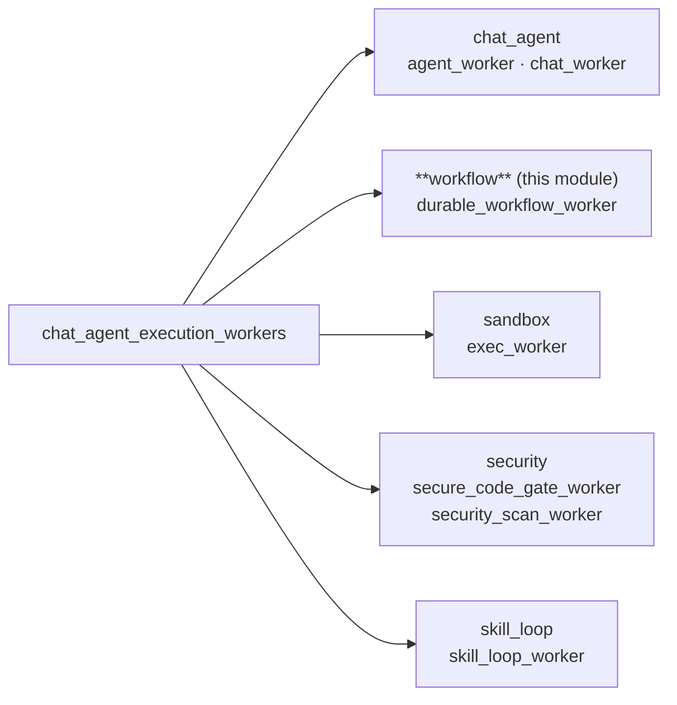
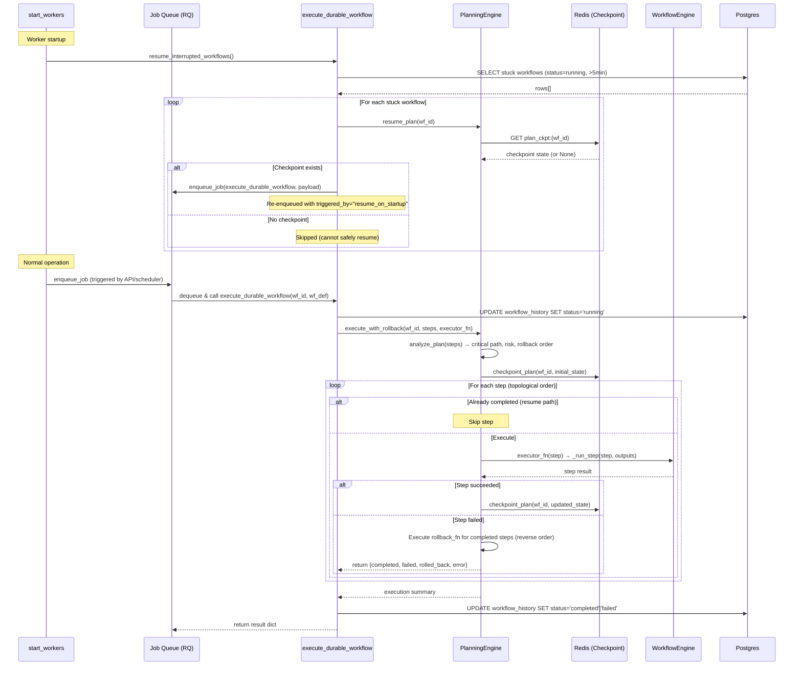
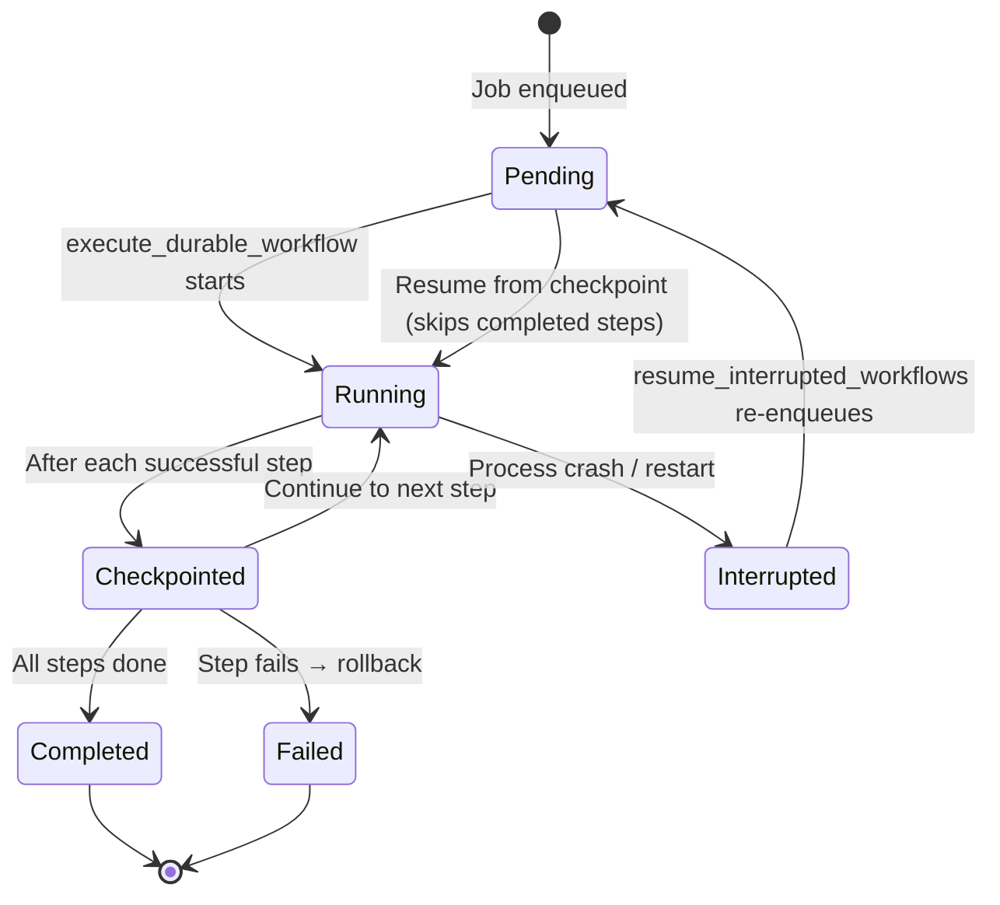
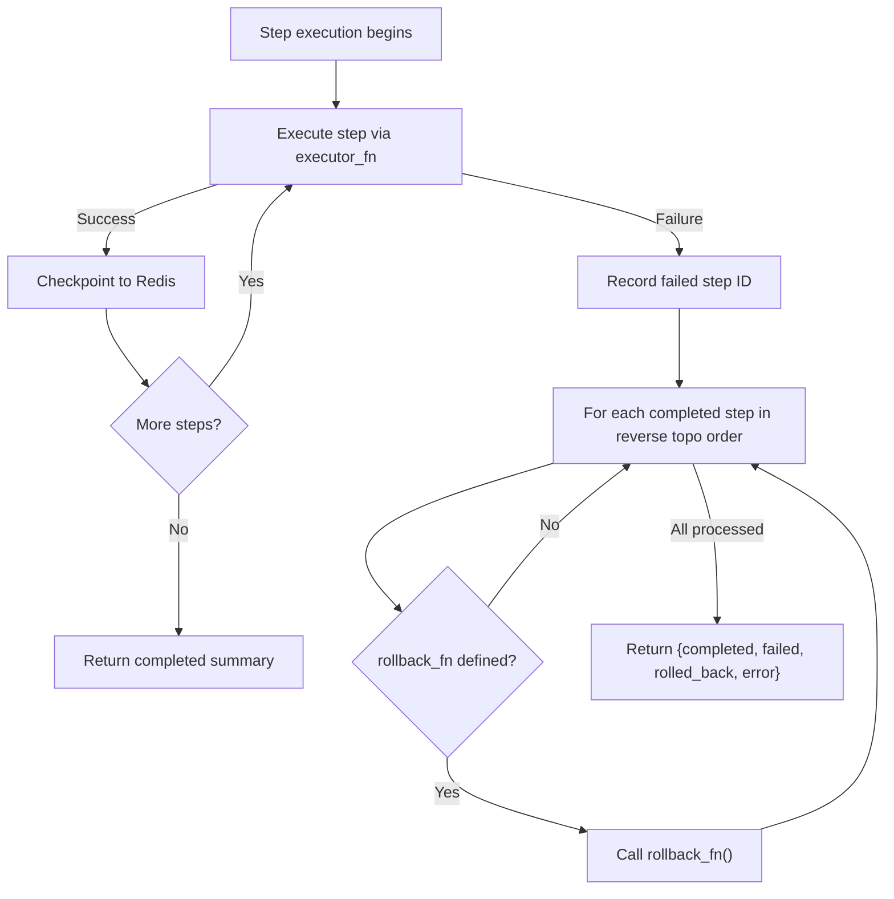
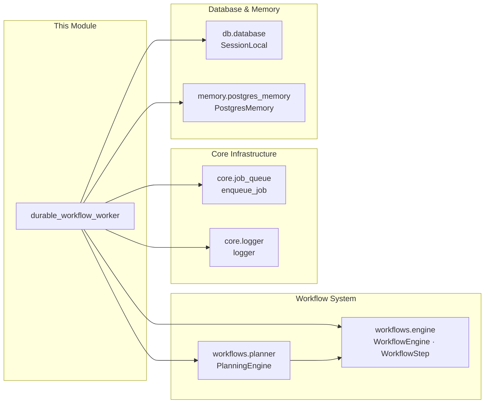

# Durable Workflow Execution Worker (`chat_agent_execution_workers_workflow`)

## 1. Introduction

The **Durable Workflow Execution Worker** is the component responsible for executing multi-step workflows with **checkpoint/resume** and **rollback-aware** semantics. It lives within the broader [`chat_agent_execution_workers`](chat_agent_execution_workers.md) family of background workers and is the specific sub-module that handles *workflow* jobs (as opposed to chat, agent, sandbox, security, or skill-loop jobs).

At its core, the module provides two entry points:

| Function | Purpose |
|---|---|
| `execute_durable_workflow()` | Execute a workflow definition durably — reconstructing steps, delegating to the `PlanningEngine` for checkpointed, rollback-aware execution, and updating workflow status in the database. |
| `resume_interrupted_workflows()` | Called at worker startup to find workflows stuck in `running` status for more than 5 minutes and re-enqueue them from their last checkpoint. |

The module is designed to survive process crashes, worker restarts, and infrastructure failures by persisting execution state after every step and automatically resuming interrupted workflows on the next boot.

---

## 2. Architecture Overview



### 2.1 Position in the Worker Hierarchy

This module is one of five sibling sub-modules under the `chat_agent_execution_workers` parent:



> See [`chat_agent_execution_workers`](chat_agent_execution_workers.md) for the parent module overview and [`worker_orchestration`](worker_orchestration.md) for how all workers are started and managed.

---

## 3. Core Components

### 3.1 `execute_durable_workflow(workflow_id, workflow_def, triggered_by)`

**Purpose:** Execute a workflow definition with full durability guarantees.

**Algorithm:**

1. **Reconstruct steps** — Parse `workflow_def["steps"]` into `WorkflowStep` objects (id, name, step_type, input, depends_on, timeout_sec).
2. **Set status to `running`** — Update the `workflow_history` table via `_update_workflow_status()`.
3. **Delegate to `PlanningEngine`** — Call `engine.execute_with_rollback()` which:
   - Runs `analyze_plan()` to compute the critical path, risk scores, and rollback order.
   - Checks for an existing checkpoint (resume path).
   - Executes steps in topological order, checkpointing after each successful step.
   - On failure, invokes `rollback_fn` for all completed steps in reverse order.
4. **Determine final status** — `completed` if no steps failed, `failed` otherwise.
5. **Update workflow status** — Persist the final status to `workflow_history`.

**Parameters:**

| Parameter | Type | Description |
|---|---|---|
| `workflow_id` | `str` | Unique identifier for the workflow run. |
| `workflow_def` | `dict` | Workflow definition containing `steps` list and optional `stop_on_failure` flag. |
| `triggered_by` | `str` | Origin of the execution (`"manual"`, `"resume_on_startup"`, etc.). |

**Returns:** A dict with keys `workflow_id`, `completed` (list of step IDs), `failed` (list of step IDs), and `error` (string or `None`).

**Step Executor Callback:**

The function defines an inner `_step_executor(step)` callback that delegates to `WorkflowEngine._run_step()`. This callback is passed to `PlanningEngine.execute_with_rollback()` as the `executor_fn`. The `WorkflowEngine._run_step()` method handles dispatching to the appropriate handler based on `step.step_type` (`llm`, `code`, `shell`, `tool`, `agent`, `approval`).

> **SEC-06 Note:** The code explicitly uses `_run_step` (not `_execute_step`) as the correct method name on `WorkflowEngine`.

### 3.2 `resume_interrupted_workflows()`

**Purpose:** Called at worker startup to recover workflows that were interrupted by a crash or restart.

**Algorithm:**

1. **Query stuck workflows** — Select up to 50 rows from `workflow_history` where `status = 'running'` and `created_at` is older than 5 minutes.
2. **Check for checkpoints** — For each stuck workflow, call `PlanningEngine.resume_plan(wf_id)` to see if a checkpoint exists in Redis.
3. **Re-enqueue if checkpointed** — If a checkpoint is found, reconstruct the `workflow_def` from the stored metadata and call `enqueue_job()` to re-queue the workflow for execution with `triggered_by="resume_on_startup"`.
4. **Skip if no checkpoint** — Workflows without a checkpoint are logged and skipped (they cannot be safely resumed).

**Returns:** Integer count of workflows re-enqueued.

### 3.3 `_update_workflow_status(workflow_id, status)`

**Purpose:** Update the `status` column in the `workflow_history` table.

**Implementation:** Uses `PostgresMemory` to obtain a database cursor and execute an `UPDATE` statement. This is a best-effort operation — failures are logged at debug level and do not propagate, ensuring that status-update issues never crash the workflow execution itself.

---

## 4. Data Flow



---

## 5. Checkpoint & Resume Lifecycle

The durability guarantee is built on a layered checkpoint strategy:



### Checkpoint Storage

| Layer | Key / Table | TTL | Purpose |
|---|---|---|---|
| Redis KV | `plan_ckpt:{workflow_id}` | 24 hours (`PLAN_CHECKPOINT_TTL_SEC`) | Fast primary checkpoint — stores `completed_steps` list and per-step results. |
| Postgres | `workflow_history.status` | Permanent | Workflow-level status (`running`, `completed`, `failed`). |
| Postgres | `workflow_runs` (via `WorkflowEngine`) | Permanent | Full state snapshot for paused/approval workflows. |

### Resume Logic

When `PlanningEngine.execute_with_rollback()` is called, it first checks for an existing checkpoint via `resume_plan()`. If found, the `completed_steps` set is used to skip already-finished steps, and execution continues from the next pending step in topological order. This means:

- **Idempotent step execution** — Steps that were checkpointed as completed are never re-executed.
- **Safe restart** — A worker crash after step 3 of 10 will resume at step 4 on the next boot (if `resume_interrupted_workflows()` re-enqueues it).

---

## 6. Rollback-Aware Execution

The `PlanningEngine.execute_with_rollback()` method implements a rollback strategy when a step fails:



Each `WorkflowStep` may optionally carry a `rollback_fn` callable. When a step fails, the engine iterates through all previously completed steps in reverse topological order and invokes their rollback functions. This allows workflows to clean up side effects (e.g., undeploy a service, delete a created resource) when a later step fails.

---

## 7. Dependencies

### 7.1 Internal Module Dependencies



| Dependency | Component | Role |
|---|---|---|
| `workflows.engine` | `WorkflowEngine`, `WorkflowStep` | `WorkflowStep` is the data structure for individual steps. `WorkflowEngine._run_step()` is the per-step executor that dispatches to LLM, code, shell, tool, agent, or approval handlers. |
| `workflows.planner` | `PlanningEngine` | Provides DAG analysis (critical path, risk scoring), checkpoint/resume via Redis, and rollback-aware execution orchestration. |
| `core.job_queue` | `enqueue_job()` | Enqueues jobs onto RQ/Redis queues. Used by `resume_interrupted_workflows()` to re-queue interrupted workflows. |
| `core.logger` | `logger` | Structured logging throughout the module. |
| `db.database` | `SessionLocal` | SQLAlchemy session factory for querying `workflow_history` during startup recovery. |
| `memory.postgres_memory` | `PostgresMemory` | Provides a database cursor for updating `workflow_history.status`. |

### 7.2 Related Module Documentation

- **[`chat_agent_execution_workers`](chat_agent_execution_workers.md)** — Parent module covering all chat/agent/execution workers.
- **[`worker_orchestration`](worker_orchestration.md)** — How `start_workers.py` launches and manages all worker processes, including calling `resume_interrupted_workflows()` at startup.
- **[`workflow_system`](../workflows/workflow_system.md)** — The `WorkflowEngine`, `PlanningEngine`, and related workflow execution infrastructure.
- **[`core_infrastructure`](../infrastructure/core_infrastructure.md)** — Job queue, logging, and KV store infrastructure.
- **[`database`](../storage/database.md)** — Database models including `WorkflowRunRecord` and `workflow_history`.
- **[`memory_system`](../reference/memory_system.md)** — `PostgresMemory` and other memory backends.

---

## 8. Integration Points

### 8.1 How Workflows Are Enqueued

Workflows are enqueued onto the `"workflows"` RQ queue from several sources:

| Source | Trigger | `triggered_by` |
|---|---|---|
| API endpoint (e.g., `run_workflow`) | User manually runs a workflow | `"manual"` |
| Workflow scheduler | Cron-based or event-based trigger fires | `"scheduled"` |
| `resume_interrupted_workflows()` | Worker startup recovery | `"resume_on_startup"` |

The job payload always contains:
```json
{
  "workflow_id": "<uuid>",
  "workflow_def": { "steps": [...], "stop_on_failure": true },
  "triggered_by": "<source>"
}
```

### 8.2 Workflow Definition Format

The `workflow_def` dict expected by `execute_durable_workflow()` has this shape:

```python
{
    "steps": [
        {
            "id": "step_1",
            "name": "Generate Report",
            "step_type": "llm",          # llm | code | shell | tool | agent | approval
            "input": "Generate a summary of {data_step}",
            "depends_on": ["data_step"],
            "timeout_sec": 300
        },
        # ... more steps
    ],
    "stop_on_failure": True   # optional, default True
}
```

### 8.3 Status Lifecycle

The `workflow_history.status` column transitions through these states:

| Status | Meaning |
|---|---|
| `running` | Execution in progress (set at start of `execute_durable_workflow`). |
| `completed` | All steps finished successfully. |
| `failed` | One or more steps failed (after rollback). |

> **Note:** The `paused` state (used for HITL approval gates) is managed by `WorkflowEngine` directly via the `workflow_runs` table, not by this worker. See [`workflow_system`](../workflows/workflow_system.md) for details on the approval/pause/resume flow.

---

## 9. Error Handling & Resilience

| Scenario | Behavior |
|---|---|
| **No steps in workflow_def** | Logs a warning and returns an empty result dict (no error). |
| **Step execution raises exception** | `PlanningEngine` catches it, records the step as failed, executes rollback for completed steps, and returns the failure summary. The worker updates status to `failed`. |
| **`_update_workflow_status` fails** | Logged at debug level; does not propagate. The workflow still executes — only the status tracking is affected. |
| **Worker crash mid-execution** | Checkpoint in Redis survives. On next startup, `resume_interrupted_workflows()` finds the stuck workflow (status=`running`, age > 5min), verifies a checkpoint exists, and re-enqueues it. |
| **No checkpoint for stuck workflow** | The workflow is logged and skipped — it cannot be safely resumed and will remain in `running` status (requires manual intervention). |
| **Redis unavailable** | `PlanningEngine.checkpoint_plan()` and `resume_plan()` log warnings but do not crash. Execution proceeds without checkpointing (no resume capability for that run). |
| **Postgres unavailable** | `_update_workflow_status()` silently fails. `resume_interrupted_workflows()` catches the exception and returns 0. |

---

## 10. Configuration

The module relies on configuration from several sources:

| Config | Source | Default | Description |
|---|---|---|---|
| `PLAN_CHECKPOINT_TTL_SEC` | `workflows.planner` | 86400 (24h) | TTL for Redis checkpoint keys. |
| Queue name | Hardcoded | `"workflows"` | RQ queue name for workflow jobs. |
| Resume timeout | Hardcoded | 5 minutes | Minimum age before a `running` workflow is considered stuck. |
| Resume batch size | Hardcoded | 50 | Max workflows re-enqueued per startup. |
| Re-enqueue job timeout | Hardcoded | 3600s (1h) | RQ job timeout for re-enqueued workflows. |

---

## 11. Summary

The Durable Workflow Execution Worker is the reliability backbone for multi-step workflow execution. By combining:

- **Per-step checkpointing** (Redis) for fast resume,
- **Rollback-aware execution** (`PlanningEngine`) for safe failure handling,
- **Startup recovery** (`resume_interrupted_workflows`) for crash resilience, and
- **Database status tracking** (`workflow_history`) for observability,

it ensures that workflows either complete successfully or fail cleanly with side effects rolled back — even across process restarts and infrastructure failures.
