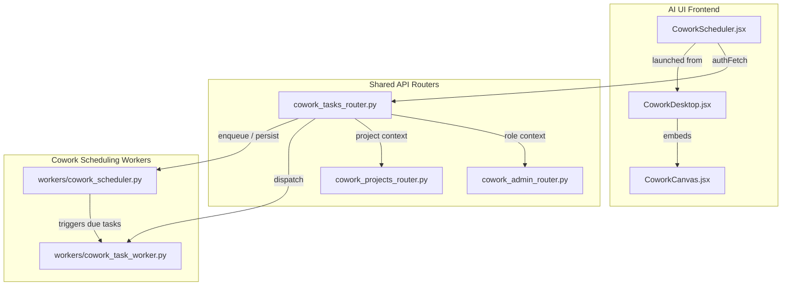
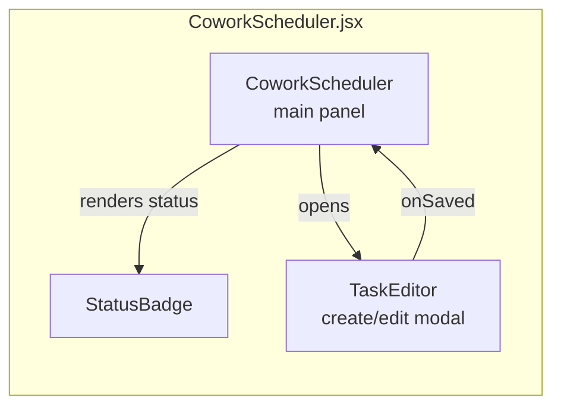
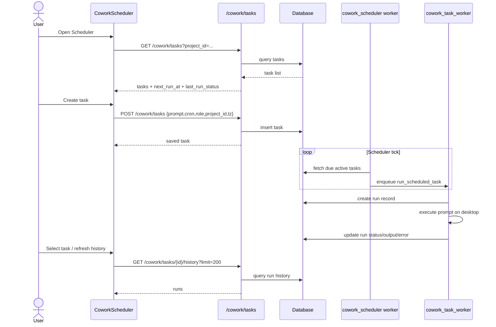
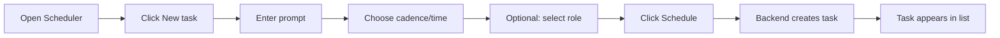
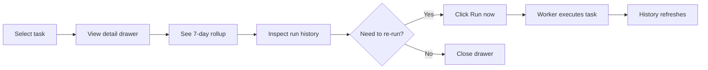
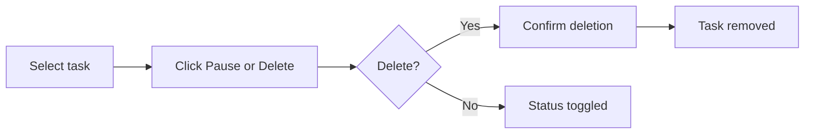

# Cowork Scheduler

The **Cowork Scheduler** is the recurring-task management UI for the Buddy desktop assistant. It lets users create, edit, pause, run, and monitor scheduled tasks that Buddy executes automatically on the user's desktop. A task is a natural-language instruction (for example, *"Summarise my calendar for the day and email me a digest"*) combined with a cron-like schedule, an optional role, and a project scope.

The scheduler is implemented as a dedicated full-screen panel inside the AI UI frontend. It is part of the larger **Cowork** feature set, which also includes the desktop runtime, project management, role configuration, and usage tracking.

---

## 1. Purpose and Core Functionality

### 1.1 What it does

- Displays a table of scheduled tasks for the current project (or all tasks when no project is selected).
- Shows each task's prompt, human-readable schedule, next run time, and last-run status.
- Opens a detail drawer for a selected task with full metadata, action buttons, and a 7-day run history.
- Provides a create/edit modal with a friendly cadence picker (daily / weekly / monthly) and an advanced raw-cron mode.
- Supports pausing/resuming, running immediately, and deleting tasks.
- Visualises recent run outcomes with a colour-coded success/fail strip and a per-run status list.

### 1.2 Key capabilities

| Capability | Description |
|------------|-------------|
| Friendly scheduling | Users pick *daily*, *weekly*, or *monthly* cadences plus a time; the component builds the cron expression. |
| Raw cron support | Power users can enter any 5-field cron expression directly. |
| Role selection | A task can run as a generic Buddy or as a published Cowork role (persona). |
| Project scoping | New tasks are attached to the project that was open when the scheduler was launched. |
| Run history | Each task exposes its last 200 runs with status, output, and error details. |
| Immediate execution | A *Run now* button enqueues the task on the backend worker queue. |
| Pause / resume | Tasks can be paused without deleting them. |
| Email delivery | The backend extracts recipients from the task prompt and sends results via Outlook automatically. |

---

## 2. Architecture

### 2.1 High-level placement



### 2.2 Component structure



### 2.3 Data flow



---

## 3. Core Components

### 3.1 `CoworkScheduler`

The main panel component. It manages the list of tasks, the selected task detail drawer, the run-history view, and the create/edit modal state.

**Props**

| Prop | Type | Description |
|------|------|-------------|
| `projectId` | `string` | Optional project filter for the task list and default scope for new tasks. |
| `projectName` | `string` | Displayed in the header when a project is active. |
| `roles` | `array` | Published Cowork roles available in the *Run as role* dropdown. |
| `initialCreate` | `boolean` | If true, opens the create modal on mount. |
| `initialPrompt` | `string` | Pre-fills the prompt when `initialCreate` is true. |
| `onClose` | `function` | Called when the user closes the scheduler panel. |
| `onToast` | `function` | Optional callback to show a toast message. |

**State**

| State | Purpose |
|-------|---------|
| `tasks` | Loaded task list. |
| `loading` | Initial list loading indicator. |
| `selectedId` | Currently selected task for the detail drawer. |
| `history` | Run history for the selected task. |
| `histLoading` | History loading indicator. |
| `editing` | Task being edited, or `{}` for a new task, or `null` when closed. |
| `busyId` | ID of the task currently performing an async action (pause/run/delete). |
| `err` | Inline error message. |

**Key behaviours**

- Loads tasks on mount and whenever `projectId` changes.
- Loads run history whenever `selectedId` changes.
- `toggleStatus` flips a task between `active` and `paused`.
- `runNow` enqueues an immediate run and refreshes history after a short delay.
- `remove` asks for confirmation before deleting a task.
- Computes a 7-day rollup (`ok` / `total` / `fail`) from the run history.

### 3.2 `TaskEditor`

A modal form for creating or editing a scheduled task.

**Props**

| Prop | Type | Description |
|------|------|-------------|
| `task` | `object \| null` | Existing task for edit mode; `null` for create mode. |
| `defaultPrompt` | `string` | Initial prompt value. |
| `roles` | `array` | Roles for the *Run as role* dropdown. |
| `projectId` | `string` | Project scope for new tasks. |
| `onClose` | `function` | Closes the modal. |
| `onSaved` | `function(msg, savedTask)` | Called after a successful save. |

**Scheduling logic**

- `parseCron` converts a 5-field cron string into a friendly `{cadence, time, dow, dom}` object.
- `buildCron` converts the friendly values back into a cron string.
- `cronToText` renders a human-readable summary such as *"Every Monday at 09:00"*.
- When *Custom (cron)* is selected, the user edits the raw cron string directly.
- The local timezone is captured from `Intl.DateTimeFormat().resolvedOptions().timeZone` and stored with the task.

**Validation**

- Prompt must be non-empty.
- Cron must be a valid 5-field expression.

### 3.3 `StatusBadge`

A small, colour-coded status chip that normalises backend status values into four categories:

| Normalised status | Source values | Visual |
|-------------------|---------------|--------|
| `ok` | `done`, `success`, `ok` | Green |
| `error` | `error`, `failed` | Red |
| `skipped` | `skipped_disabled`, `not_found`, etc. | Amber |
| `never` | missing / empty | Grey |

---

## 4. Backend Integration

The scheduler communicates with the backend through the `cowork_tasks_router` endpoints. The component uses `authFetch` from `ai-ui/src/config.js` for authenticated requests.

### 4.1 Endpoints used

| Method | Endpoint | Purpose |
|--------|----------|---------|
| `GET` | `/cowork/tasks[?project_id=...]` | List tasks. |
| `POST` | `/cowork/tasks` | Create a new task. |
| `PUT` | `/cowork/tasks/{id}` | Edit prompt, cron, role, or status. |
| `DELETE` | `/cowork/tasks/{id}` | Delete a task. |
| `POST` | `/cowork/tasks/{id}/run-now` | Enqueue immediate execution. |
| `GET` | `/cowork/tasks/{id}/history?limit=...` | Fetch run history. |

### 4.2 Task payload

```json
{
  "prompt": "Summarise my calendar and email me a digest",
  "cron": "0 9 * * 1",
  "role": "executive-assistant",
  "project_id": "proj_123",
  "tz": "Asia/Kolkata"
}
```

### 4.3 Worker execution

Scheduling is handled by two workers:

- **`workers/cowork_scheduler.py`** — periodically queries the database for due active tasks and enqueues them.
- **`workers/cowork_task_worker.py`** — executes the scheduled task on the desktop, records the run outcome, and handles automatic email delivery when the prompt contains a recipient.

For details on the worker orchestration, see [worker_orchestration](worker_orchestration.md) and [cowork_scheduling_workers](cowork_scheduling_workers.md).

---

## 5. Dependencies

### 5.1 Internal frontend dependencies

| Dependency | Module doc |
|------------|------------|
| `authFetch`, `API_BASE` from `../config` | [ai_ui_frontend_app_core](../ui/ai_ui_frontend_app_core.md) |
| `useConfirm` from `DialogProvider` | [ui_dialog](../ui/ui_dialog.md) |
| Lucide icons | External icon library |

### 5.2 Related Cowork modules

| Module | Relationship |
|--------|--------------|
| [cowork_desktop](../cowork/cowork_desktop.md) | Hosts the scheduler panel and provides the desktop runtime context. |
| [cowork_canvas](../cowork/cowork_canvas.md) | Visual workspace for Cowork sessions; scheduler can be launched from the desktop shell. |
| [cowork_settings](../cowork/cowork_settings.md) | Configures permissions and roles used by scheduled tasks. |
| [cowork_enterprise](../cowork/cowork_enterprise.md) | Enterprise rules and limits may constrain scheduler usage. |

### 5.3 Backend dependencies

| Module | Relationship |
|--------|--------------|
| [cowork_tasks_router](../cowork/cowork_tasks_router.md) | REST API for task CRUD, run-now, and history. |
| [cowork_projects_router](../cowork/cowork_projects_router.md) | Supplies project context and scoping. |
| [cowork_admin_router](../cowork/cowork_admin_router.md) | Supplies published Cowork roles. |
| [cowork_scheduling_workers](cowork_scheduling_workers.md) | Executes scheduled tasks and records history. |

---

## 6. User Flows

### 6.1 Creating a scheduled task



### 6.2 Monitoring and re-running a task



### 6.3 Pausing or deleting a task



---

## 7. Design Notes

- **Timezone handling**: The scheduler stores the user's local timezone with each new task. Backend scheduling should interpret cron expressions in that timezone.
- **Friendly cron subset**: The UI only offers daily/weekly/monthly builders plus raw cron. This keeps the UX simple while still supporting power users.
- **Async execution**: *Run now* returns immediately; the actual execution happens on the worker queue, and history is refreshed after ~4 seconds.
- **Error visibility**: Run-level errors are shown inline in the history list so users can diagnose failures without leaving the panel.
- **Project scoping**: When launched with a `projectId`, the scheduler filters the list and attaches new tasks to that project. When launched without one, it shows all user tasks.

---

## 8. References

- Frontend component: `ai-ui/src/components/CoworkScheduler.jsx`
- API router: `routers/cowork_tasks_router.py`
- Scheduler worker: `workers/cowork_scheduler.py`
- Task worker: `workers/cowork_task_worker.py`
- Related docs: [cowork_desktop](../cowork/cowork_desktop.md), [cowork_scheduling_workers](cowork_scheduling_workers.md), [cowork_tasks_router](../cowork/cowork_tasks_router.md), [worker_orchestration](worker_orchestration.md)
