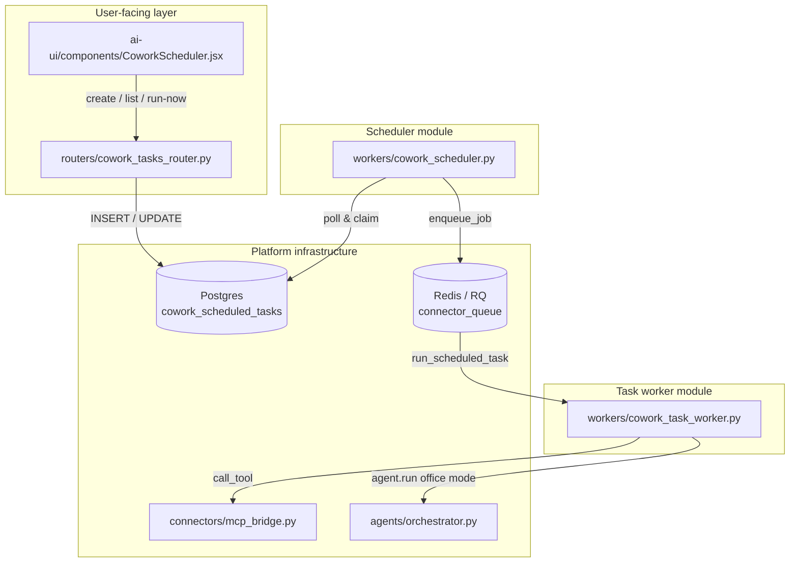
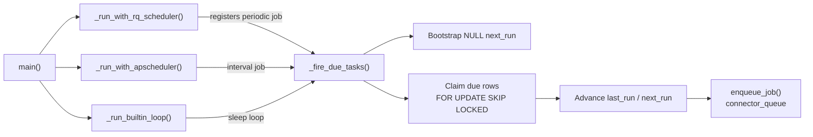
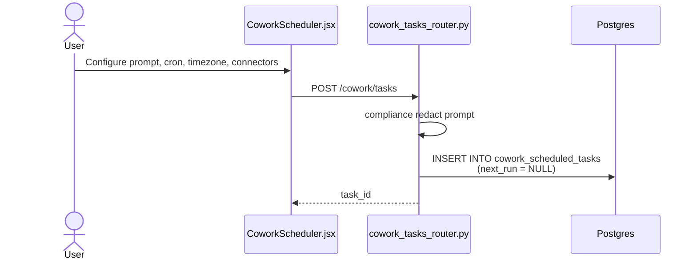
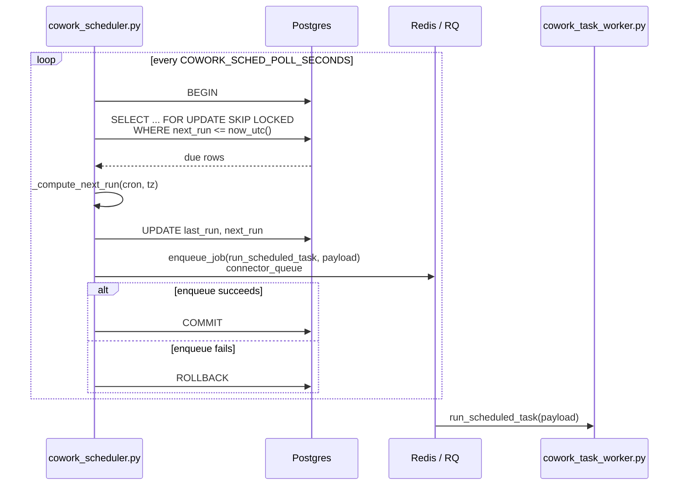

# Cowork Scheduling Workers — Scheduler

## Brief Introduction

The **Cowork Scheduler** (`workers/cowork_scheduler.py`) is the time-based trigger engine for recurring Cowork tasks. It polls the platform Postgres table `cowork_scheduled_tasks` for rows whose `next_run` is due, atomically advances each row's schedule, and enqueues a job on the RQ `connector_queue`. The actual execution is performed by [`cowork_scheduling_workers_task_worker.md`](cowork_scheduling_workers_task_worker.md) (`workers/cowork_task_worker.py::run_scheduled_task`).

The scheduler is deliberately minimal: it **only decides when to run** and **never executes connector writes, document generation, or outbound sends**. All side effects happen downstream under the same compliance-gated paths used by interactive Cowork. This design keeps multi-host deployments safe and guarantees that a scheduler restart cannot lose or double-fire an occurrence.

---

## Core Responsibilities

| Responsibility | Description |
| -------------- | ----------- |
| **Time-aware polling** | Evaluate `cowork_scheduled_tasks` rows on a configurable cadence (default 30s). |
| **Cron timezone handling** | Interpret cron expressions in the task's configured IANA timezone, then convert to UTC for storage and comparison. |
| **Atomic claim + advance** | Lock each due row with `FOR UPDATE SKIP LOCKED`, update `last_run`/`next_run`, then enqueue. |
| **Backend abstraction** | Use the best available scheduling backend (`rq-scheduler`, `APScheduler`, or a built-in poll loop) without changing behaviour. |
| **Safe enqueue** | Roll back the transaction if enqueue fails, so the row remains due and retries on the next tick. |
| **No execution of writes** | Only enqueue; all outbound actions are handled by the task worker through existing gated pipelines. |

---

## Architecture

### High-level placement



### Scheduler internal structure



---

## Component Reference

### `main()`

Entrypoint that selects the best available scheduling backend in order:

1. `rq-scheduler` — registers `_fire_due_tasks` as a repeating job.
2. `APScheduler` (`BlockingScheduler`) — interval-driven tick.
3. Built-in poll loop — sleeps `_POLL_SECONDS` between ticks.

The function blocks while the chosen backend runs.

### `_fire_due_tasks()`

The core tick function. It performs two passes inside a single Postgres transaction:

1. **Bootstrap pass** — For any active task with `next_run IS NULL`, compute the first fire time from the cron expression and timezone. Invalid crons are left `NULL` and skipped.
2. **Claim pass** — Select up to `_BATCH` active rows where `next_run <= now_utc()`, ordered by `next_run`. For each row:
   - Compute the next UTC fire time.
   - If the cron is invalid, de-schedule the task (`next_run = NULL`).
   - Update `last_run` and `next_run`.
   - Build a payload with `task_id`, `user_id`, `role`, `prompt`, `connectors`, `scheduled=True`, and `fired_at`.
   - Enqueue the job on `connector_queue` via [`core/job_queue.md`](../core_job_queue.md)'s `enqueue_job()`.
   - If enqueue fails, roll back the entire transaction so no schedule state is advanced.

The use of `FOR UPDATE SKIP LOCKED` makes the scheduler safe to run on multiple hosts: parallel instances split the available rows instead of contending.

### `_next_run_utc(cron_expr, base_utc, tz)` / `_compute_next_run(...)`

Computes the next fire time **strictly after** `base_utc`, interpreting the cron in the task's timezone.

Key implementation detail: `croniter` is fed a **naive local wall-clock datetime** and the real timezone is re-attached afterwards. This avoids a known issue where `croniter` anchors a timezone-aware base to UTC, causing expressions like `20 14 * * *` to fire at 14:20 UTC instead of 14:20 in the user's zone.

Returns `None` for invalid cron expressions or unknown timezones.

### `_run_with_rq_scheduler()`

Attempts to drive ticks using `rq_scheduler.Scheduler`. It registers `_fire_due_tasks` as a repeating job with `interval=_POLL_SECONDS` and `repeat=None`, then calls `scheduler.run()`. Returns `True` if it took over, otherwise falls back.

### `_run_with_apscheduler()`

Attempts to drive ticks using `APScheduler.BlockingScheduler`. Configures a single interval job with `max_instances=1` and `coalesce=True` to prevent overlap and collapse missed ticks. Returns `True` on success.

### `_run_builtin_loop()`

Last-resort loop that sleeps `_POLL_SECONDS` between calls to `_fire_due_tasks()`. Requires only `croniter` (already a dependency).

---

## Configuration

| Environment variable | Default | Description |
| -------------------- | ------- | ----------- |
| `COWORK_SCHED_POLL_SECONDS` | `30` | Seconds between scheduler ticks. |
| `COWORK_SCHED_BATCH` | `50` | Max rows evaluated per tick. |
| `POSTGRES_HOST` / `POSTGRES_PORT` / `POSTGRES_DB` / `POSTGRES_USER` / `POSTGRES_PASSWORD` / `POSTGRES_SCHEMA` | — | Platform database DSN used by `_pg()`. |
| `REDIS_HOST` / `REDIS_PORT` | — | RQ broker (db=5) used by `enqueue_job()`. |

---

## Data Flow

### Creating a scheduled task



### Firing a due task



---

## Deployment & Operations

### How to run

```bash
python workers/cowork_scheduler.py
```

In production this process is managed by PM2 (not systemd). It can also be started via the worker orchestrator:

```bash
python workers/start_workers.py --cowork-scheduler
```

When running `start_workers.py` in default all-queues mode or with `--connector`, the Cowork scheduler thread is started automatically.

### Multi-instance safety

- The scheduler stores no state in Redis or in the scheduling backend.
- `FOR UPDATE SKIP LOCKED` ensures only one instance claims a given due row.
- `next_run` is advanced **before** enqueue, so a crash after the commit but before the worker finishes loses at most one occurrence (idempotency is the worker's responsibility).
- If enqueue fails, the transaction is rolled back and the row remains due.

### Observability

Log lines to watch:

| Pattern | Meaning |
| ------- | ------- |
| `cowork_scheduler: fired task ...` | A task was claimed and enqueued. |
| `cowork_scheduler: bootstrapped next_run for task ...` | First fire time computed for a new task. |
| `cowork_scheduler: de-scheduled task ... (invalid cron)` | Cron expression was invalid; task will not run until fixed. |
| `cowork_scheduler: enqueue failed ... — rolling back tick` | RQ/Redis issue; retry will happen on next tick. |
| `cowork_scheduler: tick failed` | Unexpected exception in the tick. |

---

## Security & Compliance Notes

- **No prompt logging**: The scheduler payload includes the task prompt, but the scheduler logs only `task_id`, `user_id`, `role`, `job_id`, and `next_run` — never the prompt text or connector payloads.
- **No auto-execution of writes**: The scheduler only enqueues. Outbound sends and connector writes are performed by the task worker through [`connectors/mcp_bridge.md`](../connectors_mcp_bridge.md), which applies the same compliance hard-block and recipient validation as interactive Cowork.
- **Secrets never logged**: Environment-driven DSN construction uses `core.config.postgres_dsn()`; passwords are not emitted.

---

## Related Modules

- [`cowork_scheduling_workers_task_worker.md`](cowork_scheduling_workers_task_worker.md) — Executes the enqueued scheduled tasks; handles agent invocation, email composition, and delivery.
- [`core/job_queue.md`](../core_job_queue.md) — RQ enqueue abstraction (`enqueue_job`, `Q_CONNECTOR`).
- [`core/config.md`](../infrastructure/core_config.md) — Database DSN and feature flags.
- [`connectors/mcp_bridge.md`](../connectors_mcp_bridge.md) — Connector tool execution pipeline used by the task worker.
- [`agents/orchestrator.md`](../agents_orchestrator.md) — Office-mode agent run invoked by the task worker.
- [`routers/cowork_tasks_router.md`](../routers_cowork_tasks_router.md) — REST API for creating, listing, updating, and manually running scheduled tasks.
- [`ai_ui_frontend_cowork_scheduler.md`](../ai_ui_frontend_cowork_scheduler.md) — Frontend UI for scheduled Cowork tasks.
- [`workers/start_workers.md`](../workers_start_workers.md) — Worker orchestrator that can start the scheduler thread.
