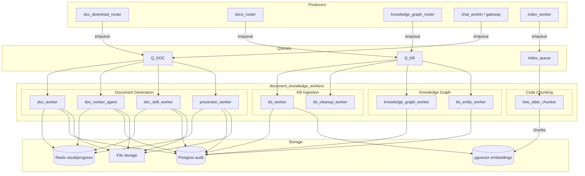
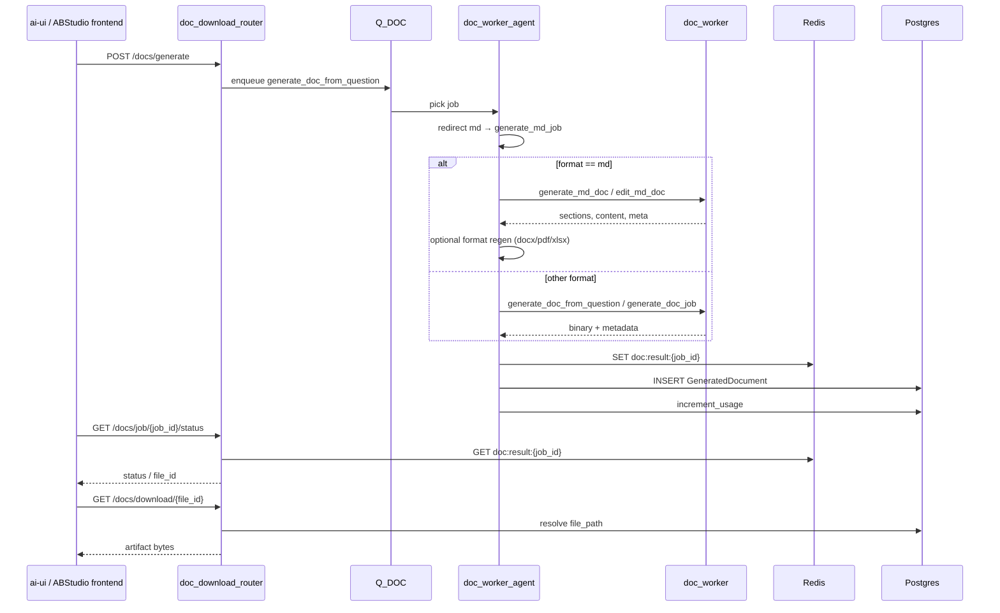
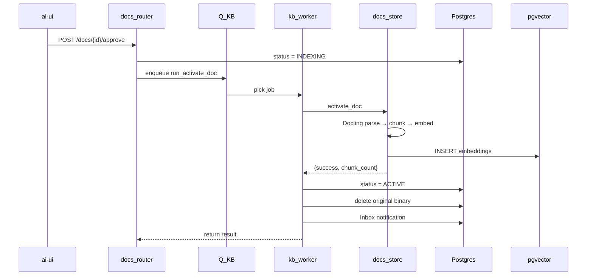
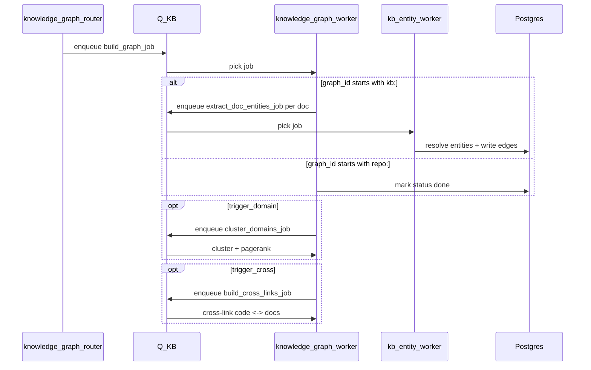

# Document & Knowledge Workers

## Overview

The `document_knowledge_workers` module is a collection of background RQ workers that power document generation, knowledge-base ingestion, and knowledge-graph construction for the ABStudio / ai-nxt platform. These workers run outside the request path (in the `workers` process pool started via `workers/start_workers.py`) so that long-running, CPU/IO-heavy, or LLM-dependent operations do not block HTTP requests.

The module sits at the intersection of three product capabilities:

1. **Document Generation** — produce branded PDF, DOCX, PPTX, XLSX, TXT, and Markdown artifacts from a user question or pre-structured sections.
2. **Knowledge Base (KB) Ingestion** — parse, chunk, embed, and activate uploaded documents so they become searchable for RAG.
3. **Knowledge Graph Construction** — extract entities and relations from KB docs and code repos, build cross-links, and cluster domains.

These workers are consumers; they are enqueued by API routes in `shared_api_routers` (e.g. `doc_download_router`, `docs_router`, `knowledge_graph_router`), by chat flows in `gateway`, and by other workers such as `index_worker`.

## Architecture

### Worker Process Model

All workers are RQ jobs. They are started by `workers/start_workers.py` with flags such as `--doc` and `--kb`. Each worker function receives a `payload` dict, performs the work, and writes results to Redis (`doc:result:{job_id}`, `ppt:result:{job_id}`) and/or Postgres. Progress is published to Redis (`doc:progress:{job_id}`) so the UI can show real-time status.

### Key Design Principles

- **Fail-open compliance gates**: document workers run input through `agents.compliance_engine` but continue if the engine itself errors.
- **Idempotency**: KB activation and graph jobs use content-hash guards and `ON CONFLICT` upserts so re-running is safe.
- **Cancellation awareness**: generation workers check `core.generation_registry.is_stopped_redis(job_id)` at safe points.
- **Budget accounting**: token/cost metadata is written to chat messages and `store.budget_store.increment_usage`.
- **RBAC scoping**: graph and KB operations mirror `classification`, `department`, and `min_band_level` from source records.

## Sub-modules

| Sub-module | Purpose | Files | Documentation |
|---|---|---|---|
| Document Generation Workers | Generate PDF/DOCX/PPTX/XLSX/TXT/MD artifacts and presentations | `doc_worker.py`, `doc_worker_agent.py`, `doc_skill_worker.py`, `presenton_worker.py` | document_knowledge_workers_document_generation.md |
| Knowledge Base Ingestion Workers | Parse, chunk, embed, and activate uploaded KB documents | `kb_worker.py`, `kb_cleanup_worker.py` | document_knowledge_workers_kb_ingestion.md |
| Knowledge Graph Workers | Extract entities/relations, build graphs, cross-link code and docs, cluster domains | `knowledge_graph_worker.py`, `kb_entity_worker.py` | document_knowledge_workers_knowledge_graph.md |
| Code Chunking Worker | AST-aware code chunking for repository indexing | `tree_sitter_chunker.py` | document_knowledge_workers_code_chunking.md |

## Data Flow

### Document Generation Flow

### KB Activation Flow

### Knowledge Graph Flow

## Integration with Other Modules

- **API layer**: `doc_download_router`, `docs_router`, `knowledge_graph_router`, and `presenton_router` enqueue jobs and poll results. See their respective documentation for request/response schemas.
- **Agent layer**: `agents.compliance_engine` gates content; `agents.doc_generator_agent` handles Markdown generation/editing; `sandbox.doc_executor` runs agent-authored document builds. See [shared_core.md](../core/shared_core.md) and its sub-modules.
- **Storage layer**: `store.docs_store`, `store.kb_entity_registry`, and `store.budget_store` provide persistence and accounting. See [shared_core.md](../core/shared_core.md).
- **Model routing**: `models.model_router` is used by graph workers for LLM extraction. See [shared_core.md](../core/shared_core.md).
- **Frontend**: `ai-ui` components such as `DocLivePreview`, `DocWorkflowCard`, `KnowledgeBase`, and `KbChat` consume these workers. See ai_ui_frontend.md.

## Operational Notes

- **Queues**: document jobs use `Q_DOC`; KB/graph jobs use `Q_KB`. Both are defined in `core.job_queue`.
- **Scaling**: run more `--doc` and `--kb` worker processes when queue depth grows. Presenton calls are blocking up to 240s, so keep enough workers.
- **Timeouts**: KB activation has no hard RQ cap but stage-level HTTP timeouts apply; graph entity extraction uses 600s; Presenton uses 240s.
- **Monitoring**: each worker wraps itself in `core.log_job_context` and emits structured logs with `job_id`, `user_id`, `chat_id`, and `agent_id`.
- **Cleanup**: `kb_cleanup_worker.recover_stale_indexing_docs` runs every 10 minutes to reset documents stuck in `INDEXING` longer than 35 minutes.
