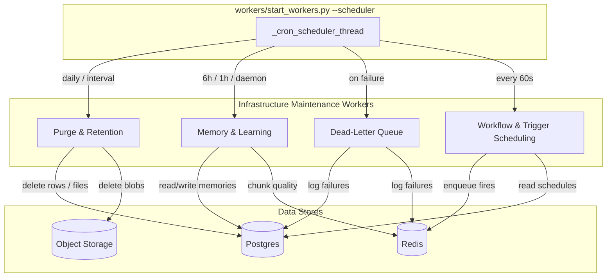
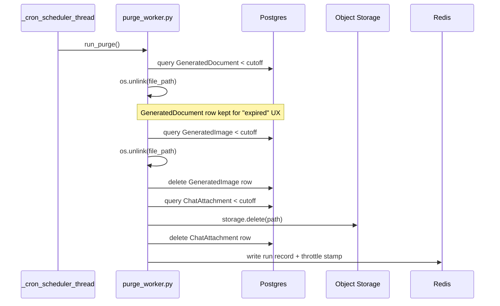
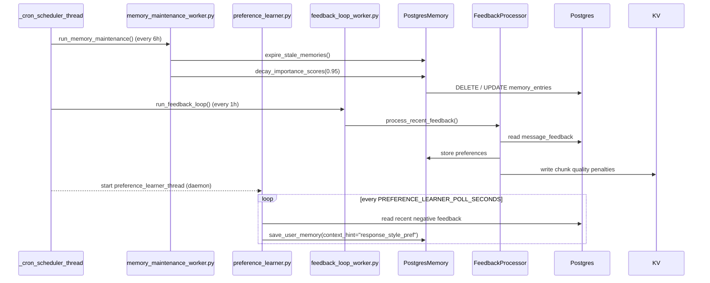
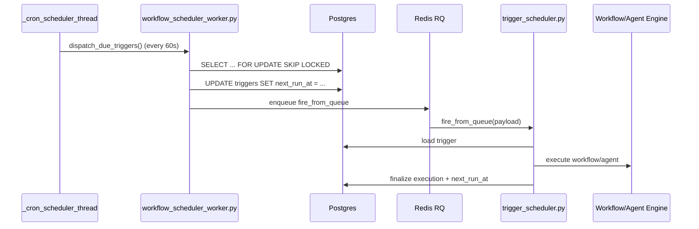

# Infrastructure Maintenance Workers

## Overview

The `infrastructure_maintenance_workers` module is a collection of background worker scripts that keep the AiNxt platform healthy, tidy, and self-improving. These workers run on scheduled cadences (managed by [`workers/start_workers.py`](worker_orchestration.md)) and perform housekeeping that does not belong on the interactive request path:

- **Data retention**: purging expired generated documents, images, uploaded chat attachments, and stale chat threads.
- **Memory quality**: expiring stale memory entries, decaying old importance scores, and distilling user feedback into durable preferences.
- **Failure handling**: recording permanently failed jobs into the dead-letter queue (DLQ) for later inspection.
- **Workflow & trigger scheduling**: dispatching cron-based platform workflows and AB Studio user-defined triggers.

All workers in this module are designed to be **idempotent**, **fail-safe**, and **observable**. They write run records to the KV trace store, log structured summaries, and support dry-run modes for safe testing.

---

## Architecture

The maintenance workers are not a single long-running service. Instead, they are discrete Python modules that are invoked by the cron scheduler thread inside [`workers/start_workers.py`](worker_orchestration.md). The scheduler runs in the parent worker process when `start_workers.py` is started with `--scheduler`.

### Key Design Principles

1. **Opportunistic throttling**: purge workers use Redis-set throttle keys so that even if invoked multiple times, only one process performs the sweep within the throttle window.
2. **DB rows preserved where UX matters**: generated-document binaries are deleted, but the `GeneratedDocument` row and chat marker are kept so the UI can render an "expired" state instead of hiding the conversation turn.
3. **Lost-fire-over-duplicate-fire**: the trigger dispatcher advances `next_run_at` in Postgres before enqueuing to Redis, ensuring exactly-once dispatch even if multiple scheduler hosts exist.
4. **No request-path impact**: preference learning and feedback loops run in background threads and never block user requests.

---

## Sub-modules

| Sub-module | Files | Responsibility | Cadence |
|------------|-------|----------------|---------|
| [Purge & Retention](infrastructure_maintenance_workers_purge.md) | `purge_worker.py`, `thread_purge.py` | Remove expired generated docs, images, uploads, and stale chat threads. | Daily (configurable) |
| [Memory & Learning](infrastructure_maintenance_workers_memory.md) | `memory_maintenance_worker.py`, `preference_learner.py`, `feedback_loop_worker.py` | Expire/decay memory entries and derive user preferences from feedback. | 6h / 1h / daemon poll |
| [Dead-Letter Queue](infrastructure_maintenance_workers_dlq.md) | `dlq_worker.py` | Record permanently failed jobs for admin inspection. | On job failure |
| [Workflow & Trigger Scheduling](infrastructure_maintenance_workers_scheduling.md) | `workflow_scheduler_worker.py` | Dispatch scheduled platform workflows and AB Studio triggers. | Every 60s |

---

## Data Flow

### Retention Sweep

### Memory Maintenance & Learning

### Trigger Dispatch

---

## Integration with the Rest of the System

| Dependency | Module | Role |
|------------|--------|------|
| `workers/start_workers.py` | [worker_orchestration](worker_orchestration.md) | Orchestrates cron schedule and worker processes. |
| `core.job_queue.enqueue_job` | [core_infrastructure](../core/core_infrastructure.md) | Enqueues scheduled workflow and trigger fire jobs. |
| `core.kv.get_kv` | [core_infrastructure](../core/core_infrastructure.md) | Redis access for throttling, run records, and chunk quality. |
| `core.storage.storage` | [core_infrastructure](../core/core_infrastructure.md) | Deletes uploaded attachment blobs. |
| `core.ckms.load_at_boot` | [ckms](../core/shared_core.md) | Decrypts protected env vars before imports. |
| `db.models` / `db.database` | [database](../core/shared_core.md) | ORM models and sessions for purge and scheduling queries. |
| `memory.postgres_memory.PostgresMemory` | [memory_system](../core/shared_core.md) | Stores and maintains memory entries and user preferences. |
| `services.feedback_processor.FeedbackProcessor` | [services](../core/shared_core.md) | Extracts preferences and computes chunk quality penalties. |
| `app.core.workflow_repo` / `app.services.trigger_scheduler` | abstudio_backend | AB Studio trigger persistence and execution. |
| `workers.durable_workflow_worker.execute_durable_workflow` | [chat_agent_execution_workers](chat_agent_execution_workers.md) | Executes scheduled platform workflows. |

---

## Configuration

The module is controlled primarily through environment variables. Each worker documents its own env vars; the most important are summarized below.

| Variable | Default | Worker | Purpose |
|----------|---------|--------|---------|
| `DOC_RETAIN_DAYS` | 2 | `purge_worker.py` | Days to retain generated documents. |
| `IMAGE_RETAIN_DAYS` | 2 | `purge_worker.py` | Days to retain generated images. |
| `UPLOAD_RETAIN_DAYS` | 2 | `purge_worker.py` | Days to retain uploaded chat attachments. |
| `THREAD_RETAIN_DAYS` | 90 | `thread_purge.py` | Days to retain inactive chat threads. |
| `THREAD_MAX_MESSAGES` | 1000 | `thread_purge.py` | Per-thread message hard cap. |
| `PREFERENCE_LEARNING` | `true` | `preference_learner.py` | Enable feedback-driven style preferences. |
| `PREFERENCE_LEARNER_POLL_SECONDS` | 3600 | `preference_learner.py` | Poll interval for preference derivation. |

All purge workers also support a `--dry-run` CLI flag and corresponding `*_PURGE_DRY_RUN` env vars for safe testing.

---

## Operational Notes

- **Start the scheduler**: `python workers/start_workers.py --scheduler`
- **Dry-run a purge**: `python workers/purge_worker.py --dry-run` or `python workers/thread_purge.py --dry-run`
- **Run records**: Each worker writes a JSON summary to the KV trace store (`RDB_TRACE`, DB=1) with a 30-day TTL. Keys follow the pattern `<worker_name>:YYYYMMDD_HHMMSS`.
- **Exactly-once triggers**: `dispatch_due_triggers` uses `SELECT ... FOR UPDATE SKIP LOCKED` and advances `next_run_at` before enqueueing, so parallel scheduler processes cannot double-fire.
- **Safe concurrency**: Memory maintenance and feedback-loop operations are idempotent and safe to run while live traffic is being served.
