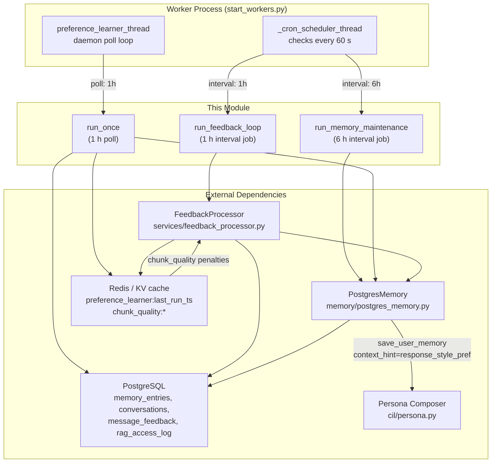
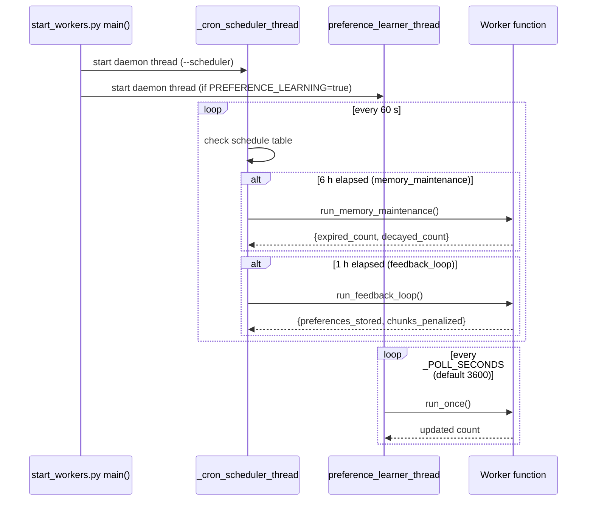
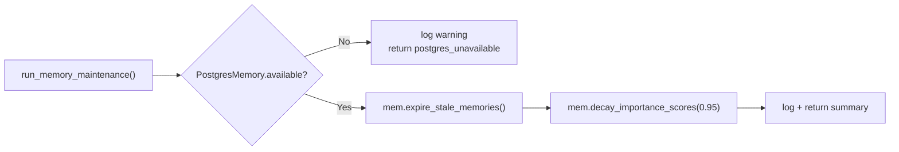
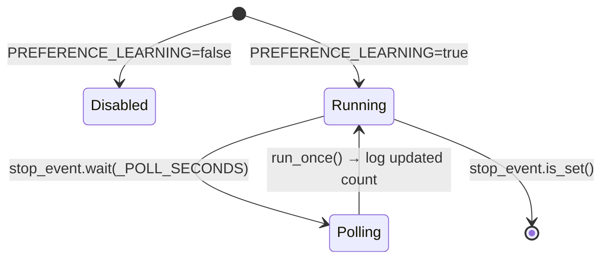
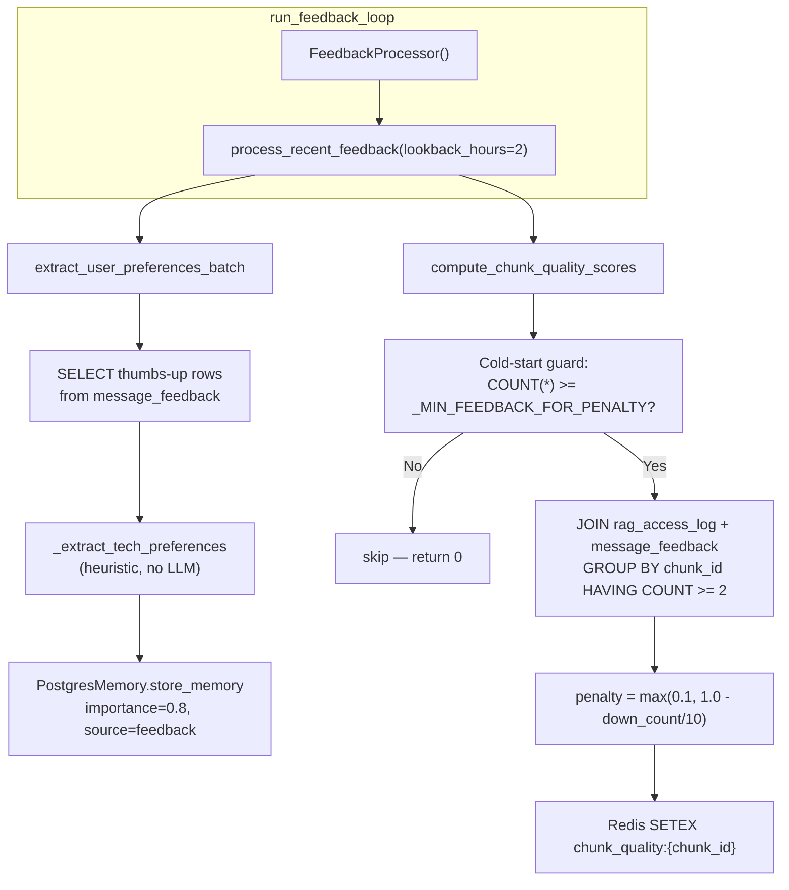
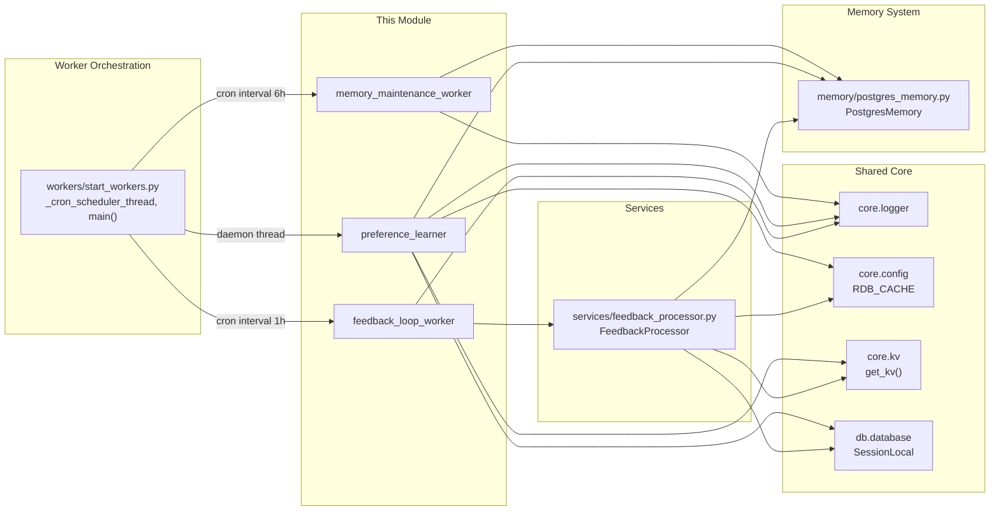
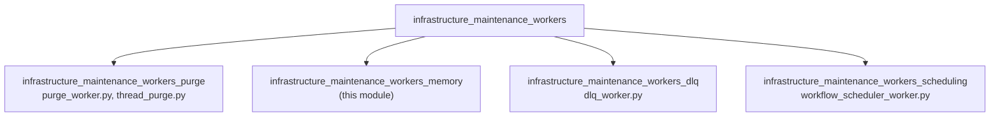

# Infrastructure Maintenance Workers — Memory

> **Module ID:** `infrastructure_maintenance_workers_memory`
> **Parent module:** [infrastructure_maintenance_workers](infrastructure_maintenance_workers.md) → [workers](worker_orchestration.md)
> **Scope:** Three background workers that maintain memory quality, learn user style preferences from feedback, and close the retrieval-quality feedback loop.

---

## 1. Introduction

The `infrastructure_maintenance_workers_memory` module is a sub-module of the
[infrastructure_maintenance_workers](infrastructure_maintenance_workers.md)
grouping within the broader [workers](worker_orchestration.md) subsystem. It
contains three long-running background jobs that keep the platform's memory and
feedback systems healthy without ever touching the live request/answer path:

| Worker | Entry point | Cadence | Purpose |
|---|---|---|---|
| **Memory Maintenance** | `run_memory_maintenance()` | Every 6 h (cron interval) | Expires stale memory entries and decays importance scores so old memories don't permanently dominate retrieval. |
| **Preference Learner** | `preference_learner_thread()` | Every 1 h (daemon poll thread) | Derives durable per-user style preferences from thumbs-down feedback and writes them into cross-chat memory. |
| **Feedback Loop** | `run_feedback_loop()` | Every 1 h (cron interval) | Extracts positive-feedback preferences and computes RAG chunk-quality penalties from negative feedback. |

All three workers are **idempotent**, **fail-safe** (every step is wrapped so a
failure logs and is skipped), and **background-only** — they run in daemon
threads or cron-triggered functions inside the worker process started by
[`start_workers.py`](worker_orchestration.md).

---

## 2. Architecture Overview



### 2.1 Scheduling Model

Two distinct scheduling mechanisms are used, both originating from
[`start_workers.py`](worker_orchestration.md):

1. **Cron interval jobs** (`memory_maintenance`, `feedback_loop`) — registered
   in the `_cron_scheduler_thread` interval table. The scheduler thread wakes
   every 60 seconds, checks whether an interval has elapsed, and invokes the
   target function via `importlib`. These are fire-and-forget synchronous calls
   inside the scheduler thread.

2. **Daemon poll thread** (`preference_learner_thread`) — started directly in
   `main()` when `--scheduler` is passed and `PREFERENCE_LEARNING` is enabled.
   It runs its own `while not stop_event.is_set()` loop with
   `stop_event.wait(_POLL_SECONDS)`, mirroring the cowork-scheduler pattern.



---

## 3. Component Documentation

### 3.1 Memory Maintenance Worker

**File:** `workers/memory_maintenance_worker.py`
**Entry point:** `run_memory_maintenance()`
**Cadence:** Every 6 hours (cron interval job `memory_maintenance`)

#### Purpose

Over time, the `memory_entries` table accumulates entries with `expires_at`
timestamps (session-scoped memories) and entries whose `importance_score` no
longer reflects their real-world relevance. This worker performs two
housekeeping operations:

1. **Expire stale memories** — `DELETE FROM memory_entries WHERE expires_at IS NOT NULL AND expires_at <= NOW()`. Removes session-scoped memories that have outlived their TTL.

2. **Decay importance scores** — `UPDATE memory_entries SET importance_score = GREATEST(0.1, LEAST(1.0, importance_score * 0.95)) WHERE created_at < NOW() - INTERVAL '30 days' AND importance_score > 0.1`. Applies a 5 % multiplicative decay to entries older than 30 days, clamped to a floor of 0.1 so memories never fully vanish from retrieval ranking.

Both operations are delegated to [`PostgresMemory`](../reference/memory_system.md) methods
(`expire_stale_memories()` and `decay_importance_scores()`) and are safe to run
concurrently with live traffic.

#### Return contract

```python
{
    "expired_count":  int,   # rows deleted by expire_stale_memories()
    "decayed_count":  int,   # rows updated by decay_importance_scores()
    "error":          str | None,
}
```

#### Failure handling

- If `PostgresMemory` is unavailable (`mem.available == False`), the worker
  logs a warning and returns `{"error": "postgres_unavailable"}` without
  raising.
- Any exception is caught, logged, and stored in `result["error"]`. The cron
  scheduler treats the job as completed (non-fatal).

#### Data flow



---

### 3.2 Preference Learner

**File:** `workers/preference_learner.py`
**Entry point:** `preference_learner_thread(stop_event)`
**Cadence:** Every 1 hour (daemon poll thread, configurable via `PREFERENCE_LEARNER_POLL_SECONDS`)

#### Purpose

Closes the "friendly chat" feedback loop **without reinforcement learning or
weight training**. It reads thumbs-down feedback from the `message_feedback`
table and, when a **stable pattern** emerges, writes a compact durable style
preference into the user's cross-chat memory. The persona composer
(`cil/persona.py`) then reads this back so future answers adapt:

```
feedback (thumbs + issue) → derived preference → user memory → persona → warmer/shorter replies
```

#### Configuration (environment variables)

| Variable | Default | Description |
|---|---|---|
| `PREFERENCE_LEARNING` | `true` | Master on/off flag. |
| `PREFERENCE_LEARNER_POLL_SECONDS` | `3600` | Poll interval (minimum 300 s). |
| `PREFERENCE_FEEDBACK_WINDOW` | `30` | Max feedback rows examined per user per run. |
| `PREFERENCE_MIN_SIGNALS` | `3` | Minimum negative signals required before a preference is written. |

#### Derivation logic (`_derive_from_rows`)

The derivation is **deterministic** — no LLM call is involved. It:

1. Filters to negative feedback rows (`rating < 0`).
2. Requires at least `_MIN_SIGNALS` (default 3) negative signals.
3. Matches each row's `issue` + `sub_issue` + `comment` text against a set of
   token buckets:

   | Token bucket | Derived preference |
   |---|---|
   | `too long`, `verbose`, `wordy` | "Prefers concise, to-the-point answers." |
   | `too short`, `not enough`, `more detail` | "Prefers thorough, detailed answers." |
   | `too formal`, `robotic`, `stiff` | "Prefers a warm, casual, conversational tone." |
   | `too casual`, `unprofessional` | "Prefers a professional, formal tone." |
   | `off topic`, `irrelevant` | "Wants answers that stay tightly on the exact question asked." |

4. Requires the dominant complaint bucket to appear **at least `_MIN_SIGNALS`
   times AND be a majority (≥ 60 %) of all negative signals** — this prevents
   over-fitting to a single gripe.

#### Watermark mechanism

To avoid re-processing the same feedback every cycle, a Redis watermark key
`preference_learner:last_run_ts` stores the Unix timestamp of the last
successful run. Each invocation only fetches `message_feedback` rows created
after that timestamp. If Redis is unavailable, the fallback window is the last
7 days.

#### Persistence

Derived preferences are written via
`PostgresMemory.save_user_memory(user_id, pref, context_hint="response_style_pref")`.
The memory layer deduplicates by the derived `context_key` (snake_case
normalisation of `context_hint`), so repeated runs with the same preference
update the existing entry rather than creating duplicates. See
[Memory System](../reference/memory_system.md) for the full upsert/merge/prune pipeline.

#### Thread lifecycle



#### Failure handling

- `run_once()` **never raises** — all exceptions are caught and logged.
- Individual user save failures are logged as warnings and skipped; the run
  continues for other users.
- Redis watermark update failures are silently ignored (next run uses the
  7-day fallback window).

---

### 3.3 Feedback Loop Worker

**File:** `workers/feedback_loop_worker.py`
**Entry point:** `run_feedback_loop()`
**Cadence:** Every 1 hour (cron interval job `feedback_loop`)

#### Purpose

A thin orchestrator that delegates to
[`FeedbackProcessor`](../reference/services.md) (`services/feedback_processor.py`). It
processes feedback from the last 2 hours to improve retrieval quality in two
ways:

1. **Positive feedback → preferences** — For each thumbs-up response,
   `FeedbackProcessor.extract_user_preferences_batch()` extracts
   language/framework/style mentions from the user prompt using a simple
   heuristic (no LLM) and stores them as `memory_entries` with
   `importance_score=0.8`, `source_type='feedback'`.

2. **Negative feedback → chunk penalties** —
   `FeedbackProcessor.compute_chunk_quality_scores()` joins `message_feedback`
   (thumbs-down) with `rag_access_log` to find which retrieved chunks
   contributed to bad responses. Chunks with ≥ 2 thumbs-down get a penalty
   score stored in Redis as `chunk_quality:{chunk_id}` (TTL-bounded), which
   downstream retrieval uses to demote low-quality chunks.

   A **cold-start guard** requires at least `_MIN_FEEDBACK_FOR_PENALTY` total
   feedback entries before any penalty is applied, preventing early
   over-penalisation.

#### Return contract

```python
{
    "preferences_stored": int,   # from extract_user_preferences_batch
    "chunks_penalized":   int,   # from compute_chunk_quality_scores
    "error":              str | None,
}
```

#### Data flow



#### Failure handling

- All exceptions in `FeedbackProcessor.process_recent_feedback()` are caught
  and stored in `result["error"]`.
- The worker itself wraps the call in a try/except and never raises — the cron
  scheduler sees the job as completed.

---

## 4. Dependency Map



### 4.1 Key dependencies

| Dependency | Module reference | Role |
|---|---|---|
| `PostgresMemory` | [memory_system](../reference/memory_system.md) | Persistent memory layer — `expire_stale_memories()`, `decay_importance_scores()`, `store_memory()`, `save_user_memory()`. |
| `FeedbackProcessor` | [services](../reference/services.md) | Feedback processing logic — `process_recent_feedback()`, `extract_user_preferences_batch()`, `compute_chunk_quality_scores()`. |
| `_cron_scheduler_thread` | [worker_orchestration](worker_orchestration.md) | Cron scheduler that fires `memory_maintenance` (6 h) and `feedback_loop` (1 h) interval jobs. |
| `core.kv.get_kv` / `RDB_CACHE` | [core_infrastructure](../infrastructure/core_infrastructure.md) | Redis/KV access for the preference learner watermark and chunk-quality penalty keys. |
| `db.database.SessionLocal` | [database](../storage/database.md) | SQLAlchemy session factory for direct `message_feedback` and `rag_access_log` queries. |
| `core.logger` | [core_infrastructure](../infrastructure/core_infrastructure.md) | Structured logging used by all three workers. |

---

## 5. Database Tables Touched

| Table | Workers | Operations |
|---|---|---|
| `memory_entries` | Memory Maintenance, Feedback Loop | `DELETE` (expire), `UPDATE` (decay), `INSERT` (store preferences from positive feedback) |
| `conversations` (role=`summary`) | Preference Learner | `INSERT`/`UPDATE` via `save_user_memory()` — cross-chat user memory with `context_key=response_style_pref` |
| `message_feedback` | Preference Learner, Feedback Loop | `SELECT` — thumbs-up/down rows with issue, sub_issue, comment, user_prompt, assistant_summary |
| `rag_access_log` | Feedback Loop | `SELECT` + `JOIN` — chunk_ids retrieved for thumbs-down responses |
| `agent_runs` | (indirect via PostgresMemory) | Read by `get_tool_sequence_hint()` which uses `importance_score` for ranking — the decay applied by Memory Maintenance directly affects this ranking |

---

## 6. Relationship to Sibling Modules

This module is one of four sub-modules under
[infrastructure_maintenance_workers](infrastructure_maintenance_workers.md):



- **Purge** — handles data retention (expired images, docs, uploads, chat
  threads). Runs daily at 00:00 IST via the same cron scheduler.
- **DLQ** — records dead-letter-queue jobs for failed background work.
- **Scheduling** — dispatches cron-based workflows and user-defined triggers
  every 60 seconds.

All four share the same `_cron_scheduler_thread` from
[`start_workers.py`](worker_orchestration.md) and the same daemon-thread
lifecycle model.

---

## 7. Operational Notes

### 7.1 Enabling / disabling

| Worker | Flag | Default |
|---|---|---|
| Memory Maintenance | Always on (no flag) | Enabled |
| Preference Learner | `PREFERENCE_LEARNING` | `true` |
| Feedback Loop | Always on (no flag) | Enabled |

The preference learner thread is started in `main()` only when `--scheduler`
is passed to `start_workers.py` **and** `PREFERENCE_LEARNING` is `true`.

### 7.2 Monitoring

All three workers log structured summaries on each run:

```
memory_maintenance_worker: expired=12 decayed=45
preference_learner: updated 3 user preference(s)
feedback_loop_worker: preferences_stored=5 chunks_penalized=2
```

The cron scheduler also logs `Cron: running {name}` and `Cron: {name}
completed` / `Cron: {name} failed — {error}` for the interval jobs.

### 7.3 Concurrency safety

- `expire_stale_memories()` and `decay_importance_scores()` use
  `DELETE`/`UPDATE` with `WHERE` clauses that are idempotent — running them
  twice produces the same result as running once.
- `save_user_memory()` uses an upsert-by-context-key pattern with a 50-entry
  prune, so concurrent writes for the same user are safe (last-writer-wins on
  the merged content).
- The preference learner watermark in Redis prevents redundant re-processing,
  but a missed watermark update only causes a wider (7-day) lookback — no
  data corruption.

### 7.4 Performance characteristics

| Worker | Typical DB load | Duration |
|---|---|---|
| Memory Maintenance | 1 `DELETE` + 1 `UPDATE` on `memory_entries` | < 1 s for moderate table sizes |
| Preference Learner | 1 `SELECT` on `message_feedback` + N `save_user_memory` calls (N = users with new feedback) | Scales with active user count; typically < 10 s |
| Feedback Loop | 2 `SELECT` queries + N Redis `SETEX` calls | < 5 s for moderate feedback volume |
