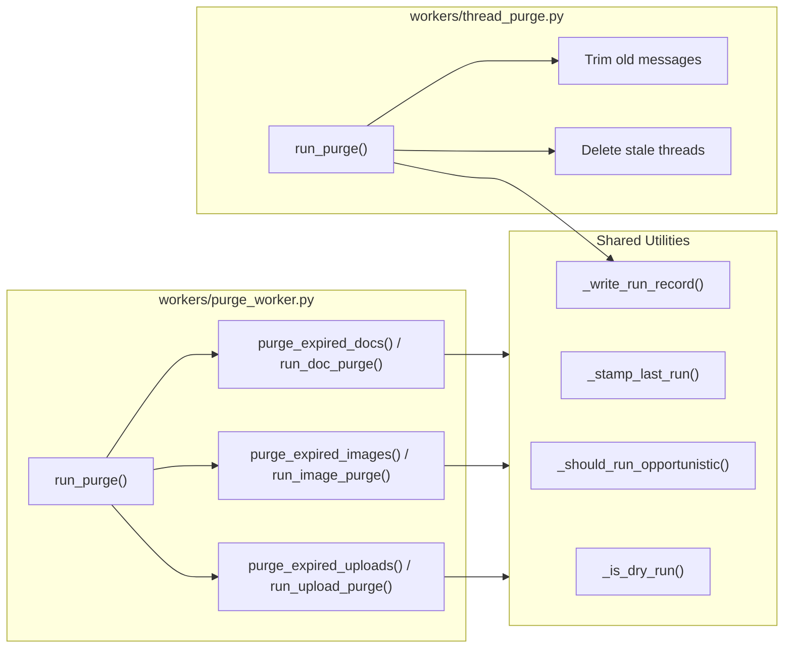
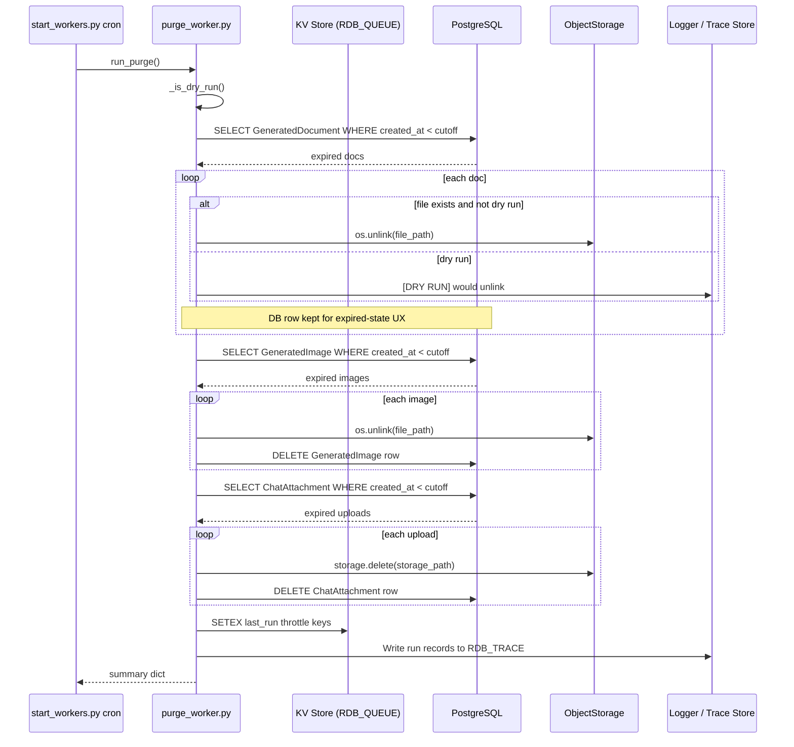
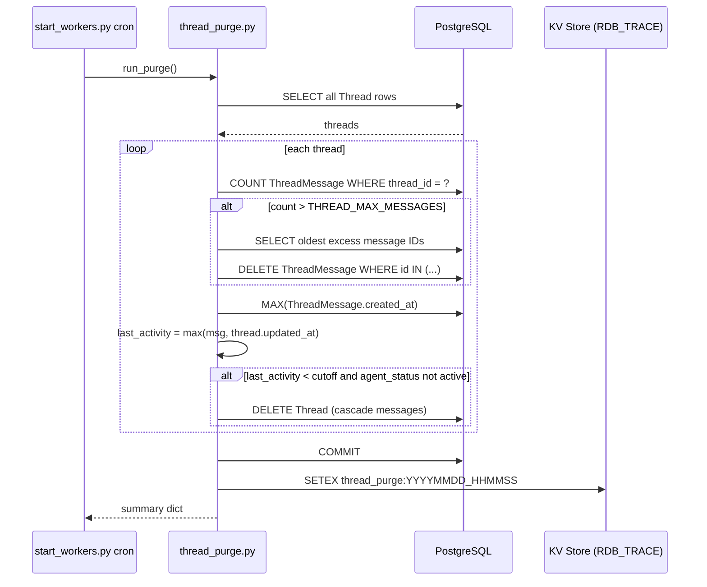
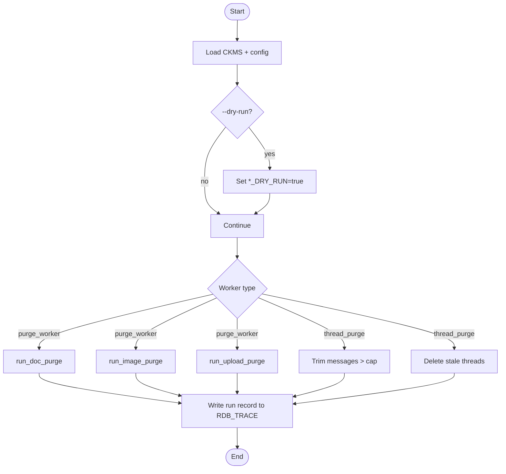

# Infrastructure Maintenance Workers — Purge

## Brief Introduction

The `infrastructure_maintenance_workers_purge` module provides scheduled, auditable cleanup of transient platform data. It consolidates legacy single-purpose purge scripts into two worker scripts that run as part of the platform's nightly cron schedule:

- **`workers/purge_worker.py`** — removes expired generated documents, generated images, and uploaded chat attachments according to separate retention windows.
- **`workers/thread_purge.py`** — trims oversized threads and deletes stale threads that have had no activity for a configurable period.

Both workers are designed to be safe (dry-run capable), observable (run records written to the KV trace store), and idempotent (opportunistic throttling via Redis). They are invoked by the cron scheduler in [`workers/start_workers.py`](worker_orchestration.md) and can also be executed manually or enqueued as one-off jobs.

---

## Module Scope & Responsibilities

| Responsibility | File | Description |
|----------------|------|-------------|
| Combined asset purge | `workers/purge_worker.py` | Deletes expired binaries and, where appropriate, their database rows for generated documents, generated images, and chat attachments. |
| Thread lifecycle cleanup | `workers/thread_purge.py` | Enforces a per-thread message cap and deletes threads whose last activity is older than the retention window. |
| Run auditing | Both | Writes JSON run summaries to the KV trace store (`RDB_TRACE`, DB 1) with a 30-day TTL. |
| Opportunistic throttling | `workers/purge_worker.py` | Uses per-purge-type Redis keys to avoid overlapping runs. |

---

## Architecture

### High-Level Placement

The purge workers sit in the **infrastructure maintenance** layer of the worker fleet. They do not serve user requests directly; instead, they operate on the PostgreSQL database and object storage backends that user-facing features depend on.

```mermaid
flowchart TB
    subgraph UserFacing["User-Facing Features"]
        Chat["ai-ui Chat / KbChat"]
        Threads["Threads / Discussions"]
        DocGen["Document Generation"]
        ImageGen["Image Generation"]
    end

    subgraph Storage["Storage & Database"]
        PG[(PostgreSQL)]
        OS[core.storage ObjectStorage]
    end

    subgraph Maintenance["Infrastructure Maintenance"]
        PW[workers/purge_worker.py]
        TP[workers/thread_purge.py]
        Cron[start_workers.py cron scheduler]
    end

    Chat -->|creates| ChatAttachment
    DocGen -->|creates| GeneratedDocument
    ImageGen -->|creates| GeneratedImage
    Threads -->|creates| Thread / ThreadMessage

    ChatAttachment -->|storage_path| OS
    GeneratedDocument -->|file_path| OS
    GeneratedImage -->|file_path| OS

    PG -->|reads| PW
    PG -->|reads/writes| TP
    OS -->|deletes| PW

    Cron -->|schedules| PW
    Cron -->|schedules| TP
```

### Component Diagram



---

## Core Components

### `workers/purge_worker.py`

#### `run_purge()`
Entry point for the combined nightly sweep. Calls `run_doc_purge()`, `run_image_purge()`, and `run_upload_purge()` sequentially and returns a summary dict.

#### `purge_expired_docs()` / `run_doc_purge()`
- Queries `GeneratedDocument` rows older than `DOC_RETAIN_DAYS` (default 2).
- Deletes **only the on-disk binary** (`file_path`).
- **Intentionally preserves** the `GeneratedDocument` row and any `[DOCJOB:...]` chat marker so the UI can render an "expired" state instead of making the entire chat turn disappear.
- Writes a `doc_purge:*` run record and stamps `doc_purge:last_run`.

#### `purge_expired_images()` / `run_image_purge()`
- Queries `GeneratedImage` rows older than `IMAGE_RETAIN_DAYS` (default 2).
- Deletes the on-disk file **and** the `GeneratedImage` DB row.
- Writes an `image_purge:*` run record and stamps `image_purge:last_run`.

#### `purge_expired_uploads()` / `run_upload_purge()`
- Queries `ChatAttachment` rows older than `UPLOAD_RETAIN_DAYS` (default 2).
- Deletes bytes via [`core.storage.storage.delete()`](../core/core_infrastructure.md) (supports MinIO and local disk).
- Deletes the `ChatAttachment` DB row.
- Writes an `upload_purge:*` run record and stamps `upload_purge:last_run`.

### `workers/thread_purge.py`

#### `run_purge()`
- Iterates all `Thread` rows.
- **Hard cap**: trims the oldest messages when a thread exceeds `THREAD_MAX_MESSAGES` (default 1000).
- **Stale deletion**: deletes threads whose last activity (latest `ThreadMessage.created_at` or `Thread.updated_at`) is older than `THREAD_RETAIN_DAYS` (default 90), unless `agent_status` is `running` or `pending`.
- Messages cascade-delete via the SQLAlchemy relationship / foreign-key `ON DELETE CASCADE`.
- Writes a `thread_purge:*` run record to the KV trace store.

#### `_write_run_record(stats)`
Writes a JSON summary to `RDB_TRACE` with a 30-day TTL. Used by `thread_purge.py`; `purge_worker.py` contains an equivalent private helper.

---

## Data Flow

### Asset Purge Flow



### Thread Purge Flow



---

## Configuration

### `purge_worker.py`

| Environment Variable | Default | Purpose |
|----------------------|---------|---------|
| `DOC_RETAIN_DAYS` | 2 | Days to keep generated documents |
| `IMAGE_RETAIN_DAYS` | 2 | Days to keep generated images |
| `UPLOAD_RETAIN_DAYS` | 2 | Days to keep uploaded chat attachments |
| `DOC_PURGE_DRY_RUN` | `false` | Log but do not delete document files |
| `IMAGE_PURGE_DRY_RUN` | `false` | Log but do not delete image files/rows |
| `UPLOAD_PURGE_DRY_RUN` | `false` | Log but do not delete upload bytes/rows |

Throttle windows are computed as `max(3600, RETAIN_DAYS * 86400 // 4)`.

### `thread_purge.py`

| Environment Variable | Default | Purpose |
|----------------------|---------|---------|
| `THREAD_RETAIN_DAYS` | 90 | Days of inactivity before a thread is deleted |
| `THREAD_MAX_MESSAGES` | 1000 | Maximum messages retained per thread |
| `THREAD_PURGE_DRY_RUN` | `false` | Log but do not delete/trim |

---

## Scheduling & Operation

The workers are normally invoked by the cron scheduler thread inside [`workers/start_workers.py`](worker_orchestration.md):

| Job | IST | UTC | Function |
|-----|-----|-----|----------|
| Combined purge | 00:00 | 18:30 previous day | `workers.purge_worker.run_purge` |
| Thread purge | 03:00 | 21:30 previous day | `workers.thread_purge.run_purge` |

Manual execution is also supported:

```bash
# Combined asset purge (dry run)
python workers/purge_worker.py --dry-run

# Thread purge (dry run)
python workers/thread_purge.py --dry-run
```

Both scripts accept `--dry-run`, which sets the corresponding `*_DRY_RUN` environment variables to `true` for the process.

---

## Dependencies

### Direct Imports

| Dependency | Module Doc | Purpose |
|------------|------------|---------|
| `core.ckms.load_at_boot` | [core_infrastructure.md](../core/core_infrastructure.md) | Decrypts protected env vars before logger/DB imports |
| `core.logger` | [core_infrastructure.md](../core/core_infrastructure.md) | Structured logging |
| `core.config.RDB_QUEUE`, `RDB_TRACE` | [core_infrastructure.md](../core/core_infrastructure.md) | Logical KV DB numbers |
| `core.kv.get_kv` | [core_infrastructure.md](../core/core_infrastructure.md) | Backend-agnostic KV client |
| `core.storage.storage` | [core_infrastructure.md](../core/core_infrastructure.md) | MinIO/local object deletion |
| `db.database.SessionLocal` | [database.md](../storage/database.md) | SQLAlchemy session factory |
| `db.models.GeneratedDocument` | [database.md](../storage/database.md) | Generated document audit rows |
| `db.models.GeneratedImage` | [database.md](../storage/database.md) | Generated image audit rows |
| `db.models.ChatAttachment` | [database.md](../storage/database.md) | Uploaded chat file rows |
| `db.models.Thread`, `ThreadMessage` | [database.md](../storage/database.md) | Thread/message rows |

### Upstream Producers

These user-facing modules create the data that purge workers later clean up:

- `ai_ui_frontend_chat.md` and `ai_ui_frontend_kb_chat.md` — create `ChatAttachment`, `GeneratedDocument`, `GeneratedImage`.
- `ai_ui_frontend_threads.md` — creates `Thread` and `ThreadMessage`.
- [`document_knowledge_workers.md`](document_knowledge_workers.md) — produces generated documents and images.

---

## Safety & Observability

1. **Dry-run mode** — every purge type supports an env var and a `--dry-run` CLI flag that logs intended deletions without mutating data.
2. **Opportunistic throttling** — `purge_worker.py` uses per-type KV keys (`doc_purge:last_run`, `image_purge:last_run`, `upload_purge:last_run`) with `SET NX EX` so concurrent runs do not overlap.
3. **Audit records** — each run writes a JSON summary to `RDB_TRACE` with a 30-day TTL, enabling post-run inspection and alerting.
4. **Graceful degradation** — failures to stamp throttles or write run records are logged but do not abort the purge cycle.
5. **Active-thread protection** — `thread_purge.py` skips threads with `agent_status in ("running", "pending")`.
6. **Document UX preservation** — expired generated documents keep their DB row and chat marker so the frontend can show an explicit "expired" chip rather than removing the conversation turn.

---

## Process Flow Summary



---

## Related Documentation

- [worker_orchestration.md](worker_orchestration.md) — how `start_workers.py` schedules and runs these purge jobs.
- [core_infrastructure.md](../core/core_infrastructure.md) — shared config, logging, KV, and storage layers.
- [database.md](../storage/database.md) — PostgreSQL models consumed by purge workers.
- [document_knowledge_workers.md](document_knowledge_workers.md) — workers that produce the generated assets cleaned up here.
- ai_ui_frontend_chat.md — chat UI that creates attachments and generated content.
- ai_ui_frontend_threads.md — thread UI affected by thread purge policy.
