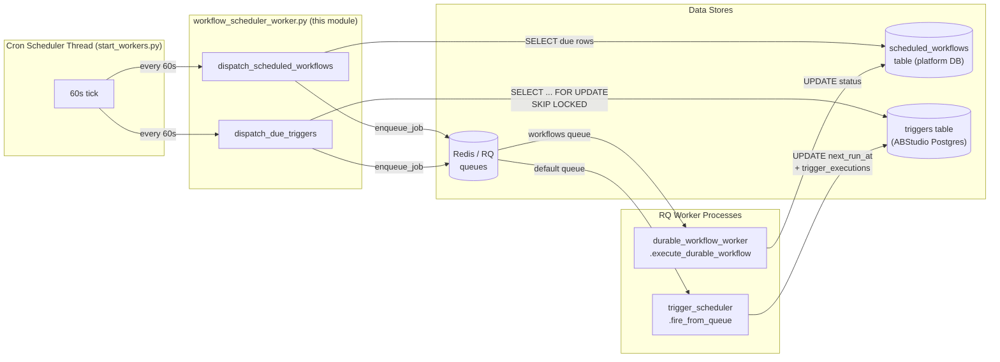
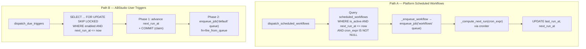
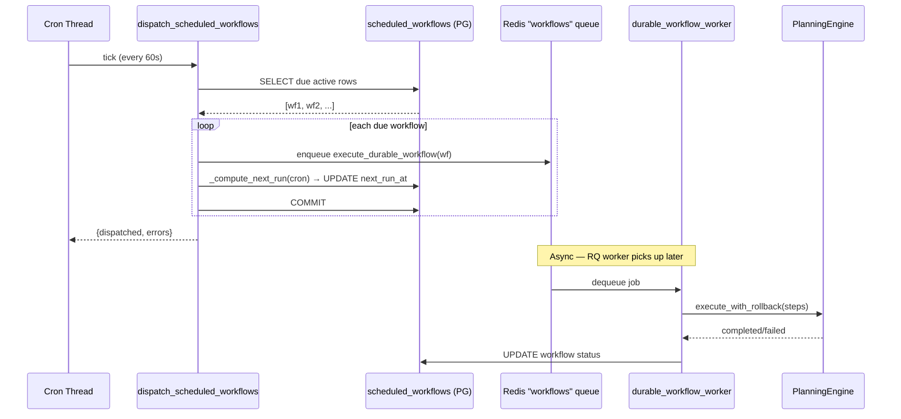
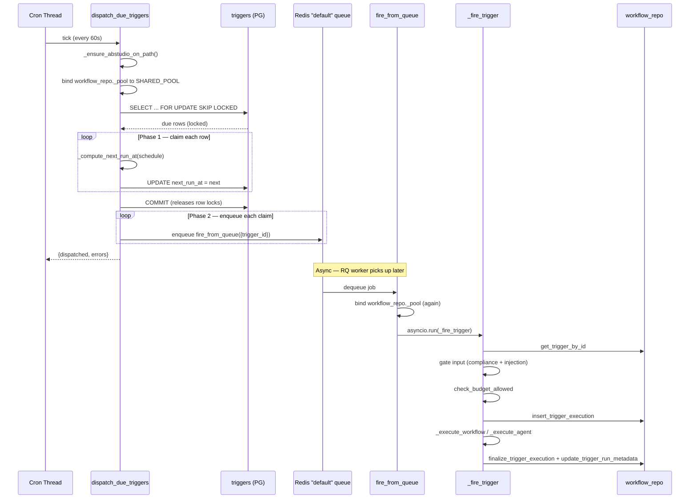
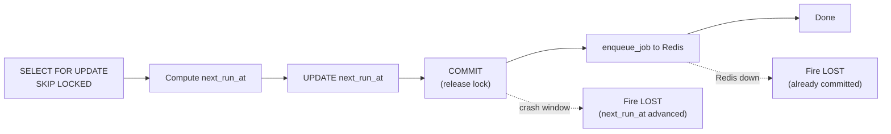
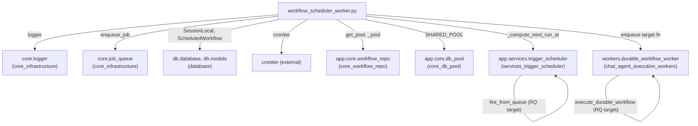

# Infrastructure Maintenance Workers — Scheduling

> **Module:** `infrastructure_maintenance_workers_scheduling`
> **Source file:** `workers/workflow_scheduler_worker.py`
> **Parent module:** [infrastructure_maintenance_workers](infrastructure_maintenance_workers.md)

## 1. Introduction

The `infrastructure_maintenance_workers_scheduling` module is the **time-driven
dispatch core** of the platform's background-worker fleet. It is responsible for
finding work that is *due* — either a platform-level scheduled workflow or an
ABStudio user-defined trigger — and enqueuing it onto the appropriate Redis (RQ)
queue so a worker process can pick it up and execute it.

It runs as a pair of functions invoked **every 60 seconds** by the cron
scheduler thread inside [`worker_orchestration`](worker_orchestration.md)
(`workers/start_workers.py::_cron_scheduler_thread`). The module deliberately
contains **no long-running loop of its own** — it is a stateless, tick-driven
poller. This keeps it composable with the dozens of other interval/daily/monthly
jobs the cron scheduler already manages.

### What it does (and does not do)

| Concern | In scope | Out of scope |
|---|---|---|
| Detecting due scheduled workflows | ✅ `dispatch_scheduled_workflows` | — |
| Detecting due user-defined triggers | ✅ `dispatch_due_triggers` | — |
| Computing next-run times from cron/schedule | ✅ `_compute_next_run` (croniter) + reuses `_compute_next_run_at` | — |
| Enqueuing fire jobs to Redis/RQ | ✅ via `core.job_queue.enqueue_job` | — |
| Executing the workflow/agent itself | ❌ | Delegated to [`chat_agent_execution_workers`](chat_agent_execution_workers.md) (`durable_workflow_worker`) and [`services_trigger_scheduler`](services_trigger_scheduler.md) (`fire_from_queue`) |
| Event/webhook-triggered workflows | ❌ | Handled synchronously by `webhooks_router.trigger_workflow_by_event` |
| TriageSkill cron jobs (Loop Engineering) | ❌ | Still run in-process via APScheduler in `trigger_scheduler` |

### Why a dedicated dispatcher exists

Historically, ABStudio user-defined triggers were fired by an **in-process
APScheduler** that lived inside *every* gunicorn worker. With N workers, the
same trigger fired N times — a multi-worker duplicate-fire bug. The fix was to
retire the in-process scheduler for user triggers and replace it with a single
scheduler-worker process that polls Postgres and enqueues fires onto Redis.
This module is that fix. The `init_scheduler` function in
[`services_trigger_scheduler`](services_trigger_scheduler.md) now only starts
APScheduler for P5 TriageSkill jobs, which are independent of the user-trigger
path.

---

## 2. Architecture

### 2.1 High-level position in the system



### 2.2 The two dispatch paths

The module serves two completely independent dispatch paths that share only the
cron-scheduler tick and the `core.job_queue.enqueue_job` primitive:



#### Path A — `dispatch_scheduled_workflows`

Targets the platform-level `scheduled_workflows` table (model:
`db.models.ScheduledWorkflow`). Each row carries a standard `cron_expr` and a
`workflow_def` JSONB blob. The dispatcher:

1. Queries all active rows whose `next_run_at <= now` and `cron_expr` is set.
2. For each due row, enqueues `workers.durable_workflow_worker.execute_durable_workflow`
   onto the `workflows` RQ queue with a 1-hour timeout.
3. Computes the next run time via `croniter` (`_compute_next_run`) and updates
   `last_run_at` / `next_run_at` on the row, then commits.

This path is **single-process safe by construction**: only one
scheduler-worker process is started (see [`worker_orchestration`](worker_orchestration.md)),
so there is no concurrent contender for the same rows. No row-level locking is
used.

#### Path B — `dispatch_due_triggers`

Targets the ABStudio `triggers` table, whose schedule is a JSON *blob* (types:
`once`, `hourly`, `daily`, `weekdays`, `weekly`, `custom`, `webhook`, `event`)
rather than a raw cron string. The dispatcher reuses ABStudio's own schedule
parser — `app.services.trigger_scheduler._compute_next_run_at` — so semantics
stay identical to the retired in-process APScheduler path.

This path is designed to be **safe even if multiple dispatcher instances ever
run in parallel** (defensive, though only one is started today). It uses a
two-phase claim protocol:

1. **Select + lock:** `SELECT ... FOR UPDATE SKIP LOCKED` grabs due rows that
   no other dispatcher can see.
2. **Phase 1 — claim (inside DB transaction):** compute the next run time and
   `UPDATE triggers SET next_run_at = <next>` for each row, then `COMMIT`.
   This releases the row lock and advances `next_run_at` so a concurrent
   dispatcher's next tick will skip the row.
3. **Phase 2 — enqueue (outside DB transaction):** call `enqueue_job` to push
   `fire_from_queue` onto the `default` RQ queue for each claimed trigger.

The ordering is deliberate: **claim-then-enqueue** prefers "occasionally lose a
fire on scheduler-host crash" over "occasionally double-fire", which is the
safer trade-off for user-visible triggers. If Redis is down after the claim,
the row's `next_run_at` is already advanced, so the fire is lost but never
duplicated.

---

## 3. Component Reference

### 3.1 `dispatch_scheduled_workflows() -> dict`

**Purpose:** Dispatch all due platform-level scheduled workflows.

| Aspect | Detail |
|---|---|
| Called by | `_cron_scheduler_thread` every 60 s (interval job `workflow_scheduler`) |
| Reads | `scheduled_workflows` table via SQLAlchemy `SessionLocal` |
| Enqueues | `workers.durable_workflow_worker.execute_durable_workflow` → `workflows` queue, timeout 3600 s |
| Updates | `last_run_at = now`, `next_run_at = _compute_next_run(cron_expr)` |
| Returns | `{"dispatched": int, "errors": int, "error": str\|None}` |
| Concurrency | Single-process; no row locking |

**Selection query:**
```sql
SELECT * FROM scheduled_workflows
WHERE is_active = TRUE
  AND next_run_at <= NOW()
  AND cron_expr IS NOT NULL
```

### 3.2 `dispatch_due_triggers() -> dict`

**Purpose:** Dispatch all due ABStudio user-defined triggers.

| Aspect | Detail |
|---|---|
| Called by | `_cron_scheduler_thread` every 60 s (interval job `trigger_dispatcher`) |
| Reads | `triggers` table via ABStudio's psycopg connection pool |
| Enqueues | `app.services.trigger_scheduler.fire_from_queue` → `default` queue, timeout 1800 s, `retry_count=0` |
| Updates | `next_run_at` per claimed row (advanced *before* Redis enqueue) |
| Returns | `{"dispatched": int, "errors": int, "error": str\|None}` |
| Concurrency | `FOR UPDATE SKIP LOCKED` + two-phase claim → at-most-once |

**Selection query:**
```sql
SELECT id, schedule FROM triggers
WHERE enabled = TRUE
  AND next_run_at IS NOT NULL
  AND next_run_at <= %s   -- now_utc
FOR UPDATE SKIP LOCKED
```

**Connection-pool binding:** ABStudio's `workflow_repo._pool` is a per-process
module-level global. Worker processes launched via `start_workers.py` do not run
ABStudio's FastAPI lifespan, so `init_db()` (which assigns the pool) may never
have been called in this process. The dispatcher detects `pool is None` and
lazily binds it to the platform's `SHARED_POOL` from
[`core_db_pool`](../storage/core_db_pool.md). The same lazy binding is repeated inside
`fire_from_queue` on the RQ-worker side, because RQ workers also bypass the
lifespan.

### 3.3 `_compute_next_run(cron_expr: str) -> datetime`

**Purpose:** Compute the next fire time from a standard cron expression.

| Aspect | Detail |
|---|---|
| Library | `croniter` |
| Input | Standard 5-field cron expression (e.g. `"0 9 * * 1"`) |
| Output | Next `datetime` (UTC, naive) |
| Fallback | On `croniter` failure → `now + 1 hour` (logged as warning) |

> **Note:** This function is used **only** by Path A (platform scheduled
> workflows). Path B (user triggers) reuses
> `app.services.trigger_scheduler._compute_next_run_at`, which interprets the
> JSON schedule blob and treats all times as **IST (Asia/Kolkata)**. The two
> paths therefore have different timezone semantics — Path A is UTC-naive,
> Path B is IST-aware. This is intentional and matches the respective table
> conventions.

### 3.4 `_enqueue_workflow(wf) -> None`

Internal helper that wraps `core.job_queue.enqueue_job` for Path A. Builds the
payload `{"workflow_id", "workflow_def", "triggered_by": "scheduler"}` and
targets the `workflows` queue with a 1-hour timeout.

### 3.5 `_ensure_abstudio_on_path() -> None`

Idempotent helper that prepends `<repo>/ABStudio/backend` to `sys.path` so that
`app.*` imports resolve inside worker processes (which do not pass through
`gateway.py`'s path setup). Called at the top of `dispatch_due_triggers`.

---

## 4. Data Flow

### 4.1 Scheduled-workflow dispatch (Path A) — end to end



### 4.2 User-trigger dispatch (Path B) — end to end



---

## 5. Concurrency & Reliability Model

### 5.1 At-most-once delivery

Both paths guarantee that a given due item is enqueued **at most once** per
tick, but they achieve it differently:

| Path | Mechanism | Failure mode |
|---|---|---|
| A (scheduled workflows) | Single scheduler-worker process; no locking | If two schedulers ran, both could select the same row — but only one is ever started |
| B (user triggers) | `FOR UPDATE SKIP LOCKED` + advance-then-enqueue | Lost fire if host crashes between claim-commit and Redis enqueue; **never** double-fire |

### 5.2 The two-phase claim trade-off (Path B)



The design explicitly chooses **lost-fire over double-fire**. Rationale:
user-visible triggers (e.g. a daily summary email) are idempotent-ish on
re-run, but a *duplicate* fire (two emails) is immediately visible and erodes
trust. A lost fire is invisible unless the user notices a missing run, and the
next scheduled tick will fire normally.

### 5.3 `retry_count=0` for trigger fires

Path B enqueues `fire_from_queue` with `retry_count=0`. This is intentional:
`_fire_trigger` already persists errors into `trigger_executions` and updates
`last_status`, so an RQ-level retry would re-run the entire fire (including
LLM calls and tool dispatch) without the trigger's own error-handling context.
Retries are left to the next scheduled tick.

---

## 6. Dependencies



### External dependencies

| Dependency | Used for |
|---|---|
| `croniter` | Parsing standard cron expressions for Path A next-run computation |
| `sqlalchemy` | ORM session for the `scheduled_workflows` table (Path A) |
| `psycopg` | Direct connection pool for the `triggers` table (Path B) |
| `rq` / Redis | Job queue backend (via `core.job_queue`) |

### Internal module references

| Module | Relationship |
|---|---|
| [`worker_orchestration`](worker_orchestration.md) | **Owner** — `_cron_scheduler_thread` invokes both dispatch functions every 60 s as interval jobs |
| [`chat_agent_execution_workers`](chat_agent_execution_workers.md) | **Downstream** — `execute_durable_workflow` is the RQ target for Path A |
| [`services_trigger_scheduler`](services_trigger_scheduler.md) | **Downstream** — `fire_from_queue` / `_fire_trigger` is the RQ target for Path B; also provides `_compute_next_run_at` |
| [`core_workflow_repo`](../workflows/core_workflow_repo.md) | **Data access** — provides the psycopg connection pool and trigger CRUD for Path B |
| [`core_db_pool`](../storage/core_db_pool.md) | **Infrastructure** — `SHARED_POOL` used for lazy pool binding in worker processes |
| [`database`](../storage/database.md) | **Data model** — `ScheduledWorkflow` ORM model for Path A |
| [`core_infrastructure`](../core/core_infrastructure.md) | **Infrastructure** — `core.logger` and `core.job_queue` |
| [`api_triggers`](../api/api_triggers.md) | **Upstream** — trigger CRUD endpoints call `register_trigger` / `reschedule_trigger` to set the initial `next_run_at` that this dispatcher later polls |
| [`infrastructure_maintenance_workers`](infrastructure_maintenance_workers.md) | **Parent** — sibling sub-modules handle purge, memory, DLQ, and feedback loops |

---

## 7. Integration with the Cron Scheduler

The cron scheduler in [`worker_orchestration`](worker_orchestration.md)
registers this module's two functions as **interval jobs** with a 60-second
cadence:

```python
interval_jobs = [
    ...
    ("workflow_scheduler",  60, "workers.workflow_scheduler_worker",
     "dispatch_scheduled_workflows"),
    ("trigger_dispatcher",  60, "workers.workflow_scheduler_worker",
     "dispatch_due_triggers"),
]
```

Both jobs start **15 seconds after worker-process startup** (the standard
interval-job warm-up) and then fire every 60 seconds. The scheduler thread
loops with a 60-second `stop_event.wait(60)`, so the effective tick granularity
is ~60 s. Each invocation is wrapped in a try/except by the scheduler so a
failure in one job does not block the other or crash the thread.

The cron scheduler also manages many unrelated maintenance jobs (thread purge,
AD sync, governance SLA, partition maintenance, HITL watchdog, KB stale
recovery, memory maintenance, feedback loop) — see
[`infrastructure_maintenance_workers`](infrastructure_maintenance_workers.md)
for the full picture. This module is just two entries in that larger schedule.

---

## 8. Configuration & Environment

The module itself reads no environment variables directly. Its behaviour is
shaped by the configuration of its dependencies:

| Config | Source | Effect on this module |
|---|---|---|
| Redis URL | `core.config.redis_url` | Must be reachable for `enqueue_job`; if down, Path B claims are lost (by design) |
| Postgres DSN | `core.config` / ABStudio config | Both `scheduled_workflows` and `triggers` tables must exist |
| `SHARED_POOL` | [`core_db_pool`](../storage/core_db_pool.md) | Lazy-bound when `workflow_repo._pool` is None in a worker process |
| `ABS_INJECTION_POLICY_TRIGGER` | env (read in `trigger_scheduler`) | `block` / `sanitize` — controls whether suspicious trigger inputs are rejected or cleaned (applied downstream in `_fire_trigger`, not here) |
| `LOOP_TRIAGE_ENABLED` | ABStudio config | Unrelated to this module; controls APScheduler triage jobs that still run in-process |

### Schedule blob format (Path B)

The `triggers.schedule` JSON column supports these `type` values, all
interpreted in **IST**:

| `type` | Fields | Example |
|---|---|---|
| `once` | `run_at` (ISO datetime) | `{"type": "once", "run_at": "2025-01-15T09:00:00"}` |
| `hourly` | `at_minute` | `{"type": "hourly", "at_minute": 30}` |
| `daily` | `at_time` (`"HH:MM"`) | `{"type": "daily", "at_time": "09:00"}` |
| `weekdays` | `at_time` | `{"type": "weekdays", "at_time": "09:00"}` |
| `weekly` | `at_time`, `day_of_week` | `{"type": "weekly", "at_time": "09:00", "day_of_week": "monday"}` |
| `custom` | `cron` (5-field) | `{"type": "custom", "cron": "0 9 * * 1"}` |
| `webhook` / `event` | — | Not scheduled; dispatched by `webhooks_router` |

---

## 9. Observability

All logging goes through `core.logger` (see
[`core_infrastructure`](../core/core_infrastructure.md)). Key log lines:

| Log level | Message pattern | Meaning |
|---|---|---|
| `info` | `workflow_scheduler: dispatched {name} (id={id}) next_run={next}` | Path A successfully enqueued a workflow |
| `info` | `trigger_dispatcher: tick now_utc={iso} due_rows={n}` | Path B diagnostic — distinguishes "no due rows" from "SELECT never ran" |
| `info` | `trigger_dispatcher: enqueued trigger={id} next_run={next}` | Path B successfully enqueued a trigger fire |
| `info` | `trigger_dispatcher: bound workflow_repo pool to platform SHARED_POOL` | Lazy pool binding occurred |
| `error` | `workflow_scheduler: failed to dispatch {name}: {e}` | Path A per-row enqueue failure |
| `error` | `trigger_dispatcher: claim failed for {id}: {e}` | Path B per-row claim failure |
| `error` | `trigger_dispatcher: enqueue failed for {id} (next_run_at already advanced, fire lost): {e}` | Path B Redis-down after claim — fire lost by design |
| `warning` | `workflow_scheduler: croniter failed for {expr!r}: {e}` | Path A cron parse failure → 1-hour fallback |

Both dispatch functions return a summary dict `{"dispatched", "errors",
"error"}` that the cron scheduler logs on completion, providing per-tick
throughput visibility without requiring DB access.

---

## 10. Key Design Decisions

1. **Tick-driven, not event-driven.** A 60-second poll is simple, stateless,
   and composes with the existing cron scheduler. It avoids the complexity of
   Postgres LISTEN/NOTIFY or a separate scheduler service. The trade-off is up
   to 60 seconds of latency between a trigger becoming due and its fire —
   acceptable for all current use cases (daily digests, scheduled agent runs).

2. **Two paths, one file.** Platform scheduled workflows and ABStudio user
   triggers have different table schemas, schedule formats, timezone
   conventions, and execution targets. Keeping them in one file avoids a
   second cron-scheduler registration while making the contrast between the
   two concurrency models explicit.

3. **Reuse, don't duplicate.** Path B reuses ABStudio's own
   `_compute_next_run_at` and `fire_from_queue` rather than reimplementing
   schedule parsing or fire logic. This guarantees that triggered runs behave
   identically to interactive runs (same engine, same RAG, same tool dispatch,
   same compliance/injection gates, same budget checks).

4. **Lazy pool binding.** Worker processes don't run ABStudio's FastAPI
   lifespan, so `workflow_repo._pool` is None. Rather than calling the heavy
   `init_db()` (which creates tables and seeds templates), the dispatcher binds
   directly to the platform's already-initialised `SHARED_POOL`. This is
   repeated in `fire_from_queue` on the RQ-worker side for the same reason.

5. **Lost-fire > double-fire.** The two-phase claim protocol in Path B
   advances `next_run_at` *before* talking to Redis. If the host crashes or
   Redis is down, the fire is silently lost — but it can never be duplicated.
   This is the correct trade-off for user-visible, potentially side-effecting
   triggers (emails, messages, agent actions).
