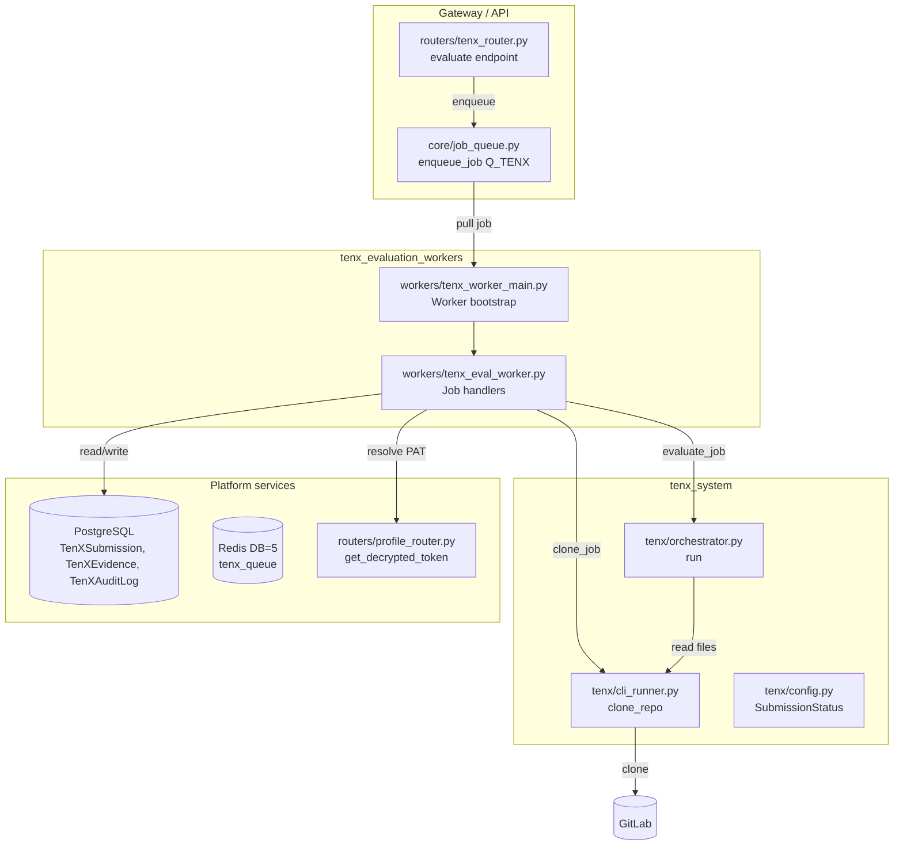
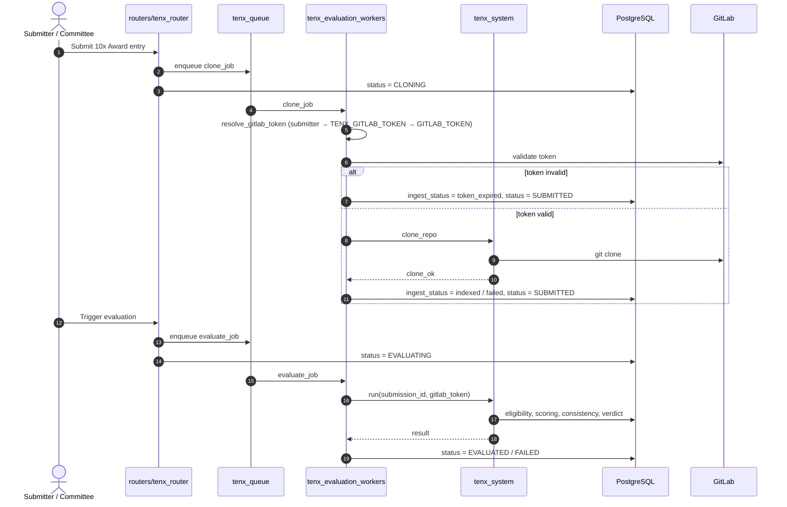
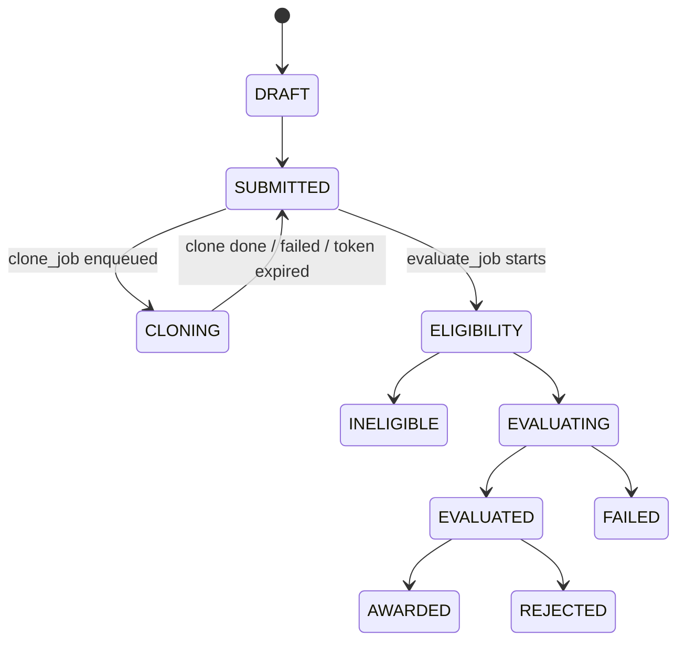

# tenx_evaluation_workers

## Overview

The `tenx_evaluation_workers` module is a dedicated, isolated RQ worker pool for the **10x Award** program. It consumes only the `tenx_queue` and executes two kinds of long-running background jobs:

1. **`clone_job`** — clones a submitted GitLab repository immediately after submission so the codebase is available on disk before evaluation.
2. **`evaluate_job`** — runs the full 10x Award evaluation pipeline for a submission, including eligibility checks, dimension scoring, consistency validation, and result persistence.

The module is intentionally thin: it contains **no scoring logic**. All evaluation orchestration is delegated to the [`tenx_system`](../reference/tenx_system.md) module (`tenx.orchestrator.run`), while repository cloning is delegated to [`tenx_system`](../reference/tenx_system.md) (`tenx.cli_runner.clone_repo`). The worker’s only responsibilities are job dispatch, GitLab token resolution, lightweight validation, audit logging, and status management.

Isolation is a key design goal. By running in its own worker process (typically under PM2 as `tenx-worker`), long CLI-based evaluations cannot starve — or be starved by — other job queues such as chat, agent, or SDLC workers.

---

## Architecture



### Component Responsibilities

| Component | File | Responsibility |
|-----------|------|----------------|
| `main` | `workers/tenx_worker_main.py` | Bootstraps environment, loads CKMS, configures logging, connects to Redis, and starts an RQ `Worker` listening exclusively to `tenx_queue`. |
| `_load_env` | `workers/tenx_worker_main.py` | Loads environment variables from `TENX_ENV_FILE` or `<repo>/.env` so the standalone worker uses the same Redis/Postgres config as the gateway. |
| `clone_job` | `workers/tenx_eval_worker.py` | RQ job that resolves the correct GitLab token, validates it, clones the submission repo, and updates `TenXEvidence` / `TenXSubmission` status. |
| `evaluate_job` | `workers/tenx_eval_worker.py` | RQ job that delegates end-to-end evaluation to `tenx.orchestrator.run` after resolving the GitLab token. |

---

## Data Flow

### Submission → Clone → Evaluate Lifecycle



---

## Core Components

### `workers/tenx_worker_main.py`

This is the executable entry point for the dedicated 10x worker process.

#### `_load_env()`

Because `core.config` reads only process environment variables, the standalone worker must explicitly load the same `.env` file used by the gateway. `_load_env()` reads `TENX_ENV_FILE` (or falls back to `<repo_root>/.env`) and populates `os.environ` without overriding values already set by PM2 or the shell.

#### `main()`

1. Imports CKMS and initializes platform logging.
2. Sets log levels for `tenx.*`, `tenx.worker`, and `rq.worker` to `INFO`.
3. Resolves the Redis connection via `core.job_queue.get_queue(Q_TENX)` and pings it for a fast failure if Redis is unreachable.
4. Starts an RQ `Worker` (using `SimpleWorker` on macOS and `Worker` elsewhere) listening only to `tenx_queue`, with `with_scheduler=False`.

Typical PM2 invocation:

```bash
pm2 start venv/bin/python --name tenx-worker --cwd /appdata/fastapi/apps/ainxt-platform \
    -- workers/tenx_worker_main.py
```

Required environment variables include:

- `ENABLE_TENX_AWARD`
- `AINXT_CLI_BIN`
- `TENX_EVAL_ENGINE` (`cli` or `agents`)
- `TENX_GITLAB_TOKEN`
- `TENX_WORKSPACE_DIR`
- `TENX_UPLOAD_DIR`
- `HOME` (must point to the directory containing `~/.ainxt/config.json`)
- `REDIS_HOST`, `REDIS_PORT`, `REDIS_PASSWORD`
- `POSTGRES_HOST`, etc.

### `workers/tenx_eval_worker.py`

This file contains the two RQ job handlers. It is deliberately thin and delegates all business logic to the `tenx_system` module.

#### `_submitter_token(user_id)`

Retrieves the submitter’s personal GitLab PAT from the encrypted `user_tokens` vault via [`routers/profile_router.py::get_decrypted_token`](../routers/profile_router.md). The stored value is `username:pat`; only the PAT portion is returned.

#### `_resolve_gitlab_token(lead_user_id)`

Returns a `(token, source)` tuple using the following precedence:

1. **Submitter’s own PAT** (`submitter`) — primary, authenticates as the repo owner.
2. **`TENX_GITLAB_TOKEN`** (`tenx_service`) — dedicated evaluator/service account.
3. **`GITLAB_TOKEN`** (`platform_service`) — generic platform service token.

This precedence ensures private repos are cloned using the account that actually has access.

#### `_validate_gitlab_token(token)`

Performs a lightweight pre-flight check against `GET /api/v4/personal_access_tokens/self`:

- `200` + `active=True` → valid.
- `200` + `active=False` → expired/revoked.
- `401` → definitively invalid.
- `403` → scope-limited but may still clone; treated as valid.
- Network/timeout errors → treated as valid to avoid blocking on transient infra issues.

#### `clone_job(payload)`

RQ entry point called immediately after submission.

**Payload:** `{submission_id, lead_user_id?}`

Steps:

1. Loads the `TenXSubmission` row; fails fast if missing or repo-less.
2. Resolves and validates the GitLab token.
3. If invalid, writes an audit entry, sets `repo` evidence `ingest_status = token_expired`, and reverts `CLONING → SUBMITTED`.
4. If valid, calls `tenx.cli_runner.clone_repo` to perform the actual `git clone` into `TENX_WORKSPACE_DIR/<period>/<submission_id>/repo`.
5. Updates `TenXEvidence.ingest_status` to `indexed` or `failed` and `machine_readable` accordingly.
6. Reverts status to `SUBMITTED` so the committee can trigger evaluation.

The clone is idempotent: if the repo already exists on disk, it is skipped.

#### `evaluate_job(payload)`

RQ entry point triggered by committee/admin action.

**Payload:** `{submission_id, actor?, lead_user_id?}`

Steps:

1. Resolves the GitLab token using the same precedence as `clone_job`.
2. Calls `tenx.orchestrator.run(submission_id, actor, gitlab_token)`.
3. The orchestrator handles eligibility, dimension scoring, consistency checks, and persistence (see [`tenx_system`](../reference/tenx_system.md) documentation).
4. Returns the orchestrator’s result dict directly.

---

## Integration with the System

### Queue Infrastructure

The worker consumes `tenx_queue` (`Q_TENX`), defined in [`core/job_queue.py`](../infrastructure/core_infrastructure.md). The queue has a depth limit of 200 and is listed in `ALL_QUEUES` with lower priority than interactive queues, reflecting the long-running nature of 10x evaluations.

### Triggering Jobs

- **Clone jobs** are enqueued by the submission flow in [`routers/tenx_router.py`](../api/tenx_router.md) (not shown in the provided snippets but implied by the `CLONING` status).
- **Evaluate jobs** are enqueued by the admin-only `POST /tenx/{id}/evaluate` endpoint in [`routers/tenx_router.py::evaluate`](../api/tenx_router.md).

### Database Entities

The worker reads and writes the following tables (defined in [`db/models.py`](../storage/database.md)):

- `tenx_submissions` — submission lifecycle, status, scores, evaluation JSON.
- `tenx_evidence` — tracks repo clone status (`ingest_status`, `machine_readable`).
- `tenx_audit_log` — immutable audit trail of worker actions.

### Status Lifecycle



Statuses are defined in [`tenx/config.py::SubmissionStatus`](../reference/tenx_system.md).

---

## Security & Operational Notes

- **Token scrubbing:** After cloning, `tenx.cli_runner.clone_repo` removes the PAT from the stored Git remote so credentials are not persisted on disk.
- **No scoring logic in worker:** All evaluation logic lives in `tenx_system`, keeping the worker focused on I/O and dispatch.
- **Isolated process:** Running as a separate PM2 process prevents long CLI evaluations from affecting other workers.
- **Audit trail:** Every significant action (clone started, clone failed, token expired, evaluation triggered) is written to `tenx_audit_log`.
- **Idempotency:** `clone_job` skips if the repo already exists; `evaluate_job` is safe to re-run because the orchestrator checks terminal statuses (`AWARDED`, `CANCELLED`).
- **Fast failure:** `tenx_worker_main.py` pings Redis at startup and exits immediately if the queue is unreachable, surfacing misconfiguration quickly.

---

## Related Documentation

- [`tenx_system`](../reference/tenx_system.md) — evaluation orchestration, scoring, eligibility, and CLI runner.
- [`core_infrastructure`](../infrastructure/core_infrastructure.md) — job queue, logging, CKMS, and configuration.
- [`database`](../storage/database.md) — `TenXSubmission`, `TenXEvidence`, `TenXAuditLog`, and related models.
- [`routers/tenx_router`](../api/tenx_router.md) — HTTP endpoints that enqueue clone and evaluate jobs.
- [`worker_orchestration`](worker_orchestration.md) — general worker startup and queue management.
