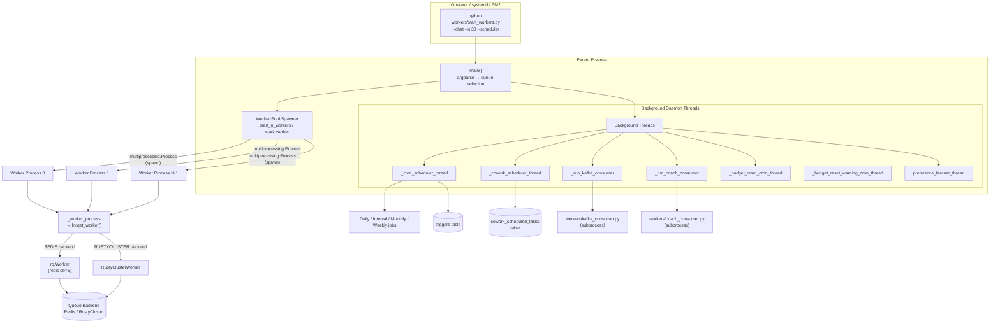
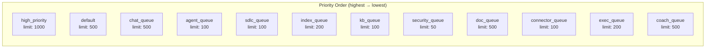
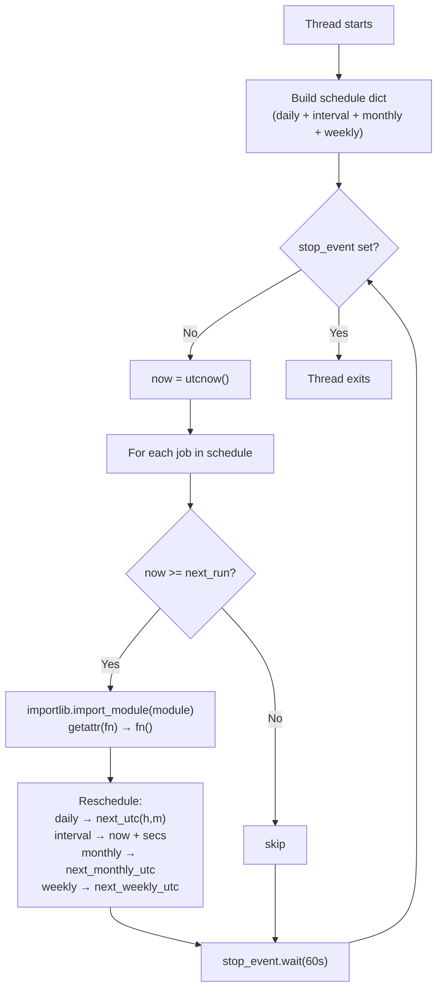
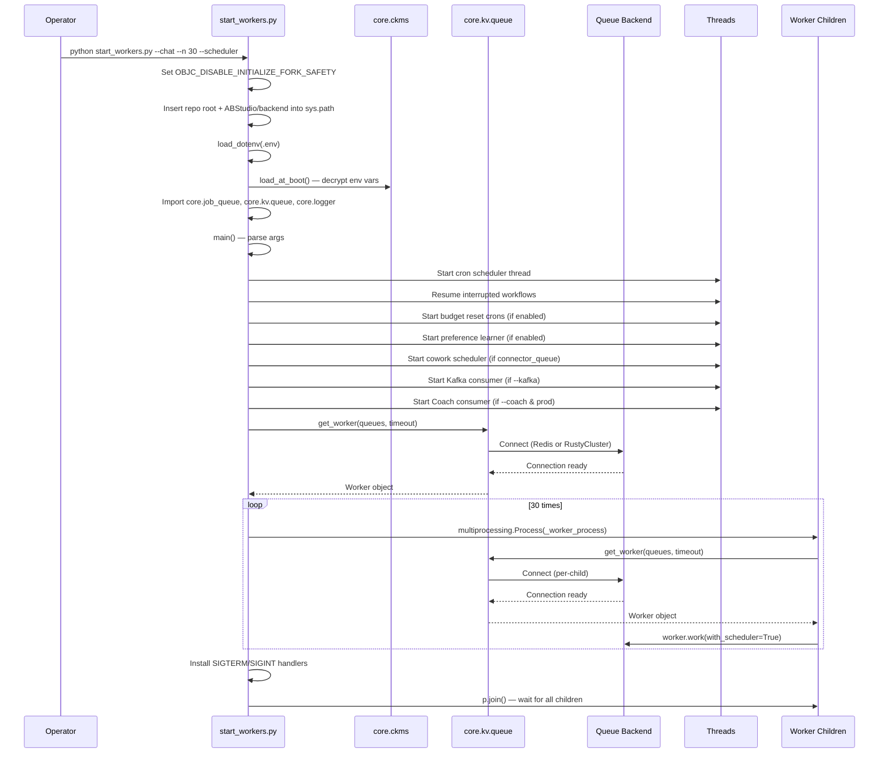
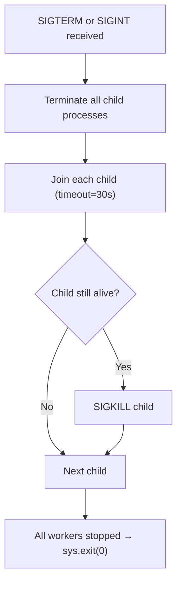
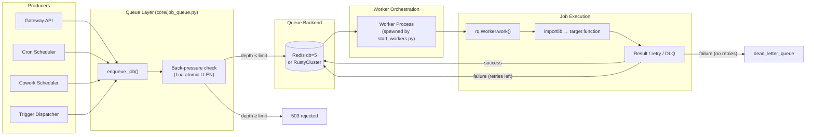

# Worker Orchestration

> **Module:** `worker_orchestration`
> **Entry point:** `workers/start_workers.py`
> **Role:** Process supervisor and background-scheduler launcher for the AiNxt platform's asynchronous job infrastructure.

## 1. Introduction

The Worker Orchestration module is the **bootstrap and lifecycle manager** for every asynchronous worker in the AiNxt platform. It is the single script that operators (or systemd / PM2) invoke to bring up RQ worker pools, Kafka consumers, cron schedulers, and long-lived daemon threads.

At its core, `start_workers.py` does three things:

1. **Spawns RQ worker subprocesses** — each child process connects to the queue backend (Redis or RustyCluster), binds to one or more named priority queues, and processes jobs until signalled to stop.
2. **Launches background daemon threads** — a cron scheduler, a Cowork task scheduler, a Kafka consumer, a Coach consumer, budget-reset cron threads, and a preference-learner thread — all running inside the parent process.
3. **Manages graceful shutdown** — intercepts `SIGTERM` / `SIGINT`, gives in-flight workers up to 30 seconds to finish, then force-kills stragglers.

The module is intentionally environment-aware: it loads `.env`, decrypts CKMS-protected secrets *before* any application code imports, and selects the queue backend (Redis vs. RustyCluster) dynamically via the KV factory — never hard-coding a connection.

---

## 2. Architecture Overview



### Key design decisions

| Decision | Rationale |
|---|---|
| **`multiprocessing.Process` with `spawn`** | Each worker child constructs its own queue connection after the fork/spawn boundary. Connections are *not* inherited — this avoids the macOS `objc_initializeAfterForkError` and RustyCluster gRPC channel corruption. |
| **Plain-string queue names passed to children** | Picklable on macOS where `spawn` (not `fork`) is the default. Queue/Worker objects containing `_thread.lock` cannot be pickled. |
| **KV factory for worker construction** | `core.kv.queue.get_worker()` selects `rq.Worker` or `RustyClusterWorker` based on `REDIS_CLIENT_CONFIG_DB5`, so the same script works in Redis-single-node and RustyCluster-cluster deployments. |
| **CKMS decryption before imports** | `core.ckms.load_at_boot()` runs *before* `core.config` / `db.database` are imported, ensuring decrypted secrets (Redis password, Postgres password, provider keys) are available to all downstream modules. |
| **Queue-specific job timeouts** | KB ingest workers run without a worker-level cap (`-1`) because Docling parsing can exceed fixed limits; all other queues use a 2100-second safety net. |

---

## 3. Queue Topology

Workers consume one or more named priority queues. The queue constants and back-pressure limits are defined in `core/job_queue.py`.



### CLI flags → queue binding

| Flag | Queues consumed | Typical process count | Resource profile |
|---|---|---|---|
| `--chat` | `high_priority`, `default`, `chat_queue` | 30 | IO-bound (LLM API calls), high concurrency |
| `--sdlc` | `sdlc_queue` | 10 | LLM-heavy, long TTL, low concurrency |
| `--index` | `index_queue` | 20 | CPU+IO (AST chunk + embed), medium concurrency |
| `--agent` | `agent_queue` | 10 | Orchestrator loops, medium concurrency |
| `--kb` | `kb_queue` | 5 | File parse + embed, low concurrency |
| `--doc` | `doc_queue` | 8 | CPU+network (LLM + file render), batch |
| `--security` | `security_queue` | — | Security scans (SonarQube/Checkmarx/PMD/CPD) |
| `--connector` | `connector_queue` | — | Async connector tool calls + Cowork scheduled tasks |
| `--coach` | `coach_queue` | — | Coach evaluator jobs + Coach Kafka consumer |
| *(no flag)* | `ALL_QUEUES` (all 13, priority order) | 1 | Dev / all-queues mode |

> **Back-pressure:** Each queue has a depth limit enforced atomically via a Lua script inside Redis (see `core/job_queue.py::_check_depth_atomic`). When a queue is full, enqueue calls return 503 immediately — no thread fallback, preventing unbounded thread spawning.

---

## 4. Component Reference

### 4.1 `main()`

The CLI entry point. Parses arguments, starts optional background threads, resolves the queue set and worker count, then delegates to `start_n_workers()` or `start_worker()`.

**Key behaviours:**
- `--scheduler` flag starts the cron scheduler thread, resumes interrupted workflows, starts budget-reset cron threads (if enabled), and starts the preference-learner thread.
- `--kafka` flag starts the Kafka consumer as a subprocess.
- `--coach` flag starts the Coach Kafka consumer (only when `ENABLE_COACH=true` and `COACH_DIRECT_INGEST=false`).
- `--cowork-scheduler` (or default all-queues / `--connector` mode) starts the Cowork task scheduler thread.
- Worker count resolution: explicit `--n` wins; `--sdlc` defaults to `SDLC_WORKER_COUNT` env; all others default to 1.
- Scheduler-only / Kafka-only modes park the parent process in a sleep loop (no RQ workers).

### 4.2 `_worker_process(queue_names, burst)`

The target function for each spawned subprocess. Receives plain queue-name strings (picklable), constructs its own `Worker` via `core.kv.queue.get_worker()`, and calls `worker.work()`.

- **Job execution timeout:** `_worker_timeout_for()` returns `-1` (no cap) for `kb_queue` and `2100` seconds for all other queues.
- **`with_scheduler=True`:** Enables RQ's built-in scheduler for delayed/scheduled jobs within the worker. Falls back gracefully if the backend's Worker class doesn't accept the kwarg.

### 4.3 `start_n_workers(n, queue_names)`

Spawns `n` `multiprocessing.Process` instances, each targeting `_worker_process`. Installs `SIGTERM` / `SIGINT` handlers that:
1. Terminate all child processes.
2. Wait up to 30 seconds for each to join.
3. Send `SIGKILL` to any that don't exit.

### 4.4 `start_worker(queue_names, burst)`

Starts a single worker in the *current* process (no subprocess). Used when `--n` is 1 or unspecified. Same timeout logic as the subprocess path.

---

## 5. Background Threads & Schedulers

### 5.1 Cron Scheduler (`_cron_scheduler_thread`)

A lightweight, in-process cron engine running as a daemon thread. Maintains an in-memory `schedule` dict mapping job names to next-run UTC datetimes. Checks every 60 seconds.



#### Scheduled jobs

| Job name | Cadence | IST time | Module::Function | Description |
|---|---|---|---|---|
| `thread_purge` | Daily | 03:00 | `workers.thread_purge::run_purge` | Purge old thread run records |
| `ad_sync` | Daily | 02:00 | `workers.ad_sync::run_sync` | Active Directory user sync |
| `governance_sla` | Daily | 09:30 | `routers.governance_router::check_governance_sla_reminders` | SLA reminders for pending approvals >5 days |
| `purge_worker` | Daily | 00:00 | `workers.purge_worker::run_purge` | Combined retention sweep (docs, images, uploads) |
| `hitl_watchdog` | Every 15 min | — | `workers.sdlc_worker::expire_stale_hitl_runs` | Expire `AWAITING_*` SDLC runs past 48h TTL |
| `kb_stale_recovery` | Every 10 min | — | `workers.kb_cleanup_worker::recover_stale_indexing_docs` | Reset stale `INDEXING` docs to `PENDING_APPROVAL` |
| `memory_maintenance` | Every 6h | — | `workers.memory_maintenance_worker::run_memory_maintenance` | Expire stale memory entries + decay importance |
| `feedback_loop` | Every 1h | — | `workers.feedback_loop_worker::run_feedback_loop` | Extract preferences + compute chunk quality |
| `workflow_scheduler` | Every 60s | — | `workers.workflow_scheduler_worker::dispatch_scheduled_workflows` | Fire cron-based scheduled workflows |
| `trigger_dispatcher` | Every 60s | — | `workers.workflow_scheduler_worker::dispatch_due_triggers` | Poll `triggers` table, enqueue fires |
| `partition_maintenance` | Monthly (1st) | 02:30 IST | `scripts/partition_maintenance.py` (subprocess) | Create future partitions, drop expired, ANALYZE |
| `coach_weekly_digest` | Weekly | Configurable | `workers.coach_weekly_mail_worker::run_weekly_digest` | Coach weekly digest email (gated by `ENABLE_COACH`) |

> **IST ↔ UTC conversion:** All daily/weekly/monthly times are specified in IST (UTC+5:30) and converted to UTC internally. The `_next_utc()`, `_next_weekly_utc()`, and `_next_monthly_utc()` helpers handle the offset arithmetic.

### 5.2 Cowork Scheduler (`_cowork_scheduler_thread`)

Fires due Cowork scheduled tasks from the `cowork_scheduled_tasks` table on a poll loop. Calls `workers.cowork_scheduler._fire_due_tasks()` which:

1. **Bootstraps** newly-created tasks (computes initial `next_run` from cron expression for rows where `next_run IS NULL`).
2. **Claims** due rows atomically using `FOR UPDATE SKIP LOCKED` — safe under multiple scheduler instances.
3. **Advances** `next_run` inside the same transaction that holds the row lock.
4. **Enqueues** each task onto `connector_queue` via `core.job_queue.enqueue_job`.
5. **Rolls back** the entire tick if any enqueue fails (so `next_run` is not advanced and the task retries next tick).

Runs as a **single daemon thread** in the parent process. Started automatically when the process serves `connector_queue` (default all-queues mode or `--connector`), or on explicit `--cowork-scheduler`.

### 5.3 Kafka Consumer (`_run_kafka_consumer`)

Launches `workers/kafka_consumer.py` as a subprocess. If the consumer exits, it waits 10 seconds and restarts (supervisor loop). The Kafka consumer handles event streams for SDLC, embeddings, budget, audit log, threads, agents, chat history, and metrics — see [kafka_event_consumer](#related-modules).

### 5.4 Coach Consumer (`_run_coach_consumer`)

Launches `workers/coach_consumer.py` as a subprocess. Only started when `ENABLE_COACH=true` and `COACH_DIRECT_INGEST=false` (production mode). In dev, the gateway ingests coach events synchronously, so running this consumer would double-consume the topic.

### 5.5 Budget Reset Cron (`_budget_reset_cron_thread`)

Runs `services.budget_audit_service.snapshot_and_reset_all_budgeted_users` on a UTC cron schedule (`BUDGET_MONTHLY_RESET_CRON`, default `15 3 1 * *` = 03:15 UTC on the 1st). Computes the closing month as the previous calendar month at fire time.

**Gated end-to-end** by `BUDGET_MONTHLY_RESET_ENABLED` (default: `false`). The flag is checked both at thread-start time and at every fire (defense-in-depth).

### 5.6 Budget Reset Warning Cron (`_budget_reset_warning_cron_thread`)

Sends pre-reset warning emails ~24 hours before the actual reset. Uses a broad cron (`15 3 28-31 * *`) but an inner guard only sends if today is the **last day of the month**. Includes in-memory dedup to prevent double-sending within the same period.

### 5.7 Preference Learner (`preference_learner_thread`)

Background derivation of durable style preferences from thumbs-up/down feedback. Gated by `PREFERENCE_LEARNING` (default on). Runs as a daemon thread in the parent process and never touches the request path.

---

## 6. Startup Sequence



---

## 7. Graceful Shutdown



The shutdown handler is installed by `start_n_workers()`. It:
1. Calls `p.terminate()` (sends `SIGTERM`) on every child process.
2. Waits up to 30 seconds per child for it to finish in-flight jobs.
3. Sends `SIGKILL` to any child that didn't exit within the deadline.
4. Exits the parent process cleanly.

---

## 8. Data Flow: Job Lifecycle



---

## 9. Dependencies

```mermaid
graph TD
    SW["workers/start_workers.py"]

    SW --> JQ["core/job_queue.py<br/>Queue constants, enqueue_job, back-pressure"]
    SW --> KVQ["core/kv/queue.py<br/>get_worker, get_job_connection"]
    SW --> LOG["core/logger.py<br/>Structured logging"]
    SW --> CKMS["core/ckms<br/>load_at_boot — env decryption"]
    SW --> CFG["core/config.py<br/>ENABLE_COACH, COACH_DIRECT_INGEST,<br/>COACH_WEEKLY_MAIL_*"]

    SW --> COWORK["workers/cowork_scheduler.py<br/>_fire_due_tasks, _POLL_SECONDS"]
    SW --> KC["workers/kafka_consumer.py<br/>(subprocess)"]
    SW --> CC["workers/coach_consumer.py<br/>(subprocess)"]
    SW --> PREF["workers/preference_learner.py<br/>preference_learner_thread"]

    CRON["_cron_scheduler_thread"] --> TP["workers/thread_purge.py"]
    CRON --> AD["workers/ad_sync.py"]
    CRON --> GOV["routers/governance_router.py"]
    CRON --> PURGE["workers/purge_worker.py"]
    CRON --> HITL["workers/sdlc_worker.py"]
    CRON --> KBC["workers/kb_cleanup_worker.py"]
    CRON --> MEM["workers/memory_maintenance_worker.py"]
    CRON --> FB["workers/feedback_loop_worker.py"]
    CRON --> WSD["workers/workflow_scheduler_worker.py"]
    CRON --> PM["scripts/partition_maintenance.py"]
    CRON --> CWM["workers/coach_weekly_mail_worker.py"]

    BRESET["_budget_reset_cron_thread"] --> BAS["services/budget_audit_service.py"]
    BWARN["_budget_reset_warning_cron_thread"] --> BAS

    JQ --> KV["core/kv<br/>KVClient, register_script"]
    KVQ --> KV
```



### External dependencies

| Dependency | Purpose |
|---|---|
| `rq` | Redis Queue — worker and job execution (Redis backend) |
| `rustycluster.rq` | RustyCluster RQ-compatible worker (cluster backend) |
| `croniter` | Cron expression parsing for budget-reset schedules |
| `python-dotenv` | `.env` file loading |
| `multiprocessing` | Worker subprocess spawning (spawn start method) |

---

## 10. Environment Variables

| Variable | Default | Description |
|---|---|---|
| `OBJC_DISABLE_INITIALIZE_FORK_SAFETY` | `YES` (set by script) | Prevents macOS fork-safety crash |
| `REDIS_CLIENT_CONFIG_DB5` | `REDIS` | Selects queue backend: `REDIS` or `RUSTYCLUSTER` |
| `SDLC_WORKER_COUNT` | `1` | Default process count for `--sdlc` workers |
| `BUDGET_MONTHLY_RESET_ENABLED` | `false` | Master gate for budget reset cron threads |
| `BUDGET_MONTHLY_RESET_CRON` | `15 3 1 * *` | UTC cron for monthly budget reset |
| `BUDGET_MONTHLY_RESET_WARNING_CRON` | `15 3 28-31 * *` | UTC cron for pre-reset warning emails |
| `ENABLE_COACH` | `false` | Enables Coach system (consumer + weekly digest) |
| `COACH_DIRECT_INGEST` | `true` | If true, gateway ingests coach events inline (dev); if false, Kafka consumer runs (prod) |
| `COACH_WEEKLY_MAIL_ENABLED` | — | Gate for Coach weekly digest emails |
| `COACH_WEEKLY_MAIL_WEEKDAY` | — | Weekday (0=Mon..6=Sun) for Coach digest |
| `COACH_WEEKLY_MAIL_HOUR_IST` | — | IST hour for Coach digest |
| `COACH_WEEKLY_MAIL_MIN_IST` | — | IST minute for Coach digest |
| `PREFERENCE_LEARNING` | `true` | Gate for preference-learner background thread |

---

## 11. Related Modules

| Module | Relationship |
|---|---|
| [kafka_event_consumer](kafka_event_consumer.md) | Launched as subprocess by `_run_kafka_consumer()`; consumes Kafka event topics for SDLC, embeddings, budget, audit, threads, agents, chat, metrics |
| [chat_agent_execution_workers](chat_agent_execution_workers.md) | Contains `agent_worker.py`, `chat_worker.py`, `durable_workflow_worker.py`, `exec_worker.py` — job functions executed by workers spawned here |
| [sdlc_pipeline_workers](../sdlc/sdlc_pipeline_workers.md) | Contains `sdlc_worker.py` whose `expire_stale_hitl_runs` is called by the cron scheduler every 15 minutes |
| [document_knowledge_workers](document_knowledge_workers.md) | Contains `kb_worker.py`, `kb_cleanup_worker.py`, `doc_worker.py`, `purge_worker.py` — job functions and cron targets |
| [infrastructure_maintenance_workers](infrastructure_maintenance_workers.md) | Contains `purge_worker.py`, `thread_purge.py`, `memory_maintenance_worker.py`, `preference_learner.py`, `feedback_loop_worker.py`, `workflow_scheduler_worker.py` — all cron-scheduled targets |
| [external_integration_workers](external_integration_workers.md) | Contains `ad_sync.py`, `external_sync_worker.py`, `index_worker.py`, `workspace_sync_worker.py` — cron and queue targets |
| [cowork_scheduling_workers](cowork_scheduling_workers.md) | Contains `cowork_scheduler.py` (called by `_cowork_scheduler_thread`) and `cowork_task_worker.py` |
| [broadcast_coach_workers](../connectors/broadcast_coach_workers.md) | Contains `coach_consumer.py` (launched as subprocess) and `broadcast_worker.py` |
| [kv_store](../storage/kv_store.md) | Provides `core/kv/queue.py` — the worker/connection factory that abstracts Redis vs. RustyCluster |
| [core_infrastructure](../core/core_infrastructure.md) | Provides `core/config.py`, `core/logger.py`, `core/ckms/`, `core/job_queue.py` — foundational imports |
| [gateway](../core/gateway.md) | The API gateway that enqueues jobs consumed by workers spawned here; also prepends `ABStudio/backend` to `sys.path` so worker imports resolve |

---

## 12. Operational Notes

### Production deployment

Each worker pool should run as a separate systemd unit or PM2 process:

```bash
# Chat workers — 30 processes
python workers/start_workers.py --chat --n 30 --scheduler

# SDLC workers — 10 processes
python workers/start_workers.py --sdlc --n 10

# Index workers — 20 processes
python workers/start_workers.py --index --n 20

# Agent workers — 10 processes
python workers/start_workers.py --agent --n 10

# KB ingest workers — 5 processes
python workers/start_workers.py --kb --n 5

# Doc generation workers — 8 processes (do NOT exceed 8)
python workers/start_workers.py --doc --n 8
```

> **Important:** Only one process should run with `--scheduler` to avoid duplicate cron fires. The cron scheduler and cowork scheduler use `FOR UPDATE SKIP LOCKED` for DB-level safety, but the in-process interval jobs (HITL watchdog, KB recovery, etc.) are not idempotent across multiple scheduler instances.

### Doc worker capacity

Doc workers are CPU+network bound (LLM call to Claude proxy + file render). More than 8 concurrent workers saturates the proxy and causes cascading timeouts across **all** queues. Chat workers (IO-bound SSE streams) and doc workers (batch jobs) have fundamentally different resource profiles and must not share a pool.

### Scheduler-only mode

```bash
# Run only background schedulers — no RQ workers
python workers/start_workers.py --scheduler --cowork-scheduler
```

This is useful for dedicated scheduler hosts in multi-node deployments where RQ workers run on separate machines.

### Burst mode

```bash
# Process all queued jobs then exit (useful for drain / maintenance)
python workers/start_workers.py --chat --burst
```
