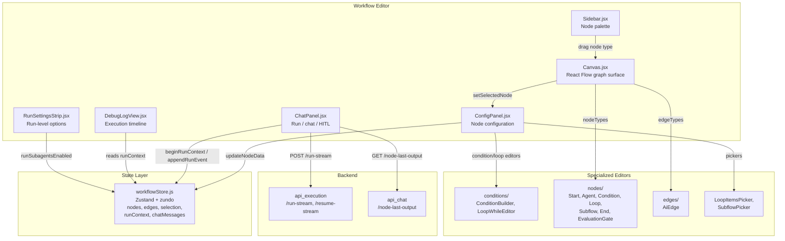
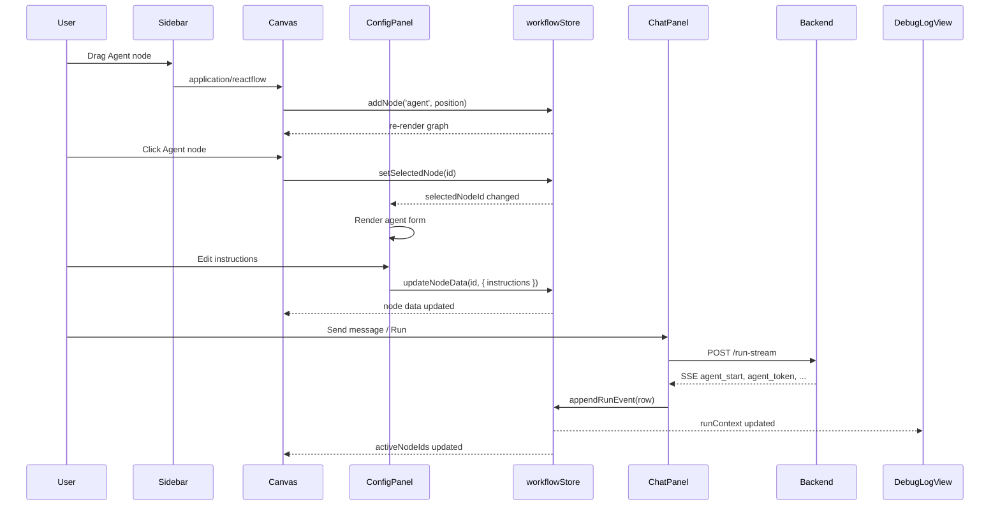
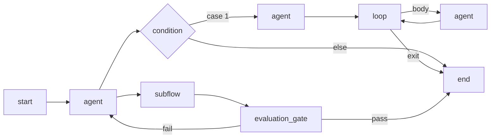

# Workflow Editor Module Overview

## Purpose

The **workflow_editor** module is the visual workflow builder at the heart of ABStudio's frontend. It provides a node-based, drag-and-drop canvas for authoring multi-agent workflows, along with the surrounding panels needed to configure nodes, run workflows, inspect execution traces, and debug failures. The module is a pure presentation and interaction layer: all workflow state (nodes, edges, selection, execution context, chat history) lives in the shared `workflowStore`, while the actual execution is delegated to the ABStudio backend via Server-Sent Events (SSE).

---

## Architecture

The editor is composed of a central graph surface surrounded by specialized panels. All panels read from and write to the same Zustand store, so selecting a node on the canvas opens its configuration, running a workflow updates the canvas with active-node highlights, and debug logs reflect every SSE event emitted by the backend.

### Data Flow

### Node Topology

The editor supports seven node types, each mapped to a custom renderer:

---

## Core Components

| Component | Responsibility | Documentation |
|-----------|--------------|---------------|
| **Canvas** | React Flow graph surface: drag-and-drop, auto-layout (Dagre), connection validation, undo/redo, node rendering, drop-on-edge insertion, MiniMap. | [Canvas.md](Canvas.md) |
| **ConfigPanel** | Right-hand configuration sidebar for the selected node. Handles agent settings, condition cases, loop modes, subflow linking, knowledge, triggers, and model selection. | [ConfigPanel.md](ConfigPanel.md) |
| **ChatPanel** | Workflow execution chat surface. Sends/runs workflows, consumes SSE events, renders streaming messages, tool calls, HITL interrupts, and generated-file downloads. | [ChatPanel.md](ChatPanel.md) |
| **DebugLogView** | Unified, chronological execution timeline. Replaces separate debug/session tabs by merging input, per-node execution, output, token estimates, and status into one view. | [DebugLogView.md](DebugLogView.md) |
| **Sidebar** | Node palette that lists draggable node types (Agent, Condition, Existing Asset, Loop, End) and enforces the single-End-node constraint. | [Sidebar.md](Sidebar.md) |
| **SubflowPicker** | Searchable, keyboard-navigable dropdown for linking saved agents, workflows, or templates into a subflow node. Handles template instantiation. | [SubflowPicker.md](SubflowPicker.md) |
| **LoopItemsPicker** | Connection-aware list picker for Loop `for_each` mode. Inspects upstream node output, detects lists, and auto-assigns or lets the user pick the iteration source. | [LoopItemsPicker.md](LoopItemsPicker.md) |
| **RunSettingsStrip** | Run-level execution options (e.g., subagent/swarm delegation) surfaced as a popover in the chat header. | [RunSettingsStrip.md](RunSettingsStrip.md) |

### Supporting Submodules

- **`conditions/`** — Condition DSL editors: `ConditionBuilder`, `ConditionCase`, `SingleCondition`, `SimpleCondition`, `LoopWhileEditor`, `LoopConditionRow`.
- **`nodes/`** — Custom React Flow node renderers: `StartNode`, `AgentNode`, `ConditionNode`, `LoopNode`, `SubflowNode`, `EndNode`, `EvaluationGateNode`.
- **`edges/`** — Custom edge renderer `AiEdge` with insert/delete buttons and execution animation.

---

## Key Dependencies

- **@xyflow/react** — Core graph rendering, pan/zoom, handles, and change events.
- **@dagrejs/dagre** — Rank-based auto-layout engine.
- **zustand + zundo** — Shared state and temporal undo/redo.
- **Backend APIs** — `api_execution` for running workflows, `api_chat` for fetching upstream node outputs, and the SSE stream that drives `ChatPanel` and `DebugLogView`.

The module is located at `ABStudio/frontend/src/features/workflows/editor/` and is rendered inside the broader `BuildStudio` / workflow feature shell.