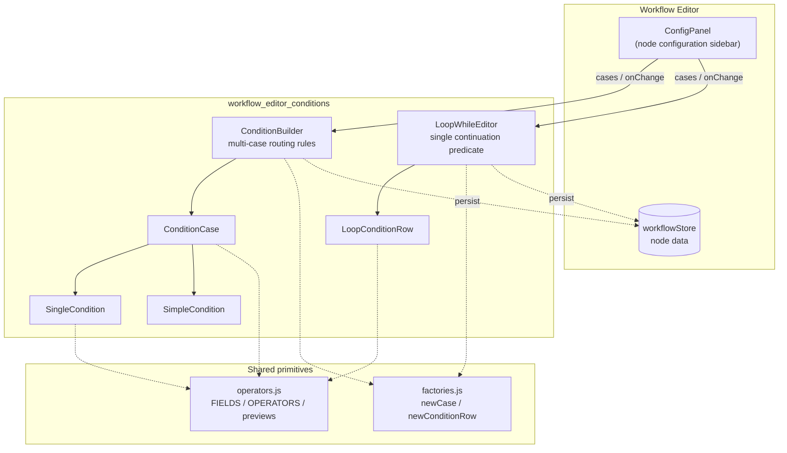
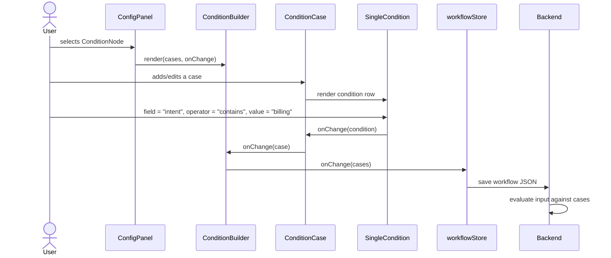

# Workflow Editor Conditions

The `workflow_editor_conditions` module is the React-based visual rule editor inside the ABStudio workflow editor. It lets non-engineers build the branching logic for **Condition nodes** and the continuation predicate for **Loop nodes** without writing code.

The module turns user-friendly form input into a small, structured expression AST that the backend already understands. The same `cases[]` shape is consumed by the workflow engine's conditional router and by the loop evaluator, so the UI and the runtime stay in sync.

## Purpose

- Provide a guided, form-based editor for `field operator value` rules.
- Support both **simple** intent/topic matching and **advanced** multi-condition boolean logic.
- Reuse the same condition primitives for two different node types:
  - `ConditionNode` — multi-case, top-down routing with an implicit `ELSE` fallback.
  - `LoopNode` — single-card "continue while" predicate.
- Emit condition data that matches the backend expression builder in `services_services` / `engine_loop_evaluator`.

## Architecture Overview



### Data Model

Both editors operate on the same `Case` shape:

```typescript
interface Condition {
  id: string;
  field: string;      // field name checked against input.<field>
  operator: string;   // ==, !=, contains, not_contains, >, >=, <, <=
  value: string | number | boolean;
  type: 'string' | 'number' | 'boolean';
}

interface Case {
  id: string;
  label: string;
  logic: 'AND' | 'OR';
  conditions: Condition[];
}
```

- `ConditionBuilder` works with `Case[]`.
- `LoopWhileEditor` wraps a single `Case` in a one-element array so the backend evaluator can treat it identically.

### Simple vs Advanced Mode

| Mode | UI | Emitted condition |
|------|----|-------------------|
| Simple | One text box: "If the message is about …" | `{ field: 'intent', operator: 'contains', value: <topic>, type: 'string' }` |
| Advanced | Field + operator + value rows, AND/OR logic | Full `Condition` object |

### Integration with the Rest of the System

- **ConfigPanel** (`workflow_editor`) embeds `ConditionBuilder` for `ConditionNode` configuration and `LoopWhileEditor` for `LoopNode` configuration.
- **workflowStore** persists the `cases` array inside the selected node's `data`.
- **Backend engine** (`engine_native_engine`, `engine_loop_evaluator`, `services_services`) compiles the same shape into executable expressions. The frontend preview helpers in `operators.js` are intentionally kept in sync with the backend builder.
- **operators.js** (`constants` module) owns the canonical field list, operator list, type inference, and expression preview functions.

## Sub-modules

The module is split into two focused sub-modules:

- **[workflow_editor_conditions_cases](workflow_editor_conditions_cases.md)** — multi-case conditional routing editor (`ConditionBuilder`, `ConditionCase`, `SingleCondition`, `SimpleCondition`).
- **[workflow_editor_conditions_loop](workflow_editor_conditions_loop.md)** — single-card loop continuation editor (`LoopWhileEditor`, `LoopConditionRow`).

## Condition Flow



## Shared Utilities

### `factories.js`

Factory functions that create new `Case` and `Condition` objects with stable IDs:

- `newCase(label)` — creates a case pre-populated with one simple condition.
- `newConditionRow(overrides)` — creates a blank advanced condition row.
- `newSimpleConditionRow(topic)` — creates the intent-contains shape used by Simple mode.

### `operators.js`

Canonical definitions used by both sub-modules:

- `FIELDS` — preset fields such as `intent`, `category`, `score`, `amount`.
- `OPERATORS` — operator lists per type (`string`, `number`, `boolean`).
- `DEFAULT_OPERATOR` — `==`.
- `getFieldType`, `getOperatorsForType`, `getDefaultValue`, `coerceValueByType` — type inference and coercion.
- `buildExpressionPreview`, `buildCombinedExpressionPreview`, `buildPlainEnglishPreview` — preview strings shown to the user.

## Design Decisions

1. **One shared data shape for two node types.** Both `ConditionNode` and `LoopNode` store `cases[]`. The loop editor simply emits a single-element array, avoiding a separate backend schema.
2. **Type inference instead of a type dropdown.** `SingleCondition` and `LoopConditionRow` infer `type` from the selected field or operator. This reduces UI noise while preserving the explicit type the backend needs.
3. **Confidence score guardrails.** `LoopConditionRow` clamps the `score` field to the `0.0–1.0` range because the backend normalises judge scores as ratios, not percentages.
4. **Plain-English previews.** Every advanced case shows a human-readable summary so users can verify the rule without reading expression syntax.

## Related Documentation

- [workflow_editor](workflow_editor.md) — parent workflow editor module that hosts the condition UI.
- [workflow_editor_conditions_cases](workflow_editor_conditions_cases.md) — detailed docs for the multi-case routing editor.
- [workflow_editor_conditions_loop](workflow_editor_conditions_loop.md) — detailed docs for the loop continuation editor.
- [services_services](../workers/services_services.md) — backend expression evaluation helpers.
- [engine_loop_evaluator](../agents/engine_loop_evaluator.md) — backend loop condition evaluator.
