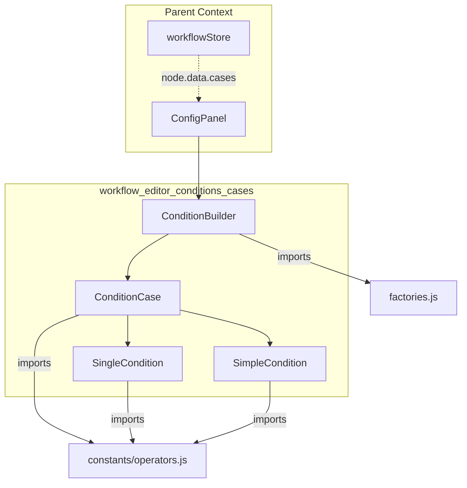
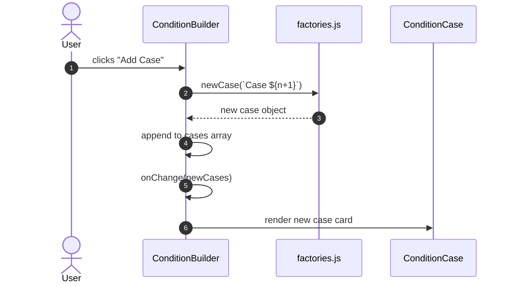
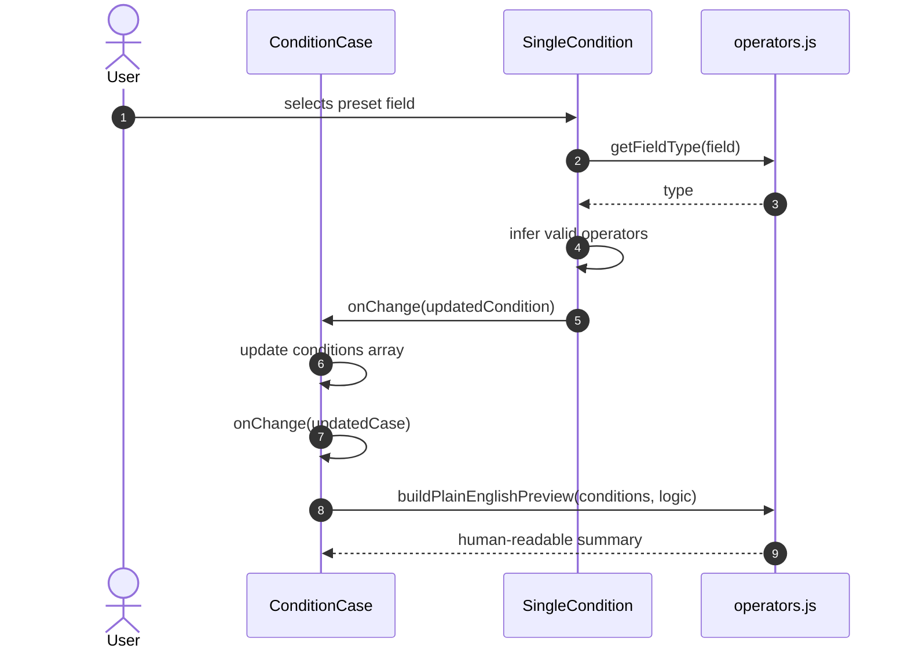
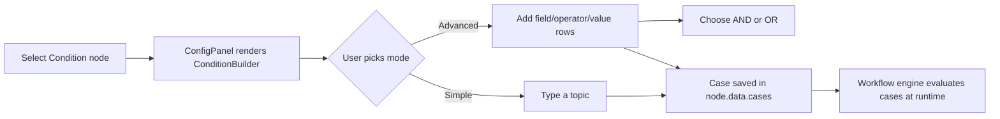
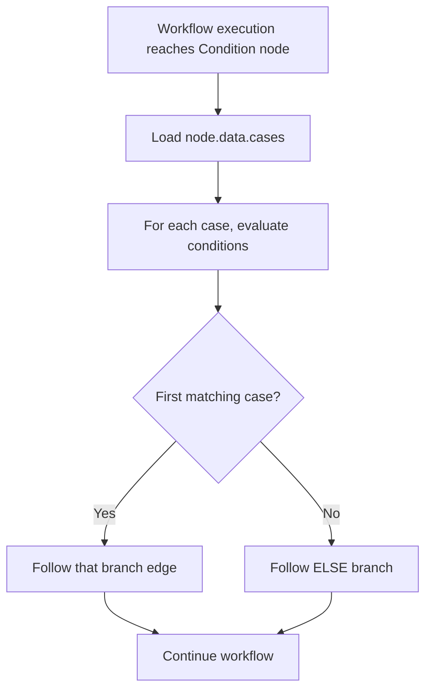

# Workflow Editor — Condition Cases

The `workflow_editor_conditions_cases` module provides the React UI components that let users build routing rules for **Condition nodes** in the ABStudio workflow editor. It supports both a simple, topic-based editor for non-technical users and an advanced, field-by-field rule builder for precise control. The module is part of the larger [`workflow_editor_conditions`](workflow_editor_conditions.md) feature set and is consumed by the workflow [`ConfigPanel`](workflow_editor.md#configpanel) when a Condition node is selected.

---

## 1. Purpose & Core Functionality

Condition nodes split a workflow's execution path based on data produced by earlier steps (for example, an intent classification, a confidence score, or a custom output field). This module renders the editor that produces the `cases` array stored on a Condition node.

Each **case** represents one outgoing branch and contains:

| Property | Description |
|----------|-------------|
| `id` / `name` | Stable identifier and default display name. |
| `label` | User-editable branch label shown in the canvas. |
| `logic` | `AND` or `OR` — how multiple conditions inside the case are combined. |
| `conditions` | Array of individual comparisons (field, operator, value, type). |

The editor enforces two important runtime semantics:

1. **Top-to-bottom priority** — cases are evaluated in order; the first matching case wins.
2. **Implicit `ELSE` fallback** — if no case matches, execution follows the default branch.

---

## 2. Architecture

The module is a small component tree rooted at `ConditionBuilder`. It delegates rendering and state updates to progressively more focused child components.



### Component Responsibilities

| Component | File | Responsibility |
|-----------|------|----------------|
| `ConditionBuilder` | `ConditionBuilder.jsx` | Owns the list of cases, handles add/remove/reorder semantics, and renders the `ELSE` fallback explanation. |
| `ConditionCase` | `ConditionCase.jsx` | Renders one IF-branch card, toggles Simple/Advanced mode, manages the case label, and combines multiple `SingleCondition` rows with `AND`/`OR` logic. |
| `SimpleCondition` | `SimpleCondition.jsx` | Plain-English input that serializes to a single `intent contains <topic>` condition. |
| `SingleCondition` | `SingleCondition.jsx` | One row of the advanced builder: field selector, operator selector, and value input with type inference. |

---

## 3. Data Model

### Case Shape

```javascript
{
  id: 'case_abc',
  name: 'Case 1',
  label: 'Billing inquiry',
  logic: 'AND',
  conditions: [
    {
      id: 'cond_1',
      field: 'intent',
      operator: 'contains',
      value: 'billing',
      type: 'string'
    }
  ]
}
```

### Condition Shape

A condition is intentionally backend-compatible. The same object is used by the workflow execution engine to evaluate branches.

| Field | Type | Notes |
|-------|------|-------|
| `field` | `string` | Preset field (e.g. `intent`, `confidence`) or custom free-text field. |
| `operator` | `string` | One of the supported operators from [`constants/operators.js`](../reference/constants.md). |
| `value` | `string \| number \| boolean` | Compared against the runtime value of `field`. |
| `type` | `'string' \| 'number' \| 'boolean'` | Inferred from the field or operator; drives the value input widget. |

---

## 4. Component Interactions

### 4.1 Adding a New Case



### 4.2 Editing a Condition in Advanced Mode



### 4.3 Switching from Advanced to Simple Mode

When a user toggles Simple mode, `ConditionCase` collapses the existing conditions into a single `intent contains <value>` row. If the first condition has a string value, that value is preserved; otherwise a blank simple condition is created.

---

## 5. Simple vs. Advanced Mode

| Aspect | Simple Mode | Advanced Mode |
|--------|-------------|---------------|
| Target user | Non-technical builder | Power user |
| UI | One text input per case | Field / Operator / Value rows |
| Underlying data | Always `intent contains <topic>` | Arbitrary field/operator/value rules |
| Logic | Single condition only | Multiple conditions with `AND`/`OR` |
| Type inference | Hard-coded `string` | Inferred from field preset or operator |

The two modes share the same data shape, so switching between them is lossless for the first condition's string value.

---

## 6. Type Inference in `SingleCondition`

`SingleCondition` deliberately removes a separate "Type" dropdown by inferring `type` automatically:

1. **Known preset field** → use the type declared in `FIELDS`.
2. **Numeric operator selected** (`>`, `>=`, `<`, `<=`) → coerce `type` to `number`.
3. **Custom field with non-numeric operator** → default to `string`.
4. **Boolean field** → render a true/false select.

This keeps the UI minimal while preserving the structured data that the backend expects.

---

## 7. Integration with the Rest of the System

### 7.1 Parent Modules

| Module | Relationship |
|--------|--------------|
| [`workflow_editor_conditions`](workflow_editor_conditions.md) | Parent module that also includes loop-specific condition editors. |
| [`workflow_editor`](workflow_editor.md) | The editor surface (`ConfigPanel`, `Canvas`, `ChatPanel`) that hosts `ConditionBuilder`. |
| [`workflowStore`](../storage/store.md) | Persists the `cases` array inside the selected node's `data`. |

### 7.2 Backend Counterparts

| Module | Relationship |
|--------|--------------|
| [`app_models`](../models/app_models.md) | Defines `ConditionNode`, `ConditionCase`, and `SingleCondition` Pydantic models that mirror the frontend shape. |
| [`engine_native_engine`](../reference/engine_native_engine.md) | Evaluates the condition cases at workflow runtime. |
| [`services_services`](../reference/services_services.md) | Provides graph utilities such as `get_linear_order` used when validating condition routing. |

### 7.3 Shared Utilities

| Utility | Purpose |
|---------|---------|
| `factories.js` | Creates empty case and condition objects with stable IDs and defaults. |
| [`constants/operators.js`](../reference/constants.md) | Defines field presets, operator lists, type coercion helpers, and the plain-English preview builder. |

---

## 8. Process Flows

### 8.1 Building a Routing Rule from Scratch



### 8.2 Runtime Evaluation Context



---

## 9. Key Design Decisions

1. **Single source of truth for cases** — `ConditionBuilder` holds the array and passes each element down; every mutation flows back up through `onChange`.
2. **Backend-compatible shape** — the frontend condition object is identical to the backend `SingleCondition` model, avoiding translation layers.
3. **Mode toggle without data loss** — Simple mode is a presentation layer over the same structured condition, not a separate schema.
4. **No explicit type dropdown** — type is inferred from field presets and operators, reducing UI clutter while keeping evaluation precise.
5. **Plain-English preview** — `buildPlainEnglishPreview` gives users immediate feedback on what the advanced rule means.

---

## 10. References

- Parent feature: [`workflow_editor_conditions`](workflow_editor_conditions.md)
- Hosting editor: [`workflow_editor`](workflow_editor.md)
- Backend models: [`app_models`](../models/app_models.md)
- Runtime engine: [`engine_native_engine`](../reference/engine_native_engine.md)
- Shared operators/constants: [`constants`](../reference/constants.md)
- Workflow persistence: [`workflowStore`](../storage/store.md)
