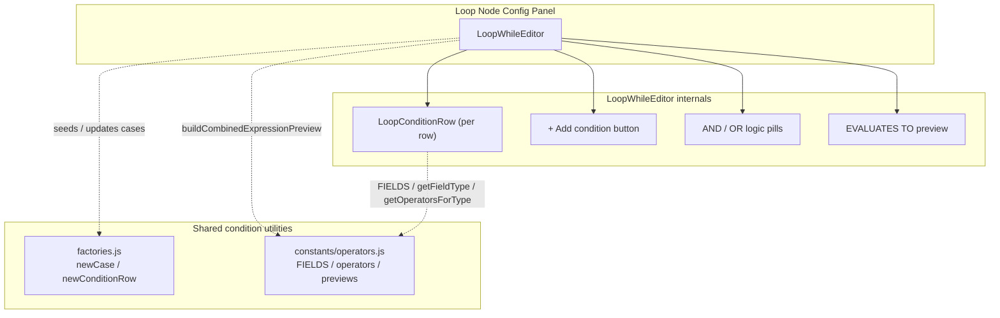
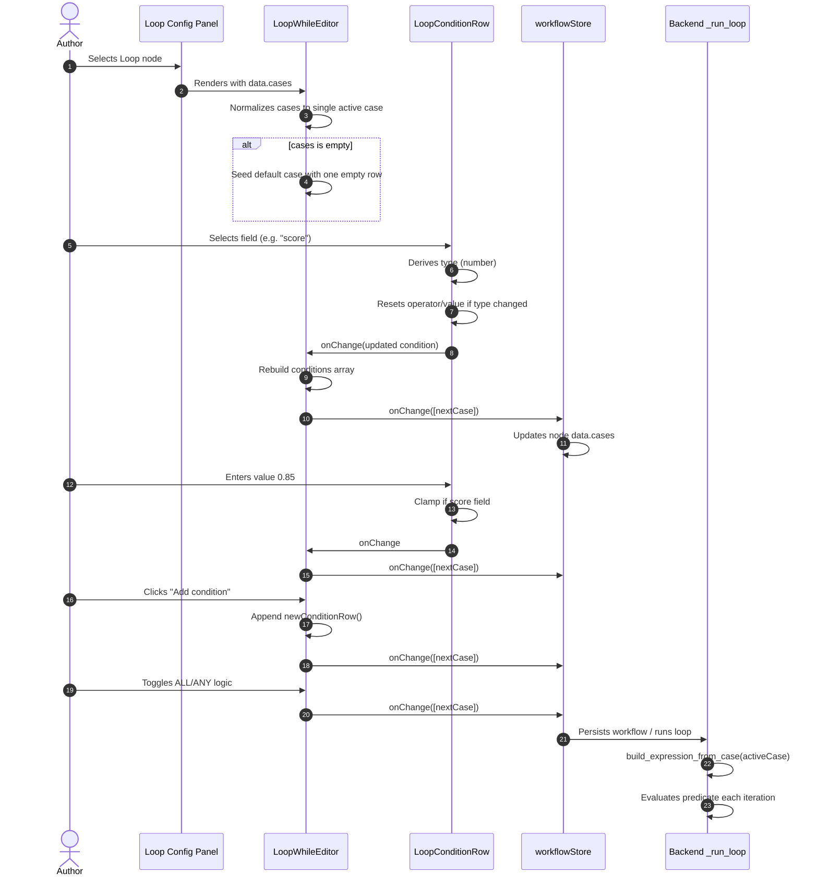
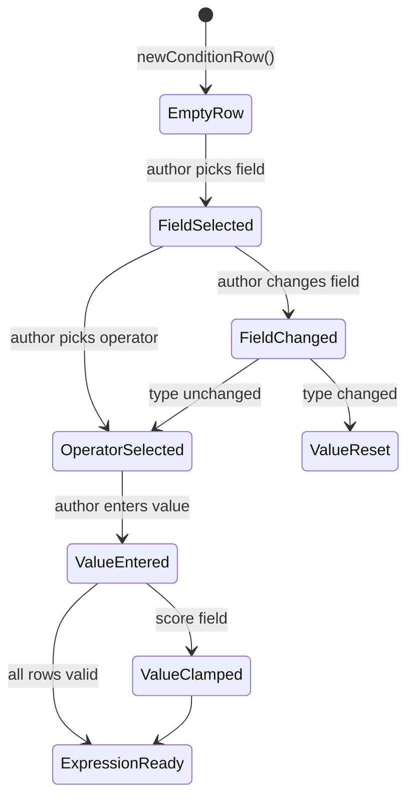

# Workflow Editor — Loop Conditions

The `workflow_editor_conditions_loop` module provides the React UI for editing the **continuation predicate** of a **Loop node** in the ABStudio workflow editor. It lets authors express *"continue iterating while these conditions hold"* using a compact, single-card editor that is separate from the multi-case routing rules used by [Conditional nodes](workflow_editor_conditions_cases.md).

---

## 1. Purpose & Core Functionality

Loop nodes in ABStudio workflows repeat a downstream body subgraph until a termination condition is met. The loop condition editor is the authoring surface for that termination predicate. Its responsibilities are:

- **Author a single continuation expression** composed of one or more field/operator/value rows.
- **Combine rows** with `AND`/`OR` logic when multiple conditions are present.
- **Preview the resulting expression** in plain English so authors can verify intent before running.
- **Persist the predicate** in the same `data.cases` shape used by Conditional nodes, ensuring the backend loop evaluator (`_run_loop` / `build_expression_from_case`) requires no special-case handling.

The module intentionally avoids reusing the full [ConditionBuilder](workflow_editor_conditions_cases.md) because that component is built for *routing rules*: top-down case evaluation, an `ELSE` fallback, per-case Simple/Advanced toggles, and the ability to add/remove cases. Those concepts are irrelevant for a loop's single continuation predicate and would leak routing semantics into the loop configuration.

---

## 2. Module Location

```text
ABStudio/frontend/src/features/workflows/editor/conditions/
├── LoopWhileEditor.jsx      # Single-card loop continuation editor
├── LoopConditionRow.jsx     # One-line field/op/value row
├── factories.js             # Shared condition/case factory helpers
├── ConditionBuilder.jsx     # (sibling) Multi-case routing editor
├── ConditionCase.jsx        # (sibling) Case card for ConditionBuilder
├── SingleCondition.jsx      # (sibling) Two-line row for ConditionCase
└── SimpleCondition.jsx      # (sibling) Topic-based simple condition
```

This module is a child of [workflow_editor_conditions](workflow_editor_conditions.md) and is consumed by the [LoopNode](workflow_editor_nodes.md) configuration panel in the workflow editor.

---

## 3. Architecture

### 3.1 Component Hierarchy



### 3.2 Data Model

The editor reads and writes `cases` — a single-element array of a `Case` object. This preserves compatibility with the backend expression builder.

```typescript
interface Condition {
  id: string;
  field: string;      // canonical field name (e.g. "score", "intent")
  operator: string;   // e.g. "==", ">", "contains"
  value: any;         // string | number | boolean
  type: string;       // "string" | "number" | "boolean"
}

interface Case {
  id: string;
  label: string;
  conditions: Condition[];
  logic: "AND" | "OR";
}

// LoopWhileEditor props
type LoopWhileEditorProps = {
  cases: Case[];      // typically length 0 or 1
  onChange: (cases: Case[]) => void;
};
```

When `cases` is empty (the loop store default), `LoopWhileEditor` seeds a default case containing one empty condition row with the default operator (`==`). All mutations are emitted as `[nextCase]` so the parent store always receives a single-element array.

---

## 4. Components

### 4.1 `LoopWhileEditor`

| Aspect | Description |
|--------|-------------|
| **File** | `ABStudio/frontend/src/features/workflows/editor/conditions/LoopWhileEditor.jsx` |
| **Purpose** | Renders the single-card "Continue while" editor for a Loop node. |
| **Props** | `cases`, `onChange` |
| **Key behavior** | Normalizes `cases` to a single active case; emits `[nextCase]` on every change. |

Responsibilities:

- Seed a default case when none exists.
- Render each condition row via `LoopConditionRow`.
- Show `ALL (AND)` / `ANY (OR)` logic pills only when two or more rows exist.
- Display a live plain-English preview of the combined expression.
- Provide an "Add condition" button that appends a new row.

### 4.2 `LoopConditionRow`

| Aspect | Description |
|--------|-------------|
| **File** | `ABStudio/frontend/src/features/workflows/editor/conditions/LoopConditionRow.jsx` |
| **Purpose** | One-line field/operator/value row optimized for loop predicates. |
| **Props** | `condition`, `onChange`, `onRemove`, `canRemove` |
| **Key behavior** | Derives the condition type from the selected field; clamps `score` values to the `[0.0, 1.0]` range. |

Responsibilities:

- Render a field dropdown populated from the canonical `FIELDS` list.
- Derive the condition type from the selected field via `getFieldType`.
- Render an operator dropdown filtered to operators valid for the derived type.
- Render a value input appropriate to the type (text, number, or boolean select).
- Apply a special confidence-score guard for the `score` field to prevent users from entering percentages (e.g. `70`) when the backend expects a normalized `0.0–1.0` ratio.

---

## 5. Data Flow

### 5.1 Editing a Loop Condition



### 5.2 Condition Row State Transitions



---

## 6. Dependencies

### 6.1 Internal (same feature)

| Dependency | Module | Role |
|------------|--------|------|
| `LoopConditionRow` | `LoopConditionRow.jsx` | Renders each individual condition row. |
| `newConditionRow`, `newCase` | `factories.js` | Factory helpers for creating condition/case objects. |

### 6.2 Cross-feature

| Dependency | Module | Role |
|------------|--------|------|
| `buildCombinedExpressionPreview` | [constants/operators.js](../reference/constants.md) | Builds the live plain-English expression preview. |
| `FIELDS`, `getFieldType`, `getOperatorsForType`, `getDefaultValue`, `DEFAULT_OPERATOR` | [constants/operators.js](../reference/constants.md) | Canonical field registry, type inference, and operator lists. |
| `LoopNode` | [workflow_editor_nodes.md](workflow_editor_nodes.md) | Visual node that owns the loop config and displays iteration progress. |

### 6.3 Backend contract

The module does not call the backend directly. It relies on the shared `data.cases` schema consumed by the backend loop evaluator (see `ABStudio/backend/app/engine/loop_evaluator.py`). Keeping the frontend shape identical to Conditional cases means `build_expression_from_case` can evaluate loop predicates without modification.

---

## 7. Design Decisions

### 7.1 Why a separate component from `ConditionBuilder`?

The [ConditionBuilder](workflow_editor_conditions_cases.md) is designed for *routing*: multiple cases evaluated top-to-bottom, an `ELSE` fallback, and Simple/Advanced mode toggles per case. A loop has exactly one continuation predicate, so those concepts would confuse users and leak routing semantics into loop configuration. `LoopWhileEditor` therefore presents a deliberately simpler, single-card UI.

### 7.2 Why a separate row component from `SingleCondition`?

`SingleCondition` is a two-line row because Conditional cases support free-text custom fields and need a manual type picker. Loop rows are typically driven by a small set of canonical fields (`score`, `intent`, `priority`, etc.), so `LoopConditionRow` is a single-line control that derives the type from the selected field. This reduces visual noise while emitting the same condition shape the backend expects.

### 7.3 Confidence-score clamping

The backend normalizes judge scores to `0.0–1.0` (`max(0.0, min(1.0, score_val))`). Without an input-side guard, users often type `70` thinking percent, producing a predicate like `input.score == 70` that can never be true and causes silent loop misbehavior. `LoopConditionRow` clamps numeric values for the `score` field to `[0, 1]` and adds placeholder, `min`, `max`, and inline hint UI to guide authors toward the correct ratio format.

### 7.4 Persistence as a single-element `cases` array

Storing the predicate as `cases: [case]` rather than a new top-level field keeps the data model aligned with Conditional nodes. The backend's `_run_loop` can call `build_expression_from_case(cases[0])` exactly as it does for conditional routing, avoiding a special-case schema and migration.

---

## 8. How It Fits Into the System

```mermaid
flowchart LR
    subgraph Authoring["Workflow Authoring"]
        Canvas["Canvas / ReactFlow"]
        Sidebar["Sidebar node palette"]
        Config["ConfigPanel"]
    end

    subgraph Conditions["Condition Editors"]
        CB["ConditionBuilder<br/>(routing rules)"]
        LWE["LoopWhileEditor<br/>(this module)"]
    end

    subgraph Runtime["Workflow Runtime"]
        Engine["NativeEngine"]
        LoopEval["loop_evaluator.py"]
    end

    Canvas -->|selects LoopNode| Config
    Sidebar -->|drops LoopNode| Canvas
    Config -->|node.type === 'loop'| LWE
    Config -->|node.type === 'condition'| CB
    LWE -->|data.cases[0]| Engine
    CB -->|data.cases| Engine
    Engine -->|evaluates| LoopEval
```

- **Upstream**: the [workflow editor](workflow_editor.md) selects a Loop node and opens its configuration panel.
- **Sibling**: [workflow_editor_conditions_cases.md](workflow_editor_conditions_cases.md) handles the analogous UI for Conditional nodes.
- **Downstream**: the workflow store persists `data.cases`, and the backend engine evaluates the predicate on each loop iteration.

---

## 9. Related Documentation

- [workflow_editor_conditions](workflow_editor_conditions.md) — parent module overview.
- [workflow_editor_conditions_cases](workflow_editor_conditions_cases.md) — multi-case routing condition editor.
- [workflow_editor_nodes](workflow_editor_nodes.md) — visual node components including `LoopNode`.
- [workflow_editor](workflow_editor.md) — overall workflow editor architecture.
- [constants](../reference/constants.md) — operator definitions, field registry, and expression helpers.
