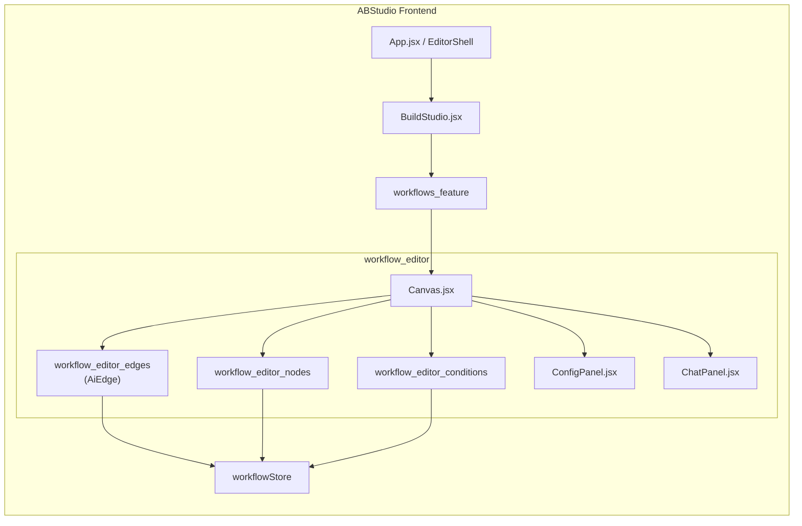
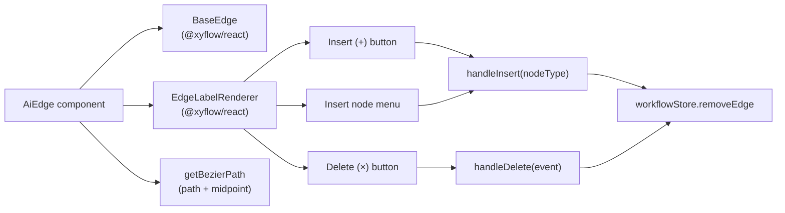
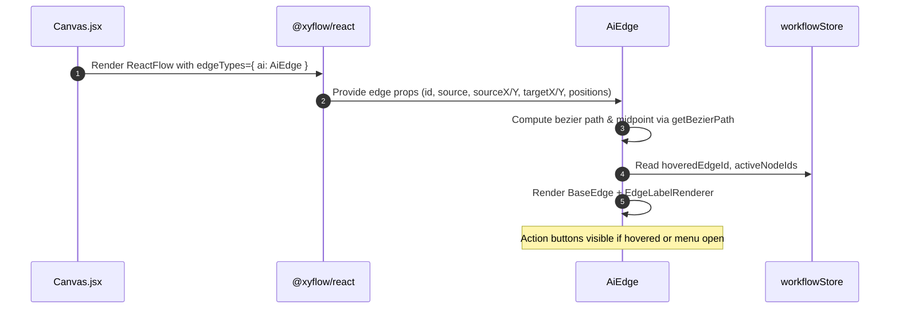
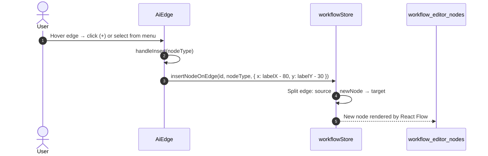
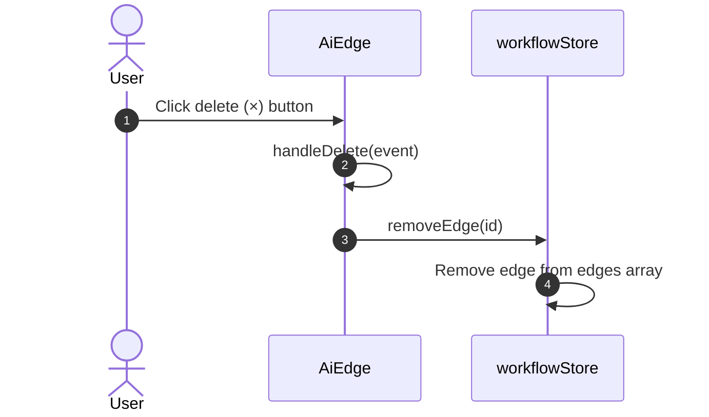

# Workflow Editor Edges Module

## Brief Introduction

The **Workflow Editor Edges** module is a focused React component layer within the ABStudio frontend that renders and manages the connections (edges) between nodes in the visual workflow builder. It is implemented as a single custom edge component, `AiEdge`, built on top of `@xyflow/react` (React Flow). The module transforms raw edge data into interactive Bézier curves and overlays an action hub at the edge midpoint, allowing users to insert new nodes inline or delete the connection without entering a separate tool mode.

This module is part of the larger [`workflow_editor`](workflow_editor.md) subsystem and works alongside [`workflow_editor_nodes`](workflow_editor_nodes.md) and [`workflow_editor_conditions`](workflow_editor_conditions.md) to provide the complete canvas editing experience.

---

## Module Purpose and Core Functionality

### Purpose

Workflows in ABStudio are directed graphs composed of nodes (Start, Agent, Condition, Loop, Subflow, End) and edges that define execution order and branching. The `workflow_editor_edges` module is responsible for:

1. **Visualizing connections** between workflow nodes as smooth Bézier paths.
2. **Indicating active execution** by animating edges whose source node is currently running.
3. **Enabling rapid editing** by exposing insert/delete actions directly on each edge.
4. **Maintaining editor state consistency** by delegating all mutations to the central [`workflowStore`](../storage/store.md).

### Core Components

| Component | File | Responsibility |
|-----------|------|----------------|
| `AiEdge` | `AiEdge.jsx` | Custom React Flow edge renderer. Computes the Bézier path, renders the base edge, and mounts an interactive label renderer with insert/delete controls. |
| `handleDelete` | `AiEdge.jsx` | Event handler that stops event propagation and removes the edge from the workflow store. |
| `handler` | `AiEdge.jsx` | Generic helper referenced by the component for internal event wiring (e.g., outside-click detection for the insert menu). |

### Key Behaviors

- **Bézier path rendering**: Uses `getBezierPath` from `@xyflow/react` with a curvature of `0.34` to produce visually balanced connections.
- **Midpoint action hub**: An `EdgeLabelRenderer` is positioned at the computed midpoint (`labelX`, `labelY`) of the edge. It hosts:
  - An **insert-node button** (`+`) that either directly inserts the only available type or opens a menu of insertable node types.
  - A **delete-edge button** (`×`) that removes the connection.
- **Insertable node palette**: The module supports inserting `agent`, `condition`, `loop`, and `subflow` nodes. Start and End nodes are intentionally excluded because they are singletons in a workflow.
- **Hover visibility**: Action buttons are only visible when the edge is hovered or the insert menu is open, keeping the canvas clean.
- **Execution animation**: When the edge's `source` node is present in `activeNodeIds`, the edge receives an `animated` CSS class so the running path is visually highlighted.
- **Outside-click dismissal**: The insert menu closes automatically when the user clicks elsewhere on the canvas.

---

## Architecture and Component Relationships

### High-Level Placement

### Internal Component Structure

### State Dependencies

`AiEdge` reads and writes the following slices of [`workflowStore`](../storage/store.md):

| Store Selector | Read / Write | Purpose |
|----------------|--------------|---------|
| `insertNodeOnEdge` | Write | Creates a new node of the requested type and splices it between the edge's source and target. |
| `removeEdge` | Write | Deletes the edge from the workflow graph. |
| `hoveredEdgeId` | Read | Determines whether this edge is currently hovered so action buttons can be shown. |
| `activeNodeIds` | Read | Determines whether the edge's source node is executing, triggering the animated state. |

---

## Data Flow

### Edge Rendering Flow

### Insert Node on Edge Flow

### Delete Edge Flow

---

## How It Fits into the Overall System

The `workflow_editor_edges` module is a presentation-and-interaction layer that sits between the React Flow canvas engine and the central workflow state. Its responsibilities are intentionally narrow:

- **It does not own workflow persistence.** Saving, loading, duplicating, and deleting workflows are handled by the backend via [`api_workflows`](../api/api_workflows.md) and the [`core_workflow_repo`](core_workflow_repo.md).
- **It does not define the data schema.** The backend [`app_models`](../core/app_models.md) module defines the `Edge` model and the overall `Workflow` schema that the frontend mirrors.
- **It does not execute workflows.** Execution is driven by [`api_execution`](../api/api_execution.md) and the [`engine_native_engine`](../agents/engine_native_engine.md); the edge component only reflects execution progress through the `activeNodeIds` animation.
- **It does not render node internals.** Node rendering is delegated to [`workflow_editor_nodes`](workflow_editor_nodes.md), while condition editing is delegated to [`workflow_editor_conditions`](workflow_editor_conditions.md).
- **It relies on the central store.** All mutations pass through [`workflowStore`](../storage/store.md), which also provides utilities such as `createWorkflowEdgeId`, `hasIllegalCycle`, and `pruneToConnectedSubgraph`.

In short, `AiEdge` is the visual glue that turns abstract `Edge` records into interactive canvas connections, while the surrounding modules handle data modeling, persistence, execution, and node-specific behavior.

---

## References

- [`workflow_editor`](workflow_editor.md) — Parent module that hosts the canvas and coordinates editor sub-modules.
- [`workflow_editor_nodes`](workflow_editor_nodes.md) — Renders the node types that edges connect.
- [`workflow_editor_conditions`](workflow_editor_conditions.md) — Edits branching logic for condition nodes connected by edges.
- [`store`](../storage/store.md) — Central Zustand store providing `insertNodeOnEdge`, `removeEdge`, `hoveredEdgeId`, and `activeNodeIds`.
- [`app_models`](../core/app_models.md) — Backend Pydantic models including `Edge` and `Workflow`.
- [`api_workflows`](../api/api_workflows.md) — REST endpoints for workflow CRUD operations.
- [`api_execution`](../api/api_execution.md) — REST and streaming endpoints for running workflows.
- [`engine_native_engine`](../agents/engine_native_engine.md) — Backend execution engine that determines which nodes are active during a run.
- [`core_workflow_repo`](core_workflow_repo.md) — Backend repository for workflow persistence and template publishing.
