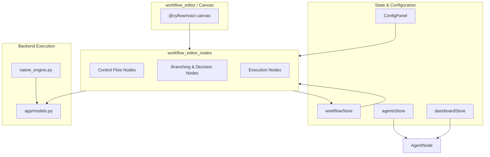
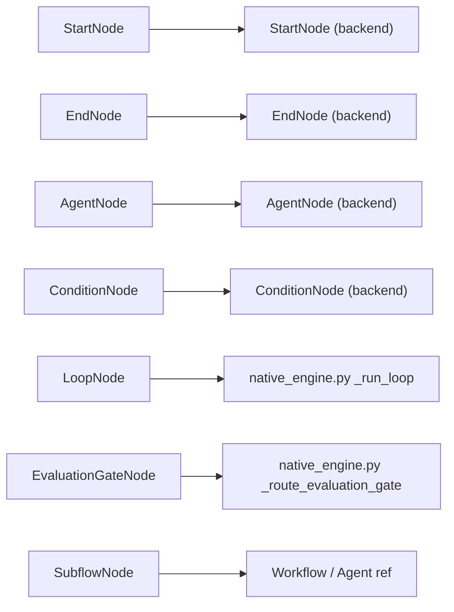

# Workflow Editor Nodes

The `workflow_editor_nodes` module is the visual node layer of the ABStudio workflow editor. It provides the React Flow custom node components that users drag, drop, and connect on the canvas to build executable workflows. Each component renders a distinct node type, surfaces execution state, and exposes the connection handles that the edge system uses to wire workflows together.

## Purpose

- Render every workflow node type on the React Flow canvas.
- Reflect live execution status (active, success, error) during workflow runs.
- Surface configuration previews and validation warnings directly on the node.
- Expose source/target handles that match the backend execution graph.

## Architecture Overview

### Node Categories

| Category | Node Types | Responsibility |
|----------|-----------|----------------|
| Control Flow | Start, End | Mark the entry and exit points of a workflow. |
| Branching & Decision | Condition, Evaluation Gate, Loop | Route execution along different paths based on rules, LLM judgment, or iteration. |
| Execution | Agent, Subflow | Perform work by invoking an AI agent or reusing an existing agent/workflow. |

All node components share a common visual foundation:

- **Framer Motion** entrance and hover animations.
- **CSS classes** prefixed with `node-block` and `node-block--{type}` for theming.
- **Execution state** derived from `workflowStore.activeNodeIds` and `data.status` / `data.executionStatus` / `data.state`.
- **React Flow handles** with IDs that the backend graph interpreter expects (for example, `pass`/`fail` on the evaluation gate, `body`/`exit` on the loop).

## Data Model Mapping

The frontend node types correspond to the backend workflow model defined in [`app_models`](../models/app_models.md). Default data shapes for new nodes are produced by `getDefaultNodeData` in [`workflowStore`](../storage/store.md), which keeps the canvas schema aligned with the engine in [`engine_native_engine`](../reference/engine_native_engine.md).

## Execution State Visualization

Every node observes `workflowStore.activeNodeIds` to highlight the currently executing node. They also read `data.status`, `data.executionStatus`, or `data.state` to apply success or error styling. This gives users immediate visual feedback during streamed workflow runs managed by [`api_execution`](../api/api_execution.md).

## Integration with the Editor

- The [`workflow_editor`](workflow_editor.md) canvas registers these components as React Flow node types.
- [`ConfigPanel`](workflow_editor.md) edits the `data` payload of the selected node.
- [`workflow_editor_conditions`](workflow_editor_conditions.md) provides the condition builder UI used by condition and loop nodes.
- [`workflow_editor_edges`](workflow_editor_edges.md) renders the edges that connect these handles.

## Sub-module Documentation

Detailed documentation for each node category is available in the following files:

- Control flow nodes: `workflow_editor_nodes_control_flow.md`
- Branching and decision nodes: `workflow_editor_nodes_branching.md`
- Execution nodes: `workflow_editor_nodes_execution.md`
