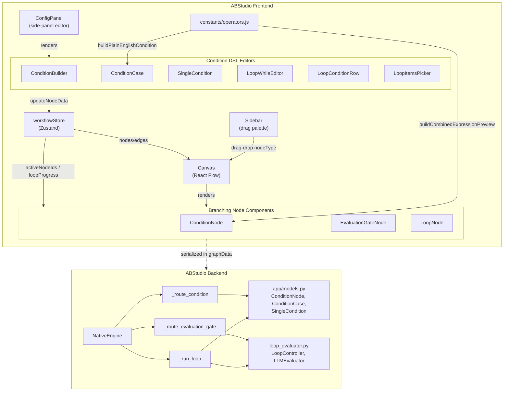
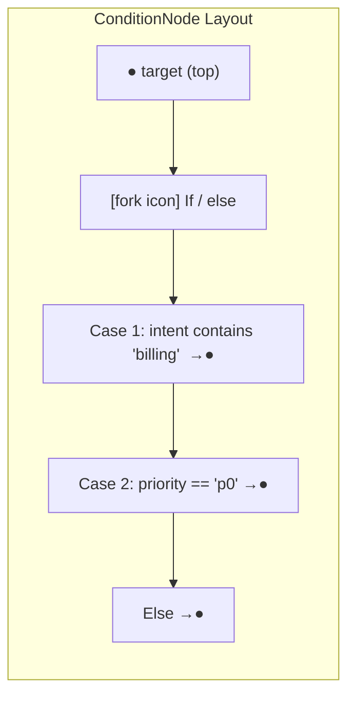
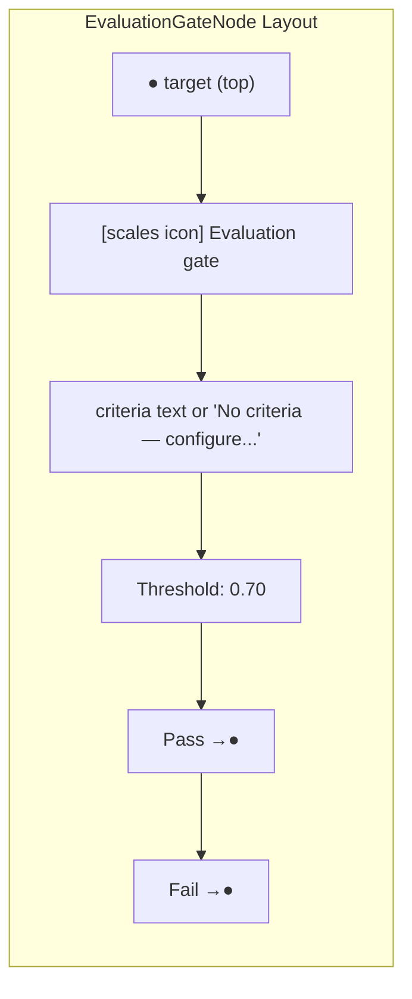
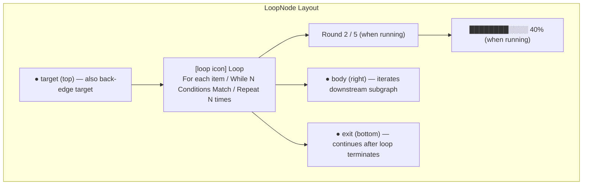
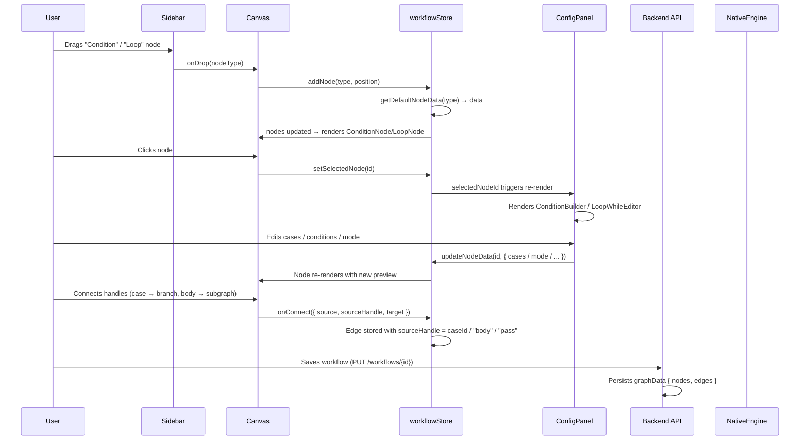
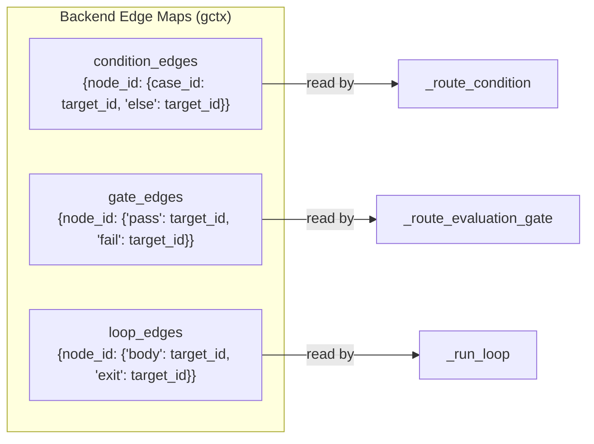
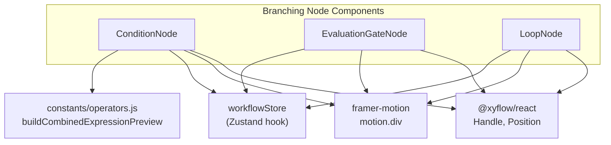
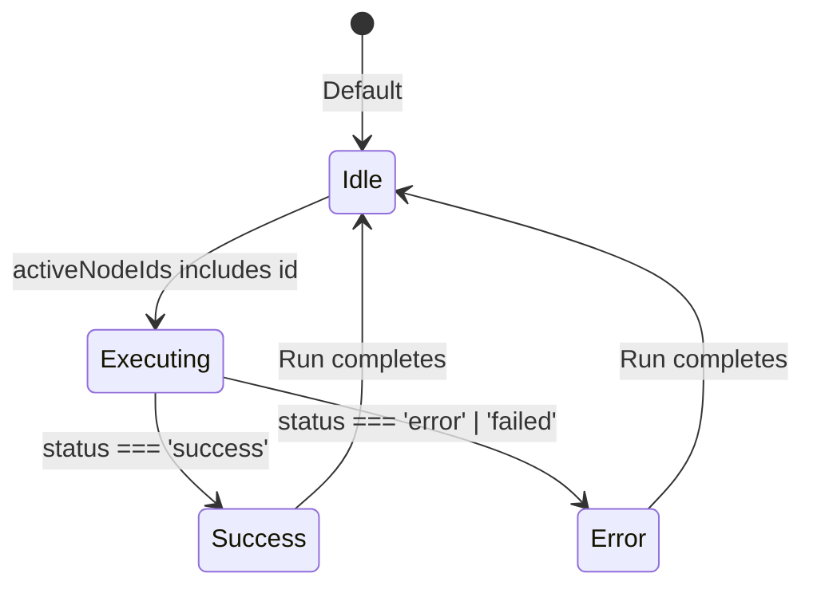

# Workflow Editor Nodes — Branching

> **Module ID:** `workflow_editor_nodes_branching`
> **Source location:** `ABStudio/frontend/src/features/workflows/editor/nodes/`
> **Parent module:** [workflow_editor_nodes](workflow_editor_nodes.md) · [workflow_editor](workflow_editor.md)

## 1. Introduction

The **Branching Nodes** module provides the three React Flow node components that
implement *control-flow divergence* on the ABStudio workflow canvas:

| Node | File | Purpose |
|------|------|---------|
| **ConditionNode** | `ConditionNode.jsx` | If/else fork — evaluates ordered cases top-to-bottom, routes to the first match, falls through to Else. |
| **EvaluationGateNode** | `EvaluationGateNode.jsx` | LLM-judge gate — scores the upstream agent's output against a rubric and routes through `pass` or `fail` based on a threshold. |
| **LoopNode** | `LoopNode.jsx` | Iteration hub — repeats a body subgraph in `for_each`, `while`, or `count` mode with live progress tracking. |

Together with the [control-flow nodes](workflow_editor_nodes_control_flow.md) (Start / End)
and the [execution nodes](workflow_editor_nodes_execution.md) (Agent / Subflow), these
components form the complete node palette available in the
[workflow editor Sidebar](workflow_editor.md#sidebar).

Each node is a **presentational React component** rendered by React Flow inside the
[Canvas](workflow_editor.md#canvas). They subscribe to the
[workflow store](../storage/store.md) for live execution state (active node highlighting, loop
progress) and expose typed **source handles** that the backend
[NativeEngine](../reference/engine_native_engine.md) reads during graph traversal to decide which
edge to follow.

---

## 2. Architecture Overview



### 2.1 Module Boundaries

The branching nodes sit at the intersection of three concerns:

1. **Visual rendering** — SVG icons, animated motion (Framer Motion), handle
   positioning, and execution-status CSS classes.
2. **Data shape contract** — each node's `data` object must match what the
   [ConfigPanel](workflow_editor.md#configpanel) writes and what the backend
   [NativeEngine](../reference/engine_native_engine.md) reads.
3. **Handle topology** — the `id` attributes on `<Handle>` elements are the
   contract between the frontend edge-wiring and the backend's
   `condition_edges` / `gate_edges` / `loop_edges` lookup maps.

---

## 3. Component Documentation

### 3.1 ConditionNode

**File:** `ConditionNode.jsx`
**Exports:** `ConditionNode` (default), `ConditionIcon`

#### Purpose

Renders an if/else decision fork on the canvas. The node has **one target handle**
(top) and **N+1 source handles** (right side): one per case plus an implicit `else`
handle. Cases are evaluated top-to-bottom by the backend; the first match wins.

#### Visual Structure



#### Data Contract

The node reads `data.cases` — an array of `ConditionCase` objects whose shape is
defined in the backend model
([`app/models.py::ConditionCase`](../models/app_models.md)):

```python
class ConditionCase(BaseModel):
    id:         str
    label:      str = ""
    conditions: List[SingleCondition] = []
    logic:      str = "AND"        # "AND" | "OR"
```

Each `SingleCondition` carries `{ field, operator, value, type }`.

On the canvas, each case row calls
[`buildCombinedExpressionPreview`](../reference/constants.md) from `constants/operators.js` to
render a human-readable preview string (e.g. `intent contains 'billing'`). Legacy
nodes that carry a raw `expression` string are supported as a fallback.

#### Handle IDs

| Handle | Type | Position | ID | Description |
|--------|------|----------|----|-------------|
| Target | `target` | Top | `"target"` | Incoming flow from upstream node |
| Case source | `source` | Right | `caseItem.id` | One per case — edge target is the case's branch |
| Else source | `source` | Right | `"else"` | Fallback when no case matches |

The backend's `_route_condition` method looks up `gctx.condition_edges[node_id]`,
which maps `case_id → target_node_id`. The `else` handle maps to
`CONDITION_ELSE_HANDLE`.

#### Execution State

The component subscribes to `activeNodeIds` from the
[workflow store](../storage/store.md) to apply the `executing` CSS class. It also reads
`data.status` / `data.executionStatus` / `data.state` for `success` / `error`
visual states.

#### Related Editors

Condition nodes are configured in the [ConfigPanel](workflow_editor.md#configpanel)
via the [ConditionBuilder](workflow_editor_conditions.md) →
[ConditionCase](workflow_editor_conditions.md) →
[SingleCondition](workflow_editor_conditions.md) editor chain. See
[workflow_editor_conditions](workflow_editor_conditions.md) for the full DSL
documentation.

---

### 3.2 EvaluationGateNode

**File:** `EvaluationGateNode.jsx`
**Exports:** `EvaluationGateNode` (default), `GateIcon`

#### Purpose

An in-graph LLM-judge gate (P2 feature). It takes the upstream agent's output as
the artifact, runs an independent LLM judge against a `criteria` rubric, and routes
through the `pass` handle when `score >= threshold` (and `verdict.met` is true),
otherwise through the `fail` handle.

> **Note:** The component comment describes this as a "minimal P2 stub" — styling
> parity with ConditionNode is planned for a follow-up alongside the side-panel
> editor.

#### Visual Structure



#### Data Contract

```javascript
// From getDefaultNodeData('evaluation_gate') in workflowStore.js
{
    label: 'Evaluation Gate',
    criteria: '',       // rubric text — empty = unconfigured
    threshold: 0.7,     // score >= threshold AND verdict.met → pass
}
```

#### Handle IDs

| Handle | Type | Position | ID | Description |
|--------|------|----------|----|-------------|
| Target | `target` | Top | `"target"` | Incoming artifact (upstream agent output) |
| Pass | `source` | Right | `"pass"` | Route when judge score ≥ threshold |
| Fail | `source` | Right | `"fail"` | Route when score < threshold or judge error |

Handle names mirror the backend's `gate_edges` map. The backend
`_route_evaluation_gate` method is **fail-closed**: any judge exception, missing
criteria, or injection-blocked artifact routes to `fail` (or `End` if no fail edge
exists).

#### Backend Integration

The gate delegates to `evaluate_llm_judge` from
[`app.loop.runner`](../reference/loop_runner.md) — the same helper used by the
`ProofEvaluator` in the outer-loop system. This ensures consistent judging behavior
between in-graph gates and loop verifiers. See
[loop_runner](../reference/loop_runner.md) for the evaluator's rubric and scoring contract.

The artifact is scanned for prompt injection before judging (policy = `block` by
default for `agent_output`), preventing a poisoned upstream output from subverting
the gate verdict.

---

### 3.3 LoopNode

**File:** `LoopNode.jsx`
**Exports:** `LoopNode` (default), `LoopIcon`

#### Purpose

An iteration hub that repeats a body subgraph until a termination condition is met.
Supports three modes:

| Mode | Label on Canvas | Stop Condition |
|------|-----------------|----------------|
| `for_each` | `For each item` | Exhausts the list resolved from `itemsExpression` |
| `while` | `While N Condition(s) Match` | Case expression evaluates false (do-while semantics) |
| `count` | `Repeat N times` | Fixed iteration count reached |

#### Visual Structure



#### Handle IDs

| Handle | Type | Position | ID | Description |
|--------|------|----------|----|-------------|
| Target | `target` | Top | `"target"` | Incoming flow; also the back-edge target when the body closes back on the loop |
| Body | `source` | Right | `"body"` | Iterates the downstream subgraph each round |
| Exit | `source` | Bottom | `"exit"` | Continues here after the loop terminates |

The backend's `_run_loop` traverses the body via
`_traverse(body_target, …, stop_at={node_id})` — when the body's last edge closes
back on the loop node, `_traverse` exits cleanly and the next iteration begins.
After termination, `_traverse` (the caller) advances to the `exit` handle target
via `gctx.loop_edges[node_id]["exit"]`.

#### Data Contract

```javascript
// From getDefaultNodeData('loop') in workflowStore.js
{
    label: 'Loop',
    mode: 'for_each',           // 'for_each' | 'while' | 'count'
    itemsExpression: 'input.items',  // for_each: dotted path to list
    count: 3,                   // count: fixed iteration count
    cases: [],                  // while: single-element array of ConditionCase
    maxIterations: 5,           // hard safety ceiling (all modes)
    iteratorVar: 'item',        // exposed as {{loop.item}} in body agents
    // LLM evaluator (opt-in)
    useLlmEvaluator: false,
    confidenceThreshold: 0.85,
    similarityThreshold: 0.95,
    regressionDelta: 0.05,
    stopMode: 'adaptive',       // 'adaptive' | 'fixed'
    evaluatorTask: '',
    evaluatorRubric: '',
    evaluatorModelName: '',
    name: '',
}
```

#### Live Progress Tracking

The component subscribes to `loopProgress[id]` from the
[workflow store](../storage/store.md). The backend emits `loop_iteration_start` and
`loop_iteration_end` SSE events per round; the store maps these into a progress
object `{ running, index, total }` that drives:

- A **progress badge** showing `Round N / M` (or `Round N` for `while` mode where
  total is unknown).
- A **progress bar** filling proportionally (only when `total` is known and > 0).

#### Canvas Label Logic

The `summarize()` helper converts the node's config into a plain-language label:

- `for_each` → `For each item` (or `For each <field>` if `itemsExpression` points
  to a named field)
- `while` → `While N Condition(s) Match` (counts rule rows in the first case)
- `count` → `Repeat N times`

The `humanisePath()` helper converts dotted paths like `input.issues` into
readable labels like `each issue`.

#### Related Editors

Loop nodes are configured in the [ConfigPanel](workflow_editor.md#configpanel),
which renders mode-specific editors:

- **for_each** → [LoopItemsPicker](workflow_editor.md#loopitemspicker) for
  selecting the list expression
- **while** → [LoopWhileEditor](workflow_editor_conditions.md) →
  [LoopConditionRow](workflow_editor_conditions.md) for the continuation predicate
- **count** → numeric input for iteration count
- **Advanced** → collapsible AI Evaluator section (judge model, stop policy,
  thresholds, rubric)

See [workflow_editor_conditions](workflow_editor_conditions.md) for the LoopWhile
editor DSL and [workflow_editor](workflow_editor.md) for the full ConfigPanel
documentation.

---

## 4. Data Flow

### 4.1 Authoring Flow (Frontend → Store → Backend)



### 4.2 Execution Flow (Backend Engine)

```mermaid
sequenceDiagram
    participant Engine as NativeEngine._traverse
    participant Cond as _route_condition
    participant Gate as _route_evaluation_gate
    participant Loop as _run_loop
    participant Judge as evaluate_llm_judge
    participant Store as CheckpointStore

    Engine->>Engine: node = gctx.nodes_by_id[node_id]
    alt type == "condition"
        Engine->>Cond: _route_condition(node, state, gctx)
        Cond->>Cond: resolve_routing_state(state.current_input)
        Cond->>Cond: For each case: build_expression_from_case → evaluate_condition
        alt Case matched
            Cond-->>Engine: (case_edge_target, route_info)
        else No match
            Cond-->>Engine: (else_edge_target, route_info)
        end
        Engine->>Store: _persist_condition_routing (audit)
    else type == "evaluation_gate"
        Engine->>Gate: _route_evaluation_gate(node, state, gctx)
        Gate->>Gate: Injection scan on artifact
        Gate->>Judge: evaluate_llm_judge(criteria, artifact)
        Judge-->>Gate: verdict { score, met, critique }
        alt score >= threshold AND met
            Gate-->>Engine: ("__next__", pass_target)
        else Score below or error
            Gate-->>Engine: ("__next__", fail_target)
        end
    else type == "loop"
        Engine->>Loop: _run_loop(node_id, node, state, gctx)
        loop Each iteration
            Loop->>Loop: Set state.loop_context { index, item, ... }
            Loop->>Engine: _traverse(body_target, stop_at={node_id})
            Engine-->>Loop: Body subgraph executed
            alt mode == "while"
                Loop->>Loop: Evaluate while-cases against body output
            end
            alt useLlmEvaluator
                Loop->>Judge: evaluate(task, output, prior_output)
                Judge-->>Loop: EvaluationResult { score, criteria, ... }
                Loop->>Loop: LoopController.record → stop decision
            end
            alt Stop condition met OR maxIterations
                Loop-->>Engine: loop_complete event
            end
        end
        Engine->>Engine: Advance to exit handle target
    end
```

---

## 5. Handle Topology & Edge Maps

The backend builds three separate edge lookup maps during graph parsing
(`parse_chain` in the engine's dependency module):



The frontend's `onConnect` handler stores edges with `sourceHandle` matching the
handle `id` attributes defined in each node component. The backend's
`ChainEdge` model carries `source_handle` (mapped from `sourceHandle`), which
`parse_chain` uses to populate the correct map.

### Handle ID Summary

| Node | Handle IDs | Backend Map Key |
|------|-----------|-----------------|
| ConditionNode | `target`, `{caseId}`, `else` | `condition_edges` |
| EvaluationGateNode | `target`, `pass`, `fail` | `gate_edges` |
| LoopNode | `target`, `body`, `exit` | `loop_edges` |

---

## 6. Dependencies

### 6.1 Frontend Dependencies



### 6.2 Module Dependencies

| Dependency | Type | Documentation |
|-----------|------|----------------|
| `workflowStore` | State management | [store](../storage/store.md) |
| `constants/operators.js` | Expression preview helpers | [constants](../reference/constants.md) |
| `ConfigPanel` | Side-panel configuration | [workflow_editor](workflow_editor.md) |
| `ConditionBuilder` / `ConditionCase` / `SingleCondition` | Condition DSL editors | [workflow_editor_conditions](workflow_editor_conditions.md) |
| `LoopWhileEditor` / `LoopConditionRow` | Loop while-mode editor | [workflow_editor_conditions](workflow_editor_conditions.md) |
| `LoopItemsPicker` | for_each list selector | [workflow_editor](workflow_editor.md) |
| `Canvas` | React Flow host | [workflow_editor](workflow_editor.md) |
| `Sidebar` | Drag-and-drop palette | [workflow_editor](workflow_editor.md) |
| `NativeEngine` | Backend graph traversal | [engine_native_engine](../reference/engine_native_engine.md) |
| `app/models.py` | Backend data models | [app_models](../models/app_models.md) |
| `loop_evaluator.py` | LLM judge + controller | [engine_loop_evaluator](../evaluation/engine_loop_evaluator.md) |
| `loop/runner.py` | `evaluate_llm_judge` helper | [loop_runner](../reference/loop_runner.md) |

---

## 7. Execution Status Visual States

All three node components share a common CSS class pattern for execution feedback:



| CSS Class | Trigger | Visual Effect |
|-----------|---------|---------------|
| `executing` | `activeNodeIds.includes(id)` | Pulsing/glowing border |
| `success` | `data.status === 'success'` | Green accent |
| `error` | `data.status === 'error'` or `'failed'` | Red accent |
| `selected` | `selected` prop from React Flow | Highlighted border |

The `LoopNode` additionally renders:
- `loop-progress-badge` — `Round N / M` text when `progress.running` is true
- `loop-progress-bar` / `loop-progress-bar-fill` — proportional fill bar when
  `total` is known

---

## 8. Backend Routing Details

### 8.1 Condition Routing (`_route_condition`)

1. **Resolve routing state** — `resolve_routing_state(state.current_input)`
   parses the upstream agent's output into a flat dict (JSON keys spread to
   top-level, with an `input` alias for the condition DSL's `input.<field>`
   convention).
2. **Evaluate cases top-to-bottom** — for each case,
   `build_expression_from_case(case)` compiles the structured conditions into a
   `simpleeval` expression, then `evaluate_condition(expr, eval_state)` checks
   it.
3. **First match wins** — the matched case's edge target is returned. If no
   case matches, the `else` handle target is used (or `end_id` if no else edge
   exists).
4. **Audit persistence** — the routing decision is persisted via
   `_persist_condition_routing` for audit trails.

### 8.2 Evaluation Gate Routing (`_route_evaluation_gate`)

1. **Injection scan** — the artifact (upstream agent output) is scanned for
   prompt injection. If blocked by policy, the gate fails closed.
2. **LLM judge** — `evaluate_llm_judge(criteria, artifact, ctx)` runs an
   independent LLM call with temperature 0 against the rubric.
3. **Threshold check** — `passed = (verdict.score >= threshold) AND verdict.met`.
   Pass routes to `pass_target`; everything else (including judge exceptions)
   routes to `fail_target` (or `end_id`).

### 8.3 Loop Execution (`_run_loop`)

1. **Mode resolution** — config is read from the top-level node (flattened by
   `workflowStore.getWorkflowForExecution`) or `node.data` (legacy).
2. **Item resolution** (for_each) — `itemsExpression` is resolved against the
   routing state with fallback logic for both `input.<field>` and bare `<field>`
   conventions.
3. **Body traversal** — each iteration calls
   `_traverse(body_target, state, gctx, …, stop_at={node_id})`. The body
   subgraph executes fully; when its last edge closes back on the loop node,
   `_traverse` returns.
4. **Termination check**:
   - `for_each` / `count` — deterministic (list exhausted / count reached)
   - `while` — case expressions evaluated against body output (do-while: body
     runs first, then condition is checked)
   - LLM evaluator (opt-in) — `LoopController.record()` decides stop based on
     confidence threshold, semantic similarity, and score regression
5. **Safety cap** — `maxIterations` is a hard ceiling regardless of mode.
6. **Best-iteration return** — when the loop stops, the highest-scoring
   iteration's output is used (not necessarily the last one).
7. **Memory** (opt-in) — `memory.read` pulls prior-run lessons into body agent
   context; `memory.write` persists a reflection digest for future runs.

---

## 9. Default Node Data

The [workflow store](../storage/store.md)'s `getDefaultNodeData(type)` function provides
initial data for each branching node type:

| Node Type | Key Default Fields |
|-----------|-------------------|
| `condition` | `cases: [newCase('Case 1')]` |
| `evaluation_gate` | `criteria: ''`, `threshold: 0.7` |
| `loop` | `mode: 'for_each'`, `itemsExpression: 'input.items'`, `count: 3`, `maxIterations: 5`, `useLlmEvaluator: false`, `confidenceThreshold: 0.85` |

See [store](../storage/store.md) for the complete `getDefaultNodeData` implementation.

---

## 10. Cross-References

| Topic | Documentation |
|-------|---------------|
| Workflow editor overview | [workflow_editor](workflow_editor.md) |
| All node types (parent) | [workflow_editor_nodes](workflow_editor_nodes.md) |
| Control-flow nodes (Start/End) | [workflow_editor_nodes_control_flow](workflow_editor_nodes_control_flow.md) |
| Execution nodes (Agent/Subflow) | [workflow_editor_nodes_execution](workflow_editor_nodes_execution.md) |
| Condition DSL editors | [workflow_editor_conditions](workflow_editor_conditions.md) |
| Edge rendering | [workflow_editor_edges](workflow_editor_edges.md) |
| Workflow store (Zustand) | [store](../storage/store.md) |
| Backend execution engine | [engine_native_engine](../reference/engine_native_engine.md) |
| Backend data models | [app_models](../models/app_models.md) |
| Loop evaluator (LLM judge) | [engine_loop_evaluator](../evaluation/engine_loop_evaluator.md) |
| Loop runner system | [loop_runner](../reference/loop_runner.md) |
| Loop models | [loop_models](../models/loop_models.md) |
| Constants (operators) | [constants](../reference/constants.md) |
