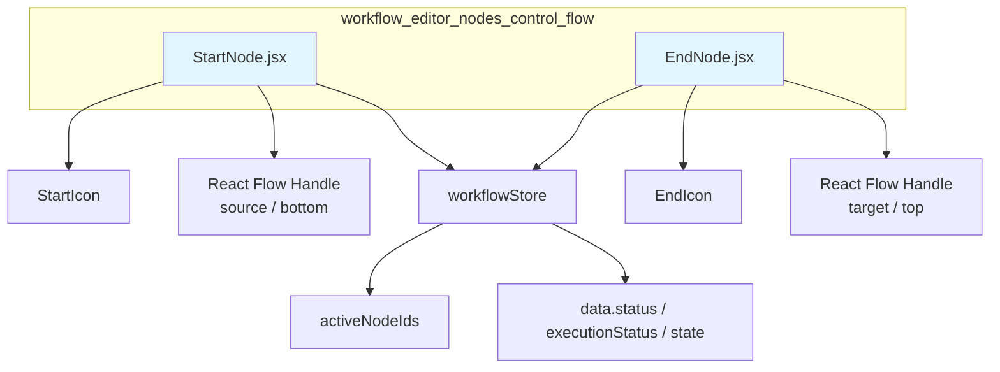
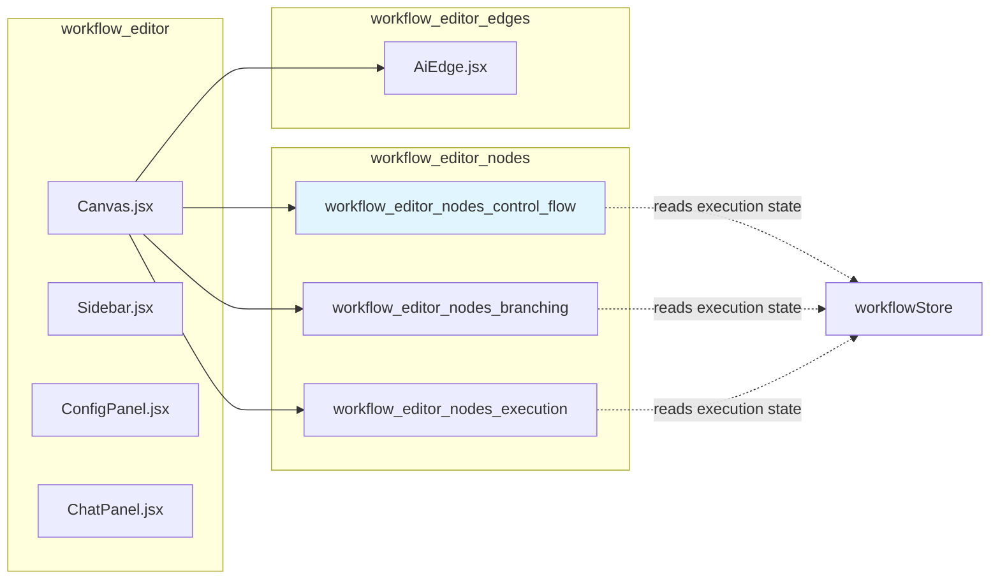
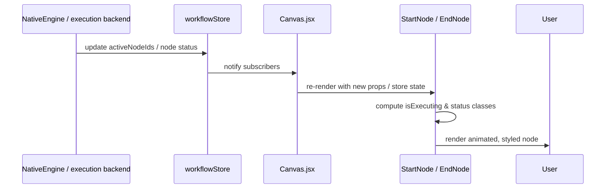
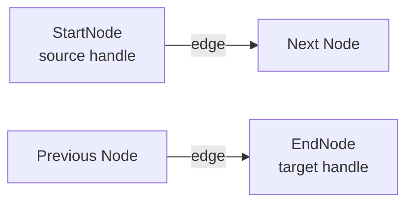
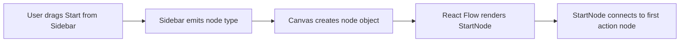
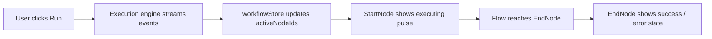

# Workflow Editor — Control Flow Nodes

## Brief Introduction

The `workflow_editor_nodes_control_flow` module provides the visual React Flow node components that mark the **entry** and **exit** points of a workflow in the ABStudio workflow editor. It contains two lightweight, presentational components:

- **`StartNode`** — Renders the workflow trigger node (a play-triangle icon labeled “Start / Trigger”).
- **`EndNode`** — Renders the workflow completion node (a solid square icon labeled “End / Complete”).

These nodes are pure UI primitives. They do not contain business logic for execution; instead, they reflect execution state (active, success, error) from the global workflow store and expose connection handles so users can wire them into the rest of the graph.

---

## Core Components

### `StartNode`

| Property | Description |
|----------|-------------|
| **File** | `ABStudio/frontend/src/features/workflows/editor/nodes/StartNode.jsx` |
| **Purpose** | Visual entry-point node for every workflow. |
| **Props** | `id` (node id), `data` (node data object), `selected` (boolean) |
| **Handle** | One `source` handle at the bottom (`Position.Bottom`). |
| **Visual states** | `selected`, `executing`, `success`, `error` / `failed` |

`StartNode` reads `activeNodeIds` from `useWorkflowStore` to determine whether the node is currently executing. It also derives a `status` from `data.status`, `data.executionStatus`, or `data.state` to apply success/error styling.

### `EndNode`

| Property | Description |
|----------|-------------|
| **File** | `ABStudio/frontend/src/features/workflows/editor/nodes/EndNode.jsx` |
| **Purpose** | Visual terminal node that signals workflow completion. |
| **Props** | `id` (node id), `data` (node data object), `selected` (boolean) |
| **Handle** | One `target` handle at the top (`Position.Top`). |
| **Visual states** | `selected`, `executing`, `success`, `error` / `failed` |

`EndNode` mirrors `StartNode`’s state-reading behavior but only accepts incoming edges.

### `StartIcon` / `EndIcon`

Small inline SVG icon components:

- `StartIcon` — right-facing triangle (▶) symbolizing “play / trigger.”
- `EndIcon` — rounded square (⏹) symbolizing “stop / complete.”

Both use `fill="currentColor"` so they inherit the parent CSS color.

---

## Architecture

### Component Hierarchy



### Relationship to the Workflow Editor



The control-flow nodes are registered inside the React Flow `nodeTypes` map used by [`Canvas`](workflow_editor.md) (see the `workflow_editor` module). They sit alongside branching nodes (`ConditionNode`, `EvaluationGateNode`, `LoopNode`) and execution nodes (`AgentNode`, `SubflowNode`).

---

## Dependencies

### Internal Dependencies

| Dependency | Module | Purpose |
|------------|--------|---------|
| `useWorkflowStore` | `workflowStore` | Reads `activeNodeIds` and node status for execution feedback. |
| React Flow `Handle`, `Position` | `@xyflow/react` | Provides connection anchors for edges. |
| `motion` | `framer-motion` | Provides mount / hover animations. |

### Upstream / Downstream Modules

```mermaid
flowchart TB
    subgraph External
        RF[@xyflow/react]
        FM[framer-motion]
    end

    subgraph ABStudio Frontend
        WFS[workflowStore]
        Canvas[Canvas.jsx]
        Sidebar[Sidebar.jsx]
        ConfigPanel[ConfigPanel.jsx]
    end

    CF[workflow_editor_nodes_control_flow]

    WFS -->|activeNodeIds, status| CF
    CF -->|nodeTypes registration| Canvas
    Sidebar -->|drag / drop palette| CF
    ConfigPanel -->|selection / properties| CF
    RF -->|Handle, Position| CF
    FM -->|motion.div| CF

    style CF fill:#e1f5fe
```

- **Upstream:** `workflowStore` supplies runtime state. [`Canvas`](workflow_editor.md) registers the node types and renders them. [`Sidebar`](workflow_editor.md) and [`ConfigPanel`](workflow_editor.md) allow users to add and configure nodes.
- **Downstream:** None directly; these are leaf presentational components consumed by React Flow.

---

## Data Flow

### Execution State Propagation



1. The backend execution engine (see [`engine_native_engine`](../agents/engine_native_engine.md)) or frontend runner updates the workflow store.
2. `useWorkflowStore` selectors in `StartNode` / `EndNode` detect changes.
3. Components recompute CSS classes (`executing`, `success`, `error`) and re-render.
4. Framer Motion handles the enter / hover animations independently.

### Node Connection Flow



- `StartNode` only emits edges from its bottom source handle.
- `EndNode` only accepts edges into its top target handle.
- Edge rendering and deletion are handled by [`AiEdge`](workflow_editor_edges.md) in the `workflow_editor_edges` module.

---

## Component Interaction

### With the Workflow Store

Both nodes subscribe to the same slice of state:

```javascript
const activeNodeIds = useWorkflowStore((state) => state.activeNodeIds);
const isExecuting = activeNodeIds.includes(id);
```

This keeps the UI responsive during workflow runs without requiring prop drilling from `Canvas`.

### With React Flow

React Flow passes the following props automatically when the node is rendered:

| Prop | Source | Usage |
|------|--------|-------|
| `id` | React Flow node id | Used to check `activeNodeIds.includes(id)`. |
| `data` | Node data object | Inspected for `status`, `executionStatus`, `state`. |
| `selected` | React Flow selection state | Applied as `selected` CSS class. |

### With Styling

The nodes rely on shared CSS classes defined elsewhere in the workflow editor stylesheet:

- `.node-block` — base card shape.
- `.node-block--start` / `.node-block--end` — type-specific theming.
- `.selected`, `.executing`, `.success`, `.error` — state modifiers.

---

## Process Flows

### Adding a Start Node to the Canvas



### Observing a Workflow Run



---

## How It Fits into the Overall System

The control-flow nodes are one of three node families in the ABStudio workflow editor:

| Family | Module | Responsibility |
|--------|--------|----------------|
| Control Flow | `workflow_editor_nodes_control_flow` (this module) | Entry (`StartNode`) and exit (`EndNode`) anchors. |
| Branching | [`workflow_editor_nodes_branching`](workflow_editor_nodes_branching.md) | Decision logic: `ConditionNode`, `EvaluationGateNode`, `LoopNode`. |
| Execution | [`workflow_editor_nodes_execution`](workflow_editor_nodes_execution.md) | Work performers: `AgentNode`, `SubflowNode`. |

Together, these node types are registered in the React Flow `nodeTypes` map by [`Canvas`](workflow_editor.md) and persisted as part of the [`Workflow`](../core/app_models.md) model on the backend (see [`app_models`](../core/app_models.md) for `StartNode`, `EndNode`, `Workflow`, `Edge`, etc.).

Execution semantics are implemented by the backend [`engine_native_engine`](../agents/engine_native_engine.md) and triggered through [`api_execution`](../api/api_execution.md). The frontend store layer (`workflowStore`) bridges backend events and the visual node states rendered by this module.

---

## References

- [`workflow_editor`](workflow_editor.md) — Canvas, Sidebar, ConfigPanel, and overall editor shell.
- [`workflow_editor_nodes_branching`](workflow_editor_nodes_branching.md) — Condition, evaluation gate, and loop nodes.
- [`workflow_editor_nodes_execution`](workflow_editor_nodes_execution.md) — Agent and subflow nodes.
- [`workflow_editor_edges`](workflow_editor_edges.md) — Edge rendering and interaction.
- `workflowStore` — Global workflow state, including `activeNodeIds` and run history.
- [`app_models`](../core/app_models.md) — Backend/frontend shared models for `Workflow`, `StartNode`, `EndNode`, `Edge`.
- [`api_execution`](../api/api_execution.md) — Endpoints that run and resume workflows.
- [`engine_native_engine`](../agents/engine_native_engine.md) — Backend execution engine that drives the node statuses reflected here.
