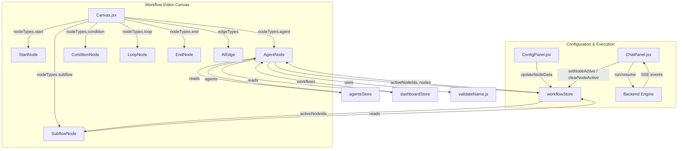
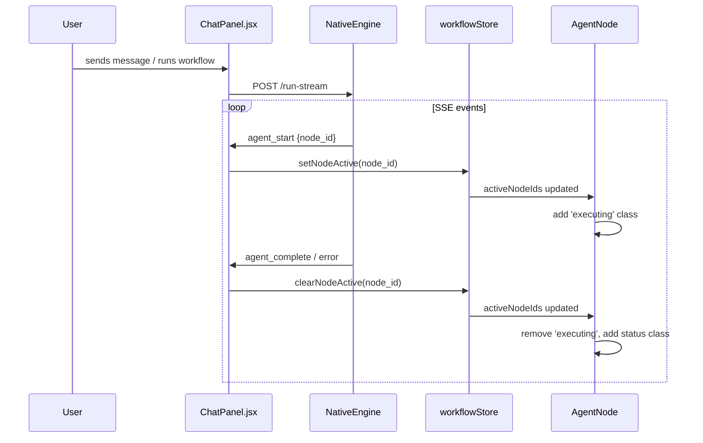
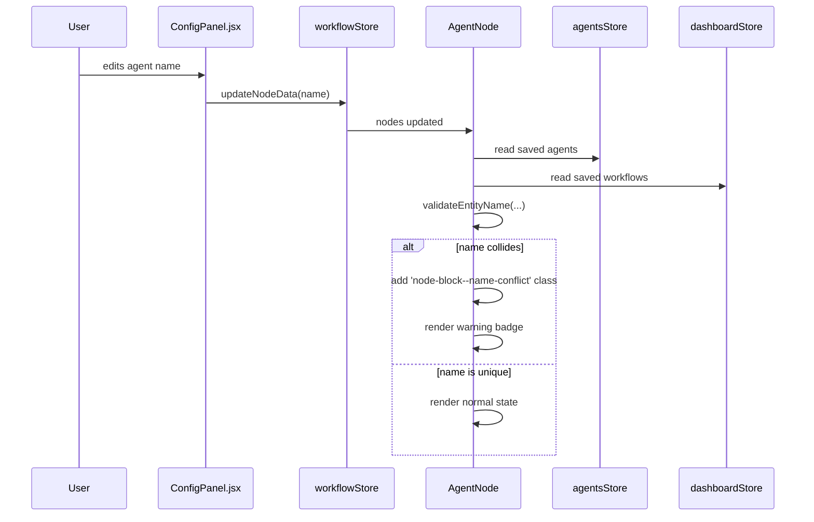
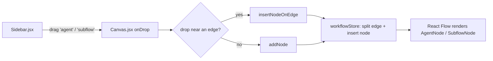
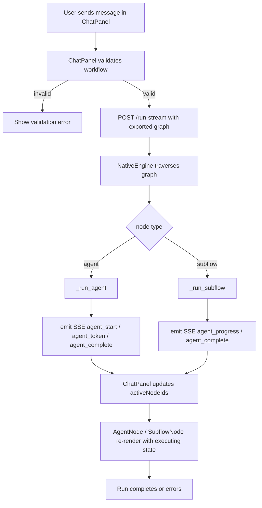
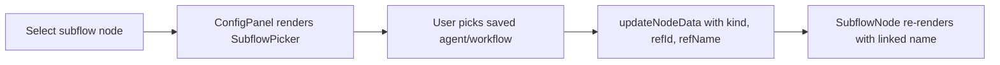

# Workflow Editor — Execution Nodes

The `workflow_editor_nodes_execution` module provides the React Flow custom node components that represent **executable work** in the ABStudio workflow editor. These nodes are the only nodes that actually run agents or delegate to existing assets during workflow execution.

## Module Scope

This module contains two node types:

| File | Component | Node Type | Purpose |
|------|-----------|-----------|---------|
| `AgentNode.jsx` | `AgentNode` | `agent` | Runs an inline AI agent configured directly on the canvas. |
| `SubflowNode.jsx` | `SubflowNode` | `subflow` | Delegates execution to a saved agent or an entire saved workflow. |

Both components are **purely presentational**. They read execution state from the global workflow store and render the node's current status (idle, executing, success, error). All configuration, validation, and execution logic lives in sibling modules such as [`workflow_editor`](workflow_editor.md), [`workflow_editor_nodes_control_flow`](workflow_editor_nodes_control_flow.md), [`workflow_editor_nodes_branching`](workflow_editor_nodes_branching.md), and the backend [`engine_native_engine`](../agents/engine_native_engine.md).

---

## Core Components

### `AgentNode`

Renders an inline agent node on the React Flow canvas.

**Responsibilities:**
- Display the agent's configured `name` and a fixed "Agent" label.
- Render a single top `target` handle and a single bottom `source` handle so the node can be wired sequentially.
- Reflect live execution state via CSS classes:
  - `executing` — when the node's id is in `activeNodeIds`.
  - `success` / `error` — when `data.status`, `data.executionStatus`, or `data.state` report a terminal result.
- Surface **name conflicts** by turning the node red and showing a warning badge. The conflict check compares the node's name against:
  - Other `agent` nodes in the same workflow.
  - Saved agents from [`agentsStore`](../storage/store.md).
  - Saved workflows from [`dashboardStore`](../storage/store.md).
- Surface **Human-in-the-Loop (HITL)** mode with a small badge when `data.hitlMode` is not `off`.
- Show a compact summary of attached **tools** and **skills** counts.

**Key props from React Flow:**
- `id` — the graph-scoped node id.
- `data` — the node's configuration blob (`name`, `instructions`, `tools`, `skills`, `hitlMode`, etc.).
- `selected` — whether the node is currently selected on the canvas.

### `AgentIcon`

A local SVG icon component (paper-plane / navigation arrow) used inside `AgentNode`.

### `SubflowNode`

Renders an "Existing Asset" node that points to a reusable saved agent or workflow.

**Responsibilities:**
- Display the linked asset's cached name (`data.refName`) and a kind label (`Existing Agent` / `Existing Workflow`).
- Render a single top `target` handle and a single bottom `source` handle.
- Reflect the same execution-state CSS classes as `AgentNode`.
- Show a placeholder (`Pick an asset…`) when no asset has been linked yet.

### `SubflowIcon`

A local SVG icon component (stacked squares) used inside `SubflowNode` to visually distinguish linked assets from inline agents.

---

## Architecture



### Design Notes

- **Presentation-only.** Neither `AgentNode` nor `SubflowNode` mutates workflow state. They subscribe to `useWorkflowStore` selectors and re-render when execution state changes.
- **Shared animation.** Both nodes use identical `framer-motion` spring transitions (`stiffness: 420, damping: 30`) so the canvas feels cohesive.
- **Status precedence.** The status CSS classes are additive. A node can be `selected executing` or `executing error`, and the stylesheet is expected to layer those states.
- **Name validation parity.** `AgentNode` duplicates the same uniqueness check that [`ConfigPanel.jsx`](workflow_editor.md) performs for the agent name input. This guarantees the canvas reflects conflicts even when the node is not selected.

---

## Data Flow

### Execution State Flow



### Name Conflict Detection Flow



---

## Component Interaction

### With `Canvas.jsx`

[`Canvas.jsx`](workflow_editor.md) registers the node components in a `nodeTypes` map:

```javascript
const nodeTypes = {
    start: StartNode,
    agent: AgentNode,
    end: EndNode,
    condition: ConditionNode,
    subflow: SubflowNode,
    loop: LoopNode,
    evaluation_gate: EvaluationGateNode,
};
```

React Flow instantiates `AgentNode` / `SubflowNode` for every node whose `type` matches. The canvas also supplies `selected`, `id`, `data`, and `isConnectable` props.

### With `ConfigPanel.jsx`

When a user selects an execution node, [`ConfigPanel.jsx`](workflow_editor.md) renders the appropriate configuration form:
- For `agent` nodes: name, instructions, model, parameters, tools/skills, knowledge, HITL, and subagent toggles.
- For `subflow` nodes: a [`SubflowPicker`](workflow_editor.md) to link an existing agent or workflow.

`ConfigPanel` writes changes back to `workflowStore.updateNodeData`, which causes the node component to re-render.

### With `ChatPanel.jsx`

[`ChatPanel.jsx`](workflow_editor.md) is the runtime surface. It:
1. Calls the backend `/run-stream` or `/resume-stream` endpoints.
2. Parses SSE events such as `agent_start`, `agent_progress`, `agent_complete`, `error`, `loop_*`, `condition_*`, etc.
3. Updates `workflowStore` execution state (`activeNodeIds`, `executionLogs`, `runContext`, `loopProgress`, chat messages, HITL snapshots).

Execution nodes react to `activeNodeIds` changes to show the executing spinner / highlight.

### With Backend `NativeEngine`

The backend [`engine_native_engine`](../agents/engine_native_engine.md) is the actual executor. It receives the exported graph from `workflowStore.getWorkflowForExecution()` and dispatches:
- `agent` nodes through `_run_agent`.
- `subflow` nodes through `_run_subflow`, which either invokes a saved agent via `AgentRunner` or recursively executes a saved workflow graph.

SSE events emitted by the engine carry `node_id` so the frontend can map them back to the correct canvas node.

---

## Node Data Schema

### Agent Node Default Data

Defined in [`workflowStore.js`](../storage/store.md) `getDefaultNodeData('agent')`:

```javascript
{
    name: 'Agent',
    instructions: '',
    provider: 'google',
    apiKey: '',
    modelName: 'gemini-2.5-flash',
    temperature: 0.7,
    maxTokens: 2048,
    topP: 1.0,
    baseUrl: '',
    knowledge: { mode: 'none' },
    tools: [],
    skills: [],
    hitlMode: 'off',
    // optional subagent pins
    enable_subagents?: boolean,
    disable_subagents?: boolean,
}
```

### Subflow Node Default Data

```javascript
{
    kind: 'agent',      // 'agent' | 'workflow'
    refId: '',          // saved asset id
    refName: '',        // cached display name
}
```

---

## Process Flows

### Adding an Execution Node to the Canvas



### Running a Workflow with Execution Nodes



### Configuring a Subflow Link



---

## Dependencies

### Runtime Dependencies

| Package / Module | Usage |
|------------------|-------|
| `@xyflow/react` | `Handle`, `Position` for React Flow node handles. |
| `framer-motion` | Entrance and hover animations. |
| `workflowStore` | `activeNodeIds`, `nodes` for execution state and conflict checks. |
| `agentsStore` | Saved agents list for name uniqueness validation. |
| `dashboardStore` | Saved workflows list for name uniqueness validation. |
| `validateName.js` | `validateEntityName` for client-side name conflict detection. |

### Related Modules

- [`workflow_editor`](workflow_editor.md) — Canvas, ConfigPanel, ChatPanel, Sidebar, DebugLogView, and other editor shells.
- [`workflow_editor_nodes_control_flow`](workflow_editor_nodes_control_flow.md) — `StartNode` and `EndNode`.
- [`workflow_editor_nodes_branching`](workflow_editor_nodes_branching.md) — `ConditionNode`, `LoopNode`, and `EvaluationGateNode`.
- [`workflow_editor_edges`](workflow_editor_edges.md) — `AiEdge`, the custom edge used between nodes.
- [`store`](../storage/store.md) — `workflowStore`, `agentsStore`, `dashboardStore` state management.
- [`engine_native_engine`](../agents/engine_native_engine.md) — Backend orchestration engine that executes `agent` and `subflow` nodes.

---

## Notes for Maintainers

- **Do not add business logic here.** If you need to change how an agent runs, modify `NativeEngine._run_agent` or the backend models. If you need to change configuration, modify `ConfigPanel.jsx`.
- **Keep status class names stable.** The CSS layer relies on `executing`, `success`, `error`, and `node-block--name-conflict`.
- **HITL badge tooltip strings** are hard-coded in `AgentNode`. Update them if new HITL modes are added in the backend.
- **Subflow recursion guard** is enforced server-side in `NativeEngine._run_subflow` via `state.subflow_stack`; the frontend node does not need to duplicate it.
- **Name validation must stay in sync** with `ConfigPanel.jsx` and `validateName.js`. Any change to uniqueness rules should be applied to both places.
