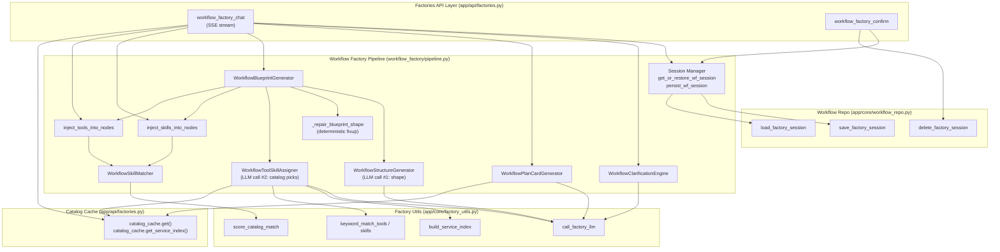
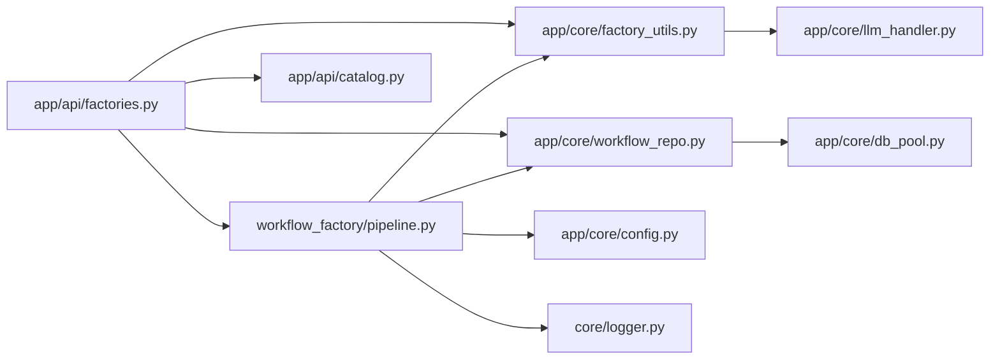
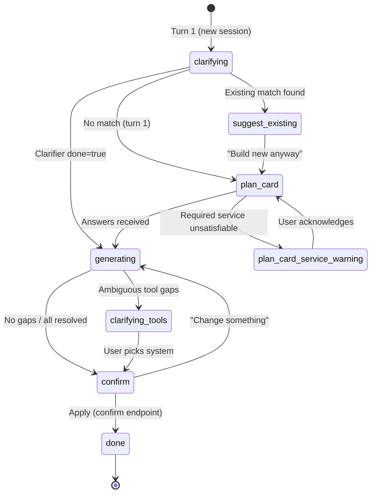
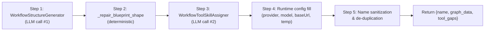
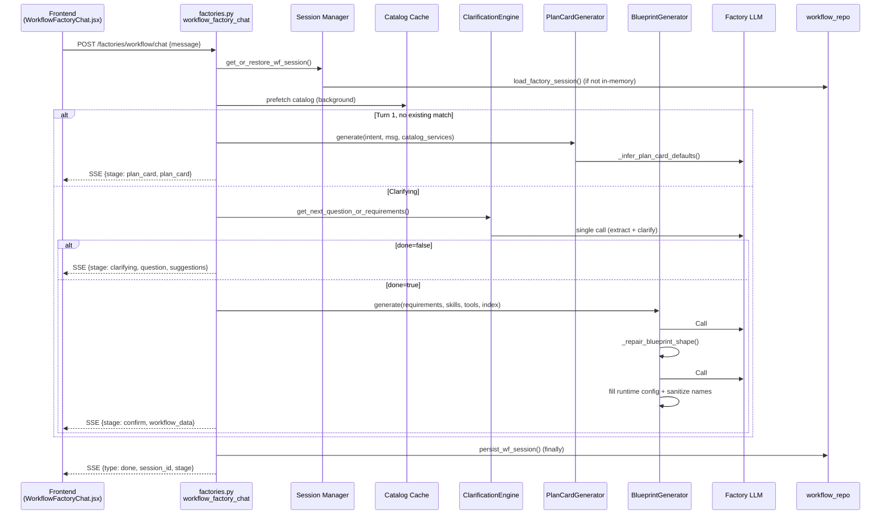

# Workflow Factory Pipeline

> Conversational, catalog-aware generation of multi-agent workflow graphs with skill and tool injection.

## Introduction

The **Workflow Factory Pipeline** (`ABStudio/backend/workflow_factory/pipeline.py`) is the backend engine that turns a natural-language conversation into a deployable, multi-agent workflow graph. It is the workflow counterpart to the [Agent Factory Pipeline](../agents/agent_factory_pipeline.md) and the [Skill Factory Pipeline](../skills/skill_factory_pipeline.md), and is invoked by the **Factories API** layer (`app/api/factories.py`) over a Server-Sent Events (SSE) stream.

Unlike the simpler one-shot `generate_workflow` endpoint in the [Generation API](../api/api_generation.md) (a single LLM call that emits raw JSON), the Workflow Factory runs a **multi-turn, multi-stage pipeline**:

1. **Clarification** — a conversational engine decides whether the user's request is detailed enough to build from, or asks targeted follow-up questions.
2. **Plan Card** — a structured pre-generation questionnaire (Q1–Q6) whose external-systems options are derived live from the tool catalog.
3. **Blueprint generation** — a two-agent LLM pipeline: a *Structure Generator* designs the graph shape and per-agent instructions, then a *Tool/Skill Assigner* picks real catalog entries for each agent.
4. **Deterministic repair & injection** — Python-side fixups coerce LLM output into the canonical React Flow shape, and catalog matchers resolve skill/tool names.
5. **Confirm** — the assembled workflow is handed back to the frontend for the user to apply (or request changes).

The pipeline is **catalog-driven**: it never invents tool or skill names. Every tool/skill attached to an agent is validated against the live catalog, and gaps (agents that need a tool but couldn't be matched unambiguously) are surfaced as runnability warnings or a single consolidated clarifying question.

---

## Architecture Overview

### Module Dependencies

The pipeline deliberately keeps its import surface narrow. The only cross-module runtime imports are:

- **`app.core.factory_utils`** — the shared LLM gateway wrapper (`call_factory_llm`), catalog scoring/matching primitives (`score_catalog_match`, `keyword_match_tools`, `build_service_index`, `agent_needs_tool`, `resolve_services_for_agent`, `_action_families`), and JSON extraction helpers. This is the same toolkit used by the [Agent Factory Pipeline](../agents/agent_factory_pipeline.md), ensuring consistent matching logic across all three factories.
- **`app.core.workflow_repo`** — Postgres-backed session persistence (`load_factory_session`, `save_factory_session`, `delete_factory_session`).
- **`app.core.config`** — runtime model/base-URL resolution (`openai_compatible_base_url`, `factory_agent_model`).
- **`core.logger`** — structured logging.

The catalog (skills + tools) is **not** imported directly. The API layer owns a `catalog_cache` (60-second TTL) and passes the resolved lists into the pipeline as arguments, keeping the pipeline testable and decoupled from the catalog data source.

---

## Core Components

### Session Management

The factory is stateful across SSE turns. A `WorkflowFactorySession` dataclass tracks the conversation stage, message history, extracted requirements, the generated workflow data, and any pending tool-clarification state.

**Key functions:**

| Function | Purpose |
|---|---|
| `get_or_create_wf_session` | In-memory cache lookup/creation with LRU eviction (`_MAX_WF_SESSIONS`, default 200). |
| `get_or_restore_wf_session` | Tries in-memory first, then falls back to Postgres `load_factory_session`. Best-effort — restore failures never break the live turn. |
| `persist_wf_session` | Write-through to Postgres via `save_factory_session`. Called in the `finally` block of every chat turn so an interrupted conversation survives a backend restart. |
| `serialize_wf_session` / `hydrate_wf_session` | Dataclass ↔ dict conversion for persistence. `hydrate` filters unknown keys for forward-compatibility. |

The session type constant `WF_FACTORY_TYPE = "workflow"` namespaces the persisted session from the agent and skill factory sessions in the same `factory_sessions` table.

### Name & Model Normalization

Before any generated name reaches the platform's validation layer, the pipeline sanitizes it to match the frontend's `validateEntityName` regex (`^[A-Za-z][A-Za-z0-9 _.\-&/,'():]{0,99}$`):

- **`sanitize_entity_name`** — strips disallowed characters (emoji, stray punctuation), ensures the name starts with a letter (prefixes a fallback otherwise), truncates to 100 chars. This prevents the `invalid_name` 400 that would otherwise fire on Apply.
- **`dedupe_names`** — case-insensitive de-duplication with `" 2"`, `" 3"` suffixes, mirroring `suggestFreeName` in the frontend. Prevents two agents both named "Reviewer" from colliding.
- **`normalize_model_pref`** — maps loose user model strings ("use opus", "gpt 4o") to canonical IDs via `_MODEL_ALIASES` and `_KNOWN_MODEL_IDS`. Falls through to `None` (→ factory default) when unrecognized. This is the model the **generated agents** run on, distinct from `FACTORY_MODEL` which runs the factory itself.

### WorkflowPlanCardGenerator

A structured pre-generation questionnaire presented on turn 1 (when no existing-workflow match is found). It replaces the conversational clarifier for users who prefer a quick form over a chat.

- **Q1–Q5** are static: trigger type, failure policy, approval gate, step count, context sharing.
- **Q6** (`external_systems`) is **catalog-driven**: its option list is the live service names from `catalog_cache.get_service_index()`, so the chips never drift from the real tool catalog. It is multi-select and allows free-text for services not yet in the catalog.
- **`_infer_plan_card_defaults`** — a single fast LLM call (256 max tokens) that picks the best default option per non-multi-select question, constrained to the static option lists. Hallucinated values are dropped by callers. Never raises — returns `{}` on failure so seeded first-option defaults survive.

### WorkflowClarificationEngine

Decides whether the user's message is detailed enough to skip clarification and go straight to blueprint generation.

- **`_is_detailed_enough`** — a conservative local heuristic: requires ≥ 60 words AND ≥ 4 step-indicator keywords (pipeline, process, classify, extract, etc.). Deliberately high thresholds so the factory asks at least one clarifying question in the common case.
- **`get_next_question_or_requirements`** — a single LLM call that doubles as both requirement extraction and clarification. When `force_done` is set (either by the heuristic on a detailed first message, or after `MAX_TURNS = 4`), the prompt instructs the model to commit immediately, eliminating one full round-trip.
- The prompt enforces a structured requirements schema: `name`, `purpose`, `agent_roles` (list of `{role, job}`), `data_in`, `data_out`, and four boolean capability flags (`needs_human_review`, `needs_knowledge_base`, `needs_iteration`, `needs_branching`) plus `preferred_model`. These flags drive the advanced-pattern instructions in the structure generator.
- **`_fallback_requirements`** — a deterministic last-resort that extracts a name and purpose from the raw message text when the LLM call fails entirely.

### WorkflowStructureGenerator (LLM Call #1)

Designs the **graph shape only** — nodes, edges, positions, and per-agent system-prompt instructions. It deliberately does **not** see the tools/skills catalog, keeping the prompt small and dramatically improving JSON-shape compliance.

The system prompt (`_STRUCTURE_SYSTEM_PROMPT`, built once at import) encodes:

- **Node schema**: exactly 1 start, 1–4 agents, optional condition/loop, exactly 1 end — all with `id`, `type`, `position`, `data`.
- **Agent instructions template**: a mandatory seven-section markdown structure (Role / Objective / Process / Do's / Don'ts / Output / Escalation). This is called out as "the single biggest driver of quality."
- **Advanced patterns**: condition (branching), parallel (fan-out/fan-in via multiple outgoing edges), loop (with `body`/`exit` sourceHandles and a back-edge), HITL (`hitlMode: "after_response"` / `"before_tool"`), and knowledge base / RAG (`knowledge: {mode: "existing_kb", namespaces: []}`).
- **Layout rules**: agents at `y=300`, `x` incrementing by 300; parallel branches at `y=150/300/450`.

The generator uses `asyncio.wait_for` with a configurable timeout (`WORKFLOW_FACTORY_BLUEPRINT_TIMEOUT`, default 300s) and retries once on `JSONDecodeError`. It explicitly avoids the assistant-prefill `{"` trick because it causes the NPCI gateway to return "Error generating response" for large prompts.

### _repair_blueprint_shape

A **deterministic Python fixup** that coerces loose LLM output into the canonical `{name, nodes, edges}` shape without an LLM round-trip. It handles:

- Unwrapping `{"graph": {...}}` wrappers.
- Inferring node types from IDs when missing (`"start"` → `start`, `"cond"` → `condition`, etc.).
- Promoting loose `{id, label}` nodes to the full `{id, type, position, data}` shape.
- Filling missing positions deterministically (start at `x=100`, agents at `x=400+i*300`, end past the last agent).
- Repairing edges (ensuring unique IDs, default style, default type, preserving `sourceHandle`).
- **Synthesizing a missing end node**: if the LLM omits it, the repair creates one and wires every terminal agent (any agent with no outgoing edge) into it. A missing start node is a hard error (can't determine flow origin); a missing end is trivially recoverable.

### WorkflowToolSkillAssigner (LLM Call #2)

Given the repaired skeleton and the **full unrestricted catalog**, assigns tools and skills to each agent node by exact name.

**Design principles:**

- Sends the **entire** tool catalog (no service pre-filter, no count cap) — the old `[:60]` cap hid tools the model could have picked. The prompt stays lean by listing **names only** (grouped by service), since names are descriptive slugs (`jira-get-issue`, `gitlab-create-mr`).
- Output shape is intentionally tiny: `{"assignments": [{"agent_id": ..., "tools": [...], "skills": [...]}]}` — just a per-agent mapping, so the model focuses on selection rather than reproducing the graph.
- **Strict name validation**: every tool/skill string must be copied character-for-character from the catalog. Invented names are dropped. The `_extract_names` helper handles the several dict shapes the LLM emits despite instructions (`{"name": ...}`, `{"tool": ...}`, `{"skill": ...}`).

**Gap resolution (`_resolve_gaps`):**

After the LLM returns its picks, a per-agent confidence-gated pass fills gaps:

1. **Skill backfill** — `keyword_match_skills` attaches skills by keyword (report/excel/pdf) regardless of LLM picks. Skills are additive and low-risk.
2. **Action-family correction** (`_correct_action_mismatch`) — if the LLM picked only write tools (add/update/delete) for a clearly read-only agent ("Fetcher"), the picks are re-derived from the correct service using `keyword_match_tools` with action-family awareness.
3. **Unambiguous gap fill** — when exactly one catalog service fits an agent's role, that service's best-fit tools are attached silently.
4. **Ambiguous gaps** (2+ services fit) — left empty and recorded under `__gaps__.ambiguous` so the caller can ask one consolidated question.
5. **Missing gaps** (0 services fit, capability absent) — left empty and recorded under `__gaps__.missing` so the caller can warn about runnability.

The assigner does **not** union workflow-level `required_services` (from Plan Card Q6) onto every agent — that previously produced garbage (a Report Generator getting Jira + GitLab tools). Declared services are a workflow-level signal, not a per-agent instruction.

### WorkflowBlueprintGenerator (Public Entrypoint)

Orchestrates the full generation sequence:

**Step 4 (runtime config)** fills each agent node with:
- `provider: "custom"`, `apiKey: ""`, `modelName` (user preference → factory default), `temperature: 0.3`, `maxTokens: 4096`, `topP: 0.9`, `baseUrl` (resolved via `openai_compatible_base_url()` so SIT/`LLM_PROXY_URL` environments get the correct proxy URL baked in).

**Step 5** sanitizes every agent name and the workflow name, then de-duplicates agent names.

The returned `tool_gaps` dict (`{ambiguous: [...], missing: [...]}`) is non-graph metadata used by the confirm step to warn about agents that can't run yet — it is not persisted with the workflow.

### WorkflowSkillMatcher & Injectors

- **`WorkflowSkillMatcher`** — delegates to the shared `score_catalog_match` (exact → substring → word-overlap) and `semantic_catalog_match` (LLM fallback). Used by both skill and tool injectors.
- **`inject_skills_into_nodes`** — resolves each agent's `skills[]` against the catalog. Only attaches skills that already exist; unmatched names are dropped (the agent's `instructions` field carries the real behavior). Supports a `yield_progress` callback for SSE streaming.
- **`inject_tools_into_nodes`** — resolves each agent's `tools[]` against the tools catalog. Tools are **never** auto-generated (real integrations require credentials, auth flows, and tested SDK code). Unmatched names are dropped and logged.

---

## Data Flow

### Stage Transitions in the API Layer

The `workflow_factory_chat` endpoint in `factories.py` drives the stage machine. Key transitions handled in the API (not the pipeline):

| From Stage | Trigger | Action |
|---|---|---|
| `clarifying` (turn 1) | Existing-workflow match found | → `suggest_existing` (recommend reuse) |
| `clarifying` (turn 1) | No match | → `plan_card` (structured questionnaire) |
| `plan_card` | Answers parsed | Merge into requirements, validate required services → `generating` |
| `plan_card` | Free-text "change something" | → `clarifying` (conversational) |
| `generating` | Ambiguous tool gaps | → `clarifying_tools` (one consolidated question) |
| `clarifying_tools` | User picks system | `_apply_tool_choices` (deterministic, no LLM) → `confirm` |
| `confirm` | "Change something" | Append to `additional_notes` → `generating` (regenerate) |
| `confirm` | Apply (via `workflow_factory_confirm`) | → `done`, delete persisted session |

The `clarifying_tools` stage is notable: when the assigner left agents with an ambiguous tool choice (2+ real services fit), the pipeline pauses to ask **one** consolidated plain-language question. The user's answer is applied **deterministically** (no LLM) via `_apply_tool_choices`, which matches the answer against the candidate services and attaches that service's best-fit tools. This is why the ambiguous question costs no extra generation call.

---

## Integration Points

### With the Factories API

The pipeline is invoked exclusively by `app/api/factories.py`:

- **`workflow_factory_chat`** — the SSE streaming endpoint. Imports pipeline components lazily inside the handler. Owns the `catalog_cache`, the stage machine, and the SSE framing (`_sse` helper). Calls `persist_wf_session` in a `finally` block on every turn.
- **`workflow_factory_confirm`** — the apply endpoint. Restores the session, optionally applies a `graph_data_override` (the frontend's edited per-node picks), sets stage to `done`, and deletes the persisted draft session. Returns `{name, graph_data: {nodes, edges}}`.

### With the Catalog

The pipeline receives the catalog as arguments — it never imports the catalog data source. The API layer's `catalog_cache` (defined in `factories.py`, backed by `app/api/catalog.py`) provides:

- `catalog_cache.get()` → `(catalog_skills, catalog_tools)` with a 60-second TTL.
- `catalog_cache.get_service_index()` → the `build_service_index` output, cached on the same TTL.

Auto-injected runtime tools (e.g. `code_executor`) are filtered out by the API before passing to the pipeline, so the LLM doesn't waste an assignment slot on something every agent already gets.

### With Session Persistence

Sessions are mirrored to the `factory_sessions` Postgres table via `app/core/workflow_repo.py` (`save_factory_session` / `load_factory_session` / `delete_factory_session`), namespaced by `WF_FACTORY_TYPE = "workflow"`. Persistence is best-effort: failures are logged at debug level and never break the live chat turn. On confirm, the draft session is deleted.

### With the Native Engine

The generated `graph_data` (`{nodes, edges}`) conforms to the React Flow shape consumed by the [Native Engine](../agents/engine_native_engine.md) at execution time. The pipeline's runtime config fill (`provider`, `modelName`, `baseUrl`, `temperature`, etc.) ensures each agent node is immediately runnable without further configuration. Advanced patterns (conditions, loops, HITL, RAG) are encoded as node `data` fields that the engine interprets at runtime.

### With the Generation API

The [Generation API](../api/api_generation.md) (`generate_workflow`) is a **separate, simpler** one-shot endpoint that does a single LLM call with no clarification, no catalog awareness, and no tool/skill assignment. The Workflow Factory Pipeline supersedes it for conversational builds but `generate_workflow` remains for programmatic / API-driven workflow creation.

---

## Configuration

| Environment Variable | Default | Purpose |
|---|---|---|
| `WORKFLOW_FACTORY_BLUEPRINT_TIMEOUT` | `300` | Max seconds for each LLM call (structure + assignment). |
| `WORKFLOW_FACTORY_MAX_SESSIONS` | `200` | In-memory session cache size before LRU eviction. |
| `FACTORY_LLM_TIMING` | `1` | Log per-call wall-clock timing (`0` to silence). |
| `FACTORY_LLM_FORCE_STREAM` | `0` | Force streaming endpoint for factory LLM calls (`1` to revert from non-streaming). |
| `LLM_PROXY_URL` | — | When set, `openai_compatible_base_url()` resolves to `${LLM_PROXY_URL}/v1` for the generated agents' `baseUrl`. |

---

## Key Design Decisions

1. **Two-agent separation (structure vs. assignment)** — keeping the structure generator catalog-free produces far better JSON-shape compliance than a single mega-prompt. The assigner then operates on a clean skeleton.

2. **Catalog-only tool/skill attachment** — tools are never auto-generated (credentials, auth, tested SDK code). Skills are never auto-generated either (catalog-only mode). Unmatched names are dropped; the agent's `instructions` field carries the real behavior.

3. **Deterministic repair over LLM retry** — `_repair_blueprint_shape` fixes common shape drift (missing types, positions, end nodes, edge IDs) in Python, avoiding expensive and unreliable LLM re-generation.

4. **Action-family awareness** — the assigner and gap resolver use `_action_families` to ensure a read-only agent ("Fetcher") gets read tools (`get_issue`) rather than write tools (`add_comment`), fixing a class of mismatch bugs.

5. **Consolidated ambiguity resolution** — rather than guessing when 2+ services fit an agent, the pipeline pauses to ask one question, then applies the answer deterministically. This avoids both wrong guesses and per-agent LLM calls.

6. **Name sanitization at generation time** — every generated name is sanitized to pass the frontend's `validateEntityName` before it ever reaches the platform, eliminating `invalid_name` 400s on Apply.
