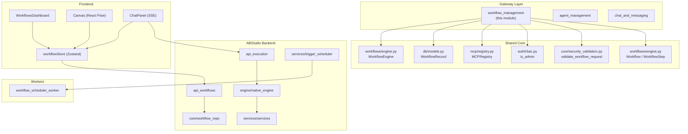
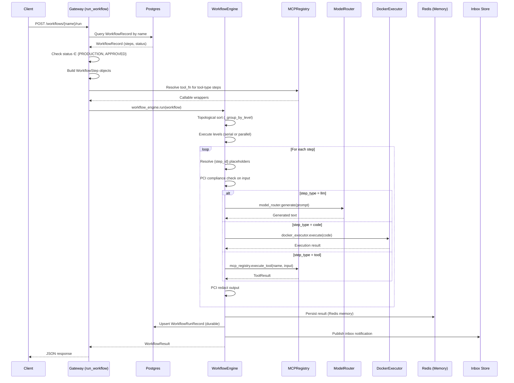
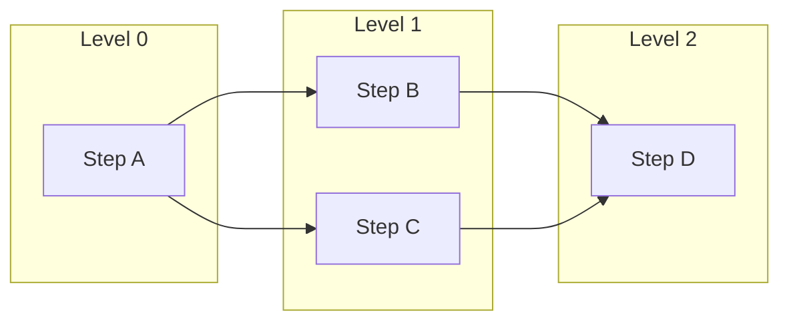
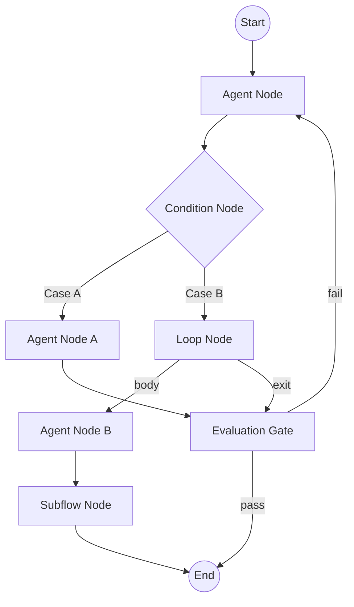
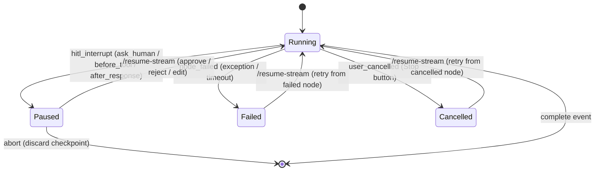
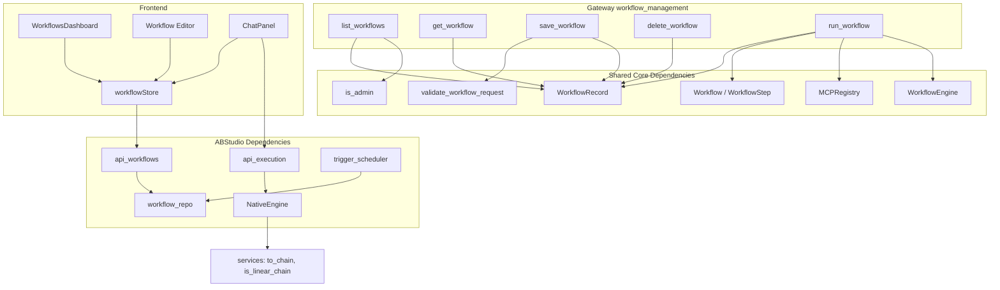
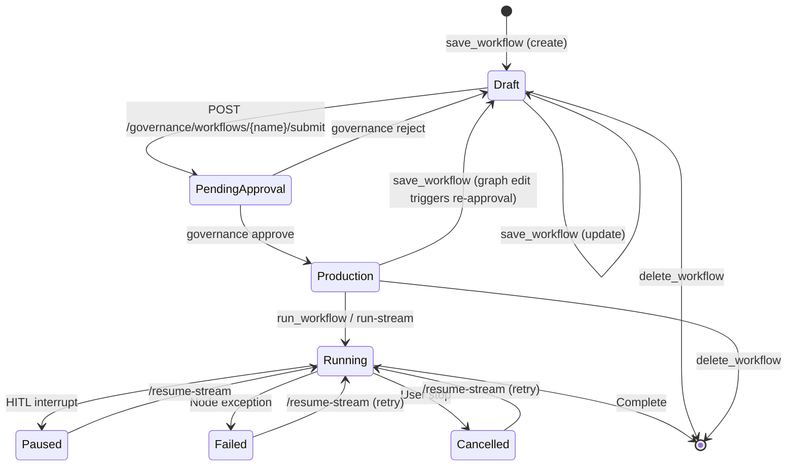
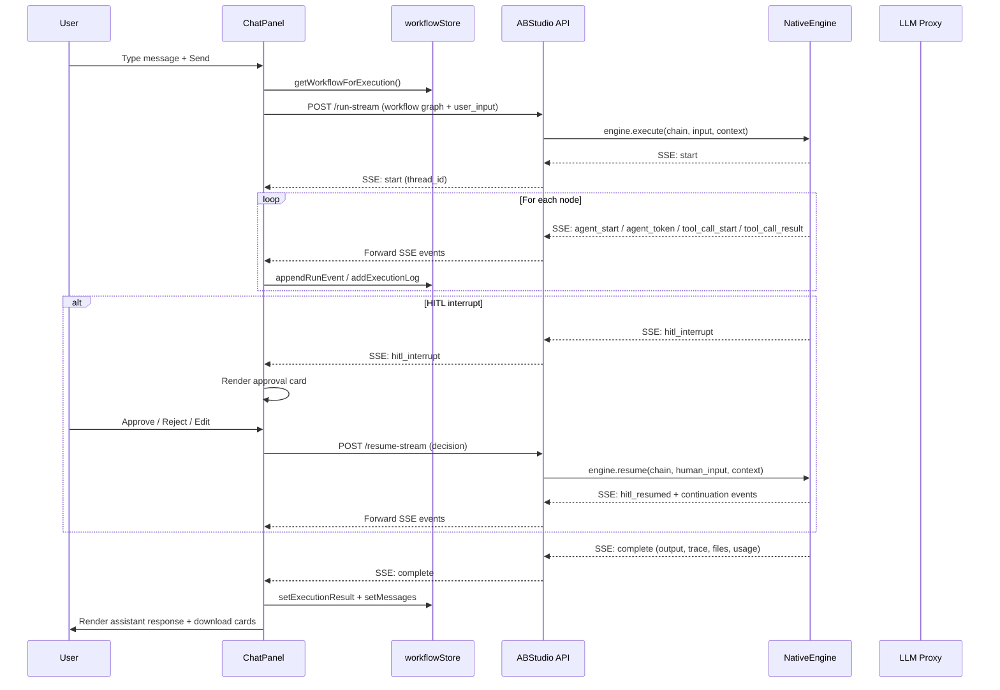
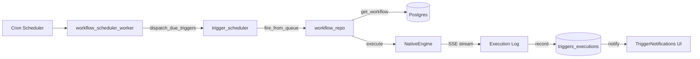

# Workflow Management Module

## Introduction

The **Workflow Management** module is a sub-module of the [Gateway](../models/gateway.md) that provides the REST API surface for creating, retrieving, updating, deleting, and executing multi-step agent workflows. It serves as the primary entry point for the platform's workflow builder (ABStudio) and the legacy gateway workflow store, bridging user-facing workflow definitions with the underlying execution engine, governance lifecycle, and tool/skill registries.

The module exposes seven core components:

| Component | Type | Purpose |
|---|---|---|
| `WorkflowBody` | Pydantic Model | Request schema for workflow create/update |
| `WorkflowStepBody` | Pydantic Model | Request schema for individual workflow steps |
| `list_workflows` | Endpoint | List workflows with RBAC-based visibility filtering |
| `get_workflow` | Endpoint | Retrieve a single workflow by name |
| `save_workflow` | Endpoint | Create or update a workflow definition |
| `delete_workflow` | Endpoint | Remove a workflow and its associated resources |
| `run_workflow` | Endpoint | Execute a workflow through the `WorkflowEngine` |

---

## Architecture Overview



### Two Workflow Paradigms

The platform supports two distinct workflow paradigms that share the `workflow_management` gateway endpoints but diverge in storage and execution:

1. **Gateway Workflow Store (Legacy)** — Workflows are stored as `WorkflowRecord` rows in Postgres (`workflows_pg` table) with a flat list of `WorkflowStep` objects. Execution is handled by the shared-core `WorkflowEngine`, which performs topological sorting, parallel level execution, HITL approval gates, and conditional branching. This is the paradigm directly served by the `list_workflows`, `save_workflow`, `get_workflow`, `delete_workflow`, and `run_workflow` endpoints in this module.

2. **ABStudio Graph Workflows (Modern)** — Workflows are stored as graph blobs (`graphData` with React Flow nodes/edges) in a separate `workflows` table managed by `ABStudio/backend/app/core/workflow_repo.py`. Execution is handled by the `NativeEngine`, which traverses a DAG of typed nodes (agent, condition, loop, subflow, evaluation_gate, etc.) with SSE streaming, HITL interrupts, compliance gates, and swarm delegation. The ABStudio API routes (`api_workflows`, `api_execution`) serve this paradigm.

Both paradigms are documented here because the gateway `workflow_management` module is the canonical reference for the legacy store, while the ABStudio routes represent the evolution of the same concepts.

---

## Core Components

### Request Models

#### `WorkflowStepBody`

```python
class WorkflowStepBody(BaseModel):
    id:         str
    name:       str
    step_type:  str              # llm | code | shell | tool
    input:      str = ""
    depends_on: List[str] = []
```

Represents a single unit of work inside a gateway workflow. The `step_type` field determines how the `WorkflowEngine` dispatches the step:

| `step_type` | Dispatch | Description |
|---|---|---|
| `llm` | `ModelRouter.generate()` | Generates text via the best available LLM with retry + backoff |
| `code` | `DockerExecutor` / `SelfHealingEngine` | Executes Python in an isolated sandbox with optional self-healing |
| `shell` | `DockerExecutor` (bash) | Executes shell commands in Docker |
| `tool` | `MCPRegistry.execute_tool()` | Invokes a registered MCP tool by name |

The `depends_on` list establishes DAG edges — steps can reference prior outputs via `{step_id}` placeholder templating.

#### `WorkflowBody`

```python
class WorkflowBody(BaseModel):
    name:            str
    description:     str = ""
    stop_on_failure: bool = True
    steps:           List[WorkflowStepBody] = []
    visibility:      str = "private"    # public | private
    department:      str = ""
```

The top-level request schema for `save_workflow`. The `visibility` and `department` fields control RBAC-based access: public workflows are visible to all users when in `PRODUCTION` status; private workflows are visible only to the creator or users in the same department.

---

### Endpoints

#### `list_workflows`

```python
def list_workflows(_u: dict = Depends(_require_auth)):
```

Lists all workflows visible to the authenticated user. Applies RBAC filtering:

- **Admins** see all workflows.
- **Non-admins** see workflows they created, public `PRODUCTION` workflows, or private workflows in their department.

Returns a `{"workflows": [...]}` payload where each workflow is serialized by the `_wf_row_to_dict` helper.

#### `get_workflow`

```python
def get_workflow(name: str):
```

Retrieves a single workflow by its unique name. Returns 404 if not found. No authentication dependency is declared on this endpoint (the gateway mounts it behind a global auth middleware).

#### `save_workflow`

```python
def save_workflow(body: WorkflowBody, _u: dict = Depends(_require_auth)):
```

Creates or updates a workflow. The flow:

1. **Validation** — Delegates to `validate_workflow_request(body)` from `core/security_validation.py` for input sanitization.
2. **Upsert** — Queries for an existing `WorkflowRecord` by name. If found, updates description, steps, and visibility. If not, creates a new record with `status="DRAFT"` and `is_production=False`.
3. **Department inheritance** — When updating, the department is only changed if the current user is the original creator.

New workflows always start in `DRAFT` status — they must go through the governance approval flow before they can be executed.

#### `delete_workflow`

```python
def delete_workflow(name: str):
```

Deletes a workflow by name. Returns 404 if not found, 500 on database errors.

#### `run_workflow`

```python
def run_workflow(name: str):
```

Executes a workflow by name through the `WorkflowEngine`. The flow:

1. **Status check** — Only `PRODUCTION` or `APPROVED` workflows can run. `DRAFT` workflows are rejected with a 403 and a pointer to the governance submission endpoint.
2. **Step resolution** — Converts stored `WorkflowStepBody` records into `WorkflowStep` objects. For `tool`-type steps, resolves the tool callable from the `MCPRegistry` at runtime.
3. **Execution** — Constructs a `Workflow` object and calls `workflow_engine.run(wf)`.
4. **Result** — Returns the `WorkflowResult` as a dict via `asdict()`.

---

## Data Flow: Workflow Execution



---

## WorkflowEngine Deep Dive

The `WorkflowEngine` (from `shared_core/workflows/engine.py`) is the execution heart of the gateway workflow system. Key capabilities:

### DAG Execution



Steps are grouped into topological levels using Kahn's algorithm. Steps within the same level have no interdependencies and execute in parallel via `ThreadPoolExecutor`. The `stop_on_failure` flag controls whether a failed step halts the entire workflow.

### HITL Approval Gates

When a step with `step_type="approval"` is reached, the engine:

1. **Persists state** — Serializes completed steps to Redis (fast path) and Postgres (durable fallback).
2. **Publishes notification** — Sends an inbox item via `publish_inbox_item()` with type `workflow_approval`.
3. **Returns paused result** — Returns a `WorkflowResult` with `paused=True` and `approval_step_id`.
4. **Resume** — `engine.resume(workflow_id, workflow, approved, feedback)` restores state, injects approval feedback as a virtual step output, and continues from after the approval gate.

### Conditional Branching

Steps can declare `branch_on: Dict[str, str]` mapping keywords to target step IDs. When the step output contains a matching keyword (case-insensitive), execution jumps to the target step and all other direct successors are marked `SKIPPED`.

### PCI/PII Compliance

Every step input is validated through `compliance_engine.validate_input()` — blocking inputs containing PAN, CVV, or secrets. Step outputs are redacted (not blocked) via `compliance_engine.validate_output()`.

### Memory Persistence

- **Redis** (transient) — `RedisMemory.save_workflow_run()` stores truncated step outputs for fast retrieval.
- **Postgres** (durable) — `WorkflowRunRecord` rows track run status (`running`, `paused`, `completed`, `failed`) and serialized state snapshots for crash recovery.

---

## ABStudio Graph Workflows

The modern ABStudio backend extends workflow management with a visual graph editor and a more powerful execution engine. See [agent_factory_pipeline](../agents/agent_factory_pipeline.md) for the agent assembly pipeline and [api_execution](../api/api_execution.md) for the streaming execution API.

### Graph Structure



### Node Types

| Node Type | Engine Handler | Description |
|---|---|---|
| `start` | Passthrough | Entry point; routes to first successor |
| `agent` | `_run_agent()` | ReAct tool-calling loop with LLM streaming |
| `condition` | `_route_condition()` | Evaluates case expressions against upstream output |
| `loop` | `_run_loop()` | Iterates body subgraph (for_each / while / count modes) |
| `evaluation_gate` | `_route_evaluation_gate()` | LLM judge scores artifact; routes pass/fail |
| `subflow` | `_run_subflow()` | Dispatches into a saved agent or workflow |
| `end` | Terminal | Stops traversal |

### NativeEngine Execution Flow

The `NativeEngine` (from `ABStudio/backend/app/engine/native_engine.py`) is a pure-Python orchestration engine that:

1. **Parses the graph** — Converts React Flow nodes/edges into a `ChainDefinition` with adjacency maps.
2. **Detects parallel structure** — Identifies fan-out/fan-in nodes for parallel branch execution.
3. **Traverses the DAG** — Walks from Start to End, dispatching each node by type.
4. **Streams SSE events** — Emits `agent_start`, `agent_token`, `agent_complete`, `tool_call_start`, `tool_call_result`, `condition_routed`, `loop_iteration_start`, `hitl_interrupt`, `complete`, and `error` events.
5. **Supports HITL interrupts** — Pauses on `ask_human`, `before_tool`, and `after_response` gates; persists snapshots for resume.
6. **Handles failure recovery** — On node failure or user cancellation, persists a `node_failed`/`user_cancelled` snapshot so the run can be resumed from the exact failure point.

### HITL (Human-in-the-Loop) Flow



### Compliance & Injection Gates

The `NativeEngine` enforces security at multiple checkpoints:

- **Compliance-in** — Validates node input before it reaches the LLM; blocks PAN/CVV/secrets.
- **Compliance-out** — Redacts PII from agent output before it flows downstream.
- **Injection scan** — Scans tool results and agent outputs for prompt-injection attempts; blocks when policy is set to `block`.

---

## Component Interaction Diagram



---

## Dependencies

### Internal Gateway Dependencies

| Component | Dependency | Purpose |
|---|---|---|
| All endpoints | `_require_auth` | JWT authentication dependency |
| `list_workflows` | `auth/rbac.py::is_admin` | RBAC visibility filtering |
| `save_workflow` | `core/security_validation.py::validate_workflow_request` | Input sanitization |
| `run_workflow` | `workflows/engine.py::workflow_engine` | Workflow execution |
| `run_workflow` | `workflows/engine.py::Workflow`, `WorkflowStep` | Step construction |
| `run_workflow` | `mcp/registry.py::mcp_registry` | Tool resolution for `tool`-type steps |
| All endpoints | `db/models.py::WorkflowRecord` | Postgres persistence |

### Cross-Module References

| Module | Relationship |
|---|---|
| [agent_management](../agents/agent_management.md) | Shares the gateway auth layer; agents can be invoked as workflow steps |
| [chat_and_messaging](../chat/chat_and_messaging.md) | Workflow run results feed into chat history |
| [shared_core](../reference/shared_core.md) → `workflow_system` | Provides `WorkflowEngine`, `Workflow`, `WorkflowStep` |
| [shared_core](../reference/shared_core.md) → `database` | Provides `WorkflowRecord`, `WorkflowRunRecord` ORM models |
| [shared_core](../reference/shared_core.md) → `mcp_system` | Provides `MCPRegistry` for tool resolution |
| [shared_core](../reference/shared_core.md) → `authentication` | Provides `is_admin` for RBAC checks |
| [abstudio_backend](../ui/abstudio_backend.md) → `api_workflows` | Modern CRUD API for graph workflows |
| [abstudio_backend](../ui/abstudio_backend.md) → `api_execution` | Streaming execution + HITL resume endpoints |
| [abstudio_backend](../ui/abstudio_backend.md) → `core_workflow_repo` | Postgres persistence for graph workflows |
| [abstudio_backend](../ui/abstudio_backend.md) → `engine_native_engine` | DAG traversal engine with SSE streaming |
| [abstudio_backend](../ui/abstudio_backend.md) → `services_trigger_scheduler` | Scheduled workflow trigger dispatch |
| [workers](../workers/workers.md) → `infrastructure_maintenance_workers` | `workflow_scheduler_worker` dispatches due triggers |
| [shared_api_routers](../api/shared_api_routers.md) → `jobs_router` | Durable workflow job submission/resume |
| [shared_api_routers](../api/shared_api_routers.md) → `webhooks_router` | Webhook-triggered workflow execution |

---

## Process Flow: Workflow Lifecycle



---

## Frontend Integration

The ABStudio frontend provides a visual workflow builder and execution chat panel:

### Workflow Editor (`workflow_editor`)

- **Canvas** (`Canvas.jsx`) — React Flow-based drag-and-drop canvas with auto-layout (Dagre), undo/redo (zundo), and connection validation.
- **ConfigPanel** (`ConfigPanel.jsx`) — Per-node configuration (agent instructions, model picker, tools, skills, KB, HITL mode, loop config).
- **ChatPanel** (`ChatPanel.jsx`) — SSE streaming chat with live agent timeline, HITL approval cards, failure retry banners, debug log view, and file download cards.
- **Sidebar** (`Sidebar.jsx`) — Node palette for drag-and-drop (Start, Agent, Condition, Loop, Subflow, Evaluation Gate, End).
- **DebugLogView** (`DebugLogView.jsx`) — Unified timeline of all SSE events with JSON inspection, per-node token estimates, and KB retrieval details.

### State Management (`workflowStore.js`)

The Zustand store manages:
- Graph state (nodes, edges) with temporal undo/redo
- Chat state (messages, streaming content, HITL requests, failure snapshots)
- Execution state (isExecuting, execution logs, run context)
- Run settings (subagents enabled toggle)
- Cycle detection (`hasIllegalCycle`) and connected subgraph pruning (`pruneToConnectedSubgraph`)

### Execution Flow (Frontend → Backend)



---

## Trigger-Based Execution

Workflows can be executed automatically via the trigger system:



The `workflow_scheduler_worker` (`workers/workflow_scheduler_worker.py`) polls for due triggers, dispatches them via `trigger_scheduler.fire_from_queue()`, which loads the workflow graph and executes it through the `NativeEngine`. Results are recorded in the `triggers_executions` table and surfaced in the frontend's `TriggerNotifications` component.

See [api_triggers](../api/api_triggers.md) for the trigger CRUD API and [services_trigger_scheduler](../workers/services_trigger_scheduler.md) for the scheduler internals.

---

## Security & Governance

### Input Validation

The `save_workflow` endpoint delegates to `validate_workflow_request()` from `core/security_validation.py`, which sanitizes workflow names, descriptions, and step inputs to prevent injection attacks.

### RBAC

- **Workflow visibility** — Public workflows are visible to all authenticated users when in `PRODUCTION` status. Private workflows are restricted to the creator or same-department users.
- **Tool access** — The `MCPRegistry.execute_tool()` method enforces governance: user-registered tools not in `PRODUCTION` state are blocked with a governance error.
- **Execution gating** — Only `PRODUCTION` or `APPROVED` workflows can be executed. Draft workflows must be submitted through the governance approval flow.

### Compliance

- **PCI/PII blocking** — The `WorkflowEngine` validates every step input through `compliance_engine.validate_input()` and redacts outputs via `compliance_engine.validate_output()`.
- **Injection scanning** — The `NativeEngine` scans tool results and agent outputs for prompt-injection attempts, blocking them when policy is set to `block`.

See [api_governance](../api/api_governance.md) and [core_governance](../sdlc/core_governance.md) for the governance submission and approval lifecycle.

---

## Key Design Decisions

1. **Dual paradigm coexistence** — The gateway workflow store (flat step list + `WorkflowEngine`) and the ABStudio graph workflows (React Flow DAG + `NativeEngine`) coexist because the gateway store serves legacy integrations while ABStudio represents the platform's future direction.

2. **Durable state persistence** — Both engines persist run state to Postgres (`WorkflowRunRecord` for the gateway engine; `pending_interrupts` + `run_steps` for the NativeEngine) so runs survive process restarts and can be resumed after crashes.

3. **HITL as first-class** — Both engines treat human-in-the-loop as a core feature, not an afterthought. The gateway engine uses approval-step types; the NativeEngine uses configurable HITL modes (`ask_human`, `before_tool`, `after_response`, `both`) per agent node.

4. **SSE streaming** — The NativeEngine streams all execution events via Server-Sent Events, enabling real-time UI updates (token streaming, tool call progress, condition routing, loop iterations, subagent delegation).

5. **Swarm delegation** — The NativeEngine integrates with the [swarm](../agents/swarm.md) module via the `WorkflowSwarmTool`, allowing agent nodes to dynamically decompose tasks into parallel sub-agent swarms with live status streaming.
