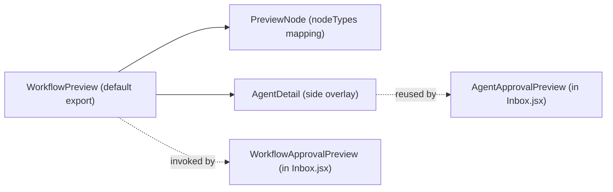
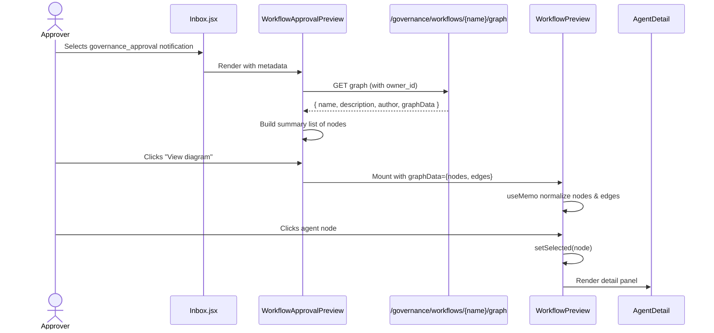
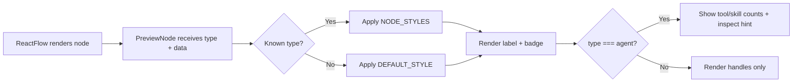

# Workflow Preview Module

## Introduction

The `workflow_preview` module provides a **read-only, self-contained workflow diagram renderer** used inside the AI-UI Inbox approval panel. It allows approvers to visually inspect a submitted workflow graph—its nodes, edges, and agent configuration—before approving or rejecting a governance request.

Unlike the interactive [workflow_editor](../workflows/workflow_editor.md) in ABStudio's Build Studio, this module is intentionally lightweight and decoupled from editing stores. It uses [React Flow](https://reactflow.dev/) purely for presentation, rendering a submitted workflow's `graphData` without drag, connect, or edit capabilities.

---

## Purpose and Core Functionality

### What it does

- Renders a submitted workflow graph as a static React Flow canvas.
- Displays node types with distinct styling: `start`, `end`, `agent`, `condition`, `subflow`, `loop`, and `evaluation_gate`.
- Normalizes edges for consistent visual rendering regardless of how Build Studio persisted them.
- Lets approvers click an `agent` node to inspect its system prompt, attached tools, and attached skills in a side panel.
- Exposes `AgentDetail` as a reusable component for both the diagram overlay and inline summary lists.

### What it does NOT do

- It does not edit workflows. All nodes are draggable=false, connectable=false, and selectable=false.
- It does not reuse ABStudio Build Studio node components. Those components depend on Zustand stores and application-specific CSS that do not exist in `ai-ui`.
- It does not fetch workflow data. The parent component (`WorkflowApprovalPreview` in [Inbox](../chat/inbox.md)) loads the graph via the governance API and passes it down as props.

### Core Components

| Component | File | Responsibility |
|-----------|------|----------------|
| `WorkflowPreview` | `ai-ui/src/components/WorkflowPreview.jsx` | Main React Flow canvas. Accepts `graphData`, renders nodes/edges, and manages the selected-agent overlay. |
| `PreviewNode` | `ai-ui/src/components/WorkflowPreview.jsx` | Presentational node component. Chooses badge, color, and handle placement based on `type`. |
| `AgentDetail` | `ai-ui/src/components/WorkflowPreview.jsx` | Reusable detail panel showing system prompt, tools, and skills for an agent node. |

---

## Architecture

### High-level placement

```mermaid
flowchart TB
    subgraph ai_ui["ai-ui frontend"]
        A[Inbox Approval Panel<br/>see inbox.md]
        B[WorkflowApprovalPreview]
        C[WorkflowPreview]
        D[AgentDetail]
        E[PreviewNode]
    end

    subgraph backend["ABStudio / Gateway backend"]
        F[governance_router<br/>GET /governance/workflows/{name}/graph]
        G[workflow_repo / workflow models]
    end

    A -->|selects governance_approval notification| B
    B -->|fetches graphData| F
    F --> G
    B -->|graphData={nodes, edges}| C
    C --> E
    C -->|selected agent| D
    D -->|also used inline by| B
```

### Component hierarchy



### Node type styling

```mermaid
flowchart LR
    subgraph types["NODE_STYLES map"]
        start["start — green"]
        end["end — red"]
        agent["agent — violet"]
        condition["condition — amber"]
        subflow["subflow — blue"]
        loop["loop — cyan"]
        eval["evaluation_gate — pink"]
    end
    PreviewNode --> types
```

---

## Component Relationships

### `WorkflowPreview`

- **Props:** `graphData` object with `nodes` and `edges` arrays.
- **State:** `selected` — the currently clicked agent node.
- **Responsibilities:**
  - Memoizes and validates `nodes` and `edges`.
  - Normalizes edges by stripping `sourceHandle`/`targetHandle` and adding a visible arrowhead marker.
  - Configures React Flow in read-only mode (`nodesDraggable={false}`, `nodesConnectable={false}`, `elementsSelectable={false}`).
  - Handles `onNodeClick` to open the `AgentDetail` overlay for agent nodes only.

### `PreviewNode`

- **Props:** `data` (node data), `type` (node type string).
- **Responsibilities:**
  - Looks up styling from `NODE_STYLES` or falls back to `DEFAULT_STYLE`.
  - Renders a top target handle for all nodes except `start`.
  - Renders a bottom source handle for all nodes except `end`.
  - For `agent` nodes, shows tool/skill counts and a "click to inspect" hint.

### `AgentDetail`

- **Props:** `data` object containing `instructions`/`systemPrompt`, `tools`, and `skills`.
- **Responsibilities:**
  - Renders the system prompt in a scrollable `<pre>` block.
  - Lists attached tools with names and descriptions.
  - Renders attached skills as chips.
  - Handles missing values gracefully with italic placeholders.

---

## Data Flow

### Loading a workflow preview



### Edge normalization

Build Studio may persist edges with custom `sourceHandle`/`targetHandle` IDs. `WorkflowPreview` strips these because its simple nodes expose only a single default handle per side. It also adds:

- `type: "smoothstep"`
- `style: { stroke: "#94a3b8", strokeWidth: 1.5 }`
- `markerEnd: ArrowClosed`

This guarantees the preview renders cleanly even when the original graph was authored with complex handle IDs.

---

## How It Fits into the Overall System

The `workflow_preview` module is a **presentation-layer utility** inside the broader governance approval experience:

1. A user submits a workflow for approval (via [governance](../sdlc/governance.md) or [api_governance](../api/api_governance.md)).
2. The approver opens the [Inbox](../chat/inbox.md), which lists pending governance notifications.
3. For notifications where `type === "governance_approval"` and `entity_type === "workflows"`, `Inbox` renders `WorkflowApprovalPreview`.
4. `WorkflowApprovalPreview` fetches the workflow graph from the backend and shows a textual summary plus an expandable diagram.
5. `WorkflowPreview` renders that diagram read-only, letting the approver inspect agent configuration before taking action.

It complements, but does not depend on, the full [workflow_editor](../workflows/workflow_editor.md) used in ABStudio's Build Studio. Where the editor is interactive and store-driven, `WorkflowPreview` is stateless and prop-driven.

---

## Process Flows

### Approver inspects a submitted workflow

```mermaid
flowchart TD
    A[Approver opens Inbox] --> B{Notification type?}
    B -->|governance_approval + workflows| C[Render WorkflowApprovalPreview]
    B -->|governance_approval + agents| D[Render AgentApprovalPreview]
    B -->|governance_approval + skills| E[Render SkillApprovalPreview]
    C --> F[Fetch /governance/workflows/{name}/graph]
    F --> G[Show node summary list]
    G --> H{Click View diagram?}
    H -->|Yes| I[Mount WorkflowPreview]
    I --> J{Click agent node?}
    J -->|Yes| K[Show AgentDetail overlay]
    J -->|No| I
    H -->|No| G
```

### Rendering a node



---

## Dependencies

### Runtime dependencies

- `@xyflow/react` — React Flow library for the canvas, background, controls, handles, and marker types.
- `lucide-react` — `X` icon for closing the agent detail overlay.
- React `useMemo` and `useState` for performance and local UI state.

### Related modules

| Module | Relationship |
|--------|--------------|
| [inbox](../chat/inbox.md) | Hosts `WorkflowApprovalPreview` and `AgentApprovalPreview`, which consume `WorkflowPreview` and `AgentDetail`. |
| [workflow_editor](../workflows/workflow_editor.md) | The interactive editor that authors the workflows being previewed. `WorkflowPreview` deliberately avoids reusing its node components. |
| [workflow_editor_nodes](../workflows/workflow_editor_nodes.md) | Defines interactive node types in Build Studio; `WorkflowPreview` mirrors a subset of these types in read-only form. |
| [api_governance](../api/api_governance.md) / [governance](../sdlc/governance.md) | Backend governance APIs that persist and serve workflow graphs. |
| [app_models](../core/app_models.md) | Backend Pydantic models for `Workflow`, `AgentNode`, `ConditionNode`, `Edge`, etc. |

---

## Notes for Maintainers

- **No store coupling:** `WorkflowPreview` reads only from props. Keep it that way so it remains portable between `ai-ui` and any future approval surface.
- **Handle IDs:** Do not re-introduce `sourceHandle`/`targetHandle` from `graphData` without also updating `PreviewNode` to expose matching handles.
- **Node type additions:** To support a new node type, add an entry to `NODE_STYLES` and ensure the backend includes the type in `graphData.nodes[].type`.
- **AgentDetail reuse:** `AgentDetail` is exported so it can be rendered inline (e.g., in `AgentApprovalPreview`) as well as inside the diagram overlay. Keep its prop interface flat and defensive against missing fields.
- **Styling:** All styles are inline or Tailwind utility classes. There is no dependency on ABStudio's `[data-ac]` CSS namespace.
