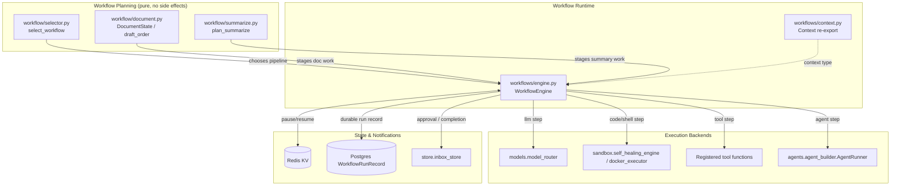
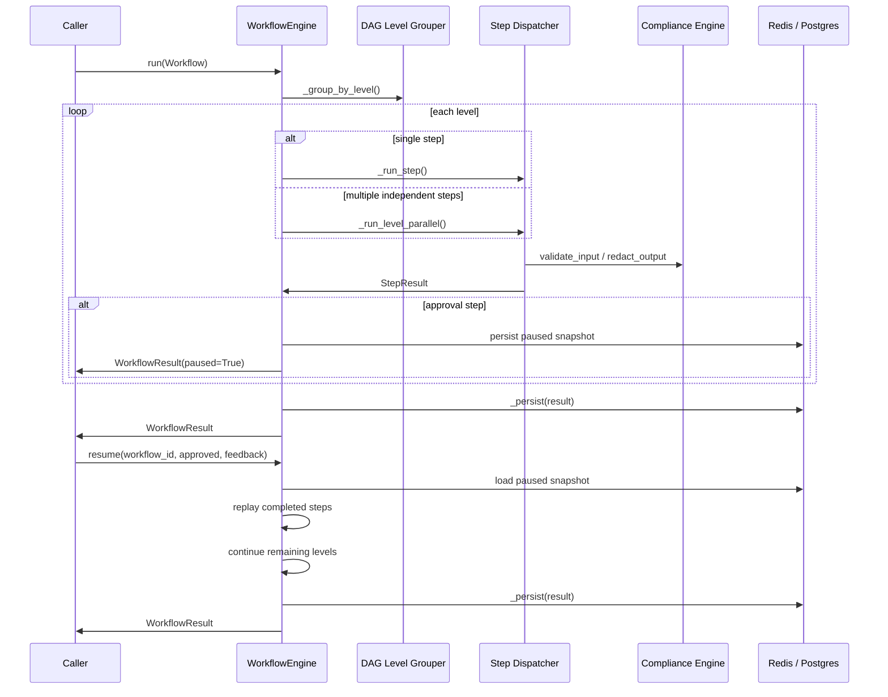

# Workflow System

## Overview

The `workflow_system` module provides the orchestration layer for executing multi-step, DAG-based agent workflows within the platform. It bridges high-level conversation intent (produced by the CIL/intent layer) with concrete execution primitives such as LLM calls, code execution, tool calls, agent delegation, human-in-the-loop (HITL) approvals, and conditional branching.

The module is intentionally split into two conceptual areas:

- **Workflow execution** (`workflows/`) — the runtime engine that schedules, runs, persists, and resumes workflows.
- **Workflow planning/selection** (`workflow/`) — pure, testable planners that decide *which* specialized pipeline to run and how to stage work such as document generation or summarization.

This separation keeps the runtime decoupled from policy decisions, making the planners easy to unit-test and the engine reusable across many front-end features (chat, agents, SDLC, document generation, etc.).

## Purpose

1. **Execute directed acyclic graphs of steps** with support for parallel independent steps, dependency-aware ordering, and per-step timeouts.
2. **Dispatch steps to diverse backends**: LLM generation via `models.model_router`, sandboxed code/shell execution, registered Python tools, and sub-agent runs.
3. **Support human-in-the-loop approval gates** that pause a workflow, persist state to Redis and Postgres, publish an inbox notification, and resume on operator decision.
4. **Enforce PCI/PII guardrails** on step inputs and outputs via the shared `compliance_engine`.
5. **Provide pure planners** for selecting the right pipeline for a turn (`workflow/selector.py`) and for staging document generation (`workflow/document.py`) and summarization (`workflow/summarize.py`).

## Architecture

### Data Flow

## Sub-modules

| Sub-module | File | Responsibility | Documentation |
|------------|------|----------------|---------------|
| Workflow Engine | `workflows/engine.py` | DAG execution, step dispatch, HITL pause/resume, PCI checks, persistence | [workflow_system_engine](../workflow_system_engine.md) |
| Document Pipeline | `workflow/document.py` | Staged document generation planner with shared `DocumentState` and anti-drift figures | [workflow_system_document_pipeline](../workflow_system_document_pipeline.md) |
| Workflow Selector | `workflow/selector.py` | Pure intent-to-pipeline selection (`qa`, `document`, `sdlc`, `summarize`, etc.) | [workflow_system_selector](../workflow_system_selector.md) |
| Summarize Pipeline | `workflow/summarize.py` | Segment → map → reduce → format planner for summarization | [workflow_system_summarize](../workflow_system_summarize.md) |

### Context Re-export (`workflows/context.py`)

`workflows/context.py` is a small compatibility shim. The installed `workflows` site-package provides a `Context` class used by downstream code (e.g., `llama_index.core.workflow.context`), while the project also owns a local `workflows` package containing `engine.py`. The shim temporarily removes the local package from `sys.modules`, imports the real `Context` from site-packages, then restores the local package so that `from workflows.context import Context` and `from workflows.engine import workflow_engine` can coexist. It does not contain business logic and is therefore documented here rather than in a separate file.

## Integration with the Rest of the System

- **Model routing**: LLM steps are dispatched through `models.model_router` (see [model_routing](../models/model_routing.md)).
- **Sandboxing**: Code and shell steps run through `sandbox.self_healing_engine` and `sandbox.docker_executor` (see [sandbox](../storage/sandbox.md)).
- **Agents**: `agent` steps delegate to `agents.agent_builder.AgentRunner` (see [agent_system](../agents/agent_system.md)).
- **Compliance**: Every step input is validated and every output is redacted by `agents.compliance_engine` (see [agent_system](../agents/agent_system.md) / compliance engine).
- **Memory & state**: Redis (`memory.redis_memory`, `core.kv`) provides fast transient state; Postgres (`db.models.WorkflowRunRecord`) provides durable run records (see [database](../storage/database.md), [memory_system](../reference/memory_system.md)).
- **Notifications**: Approval gates and workflow completion/failure publish inbox items via `store.inbox_store` (see [store_layer](../storage/store_layer.md)).
- **Intent / CIL**: The selector is designed to consume a duck-typed `ConversationState` produced by the CIL layer; see [cil](../reference/cil.md) and [pipeline](../reference/pipeline.md) for intent detection and dispatch shaping.

## Key Design Decisions

1. **Pure planners, impure engine** — `workflow/selector.py`, `workflow/document.py`, and `workflow/summarize.py` have no side effects and can be tested offline. `workflows/engine.py` owns all I/O and execution.
2. **DAG levels, not a flat topological sort** — Steps are grouped into levels so independent steps can run in parallel via `ThreadPoolExecutor`.
3. **Dual persistence for HITL** — Paused workflows are stored in Redis for speed and in Postgres for durability across Redis restarts.
4. **Fail-safe defaults** — Planners never raise; on any error they degrade to the simplest safe plan (e.g., single-segment summary, QA workflow).
5. **PCI by default** — Step inputs are blocked on compliance violations; outputs are redacted rather than blocked so the workflow can continue.
