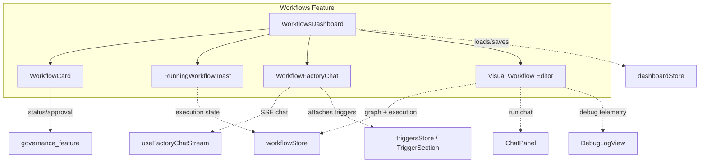
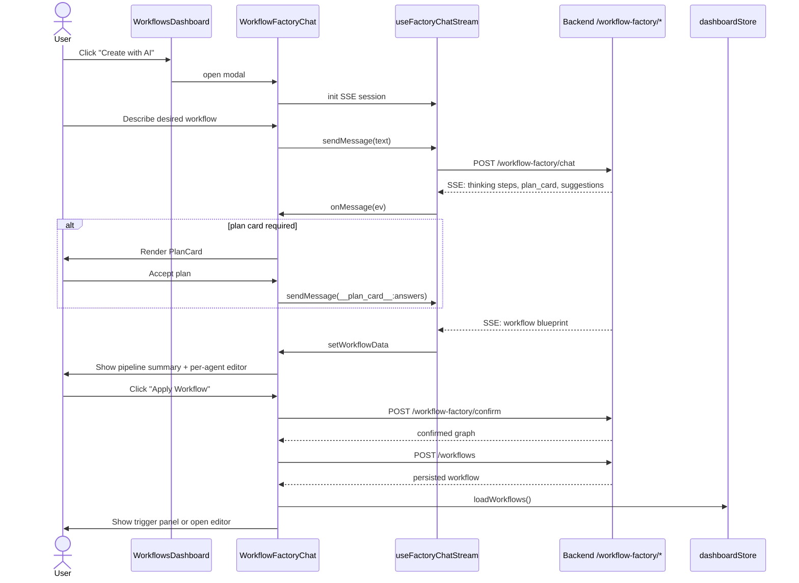
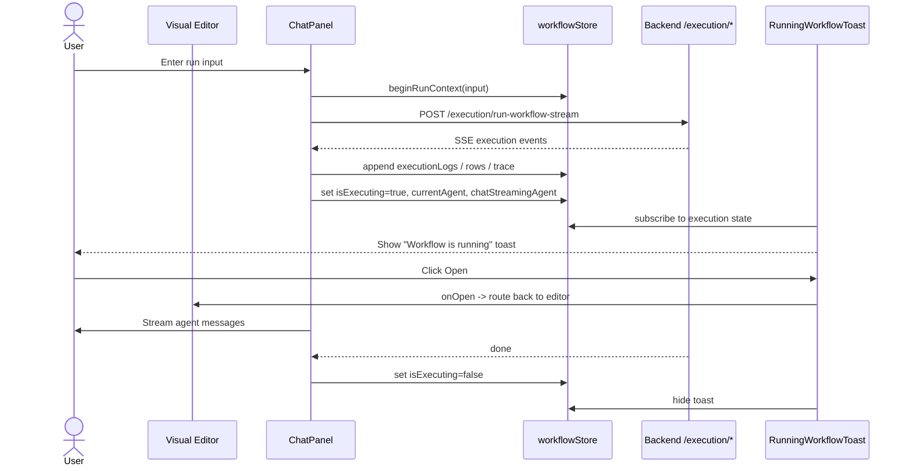

# Workflows Feature

The **Workflows Feature** is the front-end surface for building, discovering, running, and governing AI agent pipelines in ABStudio. It lets users compose multi-agent workflows from a visual node editor, generate new workflows through a conversational AI factory, manage a personal library of workflows, and browse pre-built templates.

## Purpose

- Provide a visual, node-based editor for agent pipelines (start → agent → condition → loop → sub-flow → end).
- Enable natural-language workflow generation via the **Workflow Factory** chat.
- Surface workflow status, governance approvals, and execution telemetry in one place.
- Allow users to schedule, duplicate, delete, and talk to workflows from the dashboard.
- Keep long-running workflow executions visible even when the user navigates away from the editor.

## Architecture Overview

The feature is implemented under `ABStudio/frontend/src/features/workflows/` and is split into three high-level areas:

1. **Dashboard & Listing** – `WorkflowsDashboard`, `WorkflowCard`, `RunningWorkflowToast`.
2. **AI Factory Chat** – `WorkflowFactoryChat`.
3. **Visual Workflow Editor** – `editor/` sub-tree (canvas, nodes, edges, conditions, chat panel, config panel, debug log, sidebar, pickers).

Shared infrastructure is provided by:

- [`workflowStore`](../storage/store.md) – Zustand store holding the current workflow graph, execution state, run telemetry, and chat thread state.
- [`dashboardStore`](../storage/store.md) – loads, creates, duplicates, and deletes workflows/templates.
- [`useFactoryChatStream`](../reference/shared_features.md) – reusable Server-Sent Events (SSE) hook that powers the factory chat experience.
- [`FactoryChatShell`](../reference/shared_features.md) – generic modal chat UI used by both agent and workflow factories.
- [`triggersStore`](../storage/store.md) / [`TriggerModal`](../reference/triggers_feature.md) / [`TriggerSection`](../reference/triggers_feature.md) – scheduling and webhook triggers attached to workflows.
- [`StatusBadge`](../sdlc/governance_feature.md) / [`SubmitApprovalButton`](../sdlc/governance_feature.md) – governance status and approval submission.

## High-Level Functionality

### 1. Dashboard & Listing

The dashboard is the entry point for the Workflow Builder. It is split into a sidebar showing the user’s saved workflows and a main area showing workflow templates.

Responsibilities:

- Load workflows and templates from the backend via `dashboardStore`.
- Search, sort, and filter workflows and templates.
- Create a blank workflow with a default start → agent → end graph.
- Open the **Workflow Factory** chat to generate a workflow from a description.
- Duplicate, delete, schedule, and open workflows.
- Preview templates (chat-only preview) and, when template admin is enabled, create/edit templates.

Key components:

- `WorkflowsDashboard` – orchestrates the layout, data loading, filtering, and modals.
- `WorkflowCard` – renders a workflow or template card with status, governance badge, node stats, and actions.
- `RunningWorkflowToast` – a portal toast that stays visible while a workflow is executing, letting the user return to the editor preview.

See [Workflows Dashboard & Listing](workflows_feature_dashboard.md) for details.

### 2. AI Factory Chat

`WorkflowFactoryChat` is a conversational assistant that turns a plain-language request into a persisted workflow graph. It reuses the shared factory chat infrastructure.

Responsibilities:

- Stream messages and progress steps from `/workflow-factory/chat`.
- Present **plan cards** to collect required parameters before generation.
- Surface service warnings when requested external systems have no catalog tools.
- Recommend existing workflows/templates when they match the request.
- Render a generated pipeline summary and let the user edit per-agent tools/skills.
- Confirm the blueprint via `/workflow-factory/confirm`, persist it via `POST /workflows`, and optionally attach a trigger.

See [Workflow Factory Chat](../chat/workflows_feature_factory_chat.md) for details.

### 3. Visual Workflow Editor

The editor is a React Flow–based canvas where users build and run workflows. It is the most complex sub-system and is broken into focused sub-modules.

Responsibilities:

- Render and edit a directed graph of workflow nodes (`start`, `agent`, `condition`, `loop`, `evaluation gate`, `subflow`, `end`).
- Provide a chat panel to run the workflow and stream agent responses.
- Show a configuration panel for the selected node.
- Display a debug log view with execution traces, node rows, and generated files.
- Support conditional branching, loop bodies, sub-flow selection, and run settings.

Editor sub-modules:

- [Canvas](../ui/workflows_feature_editor_canvas.md) – the React Flow canvas, drag-and-drop, minimap, and layout helpers.
- [Chat Panel](../chat/workflows_feature_editor_chat_panel.md) – run input, streaming output, message rendering, file downloads, and run control.
- [Config Panel](../workflows_feature_editor_config_panel.md) – node configuration, generated instruction acceptance, and deletion.
- [Debug Log View](../workflows_feature_editor_debug_log.md) – execution timeline, status pills, generated files, and JSON inspection.
- [Nodes](../workflows_feature_editor_nodes.md) – visual node components (agent, condition, loop, start, end, evaluation gate, subflow).
- [Edges](../workflows_feature_editor_edges.md) – custom edge rendering and deletion.
- [Conditions](../workflows_feature_editor_conditions.md) – condition builder, cases, and loop-while editors.
- [Sidebar](../workflows_feature_editor_sidebar.md) – node palette and tool/skill catalog.
- [Run Settings Strip](../workflows_feature_editor_run_settings.md) – run-time parameters and overrides.
- [Subflow Picker](../workflows_feature_editor_subflow_picker.md) – selecting another workflow as a sub-flow node.
- [Loop Items Picker](../workflows_feature_editor_loop_picker.md) – configuring loop iteration sources.

## Data Flow

### Creating a Workflow via the Factory

### Running a Workflow from the Editor

## State & Stores

- [`workflowStore`](../storage/store.md) owns the in-editor state:
  - `workflowId`, `workflowName`, `graph` (nodes/edges)
  - `isExecuting`, `currentAgent`, `chatStreamingAgent`
  - `executionLogs`, run context (`rows`, `executionTrace`, `runHistory`)
  - helpers for node/edge IDs, cycle detection, default node data, and pruning to connected subgraphs.
- [`dashboardStore`](../storage/store.md) owns the list views:
  - `workflows`, `templates`, loading/error states
  - CRUD actions: `createWorkflow`, `deleteWorkflow`, `duplicateWorkflow`, `loadWorkflows`, `loadTemplates`.

## Dependencies

| Dependency | Module | Role |
|------------|--------|------|
| `workflowStore` | [store](../storage/store.md) | Current workflow graph and execution telemetry |
| `dashboardStore` | [store](../storage/store.md) | Workflow/template library |
| `useFactoryChatStream`, `FactoryChatShell` | [shared_features](../reference/shared_features.md) | Reusable factory chat engine and UI shell |
| `FactoryFileChips`, `DownloadNotice`, `sniffGeneratedFiles` | [shared_features](../reference/shared_features.md) | Generated file download UX |
| `InlinePicker`, `PlanCard`, `ConfirmModal`, `HoverTooltip`, `TemplatesEmptyState` | [common_components](../ui/common_components.md) | Generic UI primitives |
| `StatusBadge`, `SubmitApprovalButton` | [governance_feature](../sdlc/governance_feature.md) | Governance status and approval |
| `TriggerModal`, `TriggerSection` | [triggers_feature](../reference/triggers_feature.md) | Scheduling/webhook triggers |
| `TemplateCardMenu`, `TemplateCreateModal` | [templates_feature](../reference/templates_feature.md) | Template admin UI |
| `useTriggerPortalContainer` | [triggers_feature](../reference/triggers_feature.md) | Shared portal container for toasts/modals |
| `formatDate`, `stripTemplateTag` | [utils](../reference/utils.md) | Formatting helpers |
| `API_BASE`, `buildAuthHeaders` | [config](../infrastructure/config.md) | Backend API configuration |

## Related Backend Modules

The front-end workflows feature talks to several backend modules:

- [`api_workflows`](../api/api_workflows.md) – CRUD for workflows.
- [`api_execution`](../api/api_execution.md) – synchronous and streaming workflow execution.
- [`api_factories`](../api/api_factories.md) – workflow factory chat/confirm endpoints.
- [`api_templates`](../api/api_templates.md) – template listing and usage.
- [`api_triggers`](../api/api_triggers.md) – trigger CRUD and execution history.
- [`api_governance`](../api/api_governance.md) – governance status and approval submission.

## Notes for Maintainers

- The factory chat intentionally does **not** close on backdrop click; users must use the ✕ button or Escape to avoid discarding an in-progress build.
- `RunningWorkflowToast` subscribes only to the last log entry (not the full array) to avoid re-rendering on every SSE token.
- Workflow templates are now previewed in a chat-only mode first; cloning into an editable workflow happens only when the user explicitly chooses to edit.
- Template admin capabilities are gated by a backend flag; when disabled, the create/edit template UI is not rendered.
