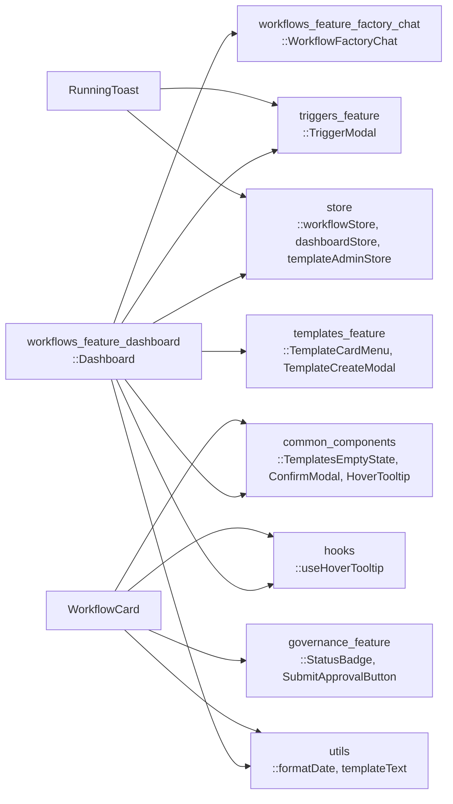
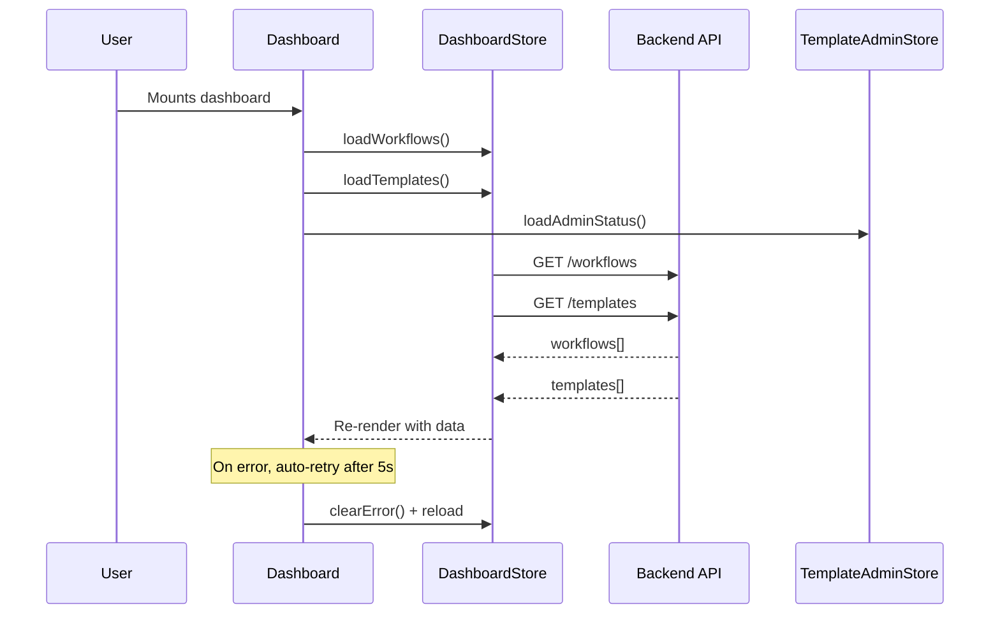
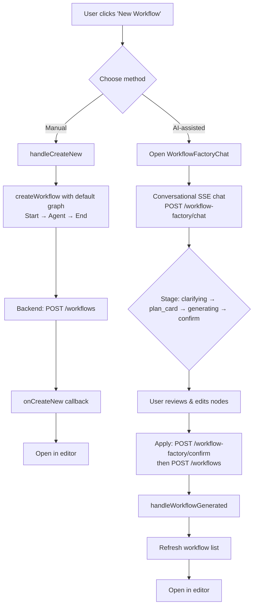
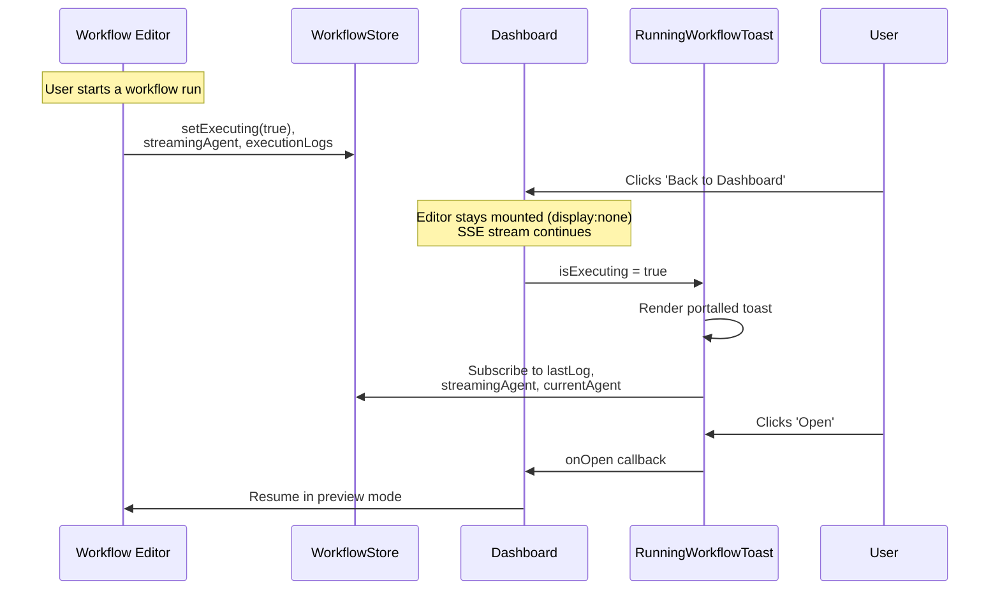
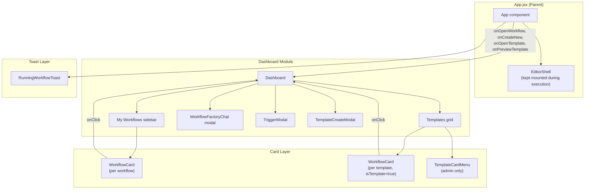
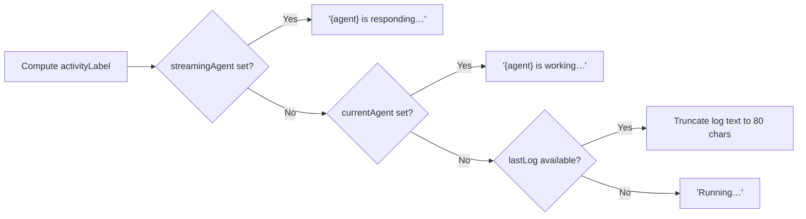
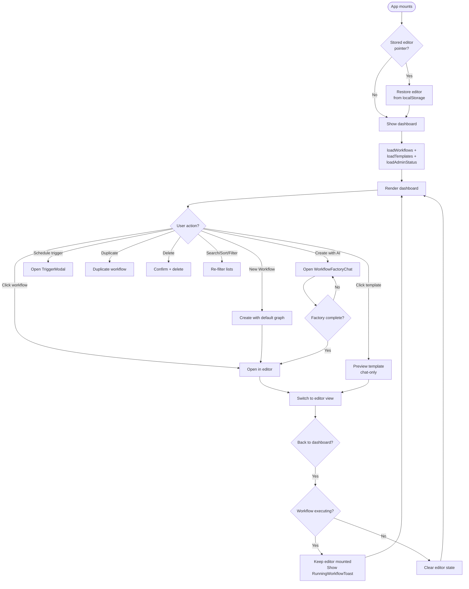
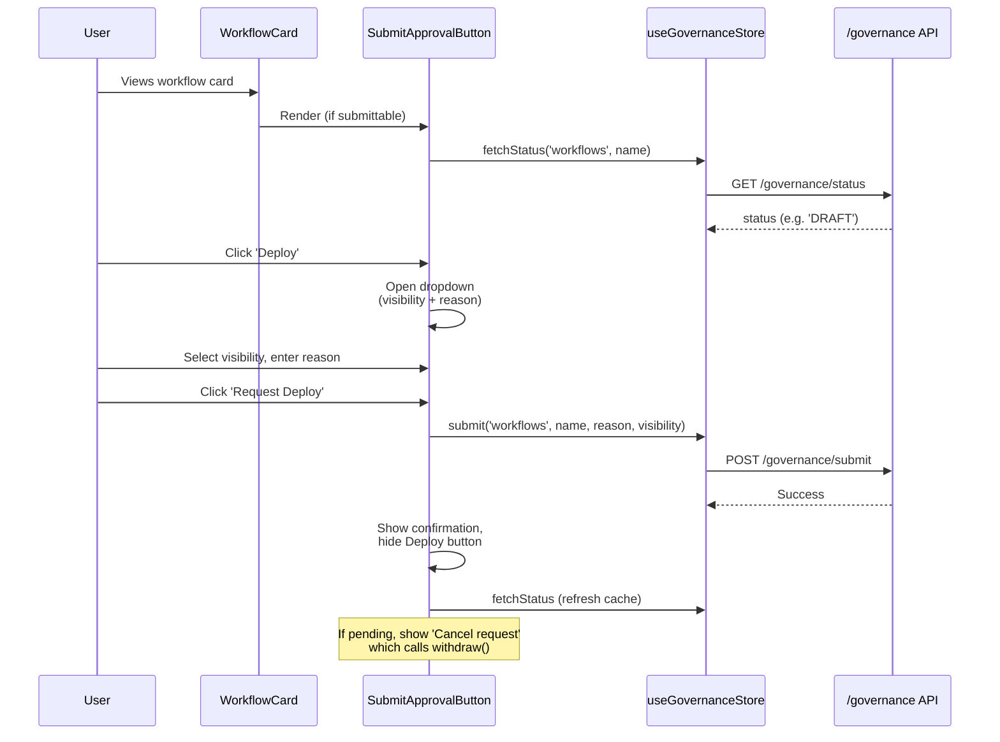

# Workflows Feature Dashboard

## Introduction

The **Workflows Feature Dashboard** is the primary landing surface for the ABStudio workflow builder. It provides users with a unified view of their saved workflows and reusable workflow templates, along with entry points for creating new workflows from scratch or via the AI-powered Workflow Factory. The dashboard also surfaces governance approval status, trigger scheduling, and a persistent toast that tracks in-flight workflow executions even when the user navigates away from the editor.

This module is part of the broader [Workflows Feature](workflows_feature.md) family and sits at the top of the workflow user-experience hierarchy — it is the first screen users see when they enter the "Workflows" section of the application (see [App Core](../reference/app_core.md)).

---

## Architecture Overview

```mermaid
graph TB
    subgraph "Workflows Feature Dashboard"
        Dashboard["Dashboard<br/>(WorkflowsDashboard.jsx)"]
        WorkflowCard["WorkflowCard<br/>(WorkflowCard.jsx)"]
        RunningToast["RunningWorkflowToast<br/>(RunningWorkflowToast.jsx)"]
    end

    subgraph "State Stores"
        DashboardStore["useDashboardStore<br/>workflows + templates CRUD"]
        WorkflowStore["useWorkflowStore<br/>execution state, SSE streaming"]
        TemplateAdminStore["useTemplateAdminStore<br/>template-edit feature flag"]
        GovernanceStore["useGovernanceStore<br/>approval status cache"]
    end

    subgraph "Child Components"
        FactoryChat["WorkflowFactoryChat<br/>AI workflow generation"]
        TriggerModal["TriggerModal<br/>schedule triggers"]
        TemplateCardMenu["TemplateCardMenu<br/>admin template actions"]
        TemplateCreateModal["TemplateCreateModal<br/>create new template"]
        TemplatesEmptyState["TemplatesEmptyState<br/>empty-state UI"]
        StatusBadge["StatusBadge<br/>governance pill"]
        SubmitApprovalButton["SubmitApprovalButton<br/>deploy request"]
        ConfirmModal["ConfirmModal<br/>delete confirmation"]
        HoverTooltip["HoverTooltip<br/>card description tooltip"]
    end

    subgraph "Backend APIs"
        WorkflowsAPI["/workflows<br/>CRUD + duplicate"]
        TemplatesAPI["/templates<br/>list + use"]
        FactoryAPI["/workflow-factory/chat<br/>/workflow-factory/confirm"]
        GovernanceAPI["/governance<br/>submit + status"]
        TriggersAPI["/triggers<br/>create + list"]
    end

    Dashboard --> DashboardStore
    Dashboard --> WorkflowStore
    Dashboard --> TemplateAdminStore
    Dashboard --> FactoryChat
    Dashboard --> TriggerModal
    Dashboard --> TemplateCreateModal
    Dashboard --> TemplatesEmptyState
    Dashboard --> WorkflowCard
    Dashboard --> RunningToast

    WorkflowCard --> GovernanceStore
    WorkflowCard --> StatusBadge
    WorkflowCard --> SubmitApprovalButton
    WorkflowCard --> ConfirmModal
    WorkflowCard --> HoverTooltip

    RunningToast --> WorkflowStore

    DashboardStore --> WorkflowsAPI
    DashboardStore --> TemplatesAPI
    FactoryChat --> FactoryAPI
    GovernanceStore --> GovernanceAPI
    TriggerModal --> TriggersAPI
```



### Component Roles

| Component | File | Responsibility |
|-----------|------|----------------|
| **Dashboard** | `WorkflowsDashboard.jsx` | Top-level orchestrator: loads workflows/templates, renders sidebar list + template grid, manages search/sort/filter, and wires up creation, duplication, deletion, and factory-chat entry points. |
| **WorkflowCard** | `WorkflowCard.jsx` | Presentational card for a single workflow or template. Displays name, description, node/agent stats, status badge, governance approval status, and action buttons (talk-to-agent, duplicate, delete). |
| **RunningWorkflowToast** | `RunningWorkflowToast.jsx` | Portalled bottom-right toast that surfaces an in-flight workflow execution while the user is on the dashboard. Subscribes to the workflow store's execution state and provides an "Open" button to return to the editor. |

---

## Dependencies & Relationships

### Internal Module Dependencies



### External (Backend) Dependencies

The dashboard interacts with several backend API modules. See the following module documentation for backend details:

- **[API Workflows](../api/api_workflows.md)** — `GET/POST/PUT/DELETE /workflows`, `POST /workflows/{id}/duplicate`
- **[API Templates](../api/api_templates.md)** — `GET /templates`, `POST /templates/{id}/use`
- **[API Factories](../api/api_factories.md)** — `POST /workflow-factory/chat` (SSE), `POST /workflow-factory/confirm`
- **[API Governance](../api/api_governance.md)** — `POST /governance/submit`, `GET /governance/status`, `POST /governance/withdraw`
- **[API Triggers](../api/api_triggers.md)** — `GET/POST/PUT/DELETE /triggers`

---

## Data Flow

### Dashboard Load & Refresh



### Workflow Creation Flow



### Template Usage Flow

```mermaid
flowchart TD
    A[User clicks template card] --> B[handleUseTemplate]
    B --> C[onPreviewTemplate callback]
    C --> D[App.jsx: handlePreviewTemplate]
    D --> E[Seed editor store from template graph]
    E --> F[Open editor in PREVIEW mode<br/>chat-only, no autosave]

    F --> G{User clicks 'Edit'}
    G --> H[handleEditFromTemplatePreview]
    H --> I[Clone template: POST /templates/{id}/use]
    I --> J[Open cloned workflow in editor<br/>EDIT mode with autosave]
```

### Running Workflow Toast Flow



---

## Component Interaction Diagram



---

## Detailed Component Documentation

### Dashboard (`WorkflowsDashboard.jsx`)

The `Dashboard` component is the main entry point for the workflows section. It receives four callback props from the parent `App` component:

| Prop | Type | Purpose |
|------|------|---------|
| `onOpenWorkflow` | `(workflow) => void` | Opens a saved workflow in the editor |
| `onCreateNew` | `(workflow) => void` | Opens a newly created workflow in the editor |
| `onOpenTemplate` | `(template) => void` | Opens a template in template-edit mode (admin) |
| `onPreviewTemplate` | `(template) => void` | Opens a template in chat-only preview mode |

#### Key State

| State | Purpose |
|-------|---------|
| `search` | Search query filtering both workflows and templates |
| `sort` | Sort order: `newest`, `oldest`, `name` |
| `templateVisibility` | Filter templates by `public` or `private` (department) |
| `templateCategory` | Filter templates by domain category (Security, Finance, HR, etc.) |
| `showWorkflowFactory` | Controls visibility of the `WorkflowFactoryChat` modal |
| `triggerWorkflow` | The workflow for which `TriggerModal` is open |
| `showCreateTemplate` | Controls visibility of `TemplateCreateModal` (admin only) |

#### Key Behaviors

1. **Auto-retry on error**: When `storeError` is set, a 5-second timer auto-clears the error and reloads both lists. A manual "Retry now" button is also available.

2. **Desktop auth re-sync**: Listens for the `agent-desktop-auth-ready` window event to reload data when the desktop app provides authentication.

3. **Default workflow name collision avoidance**: `nextDefaultWorkflowName()` generates a non-colliding name ("New workflow", "New workflow 2", ...) so the backend's unique-name rule doesn't reject the first click.

4. **Default graph skeleton**: New workflows are created with a minimal `Start → Agent → End` graph containing default agent configuration (provider, model, temperature, etc.).

5. **Template admin gating**: The `templatesEditable` flag from `useTemplateAdminStore` controls whether the "New Template" button, `TemplateCardMenu`, and `TemplateCreateModal` are rendered. When the backend feature flag is off, these are never shown.

6. **Template preview vs. edit**: Clicking a template card triggers `onPreviewTemplate` (chat-only preview) rather than immediately cloning. The clone happens only when the user clicks "Edit" in the preview, handled by `App.jsx`'s `handleEditFromTemplatePreview`.

#### Filtering Logic

- **Workflows**: Filtered by `search` (name/description), sorted by `newest`/`oldest`/`name`.
- **Templates**: Filtered by `templateVisibility` AND `templateCategory` AND `search`. Visibility `public` includes templates with missing/legacy visibility fields. Category filters come from `CATEGORY_OPTIONS` in `templateCategories.js`.

---

### WorkflowCard (`WorkflowCard.jsx`)

A presentational card component used for both workflows and templates. The `isTemplate` prop controls which features are shown.

#### Dual-Mode Rendering

| Feature | Workflow Mode | Template Mode |
|---------|--------------|---------------|
| Status badge | Draft/Active/Failed | Public/Department visibility |
| Governance status | `StatusBadge` (poll=false) | Hidden |
| Submit-for-approval | `SubmitApprovalButton` | Hidden |
| Action buttons | Talk-to-agent, Duplicate, Delete | Hidden |
| Footer hint | Last updated date | "Use template →" |
| Category label | Hidden | Shown if present |

#### Node Statistics

`getNodeStats()` parses `workflow.graph_data.nodes` (or `graphData.nodes`) to count:
- **Agents**: nodes with `type === 'agent'`
- **Total**: all nodes excluding `start` and `end`

#### Governance Integration

For non-template workflows with a name, the card renders:
1. A `StatusBadge` component (from [Governance Feature](../sdlc/governance_feature.md)) that fetches and caches the workflow's governance approval status.
2. A `SubmitApprovalButton` component that allows the user to submit the workflow for department-manager approval (deploy) or withdraw a pending request.

See [API Governance](../api/api_governance.md) for the backend endpoints backing these components.

#### Delete Confirmation

Uses `ConfirmModal` (from [Common Components](../ui/common_components.md)) to confirm deletion before calling `onDelete`. The modal shows the workflow name and a danger-styled confirm button.

---

### RunningWorkflowToast (`RunningWorkflowToast.jsx`)

A portalled toast notification that appears in the bottom-right corner when a workflow execution is in progress and the user is on the dashboard.

#### Why It Exists

When a user starts a workflow run and then navigates back to the dashboard, the editor is kept mounted (via `display: none`) so the `ChatPanel`'s SSE reader continues streaming. The toast provides visibility into this background execution and a way to return to the editor.

#### Portal Strategy

The toast is rendered via `createPortal` into a shared trigger portal container (from [Triggers Feature](../reference/triggers_feature.md)). This avoids the `position: fixed` anchor being trapped by the topbar's `backdrop-filter` containing block — the same reason trigger toasts use the portal.

#### Store Subscriptions

The component subscribes to granular slices of `useWorkflowStore` to minimize re-renders:

| Selector | Purpose |
|----------|---------|
| `isExecuting` | Whether a run is in progress |
| `workflowName` | Display name for the toast title |
| `workflowId` | Guards rendering (only shows when a workflow is targeted) |
| `currentAgent` | "X is working…" label |
| `chatStreamingAgent` | "X is responding…" label (takes priority) |
| `lastLog` (last entry only) | Fallback activity label from execution logs |

> **Performance note**: The component deliberately subscribes to only the *last* log entry rather than the full `executionLogs` array, which grows on every SSE token (60×/sec). This prevents the toast from re-rendering on every token when `streamingAgent`/`currentAgent` already provide a fresher label.

#### Activity Label Priority



#### Interaction with App.jsx

The toast's `onOpen` callback is wired to `App.jsx`'s `handleResumeRunningWorkflow`, which calls `openEditorInPreview()` to return the user to the editor's preview pane where the `ChatPanel` has been streaming all along.

---

## Process Flows

### Complete Dashboard Lifecycle



### Governance Submission Flow (via WorkflowCard)



---

## Integration Points

### With the Workflow Editor

The dashboard is the gateway to the [Workflow Editor](workflow_editor.md). The `App.jsx` component manages the transition between dashboard and editor views, keeping the editor mounted (hidden) when a workflow is executing so the SSE stream isn't interrupted. See [App Core](../reference/app_core.md) for the full view-switching logic.

### With the Workflow Factory Chat

The "Create with AI" button opens the [Workflow Factory Chat](../chat/workflows_feature_factory_chat.md) modal, which provides a conversational interface for generating workflows. On completion, `handleWorkflowGenerated` closes the modal, refreshes the workflow list, and opens the new workflow in the editor.

### With the Triggers Feature

Each workflow in the sidebar has a clock icon that opens the [TriggerModal](../reference/triggers_feature.md), allowing users to schedule automatic executions. The modal is portalled to avoid layout issues within the dashboard's scrollable container.

### With the Templates Feature

The template grid supports admin-only template management via [TemplateCardMenu](../reference/templates_feature.md) and [TemplateCreateModal](../reference/templates_feature.md), gated by the `templatesEditable` feature flag. Non-admin users see templates as read-only cards that open in chat-only preview mode.

### With the Governance Feature

Workflow cards integrate [governance status display](../sdlc/governance_feature.md) and submission controls, allowing users to submit workflows for department-manager approval before deployment. The governance status is cached in `useGovernanceStore` and refreshed on mount.

---

## Styling & Accessibility

- **CSS classes**: The dashboard uses `agent-builder-*` class prefixes (shared with the Agents dashboard) for consistent layout across sections.
- **Animations**: Cards use `animate-slide-in-up` with staggered delays (`stagger-1` through `stagger-5`) for a cascading entrance effect.
- **ARIA**: Search inputs, sort selects, and action buttons have appropriate `aria-label` attributes. The error toast has `role="alert"`, and the running-workflow toast has `role="status"` with `aria-live="polite"`.
- **Keyboard**: Workflow cards are keyboard-accessible (`tabIndex={0}`, `role="button"`, Enter key triggers click).
- **Tooltips**: Cards with descriptions show a `HoverTooltip` on hover via the `useHoverTooltip` hook (see [Hooks](../reference/hooks.md)).
