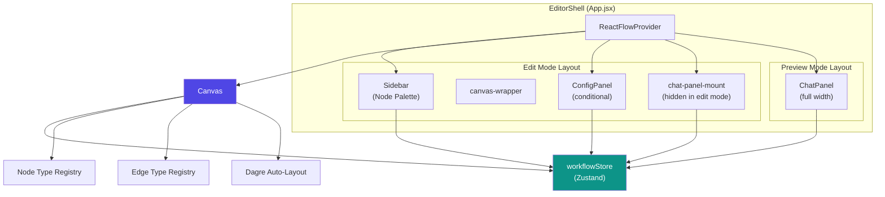
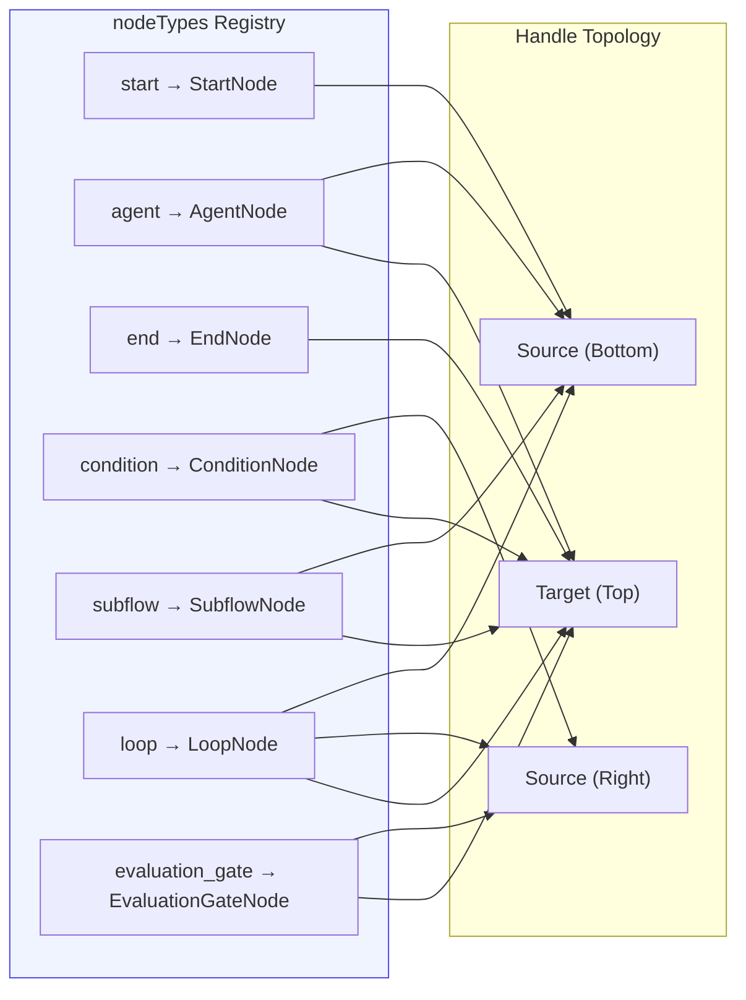
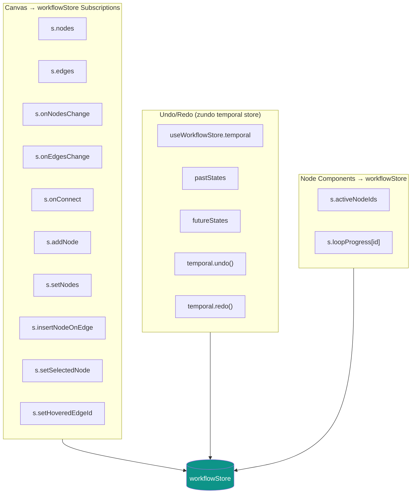
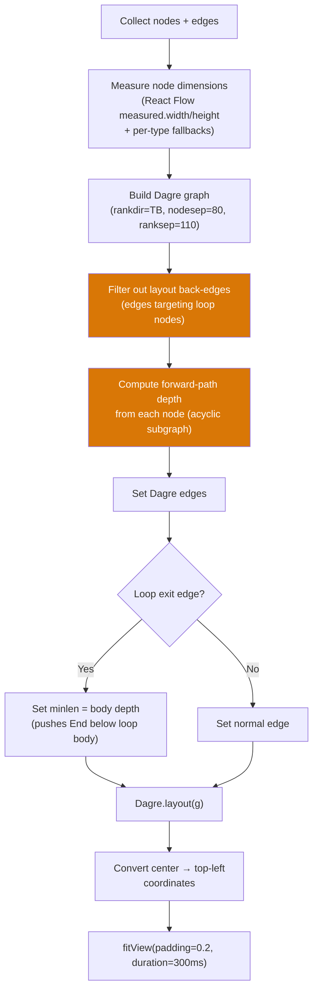
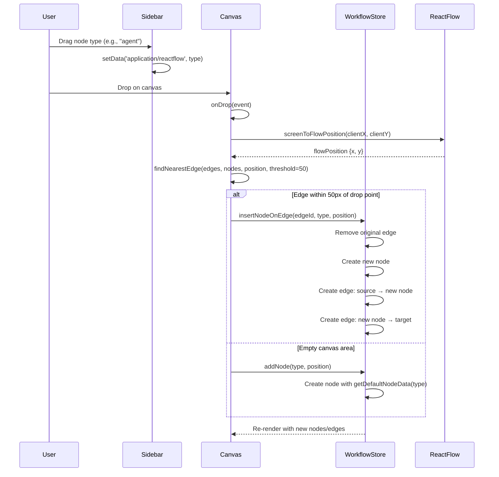
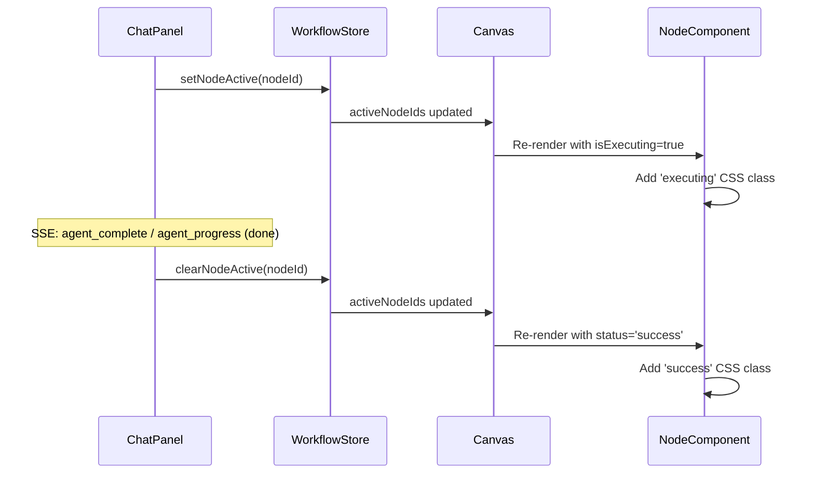
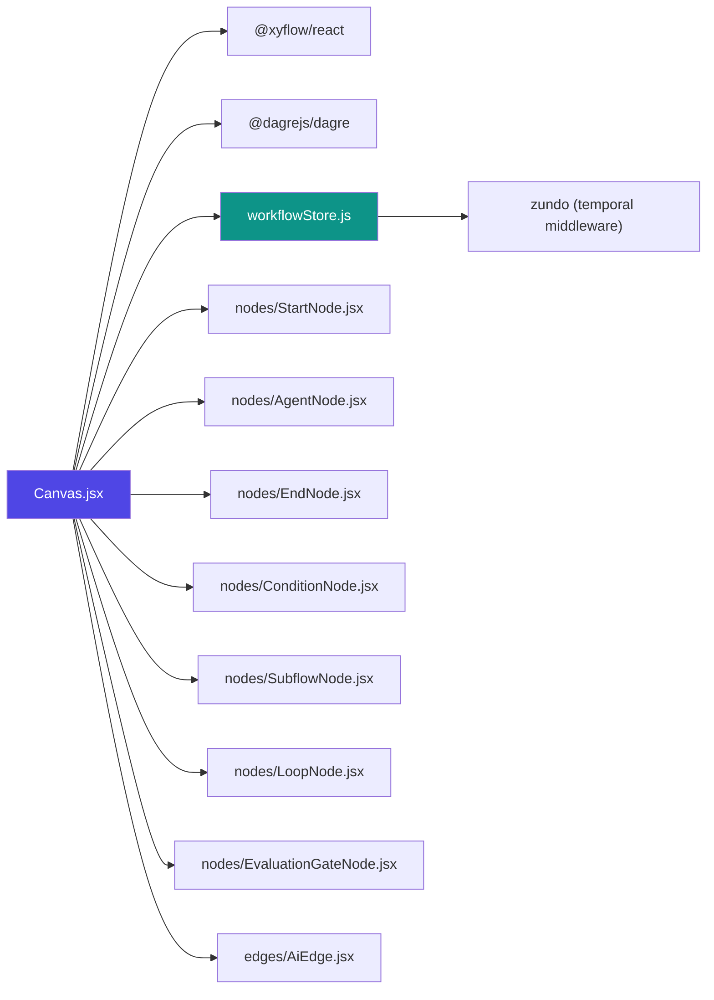

# Workflow Editor Canvas

## Overview

The **Canvas** component (`ABStudio/frontend/src/features/workflows/editor/Canvas.jsx`) is the central visual workflow editor in ABStudio's Build Studio. It provides an interactive, node-based graph surface where users design AI agent workflows by dragging, connecting, and configuring nodes. Built on [React Flow](https://reactflow.dev/) (`@xyflow/react`) with [Dagre](https://github.com/dagrejs/dagre) for automatic hierarchical layout, the Canvas is the primary authoring surface for the entire workflow feature set — from simple linear agent chains to complex branching, looping, and evaluation-gate topologies.

The Canvas is mounted inside the `EditorShell` layout (see [app_core](../core/app_core.md)) alongside the Sidebar, ConfigPanel, and [ChatPanel](workflows_feature_editor_chat_panel.md). It reads and writes all graph state through the shared Zustand-based `workflowStore`, which also powers undo/redo, execution tracking, and the serialization path that sends the workflow definition to the backend `NativeEngine` for execution.

---

## Architecture

### Component Hierarchy



### Node Type Registry

The Canvas registers seven custom node types, each rendered by a dedicated React component. All node components subscribe to `workflowStore.activeNodeIds` to display live execution status (executing, success, error) and read their configuration from `node.data`.



| Node Type | Component | Handles | Purpose |
|-----------|-----------|---------|---------|
| `start` | `StartNode` | Source (bottom) | Workflow entry point — one per workflow |
| `agent` | `AgentNode` | Target (top), Source (bottom) | LLM-powered agent with tools, skills, KB, HITL |
| `end` | `EndNode` | Target (top) | Workflow termination — one per workflow |
| `condition` | `ConditionNode` | Target (top), Multiple Sources (right, per case + else) | If/else branching with structured condition expressions |
| `subflow` | `SubflowNode` | Target (top), Source (bottom) | Reference to an existing saved agent or workflow |
| `loop` | `LoopNode` | Target (top), Source `body` (right), Source `exit` (bottom) | Iterative execution with for_each / while / count modes |
| `evaluation_gate` | `EvaluationGateNode` | Target (top), Source `pass` (right), Source `fail` (right) | LLM-as-judge quality gate with pass/fail routing |

### Edge Type

All edges use the custom `AiEdge` component (`edges/AiEdge.jsx`), which renders:
- A bezier curve path with animated styling when the source node is actively executing
- Hover-revealed action buttons at the edge midpoint: **insert node** (+) and **delete connection** (×)
- A dropdown menu for selecting which node type to insert when multiple types are available

---

## State Management

The Canvas is a thin presentation layer — all mutable graph state lives in the `workflowStore` Zustand store. The Canvas subscribes to specific slices and delegates every mutation to store actions.



### Key Store Interactions

| Canvas Action | Store Action | Description |
|---------------|-------------|-------------|
| Drag node from Sidebar | `addNode(type, position)` | Creates a new node with `getDefaultNodeData(type)` defaults |
| Drop node on an edge | `insertNodeOnEdge(edgeId, type, position)` | Splits an edge: removes original, creates two new edges through the inserted node |
| Connect two handles | `onConnect(connection)` | Creates a new edge with `createWorkflowEdgeId()` |
| Click a node | `setSelectedNode(nodeId)` | Opens the ConfigPanel for that node |
| Click empty pane | `setSelectedNode(null)` | Closes the ConfigPanel |
| Hover an edge | `setHoveredEdgeId(edgeId)` | Shows AiEdge action buttons |
| Auto-layout button | `setNodes(layoutedNodes)` | Replaces all node positions with Dagre-computed coordinates |
| Ctrl+Z / Ctrl+Y | `temporal.undo()` / `temporal.redo()` | Reverts/reapplies the last graph mutation |

---

## Auto-Layout (Dagre)

The Canvas includes a sophisticated auto-layout engine that arranges nodes in a top-to-bottom hierarchical structure. The layout handles several edge cases that a naive Dagre application would get wrong:



### Back-Edge Exclusion

Loop nodes create legitimate cycles in the workflow graph: the body subgraph's last node connects back to the loop node (the `body` handle). Feeding these back-edges to Dagre breaks its rank-based layout because Dagre requires a DAG. The `isLayoutBackEdge()` function detects any edge whose target is a `loop` node and excludes it from the ranking computation. The excluded edges still render as curves — they just don't distort node placement.

### Loop Exit Depth Compensation

When a loop node's `exit` handle connects to the End node, a naive layout places End beside the loop (same rank as the loop's body). The `depthFrom()` function computes the longest forward path from each node over the acyclic subgraph and uses it to set a `minlen` on the exit edge, pushing End below the entire loop body.

### Node Dimension Fallbacks

Each node type has a fallback dimension used before React Flow has measured the actual rendered size:

| Node Type | Fallback Width | Fallback Height |
|-----------|---------------|-----------------|
| `start` | 180 | 64 |
| `end` | 180 | 64 |
| `agent` | 220 | 80 |
| `condition` | 240 | 160 |
| `evaluation_gate` | 240 | 140 |
| Default | 200 | 64 |

---

## Drag & Drop Workflow



---

## Connection Validation

The `isValidConnection` callback enforces two rules before React Flow allows a connection to be created:

1. **No self-loops**: `connection.source === connection.target` is rejected
2. **No duplicate edges**: An edge with the same source, target, sourceHandle, and targetHandle is rejected

This prevents the user from accidentally creating redundant or circular connections that would confuse the backend graph traversal.

---

## Execution Feedback

During workflow execution, the Canvas provides real-time visual feedback by highlighting active nodes. The `workflowStore.activeNodeIds` array is populated by the [ChatPanel](workflows_feature_editor_chat_panel.md) as it processes SSE events from the backend `/run-stream` endpoint.



### Node Status States

Each node component reads `data.status` (or `data.executionStatus` / `data.state`) and `activeNodeIds` to determine its visual state:

| State | CSS Class | Visual Effect |
|-------|-----------|---------------|
| Idle | (none) | Default styling |
| Executing | `executing` | Pulsing border / glow animation |
| Success | `success` | Green accent |
| Error/Failed | `error` | Red accent |

### Loop Progress

The `LoopNode` component additionally subscribes to `workflowStore.loopProgress[id]`, which carries `{ running, index, total, mode }` during loop iteration. The node renders a progress badge (`Round N / M`) and a fill bar when running.

---

## MiniMap

The Canvas includes a pannable, zoomable MiniMap with color-coded nodes:

| Node Type | MiniMap Color |
|-----------|--------------|
| `start` | `#0d9488` (teal) |
| `agent` | `#4f46e5` (indigo) |
| `end` | `#059669` (green) |
| `condition` | `#d97706` (amber) |
| `subflow` | `#6366f1` (light indigo) |
| `loop` | `#0ea5e9` (sky blue) |
| `evaluation_gate` | `#f59e0b` (orange) |
| Default | `#6b7280` (gray) |

---

## Undo / Redo

Undo/redo is powered by [zundo](https://github.com/charkour/zundo), a temporal middleware for Zustand. The Canvas integrates it in two ways:

1. **Toolbar buttons**: Undo (↩) and Redo (↪) buttons in the top-right Panel, disabled when no history is available
2. **Keyboard shortcuts**: `Ctrl+Z` (undo), `Ctrl+Shift+Z` or `Ctrl+Y` (redo) — ignored when focus is in an input/textarea/contentEditable element

The temporal store subscribes to `pastStates` and `futureStates` lengths to update button disabled state reactively.

---

## Backend Integration

The Canvas itself does not make API calls — it is purely a client-side graph editor. However, the workflow definition it produces is consumed by the backend in two critical paths:

### Workflow Serialization → Execution

```mermaid
flowchart LR
    subgraph Frontend
        Canvas["Canvas (nodes + edges)"]
        WorkflowStore["workflowStore.getWorkflowForExecution()"]
        ChatPanel["ChatPanel.handleSend()"]
    end
    
    subgraph Backend
        RunStream["POST /run-stream"]
        NativeEngine["NativeEngine.execute()"]
        GraphTraversal["_traverse() graph walker"]
        SSEStream["SSE event stream"]
    end
    
    Canvas --> WorkflowStore
    WorkflowStore -->|JSON: {nodes, edges, knowledge}| ChatPanel
    ChatPanel -->|fetch + body| RunStream
    RunStream --> NativeEngine
    NativeEngine --> GraphTraversal
    GraphTraversal -->|agent_start, agent_token, agent_complete, ...| SSEStream
    SSEStream -->|text/event-stream| ChatPanel
```

The `getWorkflowForExecution()` method in `workflowStore` flattens the React Flow graph into the `ChainDefinition` format expected by the backend's `NativeEngine`. This includes:
- Extracting node `data` to the top level for condition/loop nodes
- Mapping edge `sourceHandle` to the backend's handle-based routing (`condition_edges`, `loop_edges`, `gate_edges`)
- Forwarding workflow-level KB configuration

### Node Type → Backend Dispatch

The backend `NativeEngine._traverse()` method dispatches on `node.type` exactly as the Canvas registers them:

| Canvas Node Type | Backend Handler | Routing |
|-----------------|----------------|---------|
| `start` | Pass-through | First outgoing edge |
| `agent` | `_run_agent()` | ReAct tool-calling loop, HITL gates |
| `subflow` | `_run_subflow()` | Recursive `execute()` or `AgentRunner.run()` |
| `condition` | `_route_condition()` | Case-based edge selection |
| `loop` | `_run_loop()` | Body/exit handle routing, iteration control |
| `evaluation_gate` | `_route_evaluation_gate()` | Pass/fail handle routing via LLM judge |
| `end` | Termination | Emit `complete` SSE event |

For details on the execution engine, see [engine_native_engine](../agents/engine_native_engine.md).

---

## Dependencies



### External Libraries

| Library | Purpose |
|---------|---------|
| `@xyflow/react` | React Flow v12 — node-based graph rendering, drag-and-drop, pan/zoom, handles |
| `@dagrejs/dagre` | Directed graph layout algorithm for auto-arrangement |
| `zundo` | Temporal middleware for Zustand undo/redo |

### Internal Module Dependencies

| Module | Relationship |
|--------|-------------|
| [workflowStore](../storage/store.md) (`store/workflowStore.js`) | Central state store — nodes, edges, selection, execution state, undo/redo |
| Sidebar | Draggable node palette that feeds the Canvas drop handler |
| ConfigPanel | Node configuration panel — opens when `selectedNodeId` is set |
| [ChatPanel](workflows_feature_editor_chat_panel.md) | Execution/chat surface — drives `activeNodeIds` and `loopProgress` |
| [EditorShell](../core/app_core.md) (`App.jsx`) | Parent layout — wraps Canvas in `ReactFlowProvider`, manages edit/preview mode |
| Node Components | Seven custom node renderers |
| AiEdge | Custom edge with insert/delete actions |
| [NativeEngine](../agents/engine_native_engine.md) | Backend graph traversal engine that consumes the Canvas's workflow definition |

---

## Configuration Reference

### React Flow Props

| Prop | Value | Notes |
|------|-------|-------|
| `nodeTypes` | Custom registry (7 types) | Registered outside component to prevent re-creation |
| `edgeTypes` | `{ 'ai-edge': AiEdge }` | All edges use the custom type |
| `deleteKeyCode` | `null` | Delete is handled via edge buttons, not keyboard |
| `snapToGrid` | `true` | 28×28px grid |
| `connectionLineType` | `Bezier` | Curved connection lines |
| `defaultEdgeOptions.type` | `'ai-edge'` | New connections automatically use AiEdge |
| `proOptions.hideAttribution` | `true` | Hides React Flow attribution |

### Canvas Toolbar

The toolbar is rendered as a React Flow `<Panel position="top-right">` containing:

1. **Auto-layout button** — triggers `onAutoLayout()` which runs Dagre and calls `fitView()`
2. **Divider**
3. **Undo button** — disabled when `pastStates.length === 0`
4. **Redo button** — disabled when `futureStates.length === 0`

---

## Edge Proximity Detection

The `findNearestEdge()` function enables drop-on-edge insertion. When a node is dropped within 50 pixels of an existing edge's midpoint, the Canvas calls `insertNodeOnEdge()` instead of `addNode()`, automatically splitting the connection.

The midpoint is computed as the average of the source node's bottom-center and the target node's top-center, using fallback dimensions (`NODE_W = 200`, `NODE_H = 64`) since precise handle positions aren't available at drop time.

---

## Mode Switching

The Canvas is always mounted (even in preview mode) but its visibility is controlled by the parent `EditorShell` via CSS. When the user clicks a node while in preview/chat mode, the `onRequestEditMode` callback fires, switching back to edit mode so the ConfigPanel opens for the clicked node. This allows users to jump directly into an agent's configuration from the chat preview without hunting for a mode toggle.

The ChatPanel is kept mounted across edit/preview swaps so the SSE reader and streaming state survive mode transitions — only CSS visibility changes.

---

## Related Documentation

- [EditorShell & App Core](../core/app_core.md) — Parent layout, mode switching, workflow name editing
- Sidebar & Pickers — Node palette, SubflowPicker, LoopItemsPicker, RunSettingsStrip
- ConfigPanel — Per-node configuration (agent, condition, loop, subflow, evaluation gate)
- [ChatPanel](workflows_feature_editor_chat_panel.md) — Workflow execution, SSE handling, HITL, debug log
- DebugLogView — Execution timeline and per-node event inspection
- Node Components — Individual node renderers
- Edge Components — AiEdge with insert/delete actions
- Condition Builders — Condition DSL editors for condition and loop nodes
- [Workflow Store](../storage/store.md) — Zustand store with undo/redo, execution state, graph validation
- [NativeEngine](../agents/engine_native_engine.md) — Backend graph traversal and agent execution engine
- [Workflows Dashboard](../workflows/workflows_feature_dashboard.md) — Workflow list, creation, and card management
- [Workflow Factory Chat](workflows_feature_factory_chat.md) — AI-powered workflow generation
