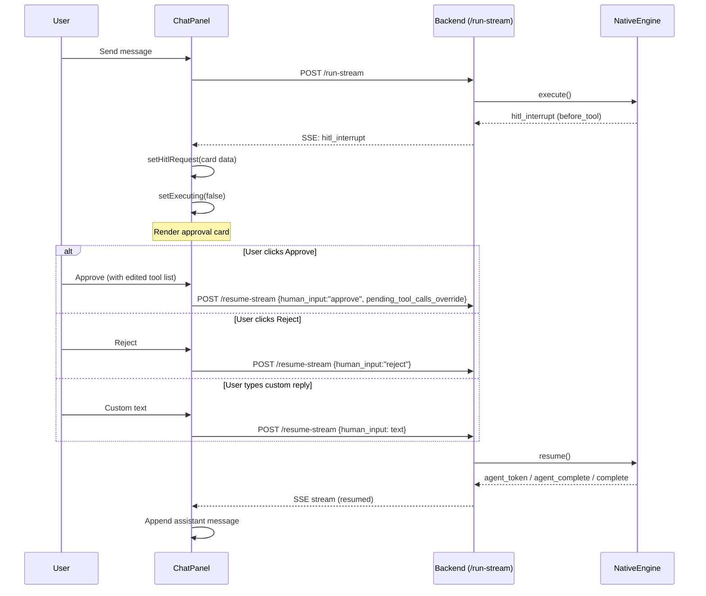
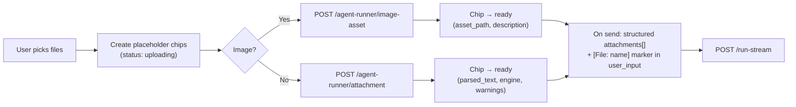
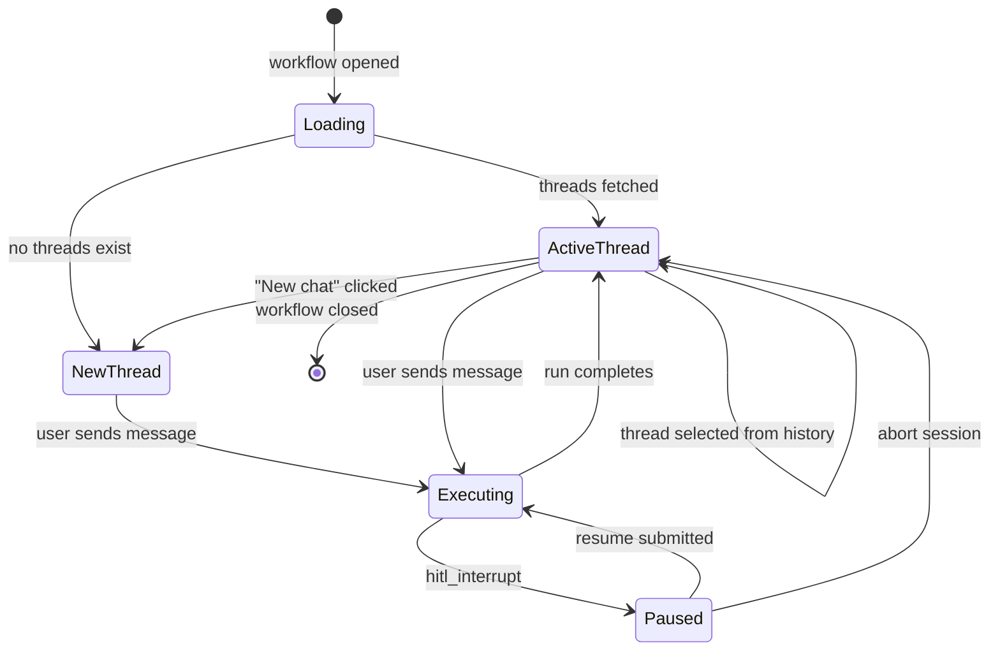
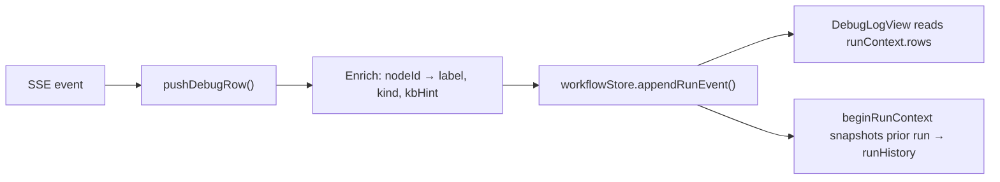
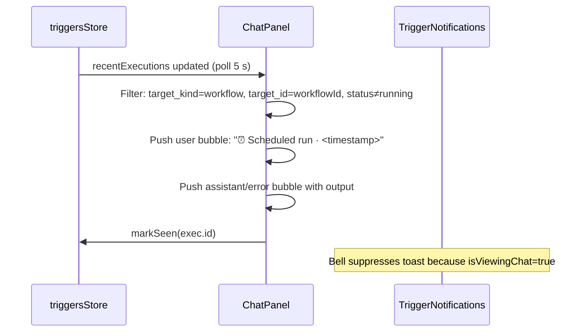
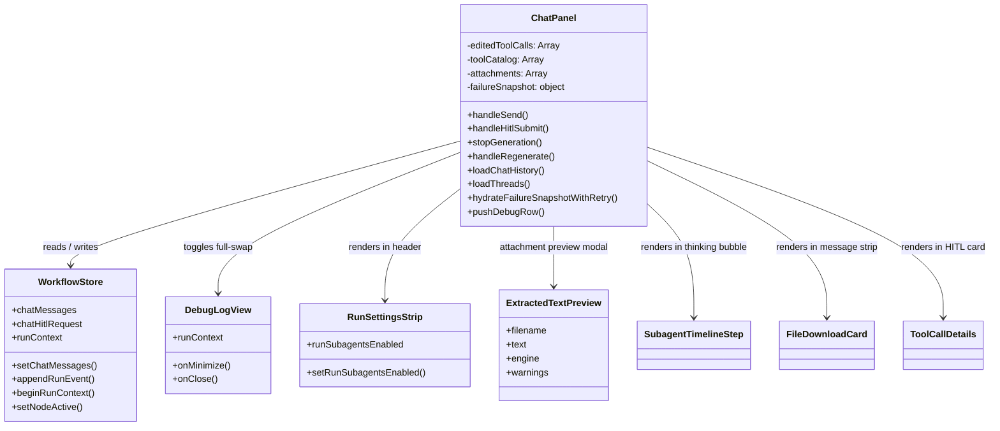
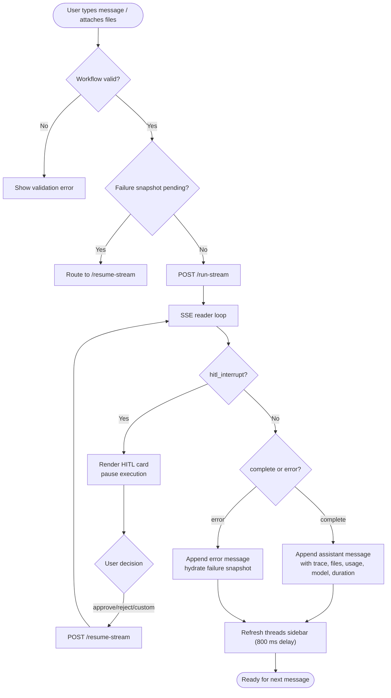

# Workflow Editor — Chat Panel

> **Module ID:** `workflows_feature_editor_chat_panel`
> **Source file:** `ABStudio/frontend/src/features/workflows/editor/ChatPanel.jsx`
> **Primary export:** `ChatPanel`

## 1. Introduction

The **ChatPanel** is the conversational execution surface inside the ABStudio Workflow
Editor.  It lets a user *test a workflow as if it were a chatbot*: type a prompt (or
attach documents/images), watch the multi-agent pipeline execute in real time via
Server-Sent Events (SSE), review tool calls / sub-agent delegations / loop iterations /
knowledge-base retrieval inline, approve or reject human-in-the-loop (HITL) interrupts,
and inspect a full Debug Log timeline after (or during) the run.

The panel is mounted inside the editor shell and **stays mounted across preview ↔ edit
mode toggles** so that an in-flight SSE stream is never interrupted when the user
switches to inspect a node configuration.  All chat state (messages, streaming content,
HITL requests, failure snapshots) lives in the global workflow store rather than local
component state, which is what makes this persistence possible.

---

## 2. Architecture Overview

```mermaid
graph TB
  subgraph Frontend["ABStudio Frontend"]
    ChatPanel["ChatPanel<br/>(this module)"]
    WorkflowStore["workflowStore<br/>(Zustand)"]
    TriggersStore["triggersStore"]
    DashboardStore["dashboardStore"]
    DebugLogView["DebugLogView"]
    RunSettings["RunSettingsStrip"]
    SharedUtils["threadHelpers · editorPersistence<br/>useGeneratedDownload · ExtractedTextPreview"]
    SubagentSelectors["subagentSelectors"]
  end

  subgraph Backend["ABStudio Backend"]
    RunStream["POST /run-stream"]
    ResumeStream["POST /resume-stream"]
    ChatAPI["GET /chat-threads<br/>GET /chat-history<br/>GET/DELETE /chat-pending"]
    DocumentsAPI["POST /agent-runner/attachment<br/>POST /agent-runner/image-asset"]
    CatalogAPI["GET /tools-catalog"]
    Health["GET /health"]
    NativeEngine["NativeEngine"]
  end

  ChatPanel --> WorkflowStore
  ChatPanel --> TriggersStore
  ChatPanel --> DashboardStore
  ChatPanel --> DebugLogView
  ChatPanel --> RunSettings
  ChatPanel --> SharedUtils
  ChatPanel --> SubagentSelectors

  ChatPanel -->|"SSE stream"| RunStream
  ChatPanel -->|"SSE resume"| ResumeStream
  ChatPanel -->|"REST"| ChatAPI
  ChatPanel -->|"multipart upload"| DocumentsAPI
  ChatPanel -->|"one-shot fetch"| CatalogAPI
  ChatPanel -->|"poll 30 s"| Health

  RunStream --> NativeEngine
  ResumeStream --> NativeEngine
  ChatAPI --> NativeEngine
```



### 2.1 Internal Sub-Components

The module tree decomposes `ChatPanel.jsx` into four logical groups.  All live in the
same source file; the grouping reflects responsibility, not separate files.

| Sub-group | Key functions / components | Responsibility |
|---|---|---|
| **ChatPanelCore** | `ChatPanel`, `getThreadMeta`, `handleClick`, `handleKeyPress`, `onDocumentClick`, `stopGeneration`, `abortRunSession` | Main component, thread lifecycle, send/stop/abort orchestration |
| **ChatActions** | `handleRegenerate`, `handleCopy`, `renderRoundChip` | Message action bar (copy, share, Teams, regenerate) and loop-round badge |
| **MessageContent** | `CodeBlock`, `ToolCallDetails`, `renderConditionSnapshot` | Rich rendering of code, tool-call arguments, and loop condition state |
| **FileHandling** | `FileDownloadCard`, `fallbackDownload` | Generated-file download cards and auth'd fallback download |

---

## 3. State Management

ChatPanel does **not** own its chat state locally.  Instead it reads from and writes to
the [`workflowStore`](../storage/store.md) (Zustand + zundo temporal middleware).  The relevant
store slice is documented in detail in the store module; the table below summarises the
fields ChatPanel touches.

| Store field | Type | Purpose |
|---|---|---|
| `chatMessages` | `Array<Message>` | Full conversation for the active thread |
| `chatStreamingContent` | `string` | Live token-by-token assistant text |
| `chatStreamingAgent` | `string` | Current agent label (e.g. `"Agent → tool"`) |
| `chatThreadId` | `string` | Active chat thread ID |
| `chatHitlRequest` | `object \| null` | Pending HITL interrupt card data |
| `chatHitlRedirectText` | `string` | Free-form text in the HITL reply box |
| `chatFailureSnapshot` | `object \| null` | Paused/failed-run banner data |
| `chatOwnerWorkflowId` | `string \| null` | Guards against cross-workflow state bleed |
| `isExecuting` | `boolean` | True while an SSE stream is active |
| `executionLogs` | `Array<LogEntry>` | Capped (1000) chronological event log |
| `runContext` | `object` | Debug Log run context (rows, status, history) |
| `activeNodeIds` | `Array<string>` | Nodes currently highlighted on the canvas |
| `loopProgress` | `Record<nodeId, Progress>` | Per-loop-node iteration progress |
| `runSubagentsEnabled` | `boolean` | Run-level swarm opt-in flag |
| `nodes` / `edges` | `Array` | Workflow graph definition (for validation & debug enrichment) |

**Key design decision:** Lifting chat state into the store means switching from preview
to edit mode (or navigating to the dashboard and back) does not drop the conversation,
the in-flight streamed reply, or a pending HITL approval card.

---

## 4. Backend API Contract

ChatPanel communicates with the ABStudio backend through several REST and SSE
endpoints.  The backend implementations live in the modules listed below; this section
documents only the *contract* ChatPanel depends on.

| Endpoint | Method | Backend module | Purpose |
|---|---|---|---|
| `/run-stream` | POST (SSE) | [`api_execution`](../api/api_execution.md) | Start a new workflow execution; streams SSE events |
| `/resume-stream` | POST (SSE) | [`api_execution`](../api/api_execution.md) | Resume a paused/failed run with a HITL decision or retry |
| `/chat-threads/{workflow_id}` | GET | [`api_chat`](../api/api_chat.md) | List conversation threads for a workflow |
| `/chat-history/{thread_id}` | GET | [`api_chat`](../api/api_chat.md) | Load persisted messages for a thread |
| `/chat-threads/{thread_id}` | DELETE | [`api_chat`](../api/api_chat.md) | Delete a conversation thread |
| `/chat-pending/{thread_id}` | GET | [`api_chat`](../api/api_chat.md) | Hydrate HITL / failure snapshot on thread open |
| `/chat-pending/{thread_id}` | DELETE | [`api_chat`](../api/api_chat.md) | Abort / discard a paused-run checkpoint |
| `/agent-runner/attachment` | POST (multipart) | [`api_documents`](../api/api_documents.md) | Upload a document for OCR / text extraction |
| `/agent-runner/image-asset` | POST (multipart) | [`api_documents`](../api/api_documents.md) | Upload an image as a sandbox asset |
| `/tools-catalog` | GET | [`api_catalog`](../api/api_catalog.md) | Fetch tool names + descriptions for smart-parse |
| `/health` | GET | [`app_main`](../core/app_main.md) | Backend + DB health polling |

### 4.1 `/run-stream` Request Payload

```json
{
  "workflow": { "nodes": [...], "edges": [...] },
  "user_input": "typed prose or [File: name] markers + question",
  "attachments": [{ "file_name": "...", "parsed_text": "...", "char_count": 1234 }],
  "workflow_id": "wf_...",
  "workflow_name": "My Workflow",
  "thread_id": "wf_...:1234_abc",
  "subagents_enabled": false
}
```

### 4.2 `/resume-stream` Request Payload

```json
{
  "workflow": { "nodes": [...], "edges": [...] },
  "human_input": "approve | reject | custom text | empty",
  "workflow_id": "wf_...",
  "thread_name": "My Workflow",
  "thread_id": "wf_...:1234_abc",
  "subagents_enabled": false,
  "pending_tool_calls_override": [{ "id": "...", "name": "...", "args": {} }]
}
```

---

## 5. SSE Event Processing

The heart of ChatPanel is a `while (true)` SSE read loop that parses `data: {json}`
frames and dispatches them to store actions and debug-log row pushers.  The same loop
runs for both `/run-stream` (initial run) and `/resume-stream` (HITL resume), with
near-identical event handling.

```mermaid
flowchart TD
  Start([SSE reader loop]) --> Parse["Parse data: JSON frame"]
  Parse --> Switch{event type}

  Switch -->|start| EStart["setThreadId<br/>beginRunContext<br/>push Input + Start rows"]
  Switch -->|agent_start| EAgentStart["setStreamingAgent<br/>addExecutionLog<br/>setNodeActive<br/>trackNodeStat"]
  Switch -->|agent_progress| EAgentProgress["Map running/done<br/>to agent_start/complete"]
  Switch -->|agent_token| EToken["Append token<br/>setStreamingContent"]
  Switch -->|agent_complete| EComplete["clearNodeActive<br/>trackNodeStat output<br/>pushDebugRow with usage"]
  Switch -->|agent_retry / agent_fallback| ERetry["setFallbackStatus<br/>pushDebugRow"]
  Switch -->|tool_call_start / result| ETool["addExecutionLog<br/>pushDebugRow Tool"]
  Switch -->|subagent_start / complete| ESub["addExecutionLog<br/>pushDebugRow Sub-agent"]
  Switch -->|swarm_plan / swarm_error| ESwarm["addExecutionLog<br/>pushDebugRow Swarm"]
  Switch -->|kb_retrieval| EKb["addExecutionLog<br/>pushDebugRow Knowledge"]
  Switch -->|condition_flash / routed| ECond["setNodeActive flash<br/>pushDebugRow"]
  Switch -->|loop_*| ELoop["setLoopProgress<br/>addExecutionLog<br/>pushDebugRow"]
  Switch -->|hitl_interrupt| EHitl["setHitlRequest<br/>setExecuting false<br/>break loop"]
  Switch -->|complete| ECompleteEvent["setExecutionResult<br/>push End + Output + Tokens rows<br/>setMessages assistant"]
  Switch -->|error| EError["setExecutionError<br/>pushDebugRow error<br/>hydrateFailureSnapshotWithRetry"]

  EHitl --> Break([Break SSE loop])
  ECompleteEvent --> Done([End SSE loop])
  EError --> Done
```



### 5.1 SSE Event Reference

| Event | Key data fields | ChatPanel action |
|---|---|---|
| `start` | `thread_id` | Initialise run context, push Input + Start debug rows |
| `agent_start` | `agent`, `node_id` | Set streaming agent, activate canvas node, seed node stats |
| `agent_progress` | `agent`, `status`, `node_id` | Map to agent_start/complete for intermediate nodes |
| `agent_token` | `token`, `node_id` | Append to streaming content, increment chunk counter |
| `agent_complete` | `agent`, `output`, `usage`, `model`, `generated_files` | Clear active node, finalise node stats, push enriched debug row |
| `agent_retry` | `agent`, `model`, `reason` | Show transient fallback status, push info row |
| `agent_fallback` | `agent`, `from`, `to` | Show transient fallback status, push info row |
| `tool_call_start` | `agent`, `tool_name`, `arguments` | Add execution log, push Tool debug row |
| `tool_call_result` | `agent`, `tool_name`, `result` | Add execution log, push Tool debug row |
| `swarm_plan` | `run_id`, `role_ids`, `worker_count` | Add swarm plan log, push Swarm debug row |
| `swarm_error` | `run_id`, `code`, `detail` | Add swarm error log, push error Swarm row |
| `kb_retrieval` | `node_id`, `agent`, `chunks`, `confidence` | Add KB log, push Knowledge debug row with chunk details |
| `subagent_start` | `call_id`, `alias`, `agent_id`, `task_preview` | Add subagent log, push Sub-agent debug row |
| `subagent_complete` | `call_id`, `alias`, `ok`, `duration_s`, `output` | Update subagent log, push completion row |
| `condition_flash` | `node_id` | Briefly highlight condition node on canvas |
| `condition_routed` | `node_id`, `matched_case_label`, `expression` | Add condition log, push debug row |
| `loop_iteration_start` | `node_id`, `index`, `total`, `mode` | Set loop progress, push debug row |
| `loop_condition_eval` | `node_id`, `will_continue`, `case_results` | Add loop condition log, push debug row |
| `loop_complete` | `node_id`, `total_iterations`, `max_iterations_hit` | Clear loop progress, push debug row |
| `loop_evaluation` / `loop_final_summary` | `node_id`, `evaluation`, `decision` | Dispatch to shared loop-summary handler |
| `hitl_interrupt` | `reason`, `thread_id`, `agent`, `pending_tool_calls` | Render HITL card, pause execution |
| `hitl_resumed` | — | Push info row, continue streaming |
| `workflow_retrying` | `node_id`, `agent`, `previous_error` | Push info row |
| `complete` | `output`, `usage`, `execution_trace`, `generated_files` | Finalise run, push End + Output + Tokens rows |
| `error` | `message`, `detail`, `retryable`, `node_id` | Show error, hydrate failure snapshot |

### 5.2 Token Usage Estimation

The backend does not always emit per-node LLM usage in the SSE stream.  ChatPanel
approximates token usage using the industry rule-of-thumb **~1 token per 4 characters**
of visible input + output text.  This is clearly labelled in the Debug Log as a
char-based estimate and under-counts real usage (system prompts, tool definitions, and
intermediate tool-calling turns are invisible).  When the backend *does* provide a
`usage` object on the `complete` event, that authoritative figure is used instead.

---

## 6. Human-in-the-Loop (HITL) Flow

HITL interrupts let a human reviewer approve, reject, or redirect a workflow run at
well-defined pause points.  The backend snapshots the run state server-side and emits a
`hitl_interrupt` SSE event; ChatPanel renders an approval card and POSTs the decision to
`/resume-stream`.



### 6.1 HITL Interrupt Types

| `interruptType` | Trigger | Card UI |
|---|---|---|
| `before_tool` | Agent wants to call one or more tools | Compact tool list with × (remove), smart-parse textarea ("don't use X", "also use Y"), Approve / Save & approve / Allow all this session / Reject |
| `after_response` | Agent produced a response; reviewer must approve | Markdown prompt + Allow & continue / Reject + free-form edit textarea |
| `ask_human` | Agent asks a structured question | Question + numbered option buttons + custom reply textarea |

### 6.2 Smart Tool-List Editing

The `before_tool` card supports natural-language tool-list edits via `parseToolEdits()`.
The parser resolves tool names against a cached `/tools-catalog` response and supports
three operations:

- **Add**: `"use jira_get_issue"` → appends resolved tool
- **Drop**: `"don't use web_search"` → removes matching tool
- **Replace**: `"use only email_draft"` → replaces entire list

Unresolvable names are surfaced as inline errors.  The "Save & approve" action
additionally persists the edited tool list onto the agent node's `data.tools` array and
PUTs the workflow via `dashboardStore.updateWorkflow`, so the change survives reload.

### 6.3 Failure & Pause Banner

Separate from HITL, a `failureSnapshot` drives a retry/abort banner when a run is
paused due to `node_failed` or `user_cancelled`.  The snapshot is hydrated from
`/chat-pending/{thread_id}` with retry backoff (0, 250, 600, 1200, 2500 ms) because the
backend's snapshot write may race with the SSE stream close.

| Banner variant | Trigger | Actions |
|---|---|---|
| **RUN PAUSED** (amber) | `user_cancelled` — user clicked Stop | Resume (empty input) / Abort session |
| **RUN FAILED** (red) | `node_failed` — a node errored | Retry failed node / Abort session |

"Abort session" calls `DELETE /chat-pending/{thread_id}` to discard the server-side
checkpoint and pushes a `session-aborted` system message into the transcript for audit.

---

## 7. Attachment Handling

ChatPanel supports uploading documents and images alongside a chat message.  Documents
flow through the OCR / text-extraction pipeline; images are saved as sandbox assets the
agent can reference by file path.



**Limits** (defined as module constants):

| Constant | Value |
|---|---|
| `CHAT_ATTACH_MAX_FILES` | 5 |
| `CHAT_ATTACH_PROMPT_BUDGET_CHARS` | 60 000 |
| `CHAT_ATTACH_ACCEPT` | `.pdf .docx .pptx .xlsx .xls .csv .html .htm .rtf .txt .json .md .png .jpg .jpeg .tiff .tif .bmp .webp` |

On send, ready attachments are split into two parallel channels:

1. **Structured `attachments[]`** on the `/run-stream` body — the engine injects these
   into agents size-aware (small → first agent only; large → every agent).
2. **`[File: <name>]` markers** prepended to `user_input` — ensures the filename
   survives history reload as an attachment chip (the structured array is not persisted
   server-side).

History reload uses `parsePersistedUserPrompt()` to strip the `[File: ...]` blocks back
into clean attachment chips + typed text, so the user never sees the raw OCR dump on
reload.  See [`threadHelpers`](../ui/utils.md) for the shared sanitisation logic.

---

## 8. Thread Lifecycle



### 8.1 Thread Persistence

- **Active thread per workflow** is persisted via `saveActiveThread()` / `loadActiveThread()`
  in [`editorPersistence`](../ui/utils.md), so a browser reload reopens the same conversation.
- **Composer draft** is persisted per `(workflowId, threadId)` via
  `saveComposerDraft()` / `loadComposerDraft()`, so unsent text survives reloads.
- After a run completes, the threads sidebar is refreshed (without reloading current
  history) so the new thread appears in the list without overwriting in-memory messages.

### 8.2 Backend Health & Auto-Retry

ChatPanel polls `/health` every 30 seconds (skipped when the tab is hidden).  If the
backend transitions from down → up, threads are automatically reloaded.  The health
status drives the empty-state card:

| `backendStatus` | Empty-state message |
|---|---|
| `null` | "Connecting…" (spinner) |
| `'error'` | "Backend offline. Retrying automatically." |
| `'ok'` / `'db_error'` | Normal empty-state card with workflow name |

---

## 9. Debug Log Integration

ChatPanel feeds every SSE event into the workflow store's `runContext` slice via
`pushDebugRow()`, which enriches each row with:

- **Node label** resolved from `nodeLabelById` (matches `AgentNode`'s `<h4>{data.name}>`)
- **Node kind** badge (Agent, Condition, Loop, Subflow, Start, End, Tool, Knowledge, Swarm, HITL, Tokens)
- **KB hint** when the node has an active knowledge-base mode
- **Generated files** metadata
- **Token estimate** (char-based or backend-provided)

The Debug Log view itself is rendered by `DebugLogView`,
which ChatPanel toggles as a full-swap overlay (chat body hidden via CSS, all chat state
preserved).  See the Debug Log module documentation for the timeline rendering details.



---

## 10. Sub-Agent & Swarm Timeline

When a workflow node delegates work to sub-agents (swarm), ChatPanel renders a live
timeline inside the assistant "thinking" bubble.  The timeline is powered by pure
selectors in [`subagentSelectors`](workflows_feature_editor_chat_panel.md):

- `selectActiveSubagents(executionLogs)` — returns currently-running sub-agents
- `selectAllSubagents(executionLogs)` — returns all sub-agents (running + complete + failed) in start order

The selectors handle `swarm_plan` events by inserting placeholder rows (status
`'planning'`) that are upgraded in place when the real `subagent_start` arrives,
preventing duplicate entries.  `swarm_error` events surface as failed rows so the user
sees *why* the swarm couldn't run instead of waiting for the parent agent's paraphrase.

Each sub-agent row is a memoised `SubagentTimelineStep` component that owns a 1-second
elapsed-time interval while running, so the timer updates don't re-render the entire
timeline.

---

## 11. Trigger Execution Injection

When a scheduled trigger fires for the workflow currently open in the editor, ChatPanel
injects the execution result as a chat exchange so the user sees it inline.  This
integrates with [`triggersStore`](../storage/store.md):



The `isViewingChat` store flag (set while ChatPanel is active) tells
[`TriggerNotifications`](../ui/triggers_feature.md) to skip the toast pop-up for executions
whose results are already being streamed into the chat.

---

## 12. Generated File Handling

Assistant messages may include generated files (documents, spreadsheets, images).
ChatPanel handles two sources:

1. **Structured `generated_files`** array on the `complete` event — rendered as
   `FileDownloadCard` components in a strip below the message.
2. **Sniffed from prose** — `sniffGeneratedFiles()` detects filenames in the assistant's
   markdown text and creates download cards for them.

To prevent false positives, an exclusion set is built from:
- **Uploaded attachment filenames** (so an input file echoed in prose isn't rendered as a
  generated download)
- **KB document filenames** (so a KB source document isn't mistaken for a generated file)

All downloads route through [`useGeneratedDownload`](../core/shared_features.md), which:
- Always uses the auth'd `downloadGeneratedFile` helper (never bare `target="_blank"`)
- Guards against double-clicks (in-flight URL set)
- Surfaces 410 (expired) / error via a `DownloadNotice`

---

## 13. Message Rendering

Assistant messages are rendered with `ReactMarkdown` + `remark-gfm` (GFM tables,
strikethrough, task lists).  A custom `buildMarkdownComponents()` factory intercepts:

- **Inline code spans** that name a generated file → rendered as download anchors
- **Links** to `/generated-files/...` → routed through the auth'd download helper
- **Multi-line code** → `CodeBlock` with copy button

Emoji are stripped from assistant content via `stripEmoji()` before rendering.  The
message action bar provides copy, share (Web Share API / clipboard), Teams deep-link,
and regenerate (replays the last user message through the workflow).

---

## 14. Component Interaction Diagram



---

## 15. Process Flow: Full Send → Complete



---

## 16. Dependencies

### 16.1 Frontend Internal

| Dependency | Module | Purpose |
|---|---|---|
| `workflowStore` | [`store`](../storage/store.md) | Chat state, execution state, run context, node graph |
| `dashboardStore` | [`store`](../storage/store.md) | `updateWorkflow` for Save & approve persistence |
| `triggersStore` | [`store`](../storage/store.md) | Recent trigger executions, mark seen |
| `subagentSelectors` | this module | Pure selectors for sub-agent timeline |
| `RunSettingsStrip` | `workflows_feature_editor_sidebar_pickers` | Run-level subagent toggle |
| `DebugLogView` | `workflows_feature_editor_debug_log` | Debug Log full-swap view |
| `ExtractedTextPreview` | [`shared_features`](../core/shared_features.md) | Attachment text preview modal |
| `DownloadNotice` | [`shared_features`](../core/shared_features.md) | Download expiry / error notice |
| `useGeneratedDownload` | [`shared_features`](../core/shared_features.md) | Auth'd download orchestration |
| `sniffGeneratedFiles` | [`shared_features`](../core/shared_features.md) | Detect generated filenames in prose |
| `threadHelpers` | [`utils`](../ui/utils.md) | Thread grouping, title, preview, history mapping |
| `editorPersistence` | [`utils`](../ui/utils.md) | Active thread + composer draft persistence |
| `config/api` | — | `API_BASE`, `buildAuthHeaders`, `kbFetch` |

### 16.2 Backend

| Dependency | Module | Purpose |
|---|---|---|
| `/run-stream`, `/resume-stream` | [`api_execution`](../api/api_execution.md) | SSE workflow execution |
| `/chat-threads`, `/chat-history`, `/chat-pending` | [`api_chat`](../api/api_chat.md) | Thread management & HITL hydration |
| `/agent-runner/attachment`, `/agent-runner/image-asset` | [`api_documents`](../api/api_documents.md) | Document OCR & image asset upload |
| `/tools-catalog` | [`api_catalog`](../api/api_catalog.md) | Tool catalog for smart-parse |
| `/health` | [`app_main`](../core/app_main.md) | Backend health polling |
| `NativeEngine` | [`engine_native_engine`](../agents/engine_native_engine.md) | SSE event source (consumed indirectly) |
| `LoopRunner` | [`loop_runner`](../agents/loop_runner.md) | Loop evaluation events (consumed indirectly) |
| `SwarmOrchestrator` | [`swarm`](../agents/swarm.md) | Sub-agent delegation events (consumed indirectly) |

### 16.3 External Libraries

| Library | Purpose |
|---|---|
| `react` | Component framework (hooks: `useState`, `useRef`, `useEffect`, `useCallback`, `useMemo`, `memo`) |
| `react-markdown` + `remark-gfm` | Markdown rendering with GFM support |
| `zustand` | State management (via `workflowStore`) |

---

## 17. Key Design Decisions

1. **Store-backed chat state** — Chat state lives in `workflowStore`, not local `useState`,
   so it survives mode toggles and dashboard navigation.  Setters short-circuit on no-op
   to avoid 60×/sec re-renders during token streaming.

2. **Dual SSE handler** — `handleSend()` and `handleHitlSubmit()` each contain a
   near-identical SSE reader loop.  This duplication is intentional: the resume path
   needs different pre-stream setup (resume body, no `beginRunContext`) but identical
   event handling.

3. **Retry-backed failure hydration** — `hydrateFailureSnapshotWithRetry()` polls
   `/chat-pending` with exponential backoff because the backend's snapshot write happens
   *after* the ASGI stream closes, so a single point-in-time poll misses it.

4. **Debug Log preservation on stop** — `stopRunPreservingLog()` resets live UI state
   but keeps the `runContext` timeline (marked `'stopped'`) so an interrupted run stays
   reviewable.

5. **Attachment dual-channel** — Structured `attachments[]` for the engine + `[File:]`
   markers in `user_input` for persistence, because the structured array is not
   persisted server-side but the marker ensures chips survive reload.

6. **Smart-parse isolation** — Tool-list edits from the HITL textarea are applied to a
   per-card `editedToolCalls` draft that resets on every new interrupt, so edits from one
   turn never bleed into the next.

7. **Trigger injection** — Scheduled trigger results are injected as chat messages (not
   toasts) when the user is viewing the chat, with `isViewingChat` suppressing the bell
   toast to avoid double-counting.

---

## 18. Related Documentation

- [Workflow Store (`store`)](../storage/store.md) — Zustand store with chat, execution, and run-context slices
- Debug Log View (`workflows_feature_editor_debug_log`) — Per-run timeline rendering
- Run Settings Strip (`workflows_feature_editor_sidebar_pickers`) — Run-level configuration popover
- [Canvas (`workflows_feature_editor_canvas`)](workflows_feature_editor_canvas.md) — React Flow canvas with node activation
- Config Panel (`workflows_feature_editor_config_panel`) — Node configuration (consumes `activeThreadId`)
- [Execution API (`api_execution`)](../api/api_execution.md) — `/run-stream` and `/resume-stream` backend endpoints
- [Chat API (`api_chat`)](../api/api_chat.md) — Thread history and pending-interrupt endpoints
- [Documents API (`api_documents`)](../api/api_documents.md) — Attachment upload and OCR pipeline
- [Native Engine (`engine_native_engine`)](../agents/engine_native_engine.md) — SSE event source
- [Loop Runner (`loop_runner`)](../agents/loop_runner.md) — Loop evaluation events
- [Swarm (`swarm`)](../agents/swarm.md) — Sub-agent orchestration
- [Shared Features (`shared_features`)](../core/shared_features.md) — `ExtractedTextPreview`, `DownloadNotice`, `useGeneratedDownload`
- [Utils (`utils`)](../ui/utils.md) — `threadHelpers`, `editorPersistence`
- [Triggers Feature (`triggers_feature`)](../ui/triggers_feature.md) — `TriggerNotifications` bell integration
