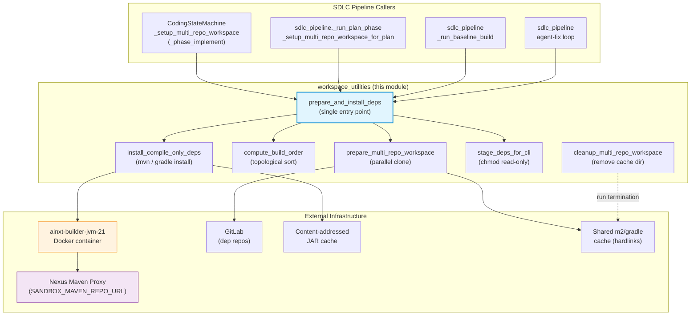
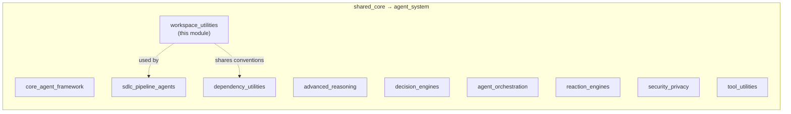
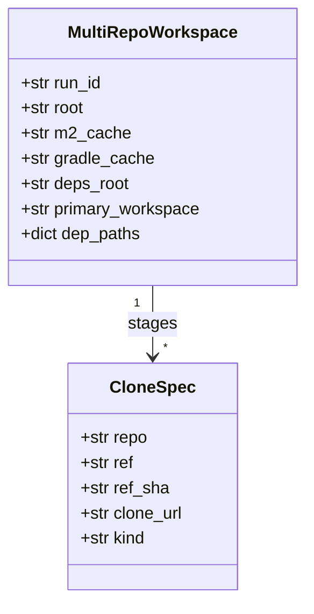
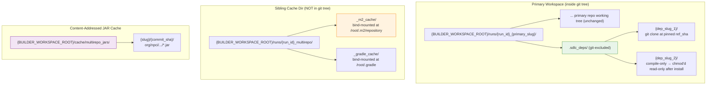
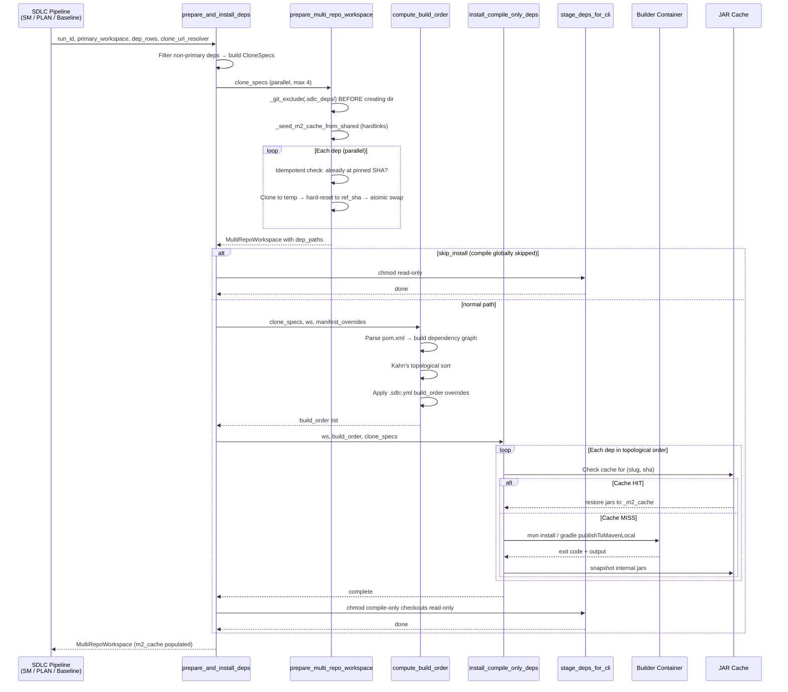
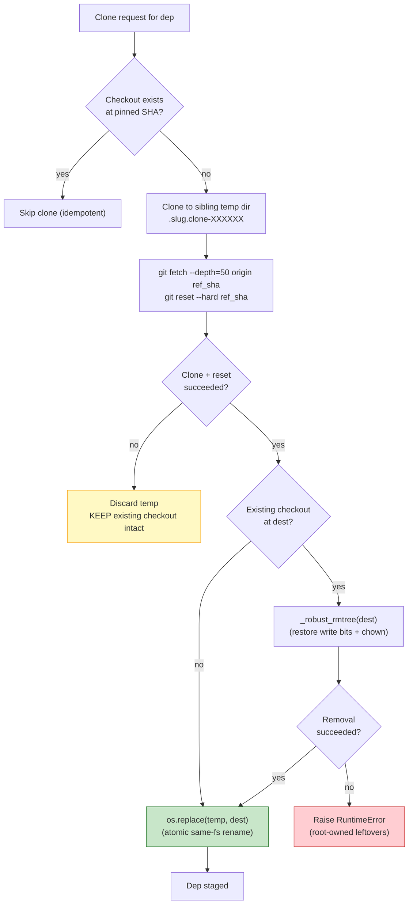
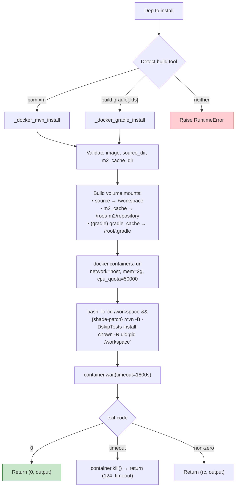
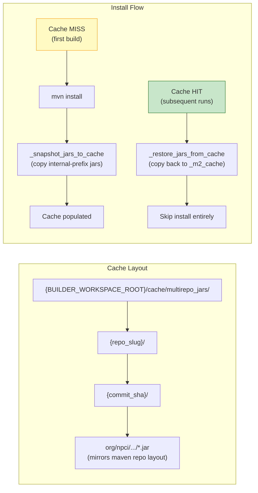

# workspace_utilities

## Introduction

The `workspace_utilities` module (`agents/multi_repo_workspace.py`) provides **multi-repository workspace assembly and sandboxed dependency installation** for the SDLC (Software Development Lifecycle) pipeline. It exists to solve a specific infrastructure constraint: NPCI's Nexus Maven proxy serves public artifacts but does **not** host internal `org.npci.*` artifacts. When an SDLC run touches a repository that depends on another internal repository, the dependent repository's JAR must be **built from source** before the primary repository can compile.

This module orchestrates the full lifecycle of that multi-repo dependency staging — from parallel git cloning, through topological build ordering, to sandboxed `mvn install` / `gradle publishToMavenLocal` inside the existing `ainxt-builder-jvm-*` container — and then makes the staged checkouts safely visible to the headless CLI coder while protecting the primary repository's git tree from vendored dependency source.

> **Status:** LIVE. The primary entry point `prepare_and_install_deps` is invoked from multiple SDLC pipeline phases (PLAN, IMPLEMENT, baseline build gate, and the agent-fix loop).

---

## Architecture Overview

### Module Position in the System

The module sits within the `agent_system` → `workspace_utilities` subtree of the shared core, alongside other agent-supporting utilities. It is consumed exclusively by the SDLC pipeline agents and workers — it has no direct API surface and is never called from the gateway or frontend.

---

## Core Components

### Public Entry Points

| Function | Purpose |
|---|---|
| `prepare_and_install_deps` | **Single shared entry point** for all callers. Builds `CloneSpec`s from `sdlc_run_repos` rows, clones every non-primary dep, topologically orders compile-only deps, installs each into the per-run `_m2_cache`, and returns the populated `MultiRepoWorkspace`. |
| `prepare_multi_repo_workspace` | Creates workspace directories and clones every dep in parallel (default concurrency 4). Idempotent — short-circuits when a checkout is already at the pinned SHA. |
| `compute_build_order` | Determines the install order for compile-only deps via topological sort (Kahn's algorithm) over internal-prefix Maven dependencies. Supports `.sdlc.yml build_order:` overrides. |
| `install_compile_only_deps` | Installs each compile-only dep into the per-run local Maven repo via `mvn install` or `gradle publishToMavenLocal` inside the builder container. Uses a content-addressed JAR cache to skip redundant builds. |
| `stage_deps_for_cli` | Strips write bits from compile-only checkouts so the headless CLI can read but not edit them. Must be called **after** install (mvn writes `target/` into the checkout). |
| `cleanup_multi_repo_workspace` | Removes the sibling multi-repo cache directory (`{run_id}_multirepo/`). Dep checkouts inside the primary workspace die with the primary workspace. |

### Helper Functions

| Function | Purpose |
|---|---|
| `_is_internal_group` | Checks whether a Maven `groupId` starts with a configured internal prefix (default `org.npci.`). Used to identify which artifacts to snapshot into the content-addressed cache. |
| `_make_workspace_dirs` | Creates the sibling cache dirs and the in-workspace `.sdlc_deps/` staging root. Excludes `.sdlc_deps/` from git **before** creating the directory. |
| `_git_exclude` | Best-effort appends a pattern to `<workspace>/.git/info/exclude` so vendored dep trees never appear in the review diff. Thread-safe via `STAGE_LOCK`. |
| `_clone_one` | Clones a single dep to a temp dir, hard-resets to the pinned SHA, then atomically swaps it into place. Never destroys an existing good checkout before its replacement is known good. |
| `_docker_mvn_install` | Runs `mvn -B -DskipTests install` inside the `ainxt-builder-jvm-*` container with host networking, per-run m2 cache mount, and post-build chown. |
| `_docker_gradle_install` | Runs `gradle publishToMavenLocal` inside the same builder container. Prefers the wrapper (`./gradlew`) when present. |
| `_snapshot_jars_to_cache` | After a successful install, copies internal-prefix JARs from `_m2_cache` to the content-addressed cache keyed by `(repo_slug, commit_sha)`. |
| `_restore_jars_from_cache` | Copies cached JARs for `(slug, sha)` back into `_m2_cache`. Returns `True` on cache hit. |
| `_seed_m2_cache_from_shared` | Hardlinks the shared Maven cache into the per-run cache so public deps (Spring, JUnit, etc.) are pre-warmed. Falls back to full copy. |
| `_kahn` | Topological sort (Kahn's algorithm). Returns `None` on cycle detection. |
| `_chmod_tree` | Adds/removes write bits across a directory tree (read+execute bits untouched). |
| `_robust_rmtree` | Removes a dep checkout, coping with root-owned build residue by restoring write bits and reclaiming ownership via host `chown`. |

---

## Data Models

### `MultiRepoWorkspace`

All paths the state machine needs to drive a multi-repo run:

| Field | Description |
|---|---|
| `run_id` | Unique SDLC run identifier |
| `root` | Base dir for the multi-repo workspace (`{BUILDER_WORKSPACE_ROOT}/runs/{run_id}_multirepo/`) |
| `m2_cache` | Per-run Maven repository (`_m2_cache/`), bind-mounted at `/root/.m2/repository` |
| `gradle_cache` | Per-run Gradle cache (`_gradle_cache/`), bind-mounted at `/root/.gradle` |
| `deps_root` | `<primary_workspace>/.sdlc_deps` — git-excluded staging root for dep checkouts |
| `primary_workspace` | Path to the existing single-repo workspace |
| `dep_paths` | `{repo: absolute_path}` map for each staged dep checkout |

### `CloneSpec`

Minimal input the cloner needs for one dependency:

| Field | Description |
|---|---|
| `repo` | GitLab namespace/project (e.g. `npci/payments-sdk`) |
| `ref` | Branch or tag passed at trigger |
| `ref_sha` | Commit SHA pinned at preflight (authoritative) |
| `clone_url` | Authenticated git clone URL (https or ssh) |
| `kind` | `'editable'` or `'compile-only'` |

---

## Workspace Layout

### Why Deps Live Inside the Primary Workspace

The deployed headless `ainxt` CLI jails its file tools to the session's workspace cwd. `--add-dir` is a verified no-op for the read tool (an absolute path outside cwd is invisible even under full permission bypass), and symlinks out of the workspace are equally dead. A dep checkout in a sibling directory is simply invisible to PLAN/IMPLEMENT. The only working pattern is to place the material **inside** the workspace, then defend the primary repo two ways:

1. **`.git/info/exclude`** — `.sdlc_deps/` is excluded **before** the directory is created, so a concurrent `git add -A` can never stage vendored trees into the customer's MR / VERIFIED_DIFF.
2. **Filesystem read-only chmod** — `stage_deps_for_cli` strips write bits from every `compile-only` checkout **after** install completes. The CLI's `--permission-mode plan` does not block writes; only `EACCES` does.

---

## Process Flows

### End-to-End Multi-Repo Preparation

### Clone Safety: Temp-Then-Swap

### Docker Install Flow

---

## Content-Addressed JAR Cache

`mvn install` is slow (1–3 minutes for a small library, 10+ for a large one). The module caches produced internal JARs on the runtime host, keyed by the dep's `(repo_slug, commit_sha)`.

Only artifacts under configured internal group prefixes (default `org.npci.`) are snapshotted — third-party JARs are produced by Maven anyway and would bloat the cache.

---

## Dependencies and Integration

### Upstream Callers

The module is consumed by the SDLC pipeline. See [sdlc_pipeline_agents](sdlc_pipeline_agents.md) for the full pipeline architecture.

| Caller | Context | Failure Handling |
|---|---|---|
| `CodingStateMachine._setup_multi_repo_workspace` | Called from `_phase_implement` (IMPLEMENT phase) | Suspends the run on failure |
| `sdlc_pipeline._setup_multi_repo_workspace_for_plan` | Called from `_run_plan_phase` (PLAN phase) | Logs failure and continues without dep JARs |
| `sdlc_pipeline._run_baseline_build` | WS-2 baseline build gate | Treated as non-transient baseline breakage (DEPENDENCY_MISSING) |
| `sdlc_pipeline` agent-fix loop | Baseline agent-fix recompile oracle | Builds internal deps once so the fix loop sees the same locally-built JARs |

### Shared Infrastructure

| Dependency | Relationship |
|---|---|
| `agents/_stage_lock.py` (`STAGE_LOCK`) | Shared `threading.Lock` for serializing `.git/info/exclude` writes between this module and `agents/sdlc_governance/engine.py`. Lives in a dependency-free module so neither writer imports the other's heavy module chain. |
| `sandbox/workspace_builder.py` | The module mirrors its Docker conventions: same builder image (`{BUILDER_REGISTRY}/ainxt-builder-jvm-21:latest`), host networking, m2 cache mount at `/root/.m2/repository` (not `/root/.m2` — preserves baked-in `settings.xml`), memory/CPU quotas, and post-build chown. |
| `core/config.py` | Provides `BUILDER_REGISTRY`, `BUILDER_IMAGE_JVM`, `BUILDER_CACHE_ROOT`. Imported lazily to keep the module testable without forcing `core.config` evaluation at load time. |
| `agents/dep_resolver.py` | Shares the `INTERNAL_GROUP_PREFIXES` default (`org.npci.`). The two modules stay in sync via the same env var. |
| `workers/workspace_sync_worker.py` | `_force_remove_dir` restores write bits across the tree before `rmtree`, so read-only compile-only checkouts cannot wedge primary workspace cleanup. |

### Docker SDK Usage

The module uses the Docker SDK (`docker.from_env()`) directly — never `docker run` via subprocess — consistent with `sandbox/workspace_builder.py`. Key alignments:

- **Image:** `{BUILDER_REGISTRY}/ainxt-builder-jvm-21:latest` — pulled from the internal Docker registry, **not** Docker Hub (air-gapped environments cannot reach Hub).
- **Network:** `host` mode so the container can reach `SANDBOX_MAVEN_REPO_URL` (Nexus proxy).
- **Cache mount:** Per-run `_m2_cache` bind-mounted at `/root/.m2/repository` — **not** `/root/.m2` (the builder image has `settings.xml` with Nexus credentials baked in at `/root/.m2/settings.xml`; covering the whole `.m2` dir would hide it).
- **Root-in-container:** The container runs as root (needs the baked-in Nexus creds + cache mount). Post-build `chown -R {uid}:{gid} /workspace` reclaims ownership so host-side cleanup succeeds.
- **Maven shade-plugin patch:** Maven 3.9+ breaks shade-plugin ≤ 2.x; a `sed` patch upgrades it to 3.3.0 before install (same fix as `workspace_builder.py`).

---

## Configuration

All configuration is environment-variable driven with sensible defaults:

| Variable | Default | Description |
|---|---|---|
| `BUILDER_WORKSPACE_ROOT` | `/opt/ainxt/workspaces` | Root directory for all run workspaces and caches |
| `BUILDER_REGISTRY` | (from `core.config`) | Internal Docker registry URL |
| `BUILDER_IMAGE_JVM` | `ainxt-builder-jvm-21:latest` | JVM builder image name |
| `BUILDER_CACHE_ROOT` | `/opt/ainxt/build-cache` | Root for shared build caches |
| `INTERNAL_GROUP_PREFIXES` | `org.npci.` | Comma-separated Maven groupId prefixes identifying internal artifacts |
| `MULTI_REPO_INSTALL_MEMORY` | `2g` | Memory limit for install containers |
| `MULTI_REPO_INSTALL_CPU_QUOTA` | `50000` | CPU quota (50000 = 50% of one CPU) |
| `MULTI_REPO_INSTALL_TIMEOUT` | `1800` | Container wait timeout in seconds |
| `AINXT_KEEP_FAILED_WORKSPACE` | (unset) | When `1`, cleanup is skipped (for debugging) |

---

## Security and Concurrency Considerations

### Git Exclusion Safety

The `.sdlc_deps/` directory is added to `.git/info/exclude` **before** the directory is created. This ordering prevents a race window in which a concurrent `git add -A` could stage the entire vendored dep tree into the customer's MR. If the exclude fails, an `ERROR`-level log is emitted (the audit signal that vendored dep source could enter the diff), but the directory is still created — the defence-in-depth guard in `_collect_workspace_edits` (which drops any `.sdlc_deps/` path from the primary diff) is the backstop.

### Thread Safety

- **Parallel cloning:** Up to `max_clone_concurrency` (default 4) deps clone simultaneously via `ThreadPoolExecutor`.
- **Serial installation:** `mvn install` runs strictly serially in topological order — each dep's build may produce JARs consumed by the next dep's build.
- **Shared exclude file:** `STAGE_LOCK` serializes read-modify-append on `<workspace>/.git/info/exclude` between this module and `agents/sdlc_governance/engine.py`.

### Root-Owned Residue

Dep builds run the container as root, so artifacts written to the bind-mounted `/workspace` (e.g. Maven `target/`) become root-owned on the host. Two mitigations:

1. **In-container chown:** `_dep_chown_cmd()` runs `chown -R {uid}:{gid} /workspace` as the last build step (pass or fail).
2. **Host-side reclaim:** `_robust_rmtree` restores write bits and calls host `chown -R` before retrying `rmtree` on a dep checkout with root-owned leftovers.

### Read-Only Staging Caveat

`stage_deps_for_cli` strips write bits from compile-only checkouts, but this is **defence-in-depth**, not a hard guarantee:

- A later `mvn install` is normally short-circuited by the content-addressed cache hit before it touches the tree.
- The SDLC build container runs as **root**, which bypasses mode bits entirely.
- The read-only chmod protects against accidental writes from tooling that honours permissions, not against `mvn` itself re-writing the tree.

---

## Cleanup

`cleanup_multi_repo_workspace(run_id)` removes **only** the sibling multi-repo cache directory (`{run_id}_multirepo/`), which holds `_m2_cache` and `_gradle_cache`. Dep checkouts inside the primary workspace at `<primary_workspace>/.sdlc_deps/{slug}/` die with the primary workspace — `_force_remove_dir` in `workers/workspace_sync_worker.py` already restores write bits across the tree before `rmtree`, so the read-only compile-only checkouts cannot wedge cleanup.

The function is **idempotent** (safe to call when the workspace was never created) and respects `AINXT_KEEP_FAILED_WORKSPACE=1` for debugging.
