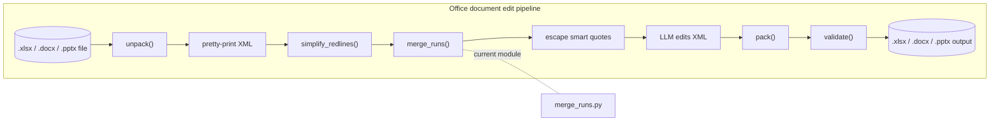
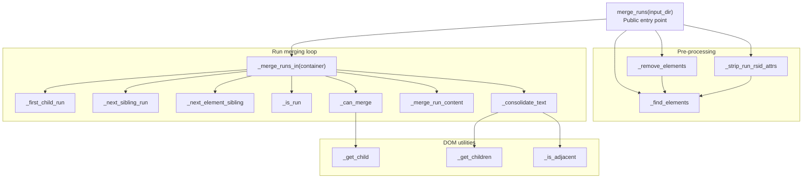
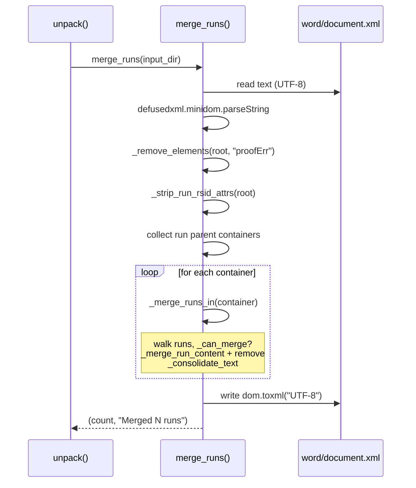
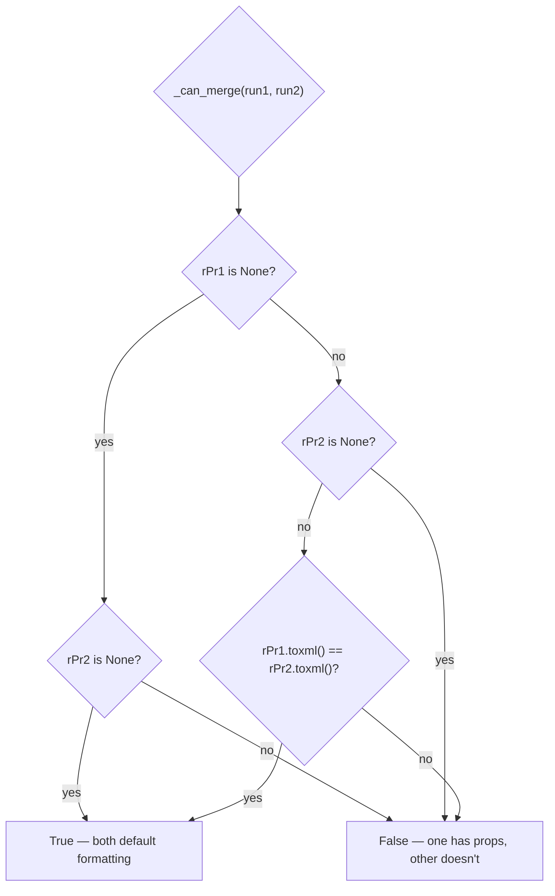
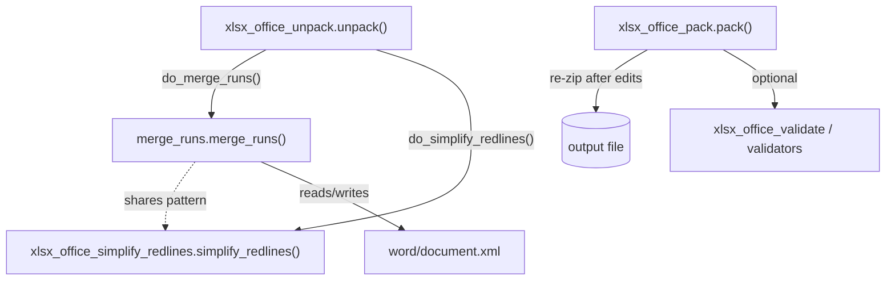
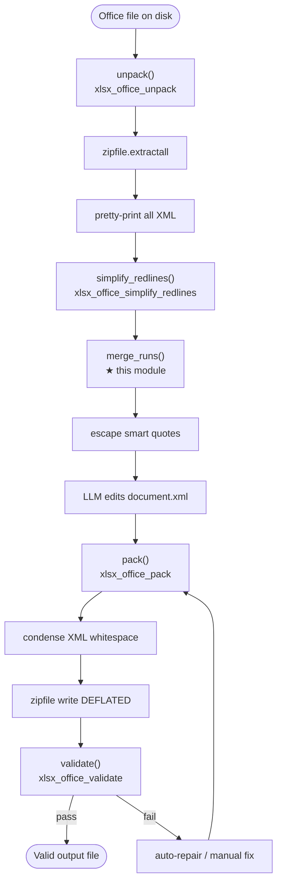

# xlsx_office_merge_runs

> Helper module that merges adjacent OOXML `<w:r>` (run) elements with identical
> `<w:rPr>` formatting inside unpacked Office documents, and consolidates their
> text nodes. It is one of the post-processing steps applied when an Office file
> (`.docx`/`.pptx`/`.xlsx`) is unpacked for LLM-driven editing.

## 1. Purpose & Scope

`merge_runs.py` lives at
`skills/ainxt_docskills/xlsx/scripts/office/helpers/merge_runs.py` and is the
**run-merging** stage of the XLSX office-processing toolkit. Although the file is
located under the `xlsx` skill tree, the OOXML run model it operates on is shared
by WordprocessingML (`word/document.xml`), so the same logic is reused (via
near-identical copies) by the [docx_office_merge_runs](docx_office_merge_runs.md)
and [pptx_office_merge_runs](pptx_office_merge_runs.md) sibling modules.

The module is responsible for:

| Concern | What it does |
|---|---|
| **Run deduplication** | Collapses consecutive `<w:r>` elements whose `<w:rPr>` (run properties) serialize to the same XML, folding the second run's content into the first and removing the duplicate. |
| **Rsid stripping** | Removes `w:rsid*` revision-save ID attributes from every run. These are authoring metadata that do not affect rendering and would otherwise prevent otherwise-mergeable runs from being considered identical. |
| **Proof-error cleanup** | Deletes all `<w:proofErr>` (spell/grammar) markers, which sit between runs and block adjacency-based merging. |
| **Text consolidation** | After runs are merged, adjacent `<w:t>` text children inside a single run are concatenated, with correct `xml:space="preserve"` handling for leading/trailing whitespace. |

The net effect is a smaller, cleaner XML tree that is easier for an LLM to edit
diff-style and that re-packs into a valid, compact Office file.

## 2. Where It Fits in the System

`merge_runs` is **not** a standalone entry point. It is invoked by the
[xlsx_office_unpack](xlsx_office_unpack.md) `unpack()` function as one of several
normalization passes applied to a freshly extracted Office package. The broader
office toolkit it belongs to is documented under
[xlsx_office_pack](xlsx_office_pack.md), [xlsx_office_validate](xlsx_office_validate.md),
[xlsx_office_soffice](xlsx_office_soffice.md), and
[xlsx_office_simplify_redlines](xlsx_office_simplify_redlines.md).

The dashed node marks the scope of this document. `unpack()` only calls
`merge_runs` for `.docx` inputs (where the WordprocessingML run model applies);
for `.xlsx`/`.pptx` the run-merge pass is skipped because their primary content
XML uses different element models (SpreadsheetML cells, PresentationML shapes).

## 3. Architecture

### 3.1 Component Map

The module is a single file of pure functions operating on a `defusedxml.minidom`
document. There is no class hierarchy and no I/O beyond reading/writing
`word/document.xml` inside the unpacked directory.

### 3.2 Public API

#### `merge_runs(input_dir: str) -> tuple[int, str]`

The only externally called function. It:

1. Resolves `word/document.xml` inside `input_dir`.
2. Parses it with `defusedxml.minidom` (XXE-safe).
3. Removes all `<w:proofErr>` elements via `_remove_elements`.
4. Strips every `*rsid*` attribute from all `<w:r>` elements via `_strip_run_rsid_attrs`.
5. Collects the unique parent nodes of all runs (paragraphs, table cells, tracked-change wrappers `<w:ins>`/`<w:del>`, etc.).
6. Calls `_merge_runs_in` on each container, accumulating a merge count.
7. Writes the serialized XML back to disk.
8. Returns `(merge_count, human_readable_message)`.

On any exception it returns `(0, "Error: ...")` so callers can treat failure
non-fatally — `unpack()` simply appends the message to its summary string.

### 3.3 Internal Helpers

| Function | Role |
|---|---|
| `_find_elements(root, tag)` | Depth-first traversal collecting elements whose local name equals `tag` (namespace-agnostic via `localName`/`tagName` fallback). |
| `_get_child(parent, tag)` | First direct child element matching `tag`, or `None`. |
| `_get_children(parent, tag)` | All direct child elements matching `tag`. |
| `_is_adjacent(elem1, elem2)` | True if `elem2` follows `elem1` with only whitespace text nodes in between — used to decide whether two `<w:t>` nodes can be concatenated. |
| `_remove_elements(root, tag)` | Detaches every element matching `tag` from its parent. |
| `_strip_run_rsid_attrs(root)` | Iterates all runs and deletes any attribute whose name contains `rsid`. |
| `_merge_runs_in(container)` | Core per-container loop: walks runs left-to-right, greedily merging each run with its immediately-following sibling when `_can_merge` is true, then consolidates text. |
| `_first_child_run(container)` | First direct child of `container` that `_is_run` recognizes. |
| `_next_element_sibling(node)` | Next sibling that is an element node (skips text/whitespace). |
| `_next_sibling_run(node)` | Next sibling that is specifically a run element. |
| `_is_run(node)` | True if the node's local name is `r` or ends with `:r`. |
| `_can_merge(run1, run2)` | True when both runs have an `<w:rPr>` child with identical serialized XML, or both lack one. A present/absent mismatch always returns `False`. |
| `_merge_run_content(target, source)` | Moves every child of `source` except `<w:rPr>` into `target`. The source run is then removed by the caller. |
| `_consolidate_text(run)` | After a merge, a run may contain multiple adjacent `<w:t>` nodes. This concatenates each adjacent pair (using `_is_adjacent`), sets `xml:space="preserve"` when the merged text has leading/trailing spaces, and removes the now-redundant `<w:t>`. |

## 4. Data Flow

### 4.1 Merge Decision Logic

`_can_merge` is the gating predicate. Two runs are mergeable **iff** their
`<w:rPr>` children are byte-identical after serialization:

Because rsid attributes are stripped *before* merging, two runs that differ only
in revision-save metadata will serialize identically and be merged. This is the
key insight that makes the pass effective on real-world documents, which
typically carry per-keystroke rsid tags.

### 4.2 Text Consolidation

After `_merge_run_content` folds content from `source` into `target`, the target
run may contain several `<w:t>` elements that were previously separated by run
boundaries. `_consolidate_text` walks them in reverse and, for each adjacent
pair, concatenates the text into the earlier node and removes the later one.
Whitespace correctness is preserved by toggling `xml:space="preserve"`:

- If the merged string starts or ends with a space → set `xml:space="preserve"`.
- Otherwise → remove any stale `xml:space` attribute.

This matters because OOXML collapses whitespace in `<w:t>` unless
`xml:space="preserve"` is set, so losing the attribute on a space-bearing text
node would silently corrupt the document.

## 5. Dependencies

### 5.1 External Libraries

| Library | Usage |
|---|---|
| `defusedxml.minidom` | XXE-hardened DOM parser used for all XML manipulation. |
| `pathlib.Path` | Filesystem path handling. |

The module deliberately avoids `lxml` (used heavily by the
[xlsx_office_validators](xlsx_office_validators.md) module) to keep the helper
lightweight and dependency-free beyond the security-hardened stdlib alternative.

### 5.2 Module Dependencies

`merge_runs` is invoked exclusively through the `do_merge_runs` indirection in
`unpack.py`. The unpack function's signature exposes boolean toggles
(`merge_runs=True`, `simplify_redlines=True`) so callers can disable the pass if
needed.

### 5.3 Sibling Modules (Shared Code Pattern)

The same `merge_runs.py` source is duplicated across three skill trees. They are
functionally identical and maintained in lockstep:

| Module | Path |
|---|---|
| **xlsx_office_merge_runs** (this module) | `skills/ainxt_docskills/xlsx/scripts/office/helpers/merge_runs.py` |
| [docx_office_merge_runs](docx_office_merge_runs.md) | `skills/ainxt_docskills/docx/scripts/office/helpers/merge_runs.py` |
| [pptx_office_merge_runs](pptx_office_merge_runs.md) | `skills/ainxt_docskills/pptx/scripts/office/helpers/merge_runs.py` |

A legacy copy also exists under `ABStudio/skills/ainxt-skills/{docx,pptx,xlsx}/scripts/office/helpers/merge_runs.py`.
See [docskills_legacy](docskills_legacy.md) for the broader legacy skill layout.

## 6. Process Flow: Full Unpack → Edit → Pack Cycle

For context, the diagram below shows the complete lifecycle in which
`merge_runs` participates. Steps highlighted with the current-module marker are
documented here; the rest are covered by their respective module docs.

## 7. Key Design Notes

### 7.1 Why Merge Runs at All?

LLM-based document editing works best on a minimal, canonical XML
representation. Real-world Office files accumulate redundant runs from
incremental editing sessions — each keystroke can produce a new `<w:r>` with its
own rsid, even when the formatting is unchanged. Without merging, an LLM diff
must reason about dozens of near-identical runs, increasing the chance of
malformed edits and inflating token usage.

### 7.2 Namespace Handling

All tag comparisons use `node.localName` with a fallback to `node.tagName`, and
accept both bare names (`r`) and namespaced names (`w:r`). This makes the helper
robust to whether the DOM exposes prefixed or default-namespace elements, which
varies across `minidom` versions and source XML styles.

### 7.3 Container-Aware Merging

Rather than merging runs globally, the pass collects the **parent nodes** of all
runs and merges within each container independently. This correctly handles runs
nested inside tracked-change wrappers (`<w:ins>`, `<w:del>`) — runs in different
wrappers are never merged across the wrapper boundary, preserving the
revision-tracking semantics that [xlsx_office_simplify_redlines](xlsx_office_simplify_redlines.md)
relies on.

### 7.4 Error Isolation

`merge_runs` wraps its entire body in a `try/except` and returns an error string
rather than raising. This is intentional: it runs inside `unpack()`, which is
itself inside a larger pipeline. A failure to merge runs should not abort the
unpack — the document remains editable, just less compact. The returned message
is surfaced to the user via `unpack()`'s summary string.

### 7.5 Ordering Relative to `simplify_redlines`

`unpack()` calls `simplify_redlines` **before** `merge_runs`. This ordering
matters: `simplify_redlines` first consolidates adjacent tracked-change wrappers
of the same type, which can place previously-separated runs next to each other.
Only after that consolidation does `merge_runs` have a chance to merge the
newly-adjacent runs. Reversing the order would leave mergeable runs stranded
across wrapper boundaries.

## 8. Related Documentation

| Topic | Document |
|---|---|
| Unpack entry point that calls `merge_runs` | [xlsx_office_unpack](xlsx_office_unpack.md) |
| Re-packing edited XML into an Office file | [xlsx_office_pack](xlsx_office_pack.md) |
| Schema & redlining validation | [xlsx_office_validate](xlsx_office_validate.md) |
| Tracked-change consolidation (runs before merge) | [xlsx_office_simplify_redlines](xlsx_office_simplify_redlines.md) |
| LibreOffice headless invocation | [xlsx_office_soffice](xlsx_office_soffice.md) |
| Validator class hierarchy | [xlsx_office_validators](xlsx_office_validators.md) |
| Formula recalculation for XLSX | [xlsx_recalc](xlsx_recalc.md) |
| Legacy docskills layout | [docskills_legacy](docskills_legacy.md) |
| DOCX sibling (identical logic) | [docx_office_merge_runs](docx_office_merge_runs.md) |
| PPTX sibling (identical logic) | [pptx_office_merge_runs](pptx_office_merge_runs.md) |
