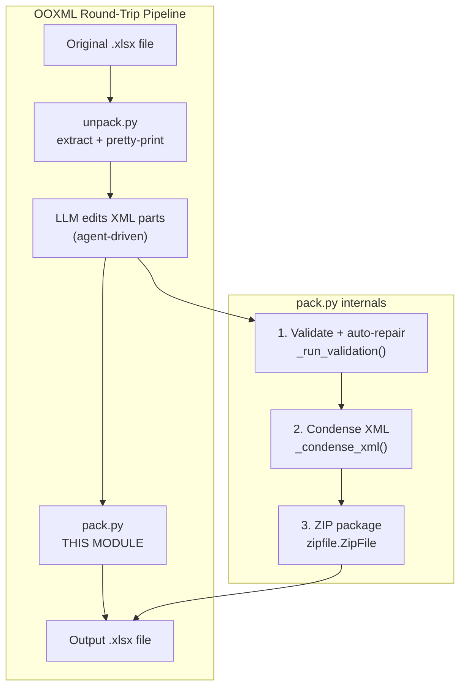
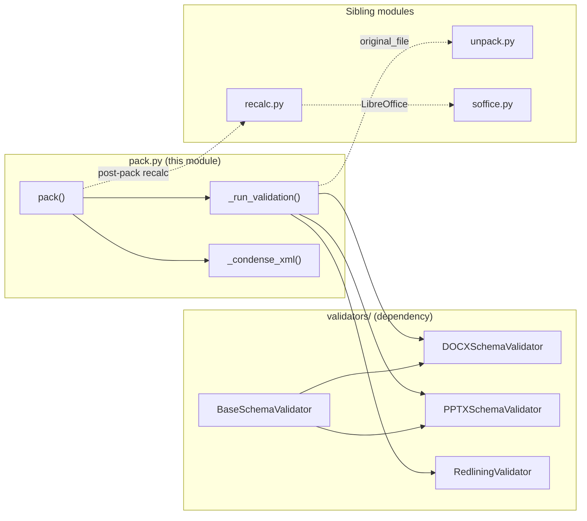
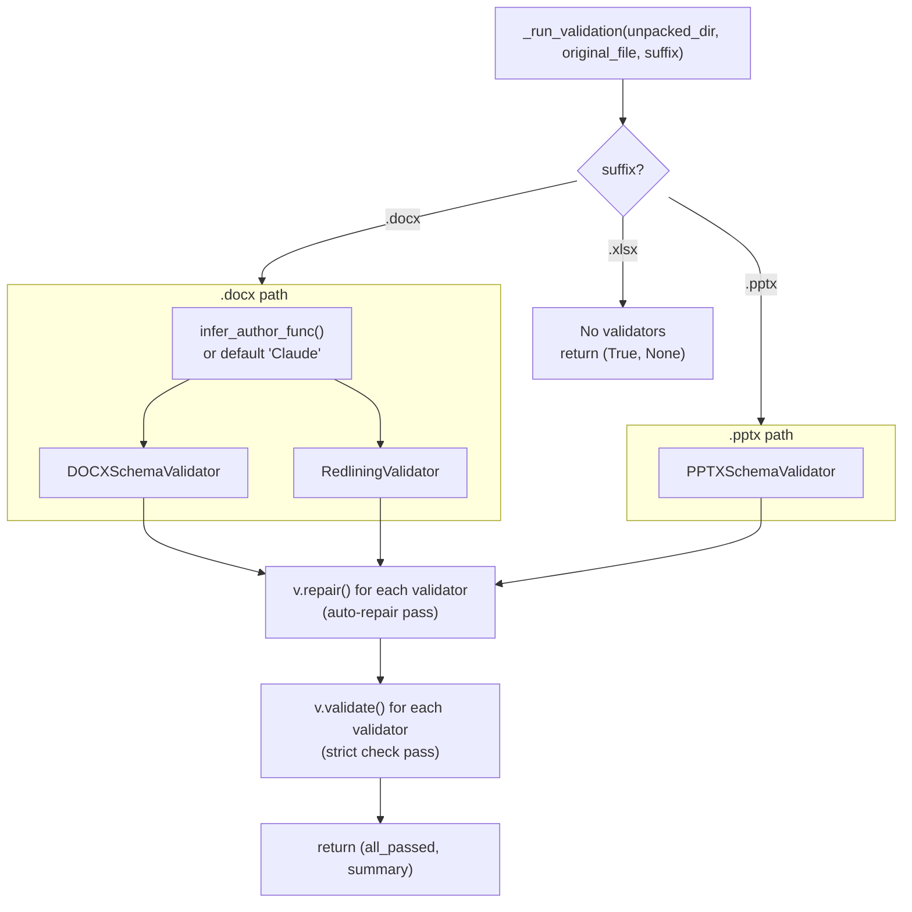
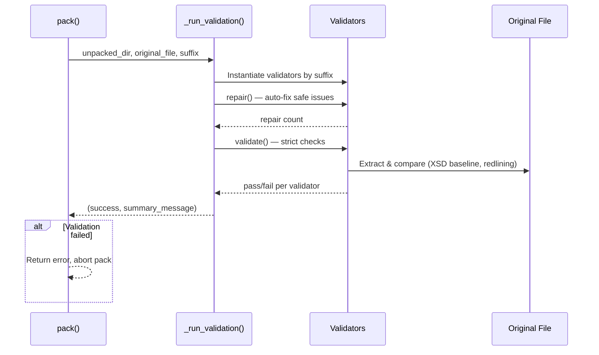
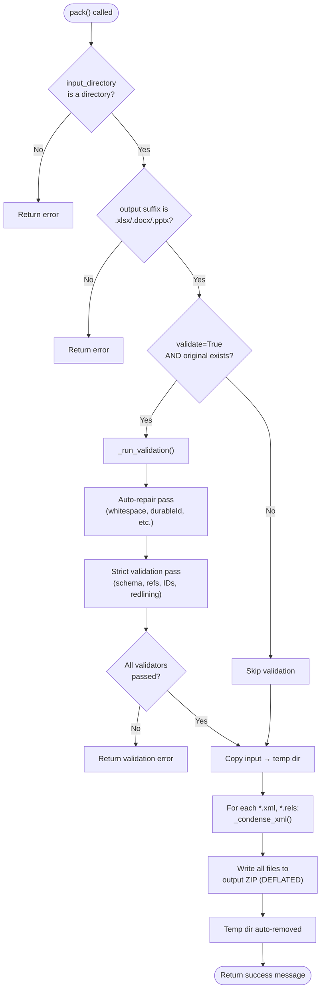

# xlsx_office_pack

## Introduction

The `xlsx_office_pack` module is the **packing (re-assembly) stage** of the Office Open XML (OOXML) document skills pipeline. It takes an unpacked directory of XML parts — produced by the companion `unpack` step — and reassembles them into a valid, compressed `.xlsx` (or `.docx` / `.pptx`) Office file.

Before zipping, the packer performs three critical jobs:

1. **Validation with auto-repair** — runs schema and structural validators against the unpacked parts, comparing them against the original file, and automatically repairs common issues (whitespace preservation, durable-ID overflows, etc.).
2. **XML condensation** — strips insignificant whitespace text nodes and XML comments from every `.xml` / `.rels` part (while preserving text inside `*:t` elements) to produce compact, deterministic output.
3. **ZIP packaging** — writes all parts into a standard OOXML ZIP container using `ZIP_DEFLATED`.

This module lives within the `shared_skills` → `docskills_legacy` → `xlsx` skill tree and is the inverse of the [`xlsx_office_unpack`](xlsx_office_unpack.md) module. Together they form the unpack → edit → validate → pack round-trip that lets an LLM agent manipulate Office documents at the XML level with safety guarantees.

---

## Architecture Overview



### Component Relationships



---

## Core Components

### `pack()`

The public entry point. Orchestrates the full validate → condense → zip sequence.

| Parameter | Type | Description |
|-----------|------|-------------|
| `input_directory` | `str` | Path to the unpacked OOXML parts directory. |
| `output_file` | `str` | Destination `.xlsx` / `.docx` / `.pptx` path. |
| `original_file` | `str \| None` | Original Office file used as the validation baseline. Required for validation to run. |
| `validate` | `bool` | Whether to run validation + auto-repair before packing (default `True`). |
| `infer_author_func` | `callable \| None` | Optional callback to infer the tracked-changes author for redlining validation. |

**Returns:** `(None, message_str)` — a tuple where the second element is a human-readable status string. Messages containing `"Error"` indicate failure.

**Key behaviours:**
- Rejects non-directory inputs and unsupported file extensions.
- Only runs validation when both `validate=True` **and** `original_file` is provided and exists.
- Copies the input directory to a temporary location before condensing, so the source is never mutated.
- Creates parent directories of the output file automatically.

### `_run_validation()`

Internal helper that instantiates and runs the appropriate validators based on the output file suffix.



**Validation vs. repair — two-pass design:**
1. **Repair pass** — each validator's `repair()` method fixes known-safe issues (e.g., adding `xml:space="preserve"`, regenerating out-of-range `durableId` values). Returns a count of repairs applied.
2. **Validation pass** — each validator's `validate()` method runs the full suite of structural, schema, and semantic checks. All must pass for the pack to succeed.

> **Note on XLSX:** Currently, `_run_validation()` only instantiates validators for `.docx` and `.pptx`. For `.xlsx` outputs, validation is skipped (returns `True, None`). XLSX integrity is instead enforced downstream by the [`recalc`](#relationship-to-recalc) step.

### `_condense_xml()`

Transforms a single XML file in-place to remove noise:

- **Removes** whitespace-only text nodes from all elements **except** those ending in `:t` (text-run elements whose whitespace is semantically significant).
- **Removes** all XML comment nodes.
- **Re-serializes** using `defusedXML.minidom.toxml(encoding="UTF-8")`.

This produces compact, deterministic XML that reduces file size and avoids spurious diffs. If parsing fails, the error is printed to `stderr` and re-raised (fail-fast).

**Security:** Uses `defusedXML` (defused `xml.dom.minidom`) to mitigate XML external entity (XXE) attacks when parsing untrusted document parts.

---

## Validation Subsystem (Dependency)

The pack module delegates all structural correctness checking to the `validators/` package. See [`xlsx_office_validators`](xlsx_office_validators.md) for full details. Summary of what each validator covers:

| Validator | Applies to | Key checks |
|-----------|-----------|------------|
| `BaseSchemaValidator` | All formats (base class) | XML well-formedness, namespace declarations, unique IDs, file-reference integrity, content-type declarations, XSD schema conformance, whitespace-preservation repair |
| `DOCXSchemaValidator` | `.docx` | All base checks + tracked-change correctness (`w:del`/`w:ins` nesting), `paraId`/`durableId` constraints, comment marker pairing, paragraph-count comparison |
| `PPTXSchemaValidator` | `.pptx` | All base checks + UUID ID validation, slide-layout ID references, notes-slide reference uniqueness, duplicate slide-layout detection |
| `RedliningValidator` | `.docx` (tracked changes) | Verifies that removing the agent author's tracked changes reproduces the original document text — catches untracked edits |

### Validation Data Flow



---

## Relationship to Sibling Modules

The pack module is one stage in the XLSX skill pipeline. The complete flow for XLSX processing is:


| Sibling module | Role | Relationship to pack |
|----------------|------|---------------------|
| [`xlsx_office_unpack`](xlsx_office_unpack.md) | Extracts an Office file into a directory of pretty-printed XML parts | **Inverse** — pack reassembles what unpack disassembled. Pack uses the original file (passed via `--original`) as the validation baseline. |
| [`xlsx_office_soffice`](xlsx_office_soffice.md) | Wraps LibreOffice (`soffice`) headless invocations | Used by `recalc.py` (not directly by pack) to recalculate formulas after packing. |
| [`xlsx_office_validate`](xlsx_office_validate.md) | CLI wrapper around the validators package | Pack calls the same validators programmatically; the standalone validate script can be used independently for debugging. |
| `recalc.py` | Recalculates all formulas via LibreOffice and reports Excel errors | Runs **after** pack to ensure formula correctness in the final XLSX. |
| `xlsx_to_json.py` | Converts XLSX structure to JSON for LLM consumption | Runs **before** editing, providing the agent a structured view of the workbook. |

---

## Process Flow: Full Pack Lifecycle



---

## CLI Usage

The module is executable as a standalone script:

```bash
python pack.py <input_directory> <output_file> [--original <file>] [--validate true|false]
```

**Examples:**

```bash
# Pack with full validation against the original
python pack.py unpacked/ output.xlsx --original input.xlsx

# Pack without validation (faster, no safety checks)
python pack.py unpacked/ output.xlsx --validate false
```

The script exits with code `1` if the result message contains `"Error"`.

---

## Integration with the Broader System

This module is part of the **Anthropic document skills** collection (`shared_skills`), which provides LLM agents with safe, validated tools for manipulating Office documents. The skills are consumed by:

- **ABStudio backend** — the [`doc_generator`](shared_integrations.md) tool and document-generation workers use these skills to produce DOCX/PPTX/XLSX artifacts.
- **Document workers** — `workers/doc_worker.py` and `workers/doc_worker_agent.py` orchestrate the full generate → pack → deliver flow.
- **AI-UI frontend** — the `DocumentPreviewModal` component (with `XlsxRenderer`) renders the packed output for end users.

The round-trip safety guarantee (validate against original, auto-repair, condense) is what allows an LLM to confidently edit Office XML without producing corrupt files — a critical requirement for enterprise document automation.

---

## Key Design Decisions

1. **Two-pass validate-then-pack** — validation runs *before* condensation and zipping, so repairs are applied to the full-fidelity XML. Condensation only removes cosmetic noise, never semantic content.

2. **Non-destructive to source** — the input directory is copied to a temp dir before any modification, preserving the agent's working files.

3. **Fail-fast on XML parse errors** — `_condense_xml` re-raises exceptions rather than silently skipping malformed files, ensuring corrupt parts are never silently packaged.

4. **Defensive XML parsing** — `defusedxml` is used throughout to prevent XXE and entity-expansion attacks when handling untrusted document parts.

5. **Suffix-driven validator selection** — the pack module is format-agnostic at the top level; format-specific logic is encapsulated in the validator classes, making it straightforward to extend to additional OOXML formats.
