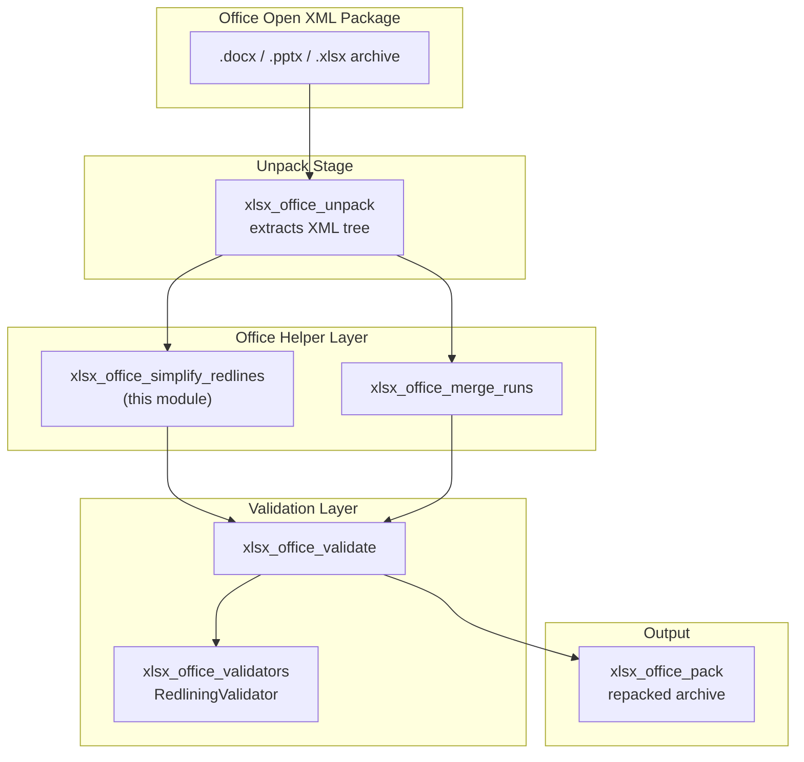
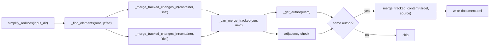
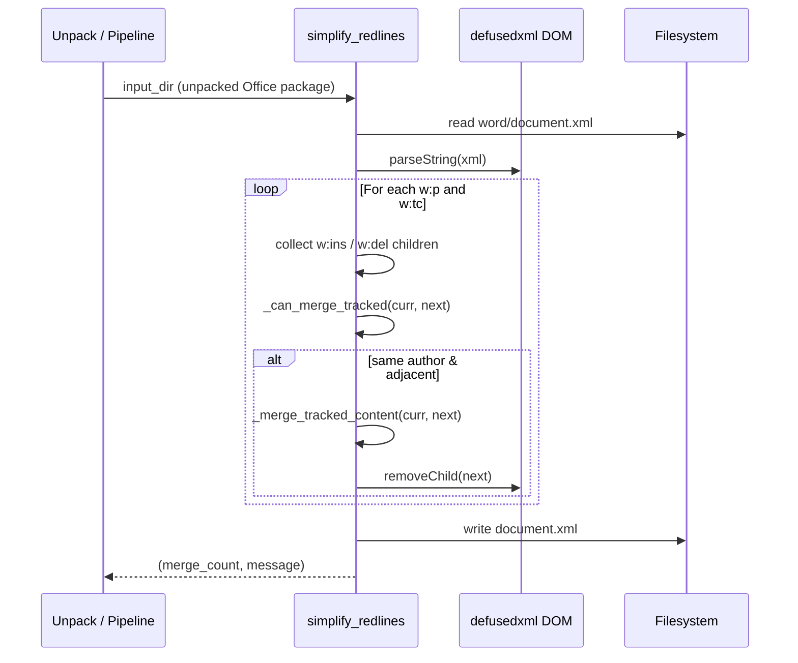
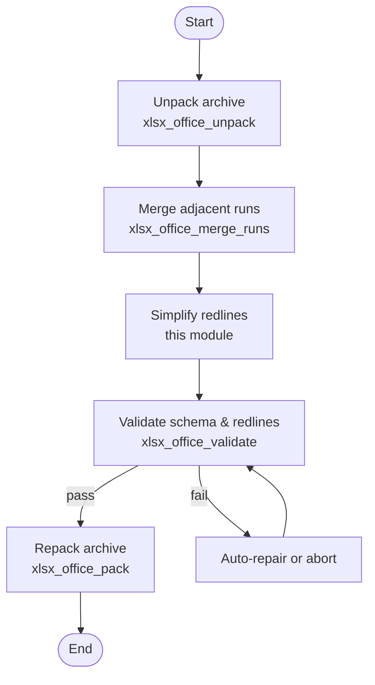
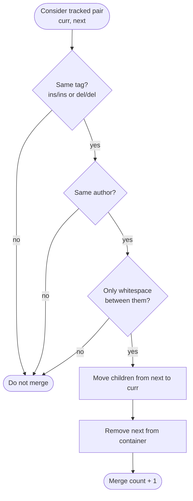

# xlsx_office_simplify_redlines

## Brief Introduction

`xlsx_office_simplify_redlines` is a legacy Office-document helper module in the `ainxt_docskills` skill set. It reduces the granularity of tracked changes (redlines) inside an unpacked Office Open XML package by merging adjacent insertion (`w:ins`) and deletion (`w:del`) elements that belong to the same author. The module also provides author-inference utilities that compare a modified document against an original `.docx`/`.pptx`/`.xlsx` archive to determine which author introduced new tracked changes.

> **Note on naming:** Although this module lives under the `xlsx` skill path, the implementation reuses the WordprocessingML tracked-change model (`word/document.xml`, `w:ins`, `w:del`). The same helper pattern is duplicated for `docx` and `pptx` skills. For format-specific packaging, validation, and recalculation logic, see the linked modules below.

---

## Core Functionality

| Capability | Description |
|------------|-------------|
| **Merge adjacent tracked changes** | Combines neighbouring `w:ins`/`w:del` wrappers when they share the same author and are separated only by whitespace. |
| **Container-aware traversal** | Operates inside paragraphs (`w:p`) and table cells (`w:tc`) so that merges never cross semantic boundaries. |
| **Author inference** | Compares tracked-change counts between a modified unpacked directory and the original archive to identify the author of newly added changes. |
| **Safe XML handling** | Uses `defusedxml.minidom` for parsing and writes the result back with UTF-8 encoding. |

---

## Architecture

The module is a pure Python helper with no external service dependencies beyond the Python standard library, `defusedxml`, and the local filesystem. It is designed to be invoked after an Office file has been unpacked into a directory tree.



### Component Breakdown



---

## Dependencies

### Internal Modules

| Module | Relationship | Purpose |
|--------|--------------|---------|
| [xlsx_office_unpack](xlsx_office_unpack.md) | Caller / upstream | Extracts the Office archive and optionally invokes `simplify_redlines` for `.docx` files. |
| [xlsx_office_pack](xlsx_office_pack.md) | Downstream consumer | Repacks the modified XML tree into a valid Office archive after simplification. |
| [xlsx_office_merge_runs](xlsx_office_merge_runs.md) | Sibling helper | Consolidates adjacent text runs (`w:r`) to reduce noise before or after redline simplification. |
| [xlsx_office_validate](xlsx_office_validate.md) | Downstream validator | Runs schema and redlining validation on the unpacked directory. |
| [xlsx_office_validators](xlsx_office_validators.md) | Downstream validator | Contains `RedliningValidator`, which verifies that tracked changes preserve document semantics. |
| [xlsx_recalc](xlsx_recalc.md) | Sibling utility | Recalculates Excel formulas; unrelated to redlines but part of the same xlsx skill family. |

### External Libraries

| Library | Usage |
|---------|-------|
| `defusedxml.minidom` | Safe DOM parsing and serialization of `document.xml`. |
| `xml.etree.ElementTree` | Lightweight parsing for author-counting helpers (`get_tracked_change_authors`, `_get_authors_from_docx`). |
| `zipfile` | Reading original `.docx` archives during author inference. |
| `pathlib` | Path manipulation for unpacked directories and archive contents. |

---

## Data Flow

### Simplification Flow



### Author Inference Flow

```mermaid
sequenceDiagram
    participant Caller as RedliningValidator / Pipeline
    participant Infer as infer_author
    participant Modified as modified_dir/word/document.xml
    participant Original as original_docx

    Caller->>Infer: modified_dir, original_docx, default
    Infer->>Modified: get_tracked_change_authors
    Infer->>Original: _get_authors_from_docx
    Infer->>Infer: diff author counts
    alt no new authors
        Infer-->>Caller: default ("Claude")
    alt exactly one new author
        Infer-->>Caller: that author
    else multiple new authors
        Infer-->>Caller: ValueError
    end
```

---

## Component Interaction

### `simplify_redlines(input_dir: str) -> tuple[int, str]`

Entry point. Reads `word/document.xml` from the unpacked directory, merges adjacent tracked-change elements, and writes the DOM back.

**Returns:**
- `merge_count` — number of merge operations performed.
- `message` — human-readable status or error string.

### `_merge_tracked_changes_in(container, tag: str) -> int`

Iterates over tracked-change children of a single paragraph or table cell. For each adjacent pair of `w:ins` or `w:del` elements, it delegates to `_can_merge_tracked` and, if allowed, moves the children of the second element into the first and removes the second from the container.

### `_can_merge_tracked(elem1, elem2) -> bool`

Determines whether two tracked-change elements can be merged. Conditions:

1. Both elements have the same `w:author` value.
2. Only whitespace text nodes exist between the two elements in the DOM.
3. No intervening element nodes exist.

### `_merge_tracked_content(target, source)`

Moves all child nodes from `source` into `target` using standard DOM `removeChild`/`appendChild` operations.

### `_find_elements(root, tag: str) -> list`

Recursive DOM traversal helper that collects elements by local name, supporting both prefixed (`w:p`) and unprefixed (`p`) tag names.

### `_is_element(node, tag: str) -> bool`

Local-name check used when filtering child nodes of a container.

### `infer_author(modified_dir: Path, original_docx: Path, default: str = "Claude") -> str`

Compares tracked-change author counts between the modified document and the original archive. Useful when a pipeline needs to know which author identity to validate against.

**Behavior:**
- Returns `default` if no tracked changes exist in the modified document.
- Returns the single author whose count increased if exactly one author added changes.
- Raises `ValueError` if multiple authors added new changes, because validation cannot disambiguate responsibility.

### `get_tracked_change_authors(doc_xml_path: Path) -> dict[str, int]`

Counts `w:ins` and `w:del` elements per author in a given `document.xml`.

### `_get_authors_from_docx(docx_path: Path) -> dict[str, int]`

Same count operation, but reads directly from a packed `.docx` archive without unpacking it to disk.

---

## Process Flows

### Full Redline Simplification Pipeline



### Merge Decision Logic



---

## Integration with the Broader System

This helper is one of many small Office utilities that support the larger document-generation and document-modification skills in `shared_skills`. It is not exposed as a standalone API; instead, it is invoked by local scripts and validators inside the `ainxt_docskills` xlsx skill family.

Upstream consumers include:

- [xlsx_office_unpack](xlsx_office_unpack.md) — calls `simplify_redlines` during unpacking when the file is a `.docx`.
- [xlsx_office_validators](xlsx_office_validators.md) — uses `infer_author` to decide which author’s tracked changes to validate.
- Higher-level document skills such as [xlsx_pipeline](xlsx_pipeline.md) and [xlsx_to_json](xlsx_to_json.md), which orchestrate these helpers into end-to-end document workflows.

For the modern ABStudio equivalent of these Office helpers, see the [abstudio_backend](abstudio_backend.md) and [abstudio_frontend](abstudio_frontend.md) modules, which provide UI-driven workflow and agent builders that may invoke similar document-processing capabilities through the [gateway](gateway.md) and [shared_integrations](shared_integrations.md) layers.

---

## Error Handling

| Scenario | Behavior |
|----------|----------|
| `word/document.xml` missing | Returns `(0, "Error: <path> not found")`. |
| XML parse error or unexpected exception | Returns `(0, "Error: <exception>")`. |
| No tracked changes | Returns `(0, "Simplified 0 tracked changes")`. |
| Author inference with multiple new authors | Raises `ValueError` with a detailed message. |

---

## Notes for Maintainers

- The module intentionally ignores timestamp differences (`w:date`) when merging; only author identity matters.
- Merges are restricted to the same container (`w:p` or `w:tc`) to avoid corrupting paragraph or table-cell semantics.
- The `infer_author` helper assumes that the original archive is available and that author counts are stable. If the original document is heavily edited by multiple parties between snapshots, inference may fail.
- Because the same helper is duplicated across `docx`, `pptx`, and `xlsx` skill paths, bug fixes should ideally be applied to all three copies or consolidated into a shared Office utility module.
