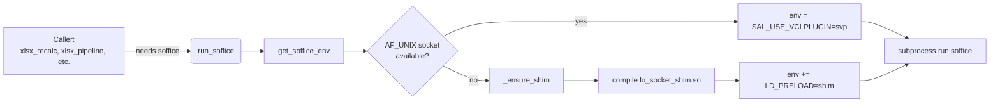
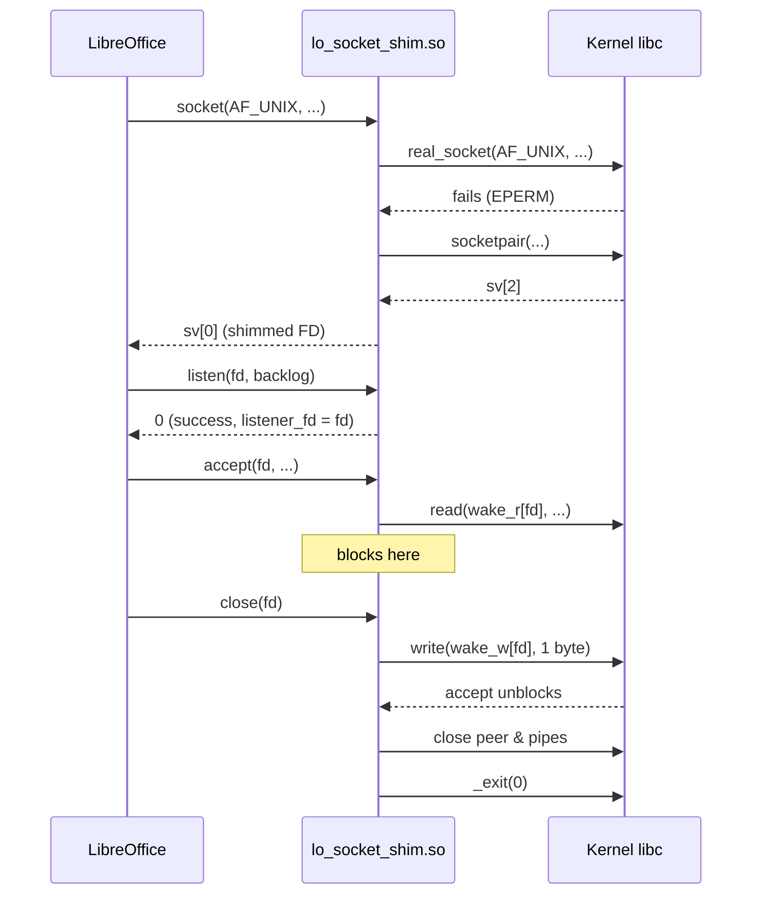
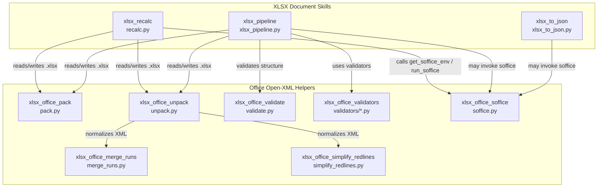
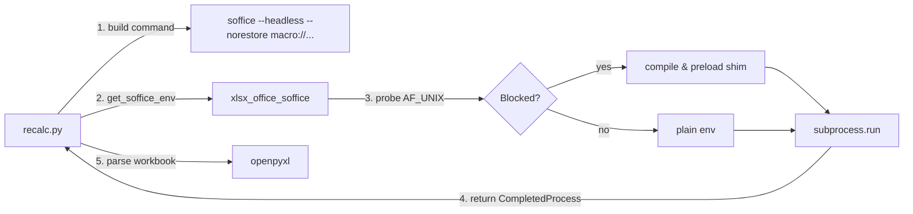

# xlsx_office_soffice

## Brief Introduction

`xlsx_office_soffice` is a low-level execution helper for running **LibreOffice (`soffice`)** from the legacy XLSX document-skill pipeline. Its primary responsibility is to detect environments where `AF_UNIX` domain sockets are blocked (for example, heavily sandboxed VMs or hardened containers) and, when necessary, transparently inject an `LD_PRELOAD` shim so that LibreOffice can still start, perform conversions, and exit cleanly.

The module exposes two public APIs:

- `run_soffice(args, **kwargs)` – runs `soffice` with the correct environment.
- `get_soffice_env()` – returns an environment dictionary that callers can pass to their own `subprocess` invocations.

This module is intentionally small and focused: it does not implement XLSX business logic, formula recalculation, packing, or validation. Those concerns live in sibling modules such as [`xlsx_recalc`](xlsx_recalc.md), [`xlsx_office_pack`](xlsx_office_pack.md), [`xlsx_office_unpack`](xlsx_office_unpack.md), and [`xlsx_office_validate`](xlsx_office_validate.md).

---

## When Is This Module Needed?

LibreOffice’s internal IPC relies on `AF_UNIX` sockets. In some deployment environments these sockets are forbidden by seccomp/AppArmor policies, causing `soffice` to fail during startup with permission errors. `xlsx_office_soffice` probes the restriction at runtime and, only when required, compiles and loads a tiny C shared library that intercepts the blocked socket calls and redirects them to `socketpair()` plus a pipe-based wake mechanism.

---

## Core Components

| Component | File | Purpose |
|-----------|------|---------|
| `get_soffice_env` | `skills/ainxt_docskills/xlsx/scripts/office/soffice.py` | Builds the environment dict used for every `soffice` invocation. |
| `run_soffice` | `skills/ainxt_docskills/xlsx/scripts/office/soffice.py` | Convenience wrapper around `subprocess.run(["soffice", ...])`. |
| `_needs_shim` | `skills/ainxt_docskills/xlsx/scripts/office/soffice.py` | Runtime probe that tries to create an `AF_UNIX` socket. |
| `_ensure_shim` | `skills/ainxt_docskills/xlsx/scripts/office/soffice.py` | Compiles the C shim (`lo_socket_shim.so`) on demand. |
| `_SHIM_SOURCE` | `skills/ainxt_docskills/xlsx/scripts/office/soffice.py` | C source for the `LD_PRELOAD` socket shim. |

---

## Architecture

### High-level flow

### Shim behavior

When the shim is loaded it intercepts five libc symbols:

- `socket` – if `domain == AF_UNIX` and the real `socket()` fails, it creates a `socketpair()` instead and marks the returned FD as shimmed.
- `listen` – remembers the shimmed listener FD and returns success without calling the kernel.
- `accept` – blocks on an internal pipe until `close()` is called on the listener, then returns `ECONNABORTED`.
- `close` – cleans up the shimmed FD, unblocks `accept()`, and calls `_exit(0)` when the listener FD is closed (this is how LibreOffice signals that conversion work is done).
- `socketpair` / `pipe` – used internally to create the replacement communication channel.

---

## Component Relationships

`xlsx_office_soffice` sits at the bottom of the XLSX document-skill stack. It is consumed by higher-level scripts that need LibreOffice to materialize or mutate `.xlsx` files.

### Cross-format siblings

The same `soffice` helper pattern is reused by the DOCX and PPTX skill pipelines. If you are documenting or debugging socket-shim behavior, refer to the equivalent modules:

- [`docx_office_soffice`](docx_office_soffice.md)
- [`pptx_office_soffice`](pptx_office_soffice.md)

These modules share the same shim source and compilation strategy.

---

## Data Flow

### Typical invocation from `xlsx_recalc`

### Environment variables injected

| Variable | Value | Why |
|----------|-------|-----|
| `SAL_USE_VCLPLUGIN` | `svp` | Forces LibreOffice to use the non-graphical SVP backend. |
| `LD_PRELOAD` | `/tmp/lo_socket_shim.so` | Only set when `_needs_shim()` returns `True`. |

---

## Process Flow

### `run_soffice(args)`

1. Call `get_soffice_env()`.
2. Merge caller-provided `kwargs` (e.g., `capture_output=True`, `timeout=...`).
3. Execute `subprocess.run(["soffice"] + args, env=env, **kwargs)`.
4. Return the `CompletedProcess` object.

### `get_soffice_env()`

1. Copy the current process environment.
2. Set `SAL_USE_VCLPLUGIN=svp`.
3. Call `_needs_shim()`.
4. If a shim is needed, call `_ensure_shim()` and set `LD_PRELOAD`.
5. Return the environment dict.

### `_needs_shim()`

1. Attempt `socket.socket(socket.AF_UNIX, socket.SOCK_STREAM)`.
2. If it succeeds, return `False`.
3. If it raises `OSError`, return `True`.

### `_ensure_shim()`

1. If `/tmp/lo_socket_shim.so` already exists, return its path.
2. Otherwise write `_SHIM_SOURCE` to `/tmp/lo_socket_shim.c`.
3. Compile with `gcc -shared -fPIC -o lo_socket_shim.so lo_socket_shim.c -ldl`.
4. Delete the C source.
5. Return the path to the shared object.

---

## How It Fits into the Overall System

`xlsx_office_soffice` is part of the **legacy Anthropic doc-skills** tree (`skills/ainxt_docskills/`) that the platform uses for low-level Office document manipulation. It is not a user-facing API; it is a utility that higher-level skill scripts import when they need to shell out to LibreOffice.

In the broader architecture:

- **ABStudio / backend** may invoke these scripts as external processes when running document-generation or document-modification skills.
- **Workers** (for example, [`doc_worker`](../workers/document_knowledge_workers.md) or [`doc_skill_worker`](../workers/document_knowledge_workers.md)) may call `recalc.py` or the XLSX pipeline, which in turn depend on this module.
- **Shared skills** ([`shared_skills`](shared_skills.md)) group this module with DOCX, PPTX, PDF, and DSLAR skill families.

Because the shim is compiled on first use, the host container must have `gcc` and the standard C library headers available. If `gcc` is missing, `_ensure_shim()` will raise a `subprocess.CalledProcessError` and the calling skill will fail.

---

## Security & Operational Notes

- The shim is compiled into `/tmp`, which is world-writable on many systems. The module does not verify the integrity of a pre-existing `lo_socket_shim.so`; if you operate in a multi-tenant or untrusted environment, consider pre-building the shim in a read-only location and pointing `LD_PRELOAD` there instead.
- The shim calls `_exit(0)` when the listener FD is closed. This is intentional: LibreOffice uses the listener socket lifetime as a process-lifecycle signal, and the shim mirrors that behavior.
- FDs `>= 1024` are passed through unshimmed. Very high FD numbers are therefore not subject to the fallback logic, but this is acceptable for LibreOffice’s typical FD usage.
- The module sets `SAL_USE_VCLPLUGIN=svp` unconditionally, ensuring headless operation even when an X11/Wayland display is available.

---

## References

- [`xlsx_recalc`](xlsx_recalc.md) – uses `get_soffice_env()` to recalculate Excel formulas and detect error values.
- [`xlsx_office_pack`](xlsx_office_pack.md) – packs a directory tree back into a `.xlsx` file.
- [`xlsx_office_unpack`](xlsx_office_unpack.md) – unpacks a `.xlsx` file into a directory tree.
- [`xlsx_office_validate`](xlsx_office_validate.md) – validates Office Open XML structure after modification.
- [`xlsx_office_validators`](xlsx_office_validators.md) – validator implementations used by the validate step.
- [`xlsx_office_merge_runs`](xlsx_office_merge_runs.md) – XML run-merging helper used during unpack.
- [`xlsx_office_simplify_redlines`](xlsx_office_simplify_redlines.md) – tracked-changes simplification helper used during unpack.
- [`docx_office_soffice`](docx_office_soffice.md) – equivalent helper for DOCX skills.
- [`pptx_office_soffice`](pptx_office_soffice.md) – equivalent helper for PPTX skills.
- [`shared_skills`](shared_skills.md) – parent module grouping all document skills.
