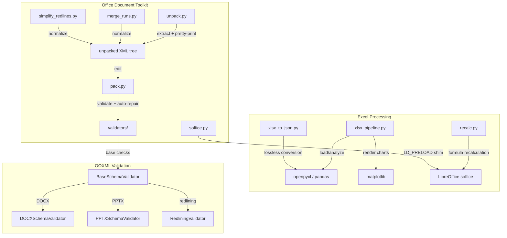
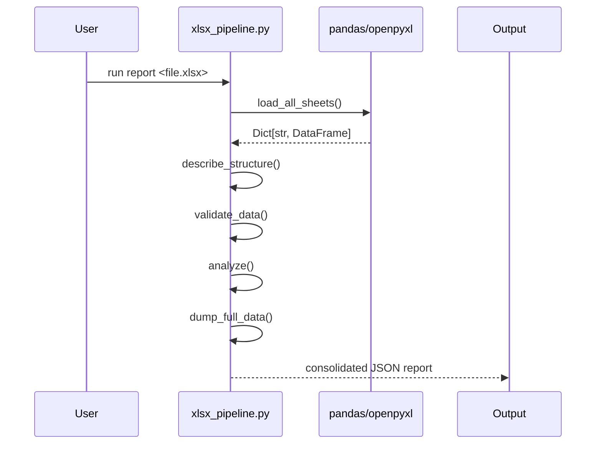
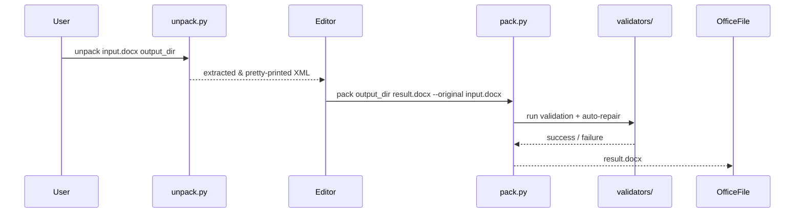

# xlsx_skills

The `xlsx_skills` module provides a collection of Python scripts for reading, validating, transforming, and repackaging Microsoft Excel workbooks (`.xlsx`, `.xls`, `.xlsm`) and other Office Open XML documents (`.docx`, `.pptx`). It is part of the larger `shared_skills` family under `ABStudio/skills/ainxt-skills` and is designed to be invoked both as standalone command-line tools and as callable helpers from agentic workflows.

## Purpose

This module has two primary responsibilities:

1. **Excel data processing** — Load workbooks, inspect structure, validate data quality, run non-destructive transformations, render charts, recalculate formulas, and convert sheets to JSON.
2. **Office document lifecycle** — Unpack, edit, validate, and repack Office Open XML packages (DOCX/PPTX/XLSX) with automatic repair of common OOXML issues.

The scripts are intentionally conservative: they report problems rather than silently rewriting data, emit audit logs for every transformation, and preserve formulas, formatting, and tracked changes where possible.

## Architecture Overview

The module is organized into two sub-modules:

- **[xlsx_skills_excel_processing](xlsx_skills_excel_processing.md)** — Excel-specific scripts for data analysis, transformation, JSON export, and formula recalculation.
- **[xlsx_skills_office_toolkit](xlsx_skills_office_toolkit.md)** — Generic Office Open XML utilities for unpacking, packing, validating, and normalizing DOCX/PPTX/XLSX packages.

## High-Level Functionality

### Excel Processing

| Script | Purpose |
|--------|---------|
| `xlsx_pipeline.py` | End-to-end pipeline with subcommands: `validate`, `structure`, `analyze`, `process`, `chart`, and `report`. |
| `xlsx_to_json.py` | Convert `.xlsx` workbooks to JSON in `rows` or `full` (lossless) mode. |
| `recalc.py` | Recalculate all formulas in an Excel file using LibreOffice and report error cells. |

These tools rely on `pandas`, `openpyxl`, and (optionally) `matplotlib` and `LibreOffice`. They are stateless and read-only unless explicitly asked to write an output file.

### Office Document Toolkit

| Script | Purpose |
|--------|---------|
| `unpack.py` | Extract an Office file, pretty-print XML, merge adjacent runs, and simplify tracked changes. |
| `pack.py` | Repack an unpacked directory into `.docx`/`.pptx`/`.xlsx` with optional validation and auto-repair. |
| `validate.py` | CLI entry point for XSD schema validation and tracked-change verification. |
| `merge_runs.py` | Merge adjacent `<w:r>` elements with identical formatting in DOCX. |
| `simplify_redlines.py` | Merge adjacent tracked-change elements from the same author. |
| `soffice.py` | Run LibreOffice with an optional LD_PRELOAD shim for sandboxed environments. |
| `validators/base.py` | Shared validation logic: XML well-formedness, unique IDs, file references, content types, XSD validation. |
| `validators/docx.py` | DOCX-specific schema and redlining checks. |
| `validators/pptx.py` | PPTX-specific schema checks. |
| `validators/redlining.py` | Verifies that an author's tracked changes preserve the original document text. |

## Data Flow

### Excel Analysis Pipeline

### Office Document Pack/Unpack Lifecycle

## Relationship to Other Modules

- The Office toolkit code is structurally mirrored in [docx_skills](docx_skills.md) and [pptx_skills](pptx_skills.md) because DOCX, PPTX, and XLSX all share the same ZIP-based Open XML package format. See those modules for additional context on the shared helpers.
- `xlsx_pipeline.py` and `xlsx_to_json.py` are consumed by the ABStudio backend document APIs (see [api_documents](api_documents.md)) when agents need to read Excel attachments.
- Formula recalculation via `recalc.py` depends on the LibreOffice wrapper in [xlsx_skills_office_toolkit](xlsx_skills_office_toolkit.md) and the broader document processing pipeline.

## Key Design Principles

1. **No silent data loss** — Every script reports what it changed and preserves the original file unless an explicit output path is given.
2. **Auditability** — `xlsx_pipeline.py` emits an `audit` array for every transformation, including row counts before and after.
3. **Conservative validation** — Validators compare against the original file and only report *new* errors introduced by edits.
4. **Sandbox compatibility** — `soffice.py` detects blocked `AF_UNIX` sockets and transparently applies an LD_PRELOAD shim so LibreOffice can run in restricted environments.
