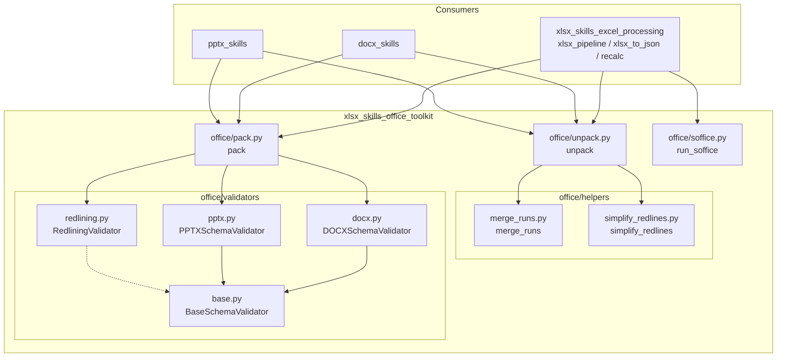
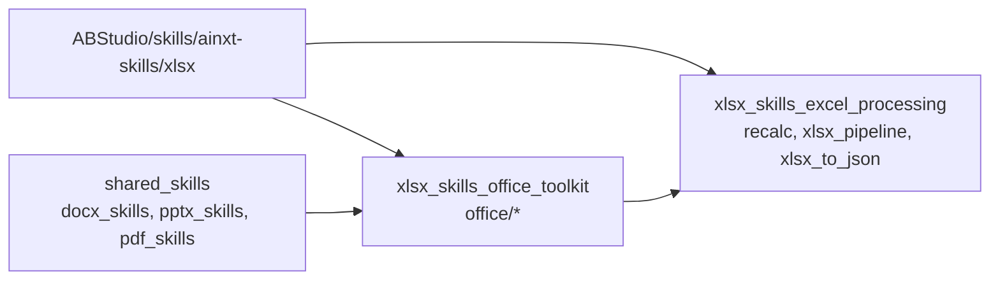
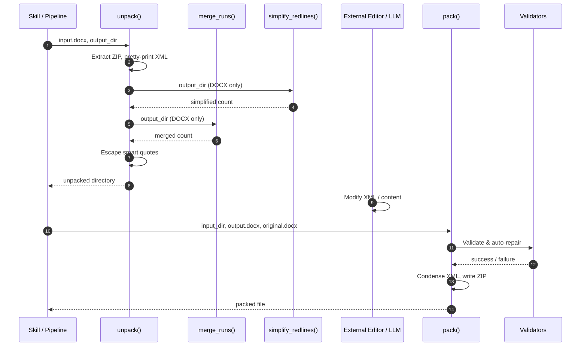
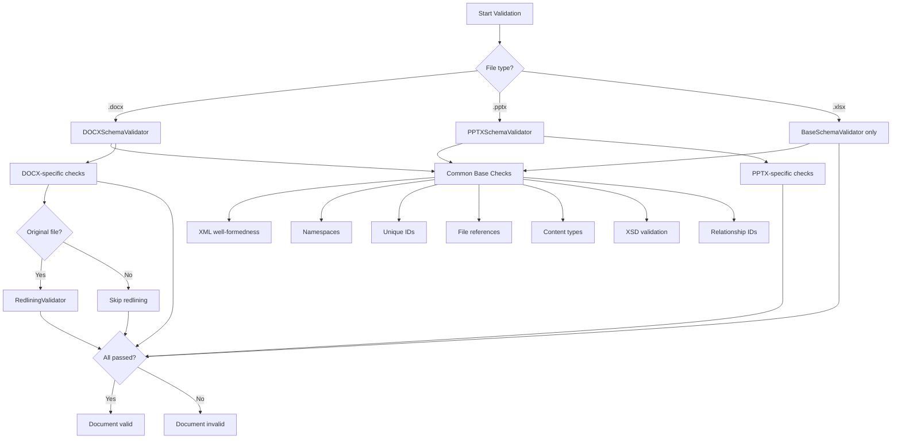
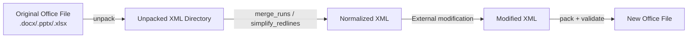
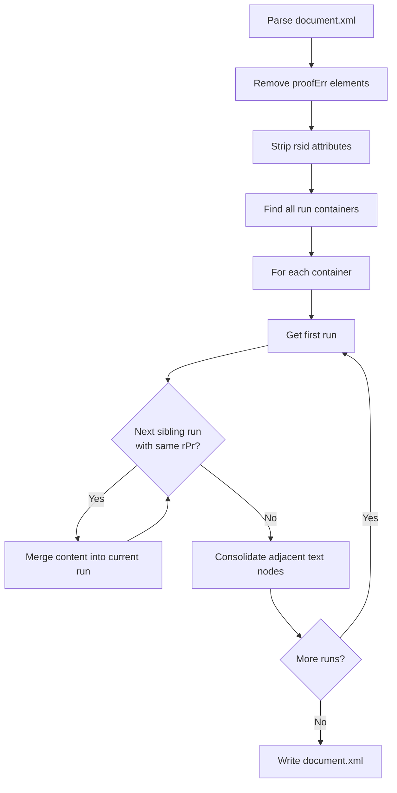
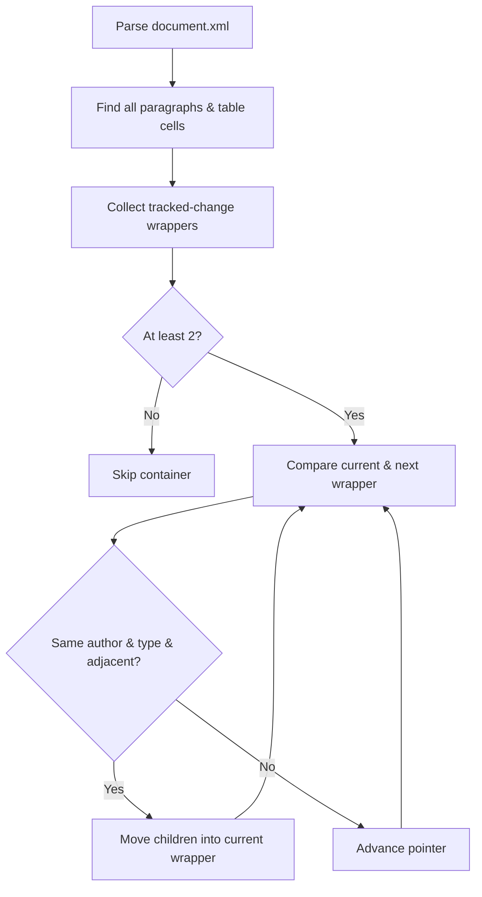
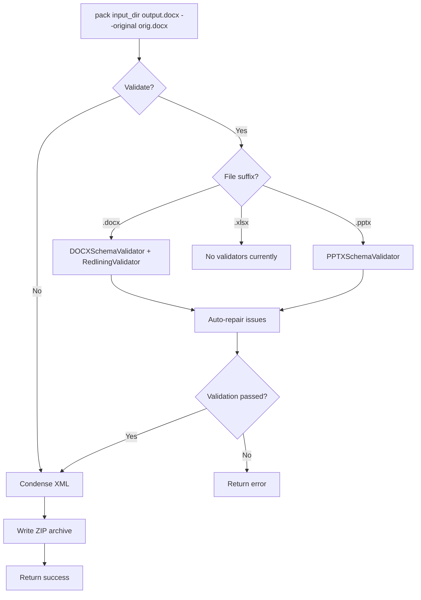

# xlsx_skills_office_toolkit

## Brief Introduction

The `xlsx_skills_office_toolkit` module is a shared Office Open XML (OOXML) utility library located under `ABStudio/skills/ainxt-skills/xlsx/scripts/office/`. Despite its placement inside the `xlsx_skills` tree, it is a **general-purpose toolkit** for unpacking, editing, validating, and repacking Microsoft Office documents in the `.docx`, `.pptx`, and `.xlsx` formats.

It provides the foundational document lifecycle operations used by higher-level skills and pipelines:

- **Unpack** Office ZIP archives into editable XML directory trees.
- **Pack** modified XML directories back into valid Office files.
- **Validate** unpacked or packed documents against OOXML XSD schemas, relationship integrity rules, and tracked-change semantics.
- **Normalize** documents by merging adjacent runs, simplifying redlines, and repairing common OOXML errors.
- **Execute LibreOffice** (`soffice`) in restricted environments where UNIX domain sockets are blocked.

This module is consumed directly by the [xlsx_skills_excel_processing](xlsx_skills_excel_processing.md) sibling module and indirectly by any skill or worker that needs to manipulate Office documents programmatically.

---

## Core Functionality

### 1. Office Document Unpacking (`unpack`)

The `unpack` function extracts a `.docx`/`.pptx`/`.xlsx` ZIP archive into a directory, pretty-prints all XML and `.rels` files, and optionally performs DOCX-specific normalizations:

- **Merge adjacent runs** (`merge_runs`) - combines consecutive `<w:r>` elements with identical run properties to reduce document noise.
- **Simplify redlines** (`simplify_redlines`) - merges adjacent tracked-change wrappers (`<w:ins>`/`<w:del>`) from the same author.
- **Escape smart quotes** - replaces Unicode curly quotes with XML character entities to avoid encoding issues during downstream processing.

### 2. Office Document Packing (`pack`)

The `pack` function reverses the unpack operation. It:

- Condenses XML by stripping non-significant whitespace and comments.
- Optionally validates the unpacked directory against the original file before repacking.
- Writes a new `.docx`, `.pptx`, or `.xlsx` ZIP archive.

Validation during packing can auto-repair common issues such as invalid `paraId`/`durableId` values and missing `xml:space="preserve"` attributes.

### 3. OOXML Validation (`validators`)

The validators module provides schema-aware, relationship-aware, and redlining-aware validation.

| Validator | Scope |
|-----------|-------|
| `BaseSchemaValidator` | Common checks: XML well-formedness, namespace declarations, unique IDs, file references, content types, XSD validation, relationship IDs. |
| `DOCXSchemaValidator` | Word-specific checks: whitespace preservation, deletions/insertions constraints, paragraph counts, comment markers, `paraId`/`durableId` constraints. |
| `PPTXSchemaValidator` | PowerPoint-specific checks: UUID IDs, slide layout references, duplicate slide layouts, notes-slide references. |
| `RedliningValidator` | Tracked-change semantic validation: ensures the document text matches the original after removing the target author's tracked changes. |

### 4. Document Normalization Helpers

- **`merge_runs`** - Merges adjacent `<w:r>` runs with identical `<w:rPr>` formatting, removes `rsid` revision attributes, and removes `<w:proofErr>` spell/grammar markers.
- **`simplify_redlines`** - Merges adjacent `<w:ins>` or `<w:del>` elements from the same author, and can infer which author introduced new tracked changes by comparing against an original document.

### 5. LibreOffice Execution Helper (`soffice`)

The `run_soffice` helper executes LibreOffice in headless mode. In sandboxed environments where `AF_UNIX` sockets are blocked, it compiles and injects an `LD_PRELOAD` shim that transparently converts UNIX socket operations into `socketpair()`/`pipe()` pairs, allowing document conversion and recalculation to succeed.

---

## Architecture

### High-Level Component Diagram

### Module Placement in the Repository

---

## Component Relationships

### Unpack -> Helpers -> Pack Pipeline

### Validation Flow

---

## Data Flow

### Document Lifecycle

### XML Processing Details

1. **Unpacking**
   - Input: binary ZIP archive.
   - Output: directory tree mirroring the OOXML package structure.
   - All `.xml` and `.rels` files are parsed with `defusedxml.minidom` and rewritten with pretty-printing.

2. **Normalization**
   - `merge_runs` operates on the DOM: removes `proofErr` and `rsid` attributes, then iterates over run containers to merge adjacent runs and consolidate adjacent `<w:t>` text nodes.
   - `simplify_redlines` operates on paragraphs and table cells, merging same-author tracked-change wrappers.

3. **Packing**
   - Input: modified directory.
   - Output: new ZIP archive.
   - XML files are condensed by removing whitespace-only text nodes and comments (preserving `xml:space` on `<w:t>` elements).

4. **Validation**
   - XSD schemas are resolved from a local `schemas/` directory relative to the validators.
   - Validation compares new errors against the original file's errors so that pre-existing schema issues do not fail validation.

---

## Process Flows

### How `merge_runs` Works

### How `simplify_redlines` Works

### How `pack` Validates and Repairs

---

## Integration with the Overall System

The `xlsx_skills_office_toolkit` is a low-level building block. It does not expose HTTP endpoints or user interfaces; instead, it is imported and invoked by:

- **[xlsx_skills_excel_processing](xlsx_skills_excel_processing.md)** - uses `recalc.py` (via `run_soffice`) to recalculate Excel formulas, and may use `pack`/`unpack` for XLSX manipulation.
- **[docx_skills](docx_skills.md)** - uses the full unpack/pack/validate/normalize pipeline for Word document generation and editing.
- **[pptx_skills](pptx_skills.md)** - uses the unpack/pack/validate pipeline for PowerPoint manipulation.
- **Higher-level workers and agents** - any backend worker or agent skill that needs to read or write Office documents can depend on this toolkit.

The toolkit relies on external system dependencies:

- **LibreOffice / `soffice`** - for document conversion and recalculation.
- **`gcc`** - for compiling the `LD_PRELOAD` socket shim when sandboxed.
- **`git`** - used by `RedliningValidator` to produce word-level diffs of text content.
- **Python packages**: `defusedxml`, `lxml`, `zipfile`, `xml.etree.ElementTree`.

---

## Key Design Decisions

1. **Shared across Office formats** - Although located under `xlsx/`, the toolkit handles DOCX, PPTX, and XLSX because all three share the same ZIP + XML package foundation (OOXML / ECMA-376).

2. **Original-file comparison** - XSD validation reports only *new* errors relative to the original file, making the toolkit tolerant of pre-existing schema quirks in real-world documents.

3. **DOM-based XML manipulation** - Uses `defusedxml.minidom` for safe XML parsing and mutation, avoiding the security risks of standard `xml` modules.

4. **Sandbox-aware LibreOffice execution** - The `soffice` helper detects `AF_UNIX` socket restrictions at runtime and transparently applies a C shim, enabling headless Office operations in containerized or restricted environments.

5. **Auto-repair over strict failure** - Common issues such as whitespace preservation and oversized IDs are repaired automatically during packing rather than failing validation, improving robustness for generated documents.

---

## References

- [xlsx_skills_excel_processing](xlsx_skills_excel_processing.md) - Excel-specific processing built on top of this toolkit.
- [docx_skills](docx_skills.md) - Word document skills that consume this toolkit.
- [pptx_skills](pptx_skills.md) - PowerPoint skills that consume this toolkit.
- [shared_skills](shared_skills.md) - Parent module grouping all reusable skill utilities.
- [abstudio_backend](abstudio_backend.md) - Backend system that orchestrates skill execution.
